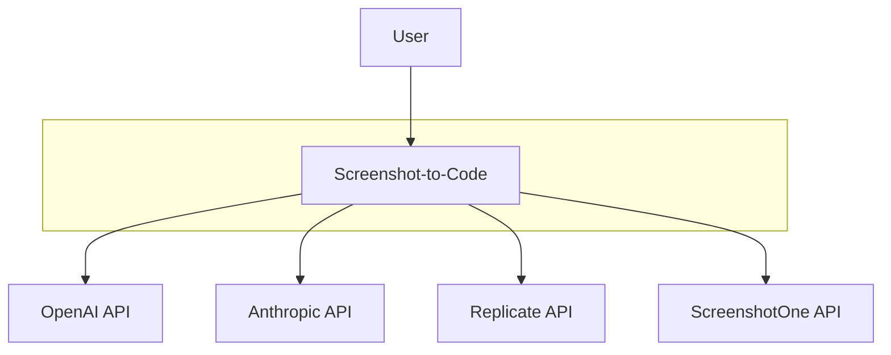
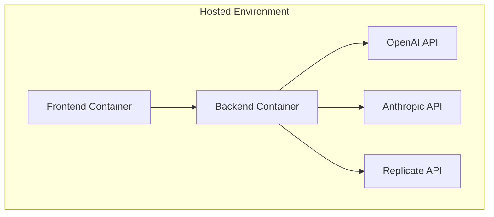

# Design Document

## BUSINESS POSTURE
### Priorities and Goals
The project aims to provide a user-friendly tool for converting screenshots, mockups, Figma designs, and video recordings into clean, functional code using AI models. Key business priorities include:
- **Accurate Code Generation**: Ensure generated code matches the visual design closely, especially in color schemes, layout, and interactive components.
- **Multi-Stack Support**: Maintain compatibility across supported frameworks (HTML+Tailwind, React, Vue, etc.).
- **Performance**: Optimize response times for the AI-driven code generation process.
- **Scalability**: Support potential growth in user base and handle high volumes of requests in the hosted version.
- **Cost Efficiency**: Manage API costs by minimizing unnecessary calls and optimizing model selection.

### Critical Business Risks
1. **API Dependency Risk**: Reliance on third-party LLM providers (OpenAI, Anthropic, Replicate) introduces risks of outages, cost increases, or model performance degradation.
2. **User Data Protection Risk**: Handling user-uploaded images/videos raises concerns about accidental exposure of sensitive design content.
3. **Competitive Risk**: Open-source nature may lead to forking or feature duplication without direct monetization paths.
4. **Hosting Scalability Risk**: The hosted version must handle unpredictable traffic spikes without compromising performance.
5. **Legal Compliance Risk**: Use of AI models may require adherence to specific terms of service or export controls.

---

## SECURITY POSTURE
### Existing Security Controls
- **Environment Variables**: API keys are stored in `.env` files (backend) and browser storage (frontend).
- **CORS Configuration**: CORS is configured in FastAPI to allow all origins (`"*"`), but credentials are permitted.
- **Mock Mode**: Option to bypass LLM calls during testing via `MOCK` environment variable.
- **Client-Side Validation**: Frontend enforces basic validation for API keys (Troubleshooting.md).
- **Docker Hardening**: Uses slim base images (`python:3.12.3-slim-bullseye`, `node:22-bullseye-slim`).

### Accepted Risks
- **CORS Misconfiguration**: Wide origin allowance in production (`allow_origins` set to `"*"` in `main.py`) exposes cross-site vulnerabilities.
- **API Key Exposure**: Frontend stores keys in browser storage, which is insecure if intercepted.
- **Build Artifact Exposure**: Dockerfile copies `.env` into the image, potentially leaking keys during containerization.
- **Unrestricted API Access**: No rate limiting or usage monitoring in the backend, risking abuse.
- **Third-Party Libraries**: Use of external dependencies (e.g., Tailwind, jQuery) introduces supply chain risks.

### Recommended Security Controls
1. **Restrict CORS**: Limit allowed origins to only trusted domains.
2. **Secure API Key Handling**: Avoid baking keys into Docker images; use environment variables at runtime instead.
3. **Input Sanitization**: Validate and sanitize user-uploaded images/videos to prevent malicious content.
4. **Rate Limiting**: Implement rate limits on backend endpoints to prevent API abuse.
5. **Dependency Locking**: Use dependency pins and vulnerability scanners (e.g., `safety`, `bandit` for Python).
6. **Audit Logging**: Track LLM requests and failures for forensic analysis.
7. **Websocket Security**: Enforce authentication headers for WebSocket connections.
8. **Secure Build Pipelines**: Integrate SAST/DAST tools in CI/CD to scan for vulnerabilities.

### Security Requirements
| Topic               | Requirements |
|---------------------|--------------|
| **Authentication**  | None (tool is open-source and hosted version uses paid access). Future versions may introduce token-based auth for users. |
| **Authorization**   | Not required for core functionality. Hosted version may need access limits. |
| **Input Validation**| Validate uploaded images/videos for MIME types, size, and format. Sanitize user inputs (e.g., API keys). |
| **Cryptography**    | Encrypt API keys in transit and at rest. Avoid hardcoding credentials. |

---

## DESIGN

### C4 CONTEXT
#### Diagram


#### Elements Table
| Name               | Type       | Description                          | Responsibilities                                   | Security Controls               |
|--------------------|------------|--------------------------------------|---------------------------------------------------|---------------------------------|
| **ScreenshotToCode** | System     | Core application                      | Handles code generation and UI interactions       | None (open-source model)        |
| **User**           | Person     | End user                              | Uploads designs, configures APIs, tests outputs   | Browser-side key storage (risk) |
| **OpenAI API**      | External   | Provides GPT-4 Vision/GPT-4o models  | Generates code from images/videos                | API key validation              |
| **Anthropic API**   | External   | Provides Claude models                | Generates code from images/videos                | API key validation              |
| **Replicate API**   | External   | Image generation (e.g., Flux Schnell) | Replaces placeholder images in generated code    | API key validation              |
| **ScreenshotOne API** | External | Takes screenshots of URLs             | Captures reference screenshots for code generation | API key validation              |

---

### C4 CONTAINER
#### Diagram
```mermaid
graph TD
    subgraph Frontend
        ReactVite[React/Vite] --> ScreenshotToCode
    end
    subgraph Backend
        FastAPI[FastAPI] --> LLMClientA[LLM Client (Claude)]
        FastAPI --> LLMClientB[LLM Client (GPT-4o)]
        FastAPI --> ImageGeneration[Image Generation]
        FastAPI --> VideoProcessing[Video Processing]
    end
    FastAPI --> OpenAI[OpenAI]
    FastAPI --> Anthropic[Anthropic]
    FastAPI --> Replicate[Replicate]
    ReactVite --> FastAPI
    VideoProcessing --> ScreenshotOne[Video API (e.g., MoviePy)]
    ImageGeneration --> ScreenshotOne
```

#### Elements Table
| Name               | Type       | Description                          | Responsibilities                                   | Security Controls               |
|--------------------|------------|--------------------------------------|---------------------------------------------------|---------------------------------|
| **React/Vite**     | Container  | Frontend UI                          | Handles user interactions, uploads, and displays code | Client-side input sanitization  |
| **FastAPI**        | Container  | Backend logic                         | Routes requests to LLMs, manages API keys          | CORS configuration              |
| **LLM Client (Claude)** | Container | Integrates with Anthropic API      | Processes video/image inputs to generate code      | API key validation              |
| **LLM Client (GPT-4o)** | Container | Integrates with OpenAI API         | Processes video/image inputs to generate code      | API key validation              |
| **Image Generation** | Container  | Replaces placeholder images          | Uses Replicate/OpenAI to generate images           | Input validation (MIME checks)  |
| **Video Processing** | Container  | Splits videos into screenshots       | Extracts key frames for code generation            | Input validation (size/format)  |

---

### DEPLOYMENT
#### Deployment Architecture (Hosted Version)
Primary deployment uses Docker Compose with separate frontend and backend containers, exposed via standard ports. Alternative options could include Kubernetes for scalability, but the current setup is simple.

#### Diagram


#### Elements Table
| Name               | Type       | Description                          | Responsibilities                                   | Security Controls               |
|--------------------|------------|--------------------------------------|---------------------------------------------------|---------------------------------|
| **Frontend Container** | Docker    | React/Vite app in a container       | Serves UI and handles WebSocket/HTTP calls        | HTTPS enforced                  |
| **Backend Container** | Docker    | FastAPI server                       | Processes code generation requests                | Environment variables for keys  |
| **OpenAI API**      | Cloud      | Third-party LLM service              | Provides GPT-4 Vision model outputs               | API key validation              |
| **Anthropic API**   | Cloud      | Third-party LLM service              | Provides Claude 3 Sonnet/Opus model outputs       | API key validation              |
| **Replicate API**   | Cloud      | Image generation service             | Replaces placeholder images in HTML outputs       | API key validation              |

---

### BUILD
#### Process Flow
```mermaid
graph TD
    Developer[Developer] --> Checkout[Checkout Code]
    Checkout --> Poetry[Install Dependencies via Poetry]
    Poetry --> FrontendBuild[Frontend Build (Yarn)]
    FrontendBuild --> DockerBuild[Build Docker Containers]
    DockerBuild --> Deploy[Deploy with Docker Compose]
```

#### Key Security Controls
- **Dependency Management**: Uses Poetry for Python dependencies (`pyproject.toml`).
- **Static Analysis**: Includes `pyright` and `pytest` for type checking and unit tests.
- **Build Environment**: Dockerfiles use slim base images and avoid exposing sensitive data in layers.
- **Missing Components**: No SAST tools (e.g., `bandit`) or DAST tools (e.g., `OWASP ZAP`) are integrated in the build process.

---

## RISK ASSESSMENT
### Critical Business Processes to Protect
1. **Code Generation**: Unauthorized access to LLM APIs could lead to cost overruns.
2. **User Input Handling**: Malicious uploads (e.g., oversized images/videos) must be mitigated.
3. **API Key Management**: Exposure of user-provided keys to third parties is a critical risk.

### Data to Protect and Sensitivity
| Data Type           | Sensitivity | Protection Mechanisms |
|---------------------|-------------|----------------------|
| **User Designs**    | High        | Not stored; processed in memory         |
| **API Keys**        | Very High   | Stored in browser or environment variables (no server-side retention) |
| **Generated Code**  | Medium      | Transient; no long-term storage          |
| **Evaluation Data** | Medium      | Stored locally (e.g., `evals_data` directory) |

---

## QUESTIONS & ASSUMPTIONS

### Questions
1. **Business Posture**:
   - Will the hosted version enforce API key restrictions (e.g., rate limits)?
   - Are there plans for user accounts and paid tiers beyond the current "hosted version (paid)"?

2. **Security Posture**:
   - How are API keys rotated for the hosted version?
   - Is there a plan to implement logging for LLM interactions in production?

3. **Design**:
   - Will the hosted version use a reverse proxy (e.g., Nginx) for security and TLS termination?
   - How are container secrets (e.g., Replicate API keys) managed in production?

---

### Assumptions
1. The project assumes users provide their own API keys, avoiding server-side storage.
2. CORS misconfiguration (`"*"` origins) is accepted for simplicity in local development.
3. Docker builds are performed in trusted environments where `.env` files are not exposed.
4. No need for user authorization in the open-source version, but the hosted version might implement paid access locks.
5. Third-party libraries (e.g., jQuery, Tailwind) are assumed to be vetted for security.
