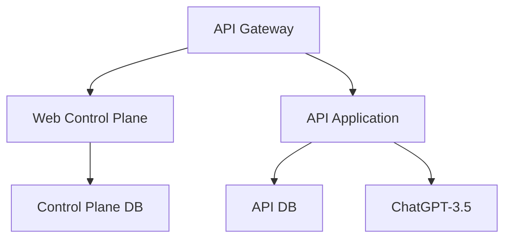

# Threat Modeling Analysis for AI Nutrition-Pro Using Attack Trees

## 1. Understand the Project

### Overview
AI Nutrition-Pro is a diet generation system that:
- Integrates with external Meal Planner applications via REST/HTTPS
- Uses ChatGPT-3.5 for AI content generation
- Features two main components:
  - Web Control Plane (Golang) for administration/billing
  - API Application (Golang) for core functionality
- Uses Kong API Gateway for authentication and rate limiting
- Stores data in Amazon RDS databases

### Key Components


### Dependencies
- AWS ECS for container orchestration
- Amazon RDS for databases
- Kong API Gateway
- OpenAI's ChatGPT API

## 2. Root Goal
**Compromise diet generation systems using AI Nutrition-Pro by exploiting vulnerabilities in its architecture**

## 3. Attack Tree Visualization

```
Root Goal: Compromise systems using AI Nutrition-Pro [OR]
+-- 1. Compromise API Gateway [OR]
|   +-- 1.1 Bypass authentication [OR]
|   |   +-- 1.1.1 Steal API keys (phishing/social engineering) [AND]
|   |   |   +-- Acquire meal planner credentials
|   |   |   +-- Bypass MFA (if present)
|   |   +-- 1.1.2 Exploit key rotation vulnerabilities [AND]
|   |       +-- Identify infrequent rotation schedule
|   |       +-- Maintain persistence using old keys
|   +-- 1.2 Exploit rate limiting [AND]
|       +-- Identify missing per-client limits
|       +-- Launch DDoS to bypass detection
+-- 2. Attack Web Control Plane [OR]
|   +-- 2.1 Exploit Golang implementation [OR]
|   |   +-- 2.1.1 SQL injection in control plane [AND]
|   |   |   +-- Find unsanitized input fields
|   |   |   +-- Exfiltrate tenant/billing data
|   |   +-- 2.1.2 Privilege escalation [AND]
|   |       +-- Find misconfigured RBAC
|   |       +-- Access admin functions
|   +-- 2.2 Compromise AWS ECS [AND]
|       +-- Exploit container vulnerabilities
|       +-- Access control plane database
+-- 3. Target API Application [OR]
|   +-- 3.1 Manipulate ChatGPT integration [OR]
|   |   +-- 3.1.1 Prompt injection attacks [AND]
|   |   |   +-- Bypass input validation
|   |   |   +-- Inject malicious prompts
|   |   +-- 3.1.2 Poison training data [AND]
|   |       +-- Upload biased diet samples
|   |       +-- Influence future outputs
|   +-- 3.2 Exploit API database [AND]
|       +-- Access unencrypted backups
|       +-- Decrypt sensitive dietitian data
+-- 4. Attack Data Stores [OR]
    +-- 4.1 Direct RDS access [AND]
    |   +-- Exploit weak IAM policies
    |   +-- Perform credential stuffing
    +-- 4.2 MITM attacks [AND]
        +-- Compromise TLS implementation
        +-- Decrypt DB communications
```

## 4. Node Attributes

| Attack Step | Likelihood | Impact | Effort | Skill | Detection |
|-------------|------------|--------|--------|-------|-----------|
| 1.1.1 API Key Theft | High | Critical | Low | Low | Medium |
| 2.1.1 SQLi | Medium | High | Medium | Medium | Hard |
| 3.1.1 Prompt Injection | High | Medium | Low | Medium | Hard |
| 4.1 RDS Access | Low | Critical | High | High | Medium |

## 5. High-Risk Paths
1. **API Key Compromise (1.1.1)**
   *Justification:* Phishing attacks require low skill but enable full system access

2. **Prompt Injection (3.1.1)**
   *Justification:* Growing attack surface with LLM integration and high business impact

## 6. Mitigation Strategies

### Preventive
- Implement API key rotation with JWT expiration
- Add semantic validation for ChatGPT inputs
- Use prepared statements for all SQL queries

### Detective
- Monitor abnormal ChatGPT request patterns
- Implement database access alerts

### Responsive
- Automated key revocation system
- LLM output sanitization pipeline

## 7. Key Findings
1. API Gateway is most vulnerable surface
2. LLM integration creates novel attack vectors
3. Golang implementation needs hardening

## 8. Assumptions & Questions

**Assumptions:**
- AWS infrastructure properly configured
- TLS 1.2+ used for all communications

**Open Questions:**
1. How are API keys distributed to Meal Planner apps?
2. Is there monitoring for abnormal DB access patterns?
3. What validation exists for dietitian content samples?
