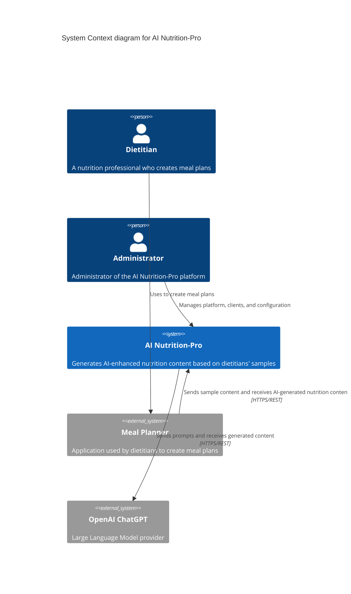
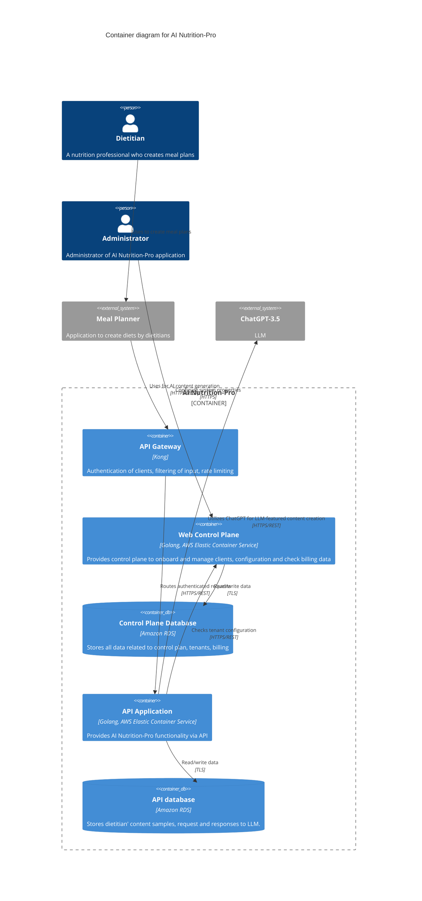
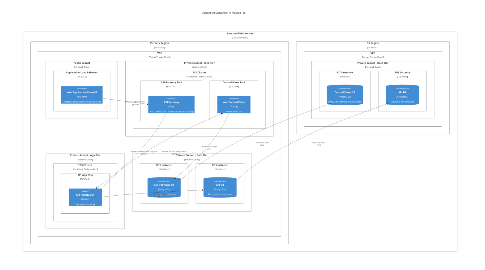
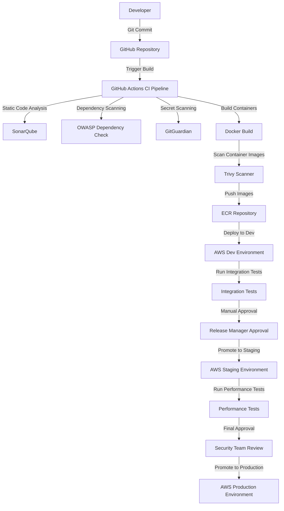

# AI Nutrition-Pro Design Document

## BUSINESS POSTURE

AI Nutrition-Pro is a software-as-a-service application designed to provide AI-enhanced nutrition content generation capabilities to meal planning applications. The system leverages large language models (specifically ChatGPT-3.5) to generate personalized nutritional content based on dietitians' sample content.

Business priorities and goals include:
1. Enabling dietitians to scale their expertise through AI-assisted content generation
2. Providing a multi-tenant platform that can serve multiple meal planning applications
3. Offering high-quality, personalized nutrition content generation
4. Maintaining data separation between different clients
5. Establishing a reliable and scalable cloud infrastructure

Key business risks that need to be addressed:
1. Dependency on third-party LLM provider (OpenAI's ChatGPT)
2. Content quality and accuracy risks when generating nutritional advice
3. Cost management of LLM API usage
4. Multi-tenant data separation and privacy concerns
5. Scaling challenges as the platform grows

## SECURITY POSTURE

Existing security controls and accepted risks:

- Security control: Authentication with API keys for each Meal Planner application integration
- Security control: Authorization via API Gateway ACL rules that allow or deny specific actions
- Security control: Network traffic encryption using TLS between Meal Planner applications and API Gateway
- Security control: Containerized applications running on AWS Elastic Container Service
- Security control: Database isolation using Amazon RDS
- Accepted risk: Dependency on third-party LLM provider (OpenAI) security

Recommended high-priority security controls:
- Security control: Implement proper secrets management for API keys and credentials
- Security control: Add input validation and content filtering before requests reach the LLM
- Security control: Implement logging and monitoring for security events
- Security control: Add data encryption at rest for all databases
- Security control: Implement regular security scanning of container images
- Security control: Deploy web application firewall (WAF) in front of API Gateway

Security requirements:

Authentication:
- Strong API key management with key rotation capabilities
- Multi-factor authentication for administrator access to control plane
- Token-based authentication with short expiration times

Authorization:
- Role-based access control (RBAC) for administrative functions
- Fine-grained permissions for API access based on client subscription level
- Tenant data isolation enforced at the database and application level

Input Validation:
- Sanitization of all client inputs before processing
- Schema validation for API requests
- Rate limiting to prevent abuse
- Content filtering to prevent prompt injection attacks

Cryptography:
- TLS 1.2+ for all communications
- Data encryption at rest for databases
- Secure key management for encryption keys
- Strong hashing algorithms for sensitive data

## DESIGN

### C4 CONTEXT

#### Context Elements

| Name | Type | Description | Responsibilities | Security Controls |
| --- | --- | --- | --- | --- |
| Dietitian | Person | Nutrition professional who creates meal plans | - Creates meal plans - Provides sample content - Reviews AI-generated content | - Training on system usage - Content quality review |
| Administrator | Person | Admin of AI Nutrition-Pro platform | - Onboard new clients - Configure system - Monitor usage and billing - Troubleshoot issues | - MFA authentication - RBAC authorization - Activity logging |
| AI Nutrition-Pro | System | Core system providing AI-enhanced nutrition content | - Process nutrition content requests - Interface with OpenAI - Manage client accounts - Track usage and billing | - API authentication - Data encryption - Input validation - Rate limiting |
| Meal Planner | External System | Third-party application used by dietitians | - Provide UI for meal planning - Send requests to AI Nutrition-Pro - Display AI-generated content | - API key management - TLS encryption |
| OpenAI ChatGPT | External System | LLM provider used for content generation | - Process prompts - Generate nutrition content | - API authentication - Data handling policies |

### C4 CONTAINER

#### Container Elements

| Name | Type | Description | Responsibilities | Security Controls |
| --- | --- | --- | --- | --- |
| API Gateway | Container (Gateway) | Kong API Gateway | - Authentication of clients - Rate limiting - Input filtering - Request routing | - API key validation - TLS termination - Request validation - Rate limiting - WAF integration |
| Web Control Plane | Container (Web Application) | Golang application for system administration | - Client onboarding - System configuration - Billing management - Usage reporting | - MFA authentication - RBAC authorization - Audit logging - Input validation |
| Control Plane Database | Container (Database) | Amazon RDS database for control plane | - Store tenant information - Store billing data - Store system configuration | - Data encryption at rest - Network isolation - Access control - Backup encryption |
| API Application | Container (API Service) | Golang application providing core functionality | - Process content requests - Communicate with OpenAI - Store request/response data - Tenant data isolation | - Request validation - Content filtering - Tenant isolation - Error handling - Logging |
| API Database | Container (Database) | Amazon RDS database for API service | - Store dietitian content samples - Store LLM requests/responses - Store usage metrics | - Data encryption at rest - Tenant data isolation - Access control - Backup encryption |

### DEPLOYMENT

AI Nutrition-Pro is deployed on AWS cloud infrastructure, utilizing containerized services for scalability and reliability. The primary deployment architecture is a multi-region AWS deployment for high availability.

Possible deployment architectures:
1. Single-region AWS deployment
2. Multi-region AWS deployment for high availability
3. Hybrid deployment with on-premise components

For this document, we'll focus on the multi-region AWS deployment.

#### Deployment Elements

| Name | Type | Description | Responsibilities | Security Controls |
| --- | --- | --- | --- | --- |
| AWS WAF | Security Component | Web Application Firewall | - Block common web attacks - Filter malicious traffic | - Rule-based filtering - DDoS protection - Bot control |
| Application Load Balancer | Network Component | AWS Load Balancer | - Distribute traffic - Health checking - TLS termination | - TLS 1.2+ support - Security groups - Access logging |
| API Gateway Task | Container Host | ECS Task for API Gateway | - Host Kong API Gateway - Auto-scale based on demand | - Task IAM roles - Task isolation - Security groups |
| Control Plane Task | Container Host | ECS Task for Control Plane | - Host Control Plane application - Auto-scale based on demand | - Task IAM roles - Task isolation - Security groups |
| API App Task | Container Host | ECS Task for API Application | - Host API application - Auto-scale based on demand | - Task IAM roles - Task isolation - Security groups |
| RDS Instances | Database Host | AWS RDS for PostgreSQL | - Host databases - Auto backup - Replicate to DR region | - Database encryption - Network isolation - IAM authentication - Backup encryption |
| VPC | Network Component | AWS Virtual Private Cloud | - Network isolation - Security zoning | - NACL filtering - VPC flow logs - Private subnets |

### BUILD

The build process for AI Nutrition-Pro components follows a secure DevOps pipeline approach, utilizing GitHub for source control, GitHub Actions for CI/CD, and various security tools integrated throughout the process.

The build process incorporates several security controls:

1. Source code management:
   - Code reviews required for all changes
   - Branch protection rules
   - Signed commits requirement

2. Dependency management:
   - OWASP Dependency Check scans for vulnerable dependencies
   - Approved dependency sources only
   - Regular dependency updates

3. Static analysis:
   - SonarQube for static code analysis
   - Gosec for Go-specific security checks
   - Linting for code quality and security issues

4. Container security:
   - Minimal base images (distroless/alpine)
   - Trivy scanner for container vulnerabilities
   - No root user in containers
   - Immutable file systems

5. Secret management:
   - GitGuardian for secret scanning
   - AWS Secrets Manager for runtime secrets
   - No hardcoded secrets in code/configuration

6. Artifact integrity:
   - Container image signing
   - SHA256 verification of all artifacts
   - Immutable tags in container registry

7. Deployment security:
   - Infrastructure as Code (Terraform) with security checks
   - Least privilege IAM roles
   - Blue/green deployment strategy

## RISK ASSESSMENT

Critical business processes we are trying to protect:
1. AI-powered nutrition content generation
2. Multi-tenant client management
3. User data handling and storage
4. Integration with external LLM providers
5. Billing and subscription management

Data we are trying to protect and their sensitivity:

1. Client API keys and credentials (High sensitivity)
   - Used for authentication between meal planning applications and AI Nutrition-Pro
   - Compromise would allow unauthorized access to API

2. Dietitian content samples (Medium-High sensitivity)
   - Original content written by dietitians
   - May contain intellectual property
   - Could contain personal nutrition information

3. LLM requests and responses (Medium sensitivity)
   - Contains prompts and generated content
   - Could reveal prompt engineering techniques
   - May contain trace amounts of nutritional advice

4. Client billing information (High sensitivity)
   - Contains usage metrics
   - Pricing information
   - Payment details

5. System configuration data (Medium sensitivity)
   - Contains integration settings
   - System parameters
   - API endpoints

6. User credentials for admin portal (High sensitivity)
   - Admin account credentials
   - Session information
   - Access control settings

## QUESTIONS & ASSUMPTIONS

### Business Posture Questions
1. What service level objectives are required for the platform?
2. Is there a specific target market or industry vertical for the service?
3. Are there specific compliance requirements for nutritional advice?
4. What is the target scale in terms of number of clients and request volume?

### Business Posture Assumptions
1. The platform aims to serve multiple meal planning applications (multi-tenant).
2. Cost efficiency of LLM API usage is a business priority.
3. Content quality and accuracy are critical for maintaining trust.
4. The platform needs to scale horizontally as demand grows.

### Security Posture Questions
1. What specific regulatory requirements apply to the nutritional content?
2. Is there a need for data residency requirements in specific regions?
3. What is the incident response process for security events?
4. How are API keys revoked if compromised?

### Security Posture Assumptions
1. The system will need to comply with data protection regulations (GDPR, CCPA).
2. Client data must be logically separated at minimum, physical separation preferred.
3. All sensitive data should be encrypted at rest and in transit.
4. Penetration testing will be conducted regularly.

### Design Questions
1. What is the anticipated request volume per client?
2. What is the required response time for API requests?
3. Are there requirements for offline operation if OpenAI is unavailable?
4. Is there a need for custom LLM fine-tuning?

### Design Assumptions
1. The system will be deployed on AWS using containerized applications.
2. Database backups will be encrypted and stored securely.
3. The system will be designed for high availability with multi-region capabilities.
4. API Gateway will handle authentication, rate limiting, and input validation.
