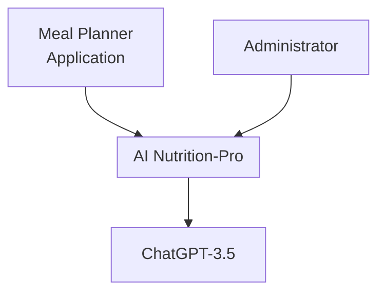
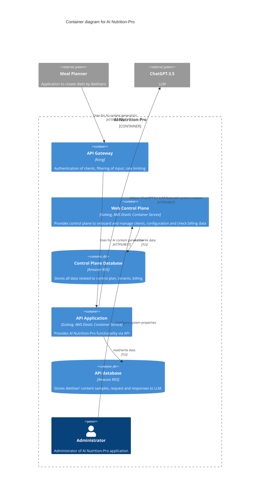
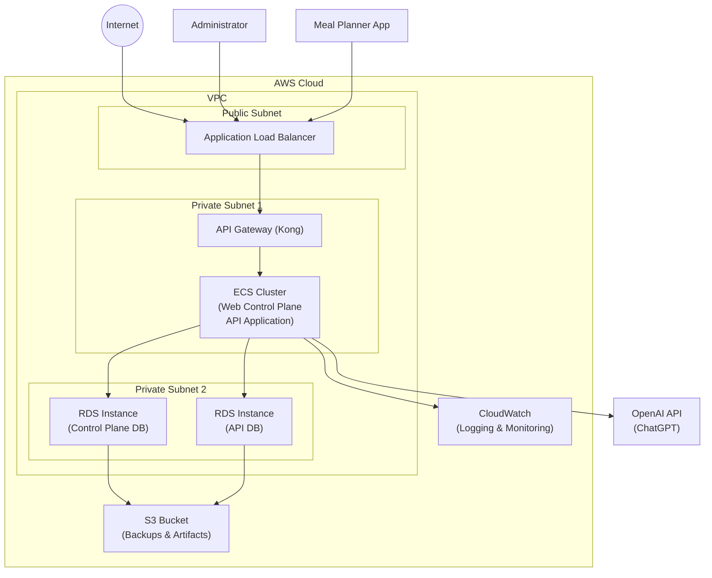
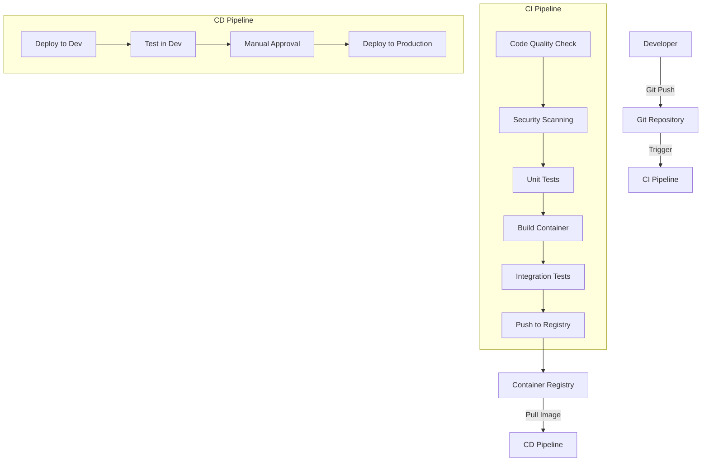

# AI Nutrition-Pro Design Document

## BUSINESS POSTURE

AI Nutrition-Pro is a service that leverages artificial intelligence to assist dietitians and meal planning applications in creating high-quality nutritional content. The system integrates with third-party Meal Planner applications and utilizes ChatGPT-3.5 to enhance content creation for dietary planning.

Business priorities and goals:
1. Provide AI-powered content generation for nutritional and dietary planning
2. Enable integration with multiple Meal Planner applications
3. Streamline onboarding and billing for client applications
4. Maintain high-quality AI-generated content based on dietitians' samples

Key business risks:
1. Dependency on third-party LLM service (ChatGPT) which could impact service availability
2. Quality and accuracy of AI-generated nutritional content potentially affecting health advice
3. Protection of intellectual property (dietitians' content samples)
4. Service reliability and performance for connected client applications
5. Compliance with relevant regulations regarding nutritional and health advice

## SECURITY POSTURE

Existing security controls:
- Security control: Authentication with individual API keys for Meal Planner applications (Implemented in Kong API Gateway)
- Security control: Authorization through ACL rules that allow or deny specific actions (Implemented in API Gateway)
- Security control: TLS encryption for network traffic between Meal Planner applications and API Gateway
- Security control: Input filtering to sanitize incoming requests (Implemented in Kong API Gateway)
- Security control: Rate limiting to prevent abuse and ensure fair usage (Implemented in Kong API Gateway)
- Security control: Isolation between control plane and application data (Implemented through separate RDS databases)

Recommended additional security controls:
- Security control: Data encryption at rest for all sensitive information stored in databases
- Security control: Secure secret management for API keys and credentials
- Security control: Comprehensive logging and monitoring of all API access and system operations
- Security control: Regular vulnerability scanning and security assessments
- Security control: Content validation before sending to LLM service
- Security control: Response sanitization before returning AI-generated content to clients
- Security control: Multi-factor authentication for administrative access

Security requirements:

Authentication:
- All external API requests must be authenticated with valid API keys
- Administrative access should require strong credentials and possibly MFA
- API keys should be unique per client application and stored securely
- Failed authentication attempts should be logged and monitored for potential attacks

Authorization:
- ACL rules should implement least privilege principle
- Different client applications must be isolated from accessing each other's data
- Administrative functions should have appropriate access controls and separation of duties

Input validation:
- All client input must be validated for format, size, and content before processing
- Potentially malicious inputs should be blocked before reaching internal systems
- Content samples should be validated before being sent to the LLM

Cryptography:
- All network communication must use TLS 1.2 or higher
- Sensitive data should be encrypted at rest
- Database connections must use encrypted channels
- Strong hashing algorithms should be used for any stored credentials

## DESIGN

### C4 CONTEXT

| Name | Type | Description | Responsibilities | Security Controls |
|------|------|-------------|-----------------|-------------------|
| AI Nutrition-Pro | System | Cloud-based service providing AI-powered content generation for nutritional and meal planning | - Process dietitians' content samples - Generate AI-enhanced content - Manage client applications and billing | - API authentication - TLS encryption - Rate limiting - Input validation |
| Meal Planner Application | External System | Third-party applications used by dietitians for meal planning | - Upload content samples - Request AI-generated content - Display results to dietitians | - Secure API key storage - Proper content handling |
| Administrator | Person | System administrators who manage the platform | - Configure system - Onboard clients - Monitor system health - Manage billing | - Access controls - Audit logging |
| ChatGPT-3.5 | External System | OpenAI's LLM service | - Process nutrition-related prompts - Generate content based on samples | - Secure API communication - Response validation |

### C4 CONTAINER

| Name | Type | Description | Responsibilities | Security Controls |
|------|------|-------------|-----------------|-------------------|
| API Gateway | Container | Kong API Gateway | - Authentication of clients - Rate limiting - Input filtering - Request routing | - API key validation - Request throttling - Input sanitization - TLS termination |
| Web Control Plane | Container | Golang application on AWS ECS | - Client onboarding - System configuration - Billing management - User administration | - Access controls - Audit logging - Input validation - Session management |
| Control Plane Database | Database | Amazon RDS instance | - Store tenant information - Store billing data - Store system configuration | - Encrypted connections - Data encryption at rest - Access controls |
| API Application | Container | Golang application on AWS ECS | - Process content samples - Communicate with ChatGPT - Format and return content | - Input validation - Output sanitization - Secure API communication |
| API Database | Database | Amazon RDS instance | - Store dietitian content samples - Cache LLM requests/responses - Track usage metrics | - Encrypted connections - Data encryption at rest - Access controls |
| Administrator | Person | Human system administrator | - Configure system - Resolve issues - Manage clients | - Role-based access - Action logging |
| Meal Planner | External System | Third-party application | - Upload content samples - Request AI-generated content | - API key management - TLS communication |
| ChatGPT-3.5 | External System | OpenAI's LLM service | - Generate content based on prompts | - Secure API communication - Response validation |

### DEPLOYMENT

For the AI Nutrition-Pro application, we can consider several deployment options:

1. Single-region AWS deployment (most straightforward)
2. Multi-region AWS deployment for high availability
3. Hybrid cloud deployment with some on-premises components
4. Multi-cloud deployment across different providers

For this document, we'll focus on the single-region AWS deployment architecture.

| Name | Type | Description | Responsibilities | Security Controls |
|------|------|-------------|-----------------|-------------------|
| Application Load Balancer | AWS Service | Entry point for all web traffic | - Traffic distribution - TLS termination - Health checking | - TLS 1.2+ configuration - Security groups - WAF integration |
| API Gateway (Kong) | Container Service | API management platform | - API authentication - Rate limiting - Request routing | - API key validation - Request throttling - Input filtering |
| ECS Cluster | AWS Service | Container orchestration | - Run application containers - Auto-scaling - Health monitoring | - IAM roles - Security groups - Container isolation |
| RDS Instances | AWS Service | Managed database service | - Data storage - Automated backups - Database management | - Encryption at rest - Network isolation - Access controls |
| CloudWatch | AWS Service | Monitoring and logging | - Collect logs - Monitor metrics - Generate alerts | - Log encryption - Access controls - Retention policies |
| S3 Bucket | AWS Service | Object storage | - Store backups - Store deployment artifacts | - Server-side encryption - Access controls - Versioning |
| OpenAI API | External Service | ChatGPT API service | - Process LLM requests - Generate content | - Secure API communication - API key protection |

### BUILD

The AI Nutrition-Pro build and deployment process includes several security-focused steps:

The build and release process includes these security controls:

1. Code repositories use branch protection rules to prevent direct commits to main branches
2. All code changes require peer review through pull requests
3. Static Application Security Testing (SAST) is performed on all code changes
4. Dependency scanning identifies vulnerable third-party libraries
5. Container scanning checks for vulnerabilities in the container images
6. All secrets are managed through AWS Secrets Manager, not stored in code
7. Container images are signed and verified before deployment
8. Infrastructure is defined as code and undergoes security review
9. Deployment to production requires manual approval after testing in development
10. Continuous security monitoring occurs during and after deployment

## RISK ASSESSMENT

Critical business processes we are trying to protect:
1. AI-powered content generation for nutritional and dietary planning
2. Client application authentication and authorization
3. Billing and tenant management
4. Protection of dietitians' intellectual property (content samples)
5. System availability and reliability

Data we are trying to protect and their sensitivity:
1. Dietitian content samples (Medium-High sensitivity) - Intellectual property of dietitians
2. Client API keys (High sensitivity) - Could enable unauthorized access if compromised
3. AI-generated content (Medium sensitivity) - Represents business value and potentially affects health advice
4. Billing information (High sensitivity) - Contains financial data of clients
5. System configuration (Medium sensitivity) - Could expose operational details
6. Administrative credentials (High sensitivity) - Could enable system compromise

## QUESTIONS & ASSUMPTIONS

### BUSINESS POSTURE
1. What is the expected scale of operation in terms of number of clients and request volume?
   Assumption: The system is designed to handle dozens of client applications with moderate traffic.

2. What are the regulatory requirements for nutritional advice in target markets?
   Assumption: The system provides AI assistance but does not make medical claims.

3. What are the SLA requirements for availability and response time?
   Assumption: High availability (99.9%+) with response times under 2 seconds for most operations.

### SECURITY POSTURE
1. Is there a need for compliance with specific regulations (HIPAA, GDPR, etc.)?
   Assumption: Basic GDPR compliance and best security practices are required.

2. What is the data retention policy for dietitian content samples?
   Assumption: Content is retained only as long as needed for service operation.

3. How sensitive is the content being processed by the system?
   Assumption: Content is professionally valuable but does not contain personal health information.

### DESIGN
1. How are database backups handled?
   Assumption: Automated backups via AWS RDS with appropriate retention periods.

2. Is there a disaster recovery plan?
   Assumption: Basic disaster recovery through database backups and infrastructure-as-code.

3. How is the system scaled during peak demand?
   Assumption: Auto-scaling is configured for the application containers based on CPU/memory metrics.
