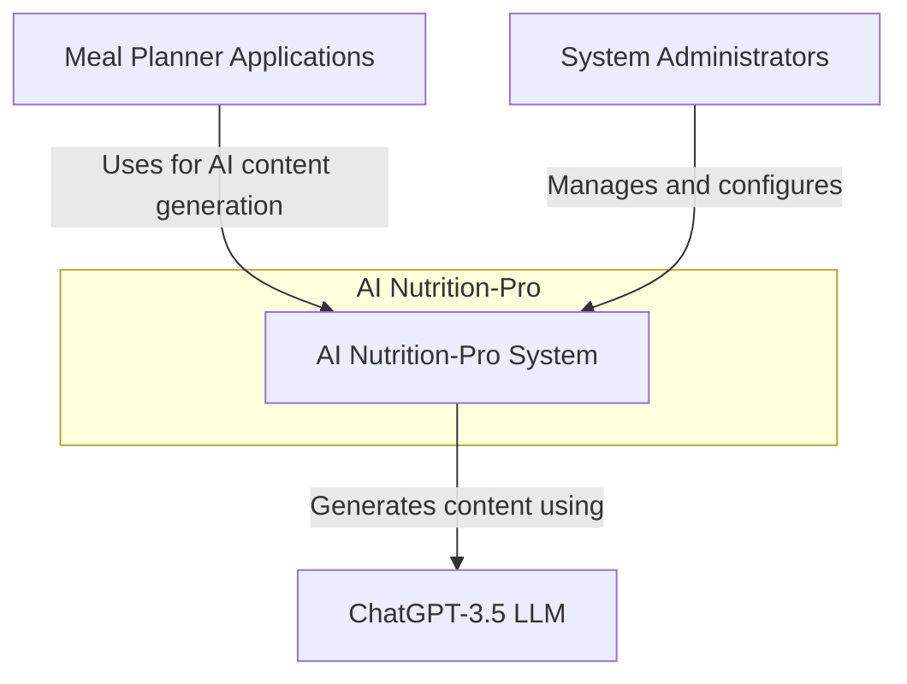
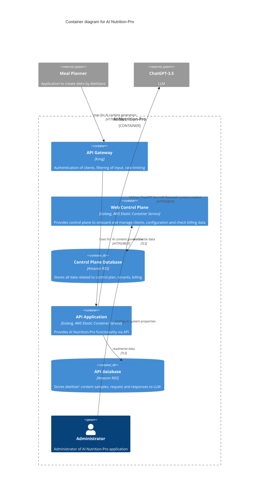
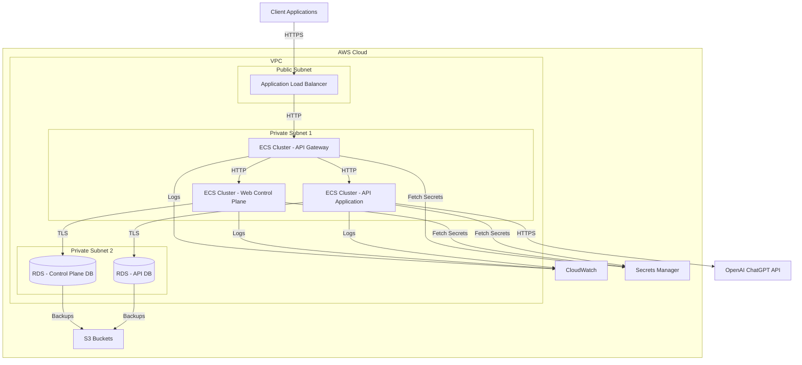
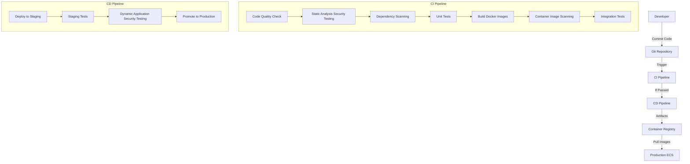

# AI Nutrition-Pro Design Document

## BUSINESS POSTURE

AI Nutrition-Pro is a software platform that leverages artificial intelligence, specifically OpenAI's ChatGPT-3.5, to enhance the content creation process for dietitians and meal planning professionals. The business priorities and goals include:

1. Automating the generation of nutrition-related content based on dietitians' samples
2. Providing a seamless integration path for third-party Meal Planner applications
3. Offering a scalable, multi-tenant solution for nutrition content generation
4. Creating a reliable platform with high uptime and performance

Key business risks that need to be addressed:

1. Inaccurate content generation that could lead to improper dietary recommendations
2. System downtime affecting client operations and satisfaction
3. Data privacy concerns regarding dietitian content and generated outputs
4. Integration challenges with various Meal Planner applications
5. Scalability issues during peak usage periods

## SECURITY POSTURE

### Existing Security Controls

- security control: Authentication with API keys for Meal Planner applications (implemented in Kong API Gateway)
- security control: Authorization via ACL rules in the API Gateway (implemented in Kong API Gateway)
- security control: Encrypted network traffic between components using TLS (implemented between all components)

### Accepted Risks

- accepted risk: Reliance on third-party LLM (ChatGPT-3.5) for content generation
- accepted risk: Potential exposure to API rate limiting from OpenAI

### Recommended High-Priority Security Controls

- security control: Implement WAF (Web Application Firewall) for API protection
- security control: Set up comprehensive logging and monitoring for all system components
- security control: Implement data encryption at rest for all databases
- security control: Establish formal access control mechanisms for administrative functions
- security control: Develop a secure SDLC process with regular security testing

### Security Requirements

#### Authentication
- API clients must authenticate using unique API keys
- Administrative access must require strong authentication mechanisms
- Failed authentication attempts should be logged and monitored

#### Authorization
- Role-based access control for administrative users
- Fine-grained permissions for API operations
- Rate limiting based on client identity

#### Input Validation
- All API inputs must be validated and sanitized
- Implement request size limitations
- Content scanning for malicious patterns

#### Cryptography
- TLS 1.2+ for all communications
- Modern encryption algorithms for data at rest
- Secure key management processes

## DESIGN

The AI Nutrition-Pro platform is designed as a cloud-native application deployed on AWS infrastructure. It consists of several interconnected components that work together to provide AI-powered nutrition content generation services.

### C4 CONTEXT

#### Context Elements

| Name | Type | Description | Responsibilities | Security Controls |
|------|------|-------------|-----------------|-------------------|
| AI Nutrition-Pro System | Core System | Central system that provides AI-powered nutrition content generation | - Process content generation requests - Manage tenant accounts - Handle billing and usage tracking - Store dietitian content samples | - Authentication and authorization - Data encryption - Input validation - Rate limiting |
| Meal Planner Applications | External System | Third-party applications that integrate with AI Nutrition-Pro | - Send content generation requests - Upload dietitian content samples - Retrieve generated content | - API key authentication - Secure TLS communication |
| ChatGPT-3.5 LLM | External System | OpenAI's language model used for content generation | - Generate nutrition-related content based on provided samples | - Secure API communication - Input validation |
| System Administrators | Person | Individuals responsible for managing the platform | - Configure system settings - Onboard new clients - Monitor system performance - Handle support requests | - Strong authentication - Audit logging - Access controls |

### C4 CONTAINER

#### Container Elements

| Name | Type | Description | Responsibilities | Security Controls |
|------|------|-------------|-----------------|-------------------|
| API Gateway | Container | Kong API Gateway | - Authentication of clients - Filtering of input - Rate limiting - Request routing | - API key validation - Input sanitization - Rate limiting - TLS termination |
| Web Control Plane | Container | Golang application running on AWS ECS | - Client onboarding - System configuration - Billing management - User management | - Authentication - Authorization - Input validation - Audit logging |
| Control Plane Database | Database | Amazon RDS instance | - Store tenant information - Store system configuration - Store billing data | - Encryption at rest - Access controls - Backup and recovery |
| API Application | Container | Golang application running on AWS ECS | - Process content generation requests - Communicate with ChatGPT - Store and retrieve content samples | - Input validation - Rate limiting - Secure API design - Content validation |
| API Database | Database | Amazon RDS instance | - Store dietitian content samples - Store LLM requests and responses - Store usage metrics | - Encryption at rest - Access controls - Backup and recovery |
| Administrator | Person | System administrator | - Manage server configuration - Resolve problems - Monitor system health | - Strong authentication - Least privilege access - Action logging |
| Meal Planner | External System | Third-party application | - Upload samples of dietitians' content - Fetch AI generated results | - API key authentication - TLS communication |
| ChatGPT-3.5 | External System | OpenAI's LLM | - Generate content based on provided samples | - Secure API communication - Response validation |

### DEPLOYMENT

AI Nutrition-Pro is deployed in AWS cloud using a combination of managed services and containerized applications. The primary deployment architecture leverages AWS Elastic Container Service (ECS) for running containerized applications, Amazon RDS for databases, and other AWS services for networking, security, and monitoring.

Possible deployment solutions:
1. Single-region AWS deployment (described below)
2. Multi-region AWS deployment for global availability
3. Hybrid cloud deployment with on-premises components

#### Deployment Elements

| Name | Type | Description | Responsibilities | Security Controls |
|------|------|-------------|-----------------|-------------------|
| Application Load Balancer | AWS Service | Entry point for all traffic | - Traffic distribution - SSL termination - Health checks | - TLS 1.2+ enforcement - WAF integration - DDoS protection |
| ECS Cluster - API Gateway | Container Cluster | Runs Kong API Gateway containers | - Traffic routing - Authentication - Rate limiting | - Auto-scaling - Health monitoring - Container hardening |
| ECS Cluster - Web Control Plane | Container Cluster | Runs Control Plane application | - Administrative interface - Configuration management | - Auto-scaling - Health monitoring - Container hardening |
| ECS Cluster - API Application | Container Cluster | Runs API application containers | - Business logic execution - LLM integration | - Auto-scaling - Health monitoring - Container hardening |
| RDS - Control Plane DB | Database Service | Managed PostgreSQL database | - Store control plane data | - Encryption at rest - Automatic backups - Multi-AZ deployment |
| RDS - API DB | Database Service | Managed PostgreSQL database | - Store API application data | - Encryption at rest - Automatic backups - Multi-AZ deployment |
| CloudWatch | Monitoring Service | Centralized logging and monitoring | - Log aggregation - Metrics collection - Alerting | - Log encryption - Access controls - Retention policies |
| S3 Buckets | Storage Service | Object storage for backups and artifacts | - Store database backups - Store application artifacts | - Encryption at rest - Versioning - Access controls |
| Secrets Manager | Security Service | Secure storage of credentials | - Store API keys - Store database credentials | - Encryption - Access controls - Automatic rotation |

### BUILD

The AI Nutrition-Pro system follows a modern DevSecOps approach for building, testing, and deploying components. The build process incorporates several security controls to ensure the integrity and security of the final product.

The build process includes the following security controls:

1. Code Quality Checks: Enforces coding standards and identifies potential issues
2. SAST (Static Application Security Testing): Uses tools like SonarQube and GoSec to identify security vulnerabilities in code
3. Dependency Scanning: Checks all dependencies for known vulnerabilities using tools like OWASP Dependency Check
4. Unit Testing: Ensures code functions as expected and maintains security properties
5. Container Image Scanning: Uses tools like Trivy or Clair to scan Docker images for vulnerabilities
6. Integration Testing: Verifies components work together securely
7. Dynamic Application Security Testing (DAST): Tests running applications for vulnerabilities
8. Immutable Infrastructure: Once built and tested, containers are not modified but replaced with new versions

All build artifacts are stored in a secure container registry with access controls and image signing to prevent tampering.

## RISK ASSESSMENT

### Critical Business Processes to Protect

1. Content Generation Process: The core functionality of generating accurate, safe nutrition content must be protected from manipulation or disruption
2. Client Authentication and Authorization: Ensuring only legitimate clients can access the system and only their own data
3. Billing and Usage Tracking: Accurately tracking and billing for system usage is critical for revenue
4. Administrative Operations: Onboarding new clients and configuring the system must be secure and reliable

### Data Protection Priorities

1. Dietitian Content Samples:
   - Sensitivity: Medium-High
   - Contains proprietary content created by dietitians that represents their intellectual property
   - Unauthorized access could expose competitive information

2. Generated Content:
   - Sensitivity: Medium
   - Output of the system that may contain elements of input data
   - Could contain health-related recommendations

3. Client Account Information:
   - Sensitivity: Medium-High
   - Contains business relationship information
   - Includes API keys and integration details

4. System Configuration:
   - Sensitivity: High
   - Contains security settings and infrastructure details
   - Could be exploited if leaked

5. Authentication Credentials:
   - Sensitivity: Critical
   - Includes admin credentials and API keys
   - Direct access to system controls

## QUESTIONS & ASSUMPTIONS

### Business Posture Questions
1. What is the expected scale of operations (number of clients, request volume)?
2. Are there specific compliance requirements for nutrition advice that must be considered?
3. What is the target SLA for the platform?
4. Is there a plan for international expansion that might introduce additional regulatory requirements?

### Business Posture Assumptions
1. The platform is designed for dietitians and meal planning professionals rather than direct consumer use
2. Content quality and accuracy are critical business priorities
3. The system needs to scale to handle multiple meal planning applications concurrently

### Security Posture Questions
1. What data retention policies need to be implemented?
2. Are there specific compliance frameworks that need to be addressed (HIPAA, GDPR, etc.)?
3. What is the threat model for the application?
4. How should security incidents be handled and reported?

### Security Posture Assumptions
1. All connections between components use TLS 1.2+
2. API keys are used as the primary authentication mechanism for external systems
3. Administrative access requires stronger authentication than client API access
4. All sensitive data is encrypted at rest

### Design Questions
1. How should the system handle failure of the ChatGPT API?
2. What monitoring and alerting mechanisms should be implemented?
3. Is there a need for a caching layer to improve performance?
4. How will database migrations be handled?

### Design Assumptions
1. The application is deployed in AWS using containerized services
2. Amazon RDS is used for relational database requirements
3. Kong is used as the API Gateway
4. The system operates in a multi-tenant model
