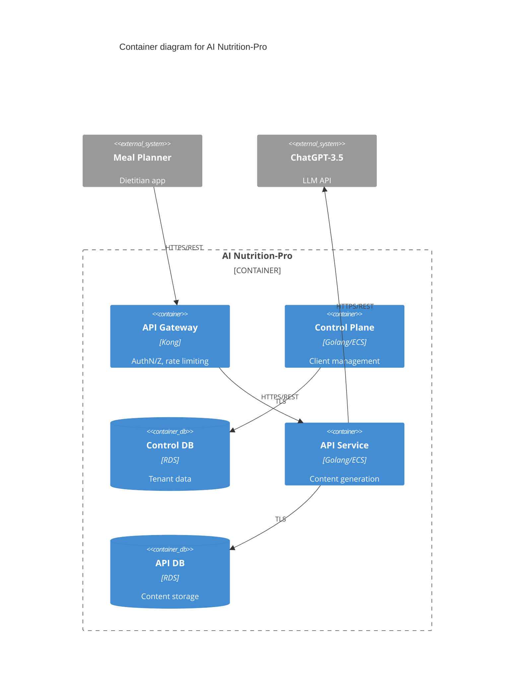
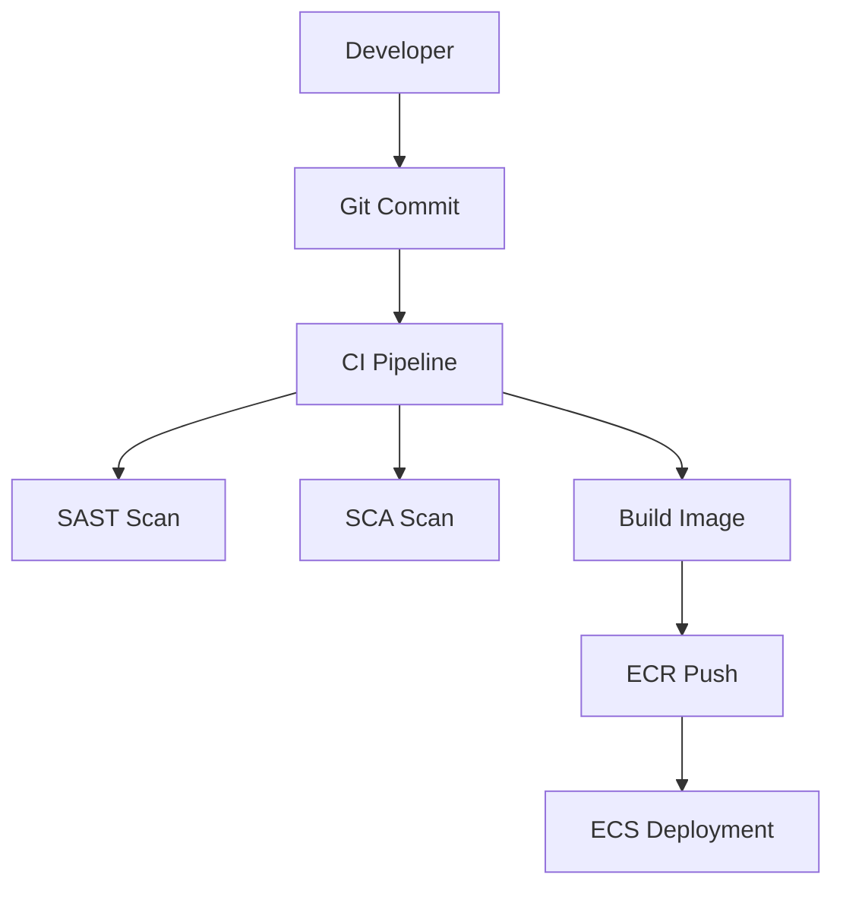

mermaid
C4Context
    title System Context diagram for AI Nutrition-Pro
    System(AI_Nutrition_Pro, "AI Nutrition-Pro", "AI-powered content generation system for dietitians")
    Person(Admin, "Administrator", "Manages system configuration and operations")
    System(Meal_Planner, "Meal Planner Application", "External diet planning system")
    System(ChatGPT, "ChatGPT-3.5", "OpenAI LLM service")
    Rel(Meal_Planner, AI_Nutrition_Pro, "Submits content samples\nRetrieves AI-generated content", "HTTPS/REST")
    Rel(Admin, AI_Nutrition_Pro, "Manages configurations\nMonitors operations", "HTTPS")
    Rel(AI_Nutrition_Pro, ChatGPT, "Sends generation requests\nReceives LLM responses", "HTTPS/REST")
```

## BUSINESS POSTURE
**Primary Business Goals:**
1. Provide AI-driven content generation for dietitians
2. Enable integration with third-party meal planning applications
3. Monetize through API usage-based billing model

**Key Business Risks:**
- Dependency on third-party LLM (ChatGPT) performance and availability
- Potential data privacy concerns with health-related content
- Competitive pressure in AI nutrition space
- API service reliability impacting customer retention

## SECURITY POSTURE

### Existing Security Controls
1. **security control** API key authentication for external systems
2. **security control** TLS encryption for all external communications
3. **security control** ACL-based authorization at API Gateway
4. **security control** Database encryption at rest (RDS)

### Recommended Security Controls
1. Implement input validation framework for API endpoints
2. Add secrets management system for API keys
3. Introduce audit logging for administrative actions
4. Deploy Web Application Firewall (WAF) for API protection

### Security Requirements
**Authentication:**
- Mutual TLS for internal service communication
- API key rotation every 90 days
- JWT for admin console access

**Authorization:**
- Role-based access control for admin portal
- Per-client API endpoint permissions
- Separation of dev/prod environments

**Input Validation:**
- Strict schema validation for JSON payloads
- Maximum payload size enforcement
- Content-type whitelisting

**Cryptography:**
- AES-256 for data at rest
- TLS 1.3 for data in transit
- KMS-managed encryption keys

## DESIGN

### C4 CONTEXT



| Name | Type | Description | Responsibilities | Security Controls |
|------|------|-------------|-------------------|-------------------|
| API Gateway | Container | Kong implementation | Request routing, AuthN/Z | TLS, Rate limiting |
| Control Plane | Container | Golang service | Client onboarding | RBAC, Audit logs |
| API Service | Container | Golang service | Content generation | Input validation |
| Meal Planner | External | Client system | Content submission | API key auth |
| ChatGPT | External | LLM provider | AI processing | TLS 1.3 |

### DEPLOYMENT

```mermaid
C4Deployment
    title Deployment Overview
    Deployment_Node(AWS, "AWS Cloud", "Production") {
        Deployment_Node(ECS, "ECS Cluster", "Docker") {
            Container(api_gateway, "API Gateway")
            Container(app_control, "Control Plane")
            Container(backend, "API Service")
        }
        Deployment_Node(RDS, "Database Tier") {
            ContainerDb(control_db, "Control DB")
            ContainerDb(api_db, "API DB")
        }
    }
    Rel(api_gateway, backend, "HTTPS")
    Rel(backend, RDS, "TLS")
```

| Component | Type | Description | Security Controls |
|-----------|------|-------------|-------------------|
| ECS Cluster | Container Runtime | Docker containers in AWS ECS | Security groups, IAM roles |
| RDS | Database | PostgreSQL instances | Encryption at rest, Backups |
| VPC | Network | Isolated network | NACLs, Flow logs |

### BUILD
**CI/CD Pipeline:**
1. Developer commits to Git repository
2. GitHub Actions triggers build
3. Security checks (SAST, SCA)
4. Container image scanning
5. Deployment to ECR
6. ECS service update



## RISK ASSESSMENT
**Critical Business Processes:**
- AI content generation reliability
- Client onboarding workflow
- Billing and usage tracking

**Protected Data Assets:**
- Client API credentials (High sensitivity)
- Dietitian content samples (Medium sensitivity)
- LLM request/response logs (Medium sensitivity)

## QUESTIONS & ASSUMPTIONS
1. What compliance requirements apply (HIPAA, GDPR)?
2. Is multi-tenancy implemented at database level?
3. Disaster recovery RTO/RPO requirements?
4. Third-party dependency monitoring strategy?

**Default Assumptions:**
- AWS shared responsibility model applies
- No PII processing in current scope
- Weekly vulnerability scanning cadence
- 30-day log retention period
