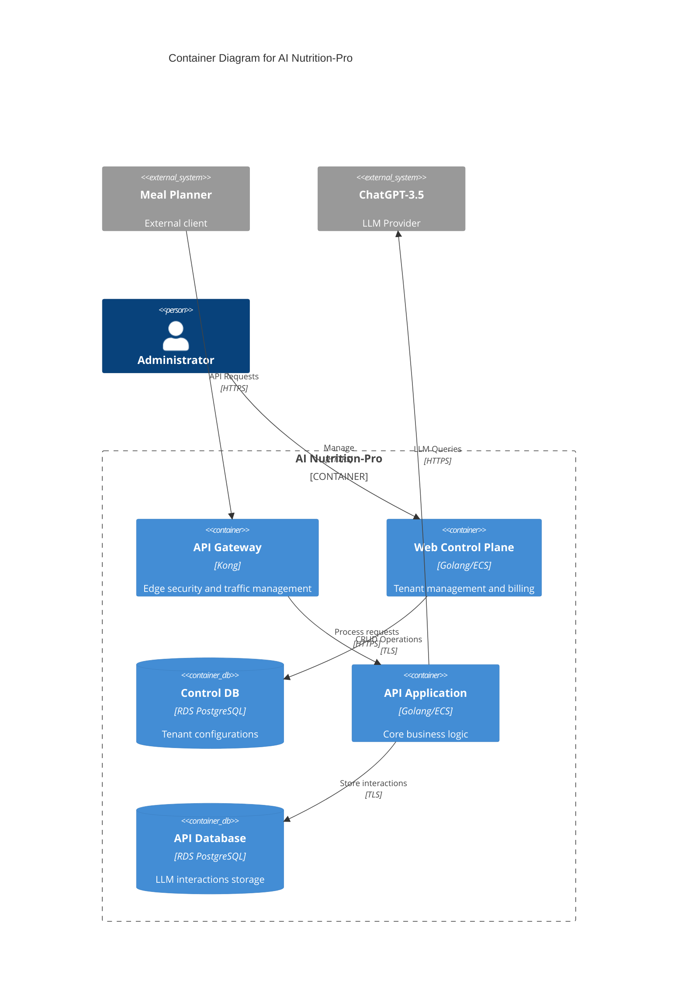
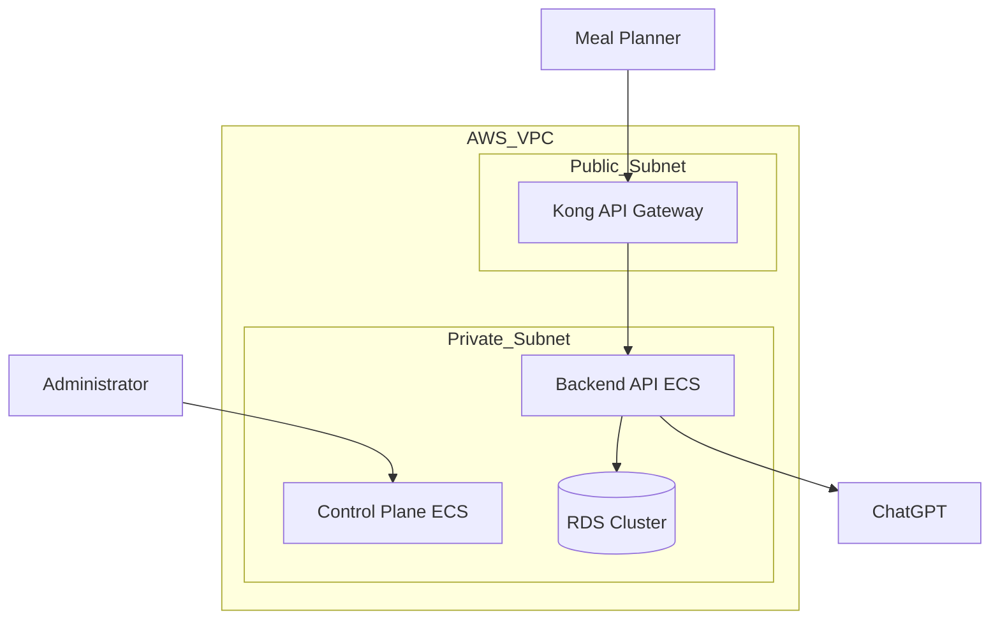
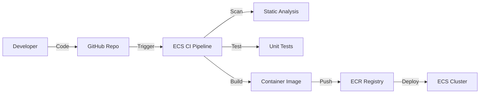

mermaid
C4Context
    title Context Diagram for AI Nutrition-Pro

    System_Boundary(c0, "AI Nutrition-Pro Ecosystem") {
        System(api_gateway, "API Gateway", "Handles client authentication and traffic management")
        System(app_control_plane, "Web Control Plane", "Management interface for administrators")
        System(backend_api, "API Application", "Core AI processing functionality")
    }

    Person(admin, "Administrator", "System administrator")
    System_Ext(mealApp, "Meal Planner", "External dietitian application")
    System_Ext(chatgpt, "ChatGPT-3.5", "LLM provider")

    Rel(mealApp, api_gateway, "HTTPS/REST API calls")
    Rel(api_gateway, backend_api, "HTTPS/REST")
    Rel(admin, app_control_plane, "Management operations")
    Rel(backend_api, chatgpt, "LLM API requests")
```

## BUSINESS POSTURE

**Business Priorities:**
1. Enable dietitians to enhance meal planning through AI-generated content
2. Maintain seamless integration with various meal planner applications
3. Ensure scalable infrastructure for growing client base
4. Monetize API usage through subscription model

**Key Business Risks:**
- Service disruptions impacting dietitians' workflows
- Data breaches exposing proprietary dietitian content
- Overdependence on third-party LLM (ChatGPT)
- Compliance challenges with health-related data processing

## SECURITY POSTURE

**Existing Security Controls:**
1. security control: API Key Authentication (Implemented in Kong API Gateway)
2. security control: TLS Encryption (All external communications)
3. security control: Rate Limiting (API Gateway layer)
4. security control: Input Validation (API Gateway and Application layers)

**Accepted Risks:**
1. accepted risk: Dependency on ChatGPT API security
2. accepted risk: API Key storage responsibility delegated to clients
3. accepted risk: Shared RDS instances for multi-tenant data

**Recommended Security Controls:**
1. Implement Web Application Firewall (WAF) for API protection
2. Add application-level authorization checks
3. Introduce secrets management system for database credentials
4. Enable database encryption at rest
5. Implement audit logging for admin actions

**Security Requirements:**
1. Authentication:
   - API Key + HMAC signature for machine-to-machine
   - MFA for admin console access
2. Authorization:
   - Role-Based Access Control (RBAC) for admin operations
   - Tenant isolation in API operations
3. Input Validation:
   - Strict schema validation for LLM prompts
   - Content size limits (max 10MB per request)
4. Cryptography:
   - AES-256 for data at rest
   - TLS 1.3 for data in transit
   - Key rotation every 90 days

## DESIGN

### C4 CONTEXT



| Name | Type | Description | Responsibilities | Security Controls |
|------|------|-------------|-------------------|-------------------|
| API Gateway | Reverse Proxy | Kong implementation | Request validation, rate limiting, auth | TLS, API Keys, WAF |
| Web Control Plane | Web App | Golang ECS container | Tenant management, billing | RBAC, MFA, Audit Logs |
| API Application | Service | Golang ECS container | LLM interaction handling | Input validation, TLS |
| Control DB | Database | RDS PostgreSQL | Tenant configurations | Encryption at rest, IAM auth |
| API Database | Database | RDS PostgreSQL | LLM request storage | Encryption at rest, PII masking |
| Meal Planner | External System | Client application | Initiate API requests | API Key rotation |
| ChatGPT-3.5 | External Service | LLM provider | Content generation | API Key encryption |

### DEPLOYMENT



| Name | Type | Description | Responsibilities | Security Controls |
|------|------|-------------|-------------------|-------------------|
| AWS VPC | Network | Isolated network | Resource grouping | Security Groups, NACLs |
| Public Subnet | Network | External access | API Gateway hosting | Limited ingress rules |
| Private Subnet | Network | Internal resources | App hosting | No direct internet access |
| RDS Cluster | Database | PostgreSQL instances | Data storage | Encryption, Automated backups |

### BUILD



**Build Security Controls:**
1. Code signing verification in CI pipeline
2. SCA (Software Composition Analysis) for dependencies
3. SAST scanning with Semgrep
4. Container vulnerability scanning
5. Immutable container tags
6. Build log retention for 1 year

## RISK ASSESSMENT

**Critical Business Processes:**
- LLM content generation availability
- Tenant configuration management
- Billing accuracy

**Data Sensitivity:**
1. PII: Dietitian contact information (Medium sensitivity)
2. PHI: Meal plan examples (High sensitivity)
3. API Keys: Authentication secrets (Critical)
4. LLM Prompts: Proprietary diet formulas (High)

## QUESTIONS & ASSUMPTIONS

**Questions:**
1. What compliance requirements apply (HIPAA, GDPR)?
2. Disaster Recovery RTO/RPO targets?
3. Monitoring requirements for LLM API costs?
4. Data retention policy for LLM interactions?

**Assumptions:**
1. AWS shared responsibility model applies
2. ChatGPT API usage complies with data policies
3. Meal Planner clients implement API key security
4. Admin access requires corporate credentials
5. Database backups encrypted by default
