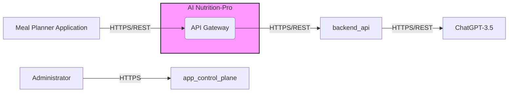
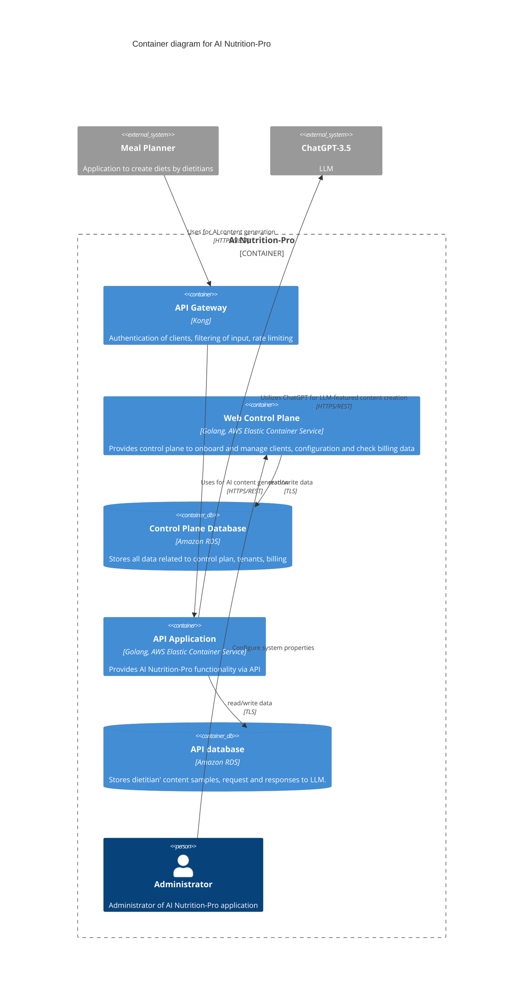
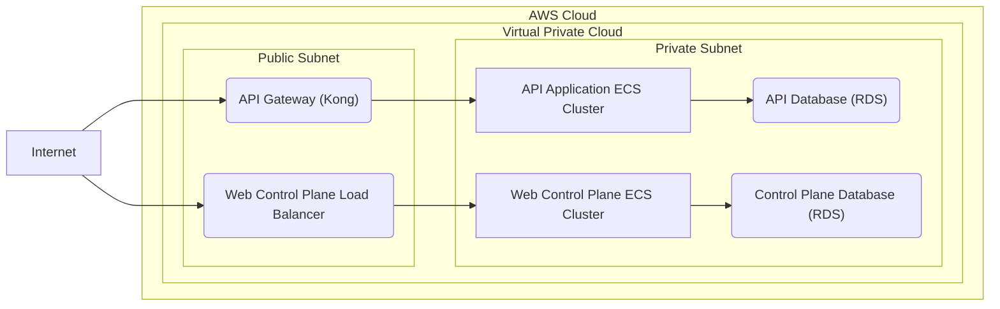

# BUSINESS POSTURE

The AI Nutrition-Pro application aims to provide AI-powered content generation for meal planning applications, specifically for dietitians' content. The primary business goal is to offer a service that enhances the capabilities of meal planner applications by automating the creation of diet-related content using Large Language Models (LLMs). This service likely targets meal planner application providers as customers, enabling them to offer more engaging and personalized content to their users.

Key business priorities include:
- Seamless integration with existing meal planner applications.
- High availability and reliability of the content generation service.
- Scalability to handle varying loads from different meal planner applications.
- Security and privacy of dietitian content samples and generated content.
- Cost-effectiveness of the solution.

Important business risks to address:
- Data breaches of dietitian content samples or generated diet plans, potentially leading to loss of competitive advantage or regulatory fines.
- Service unavailability impacting integrated meal planner applications and their users.
- Inaccurate or inappropriate AI-generated content damaging the reputation of meal planner applications and AI Nutrition-Pro.
- Integration challenges with diverse meal planner application architectures.
- Cost overruns in infrastructure or LLM usage impacting profitability.

# SECURITY POSTURE

Existing security controls:
- security control: Authentication with Meal Planner applications using individual API keys. Implemented in API Gateway.
- security control: Authorization of Meal Planner applications using API Gateway ACL rules. Implemented in API Gateway.
- security control: Encrypted network traffic between Meal Planner applications and API Gateway using TLS. Implemented in API Gateway and Meal Planner applications.

Recommended security controls:
- security control: Implement input validation and sanitization on API Gateway and Backend API to prevent injection attacks.
- security control: Implement output encoding to protect against cross-site scripting (XSS) vulnerabilities in the Web Control Plane.
- security control: Regular security vulnerability scanning and penetration testing of all components.
- security control: Implement a Web Application Firewall (WAF) in front of the API Gateway and Web Control Plane to protect against common web attacks.
- security control: Implement robust logging and monitoring for security events across all components.
- security control: Data Loss Prevention (DLP) measures to protect sensitive data at rest and in transit.
- security control: Secure Software Development Lifecycle (SSDLC) practices integrated into the development process.
- security control: Implement Infrastructure as Code (IaC) for consistent and secure infrastructure deployments.

Security requirements:
- Authentication:
    - Requirement: Meal Planner applications must authenticate to access the AI Nutrition-Pro API. Mechanism: API keys.
    - Requirement: Administrators must authenticate to access the Web Control Plane. Mechanism: username/password or multi-factor authentication.
    - Requirement: Securely manage and store API keys and administrative credentials.
- Authorization:
    - Requirement: Meal Planner applications should only be authorized to access specific API endpoints and actions based on their roles and permissions. Mechanism: API Gateway ACLs.
    - Requirement: Administrators should be authorized to perform specific actions within the Web Control Plane based on their roles. Mechanism: Role-Based Access Control (RBAC) within Web Control Plane application.
- Input Validation:
    - Requirement: All API endpoints must validate and sanitize input data to prevent injection attacks (e.g., SQL injection, command injection). Implementation: API Gateway and Backend API.
    - Requirement: Web Control Plane must validate user inputs to prevent injection attacks. Implementation: Web Control Plane application.
- Cryptography:
    - Requirement: All sensitive data at rest in databases must be encrypted. Mechanism: Database encryption at rest (e.g., Amazon RDS encryption).
    - Requirement: All network communication containing sensitive data must be encrypted in transit using TLS. Mechanism: TLS for HTTPS and database connections.
    - Requirement: Securely manage cryptographic keys. Mechanism: AWS Key Management Service (KMS) or similar.

# DESIGN

## C4 CONTEXT



### Context Diagram Elements

- Element:
    - Name: Meal Planner Application
    - Type: External System
    - Description: Web application used by dietitians to create meal plans and integrate AI-generated content.
    - Responsibilities:
        - Uploads dietitian content samples to AI Nutrition-Pro.
        - Fetches AI-generated content from AI Nutrition-Pro.
    - Security controls:
        - security control: Authenticates to AI Nutrition-Pro using API keys.
        - security control: Encrypts communication using TLS.

- Element:
    - Name: ChatGPT-3.5
    - Type: External System
    - Description: OpenAI's Large Language Model used for content generation.
    - Responsibilities:
        - Generates diet-related content based on provided samples.
    - Security controls:
        - security control: Data processing and privacy policies of OpenAI.
        - security control: Secure API communication via HTTPS.

- Element:
    - Name: Administrator
    - Type: Person
    - Description: Internal administrator of the AI Nutrition-Pro application.
    - Responsibilities:
        - Manages system configuration.
        - Resolves operational issues.
    - Security controls:
        - security control: Authenticates to Web Control Plane with username/password.
        - security control: Authorization based on administrator roles within the Web Control Plane.

- Element:
    - Name: AI Nutrition-Pro
    - Type: System
    - Description: AI-powered content generation application for meal planning.
    - Responsibilities:
        - Provides API for meal planner applications to request AI content generation.
        - Manages client onboarding, configuration, and billing.
        - Securely stores dietitian content samples and generated content.
    - Security controls:
        - security control: API Gateway for authentication, authorization, and rate limiting.
        - security control: Securely configured AWS infrastructure (ECS, RDS).
        - security control: Data encryption at rest and in transit.
        - security control: Input validation and output encoding.
        - security control: Logging and monitoring.

## C4 CONTAINER



### Container Diagram Elements

- Element:
    - Name: API Gateway
    - Type: Container
    - Description: Kong API Gateway, acting as the entry point for all external requests.
    - Responsibilities:
        - Authentication of Meal Planner applications using API keys.
        - Authorization using ACL rules.
        - Rate limiting to prevent abuse.
        - Request filtering and input validation.
        - Routing requests to Backend API.
    - Security controls:
        - security control: API Key authentication.
        - security control: ACL based authorization.
        - security control: Rate limiting configurations.
        - security control: Input validation rules.
        - security control: TLS termination for HTTPS.

- Element:
    - Name: Web Control Plane
    - Type: Container
    - Description: Golang application deployed on AWS ECS, providing a web interface for administration and management.
    - Responsibilities:
        - Administrator authentication and authorization.
        - Client onboarding and management.
        - System configuration management.
        - Billing data management.
        - Monitoring and logging.
    - Security controls:
        - security control: Username/password or MFA based authentication for administrators.
        - security control: Role-Based Access Control (RBAC) for administrator actions.
        - security control: Input validation and output encoding.
        - security control: Session management.
        - security control: Secure logging and audit trails.

- Element:
    - Name: Control Plane Database
    - Type: Container Database
    - Description: Amazon RDS instance, storing data for the Web Control Plane.
    - Responsibilities:
        - Persistent storage for control plane data, including client information, configuration, and billing details.
    - Security controls:
        - security control: Encryption at rest (RDS encryption).
        - security control: Network security groups to restrict access.
        - security control: Regular backups and disaster recovery.
        - security control: Access control lists within RDS.
        - security control: TLS encryption for database connections.

- Element:
    - Name: API Application
    - Type: Container
    - Description: Golang application deployed on AWS ECS, providing the core AI Nutrition-Pro API functionality.
    - Responsibilities:
        - Processing API requests for AI content generation.
        - Interacting with ChatGPT-3.5 for content generation.
        - Storing requests and responses in the API database.
        - Retrieving dietitian content samples from the API database.
    - Security controls:
        - security control: Input validation and sanitization.
        - security control: Secure handling of API keys and credentials for ChatGPT-3.5.
        - security control: Output encoding.
        - security control: Rate limiting (in conjunction with API Gateway).
        - security control: Secure logging.

- Element:
    - Name: API database
    - Type: Container Database
    - Description: Amazon RDS instance, storing data for the API Application, including dietitian content samples, requests, and responses.
    - Responsibilities:
        - Persistent storage for API data, including sensitive dietitian content samples and AI-generated content.
    - Security controls:
        - security control: Encryption at rest (RDS encryption).
        - security control: Network security groups to restrict access.
        - security control: Regular backups and disaster recovery.
        - security control: Access control lists within RDS.
        - security control: TLS encryption for database connections.

## DEPLOYMENT

Deployment Architecture: AWS Cloud



### Deployment Diagram Elements

- Element:
    - Name: Internet
    - Type: External Network
    - Description: Public internet, source of traffic from Meal Planner Applications and Administrators.
    - Responsibilities:
        - Provides network connectivity for external users.
    - Security controls:
        - security control: Perimeter firewalls at VPC level.
        - security control: DDoS protection services (e.g., AWS Shield).

- Element:
    - Name: VPC (Virtual Private Cloud)
    - Type: Cloud Network
    - Description: Isolated network within AWS for AI Nutrition-Pro resources.
    - Responsibilities:
        - Network isolation and security boundary for the application.
    - Security controls:
        - security control: Network Access Control Lists (NACLs) at subnet level.
        - security control: Security Groups for instances and resources.
        - security control: Route tables for network traffic management.

- Element:
    - Name: Public Subnet
    - Type: Cloud Subnet
    - Description: Subnet within VPC with internet access.
    - Responsibilities:
        - Hosting public-facing components like API Gateway and Web Control Plane Load Balancer.
    - Security controls:
        - security control: Internet Gateway for internet access.
        - security control: Route tables directing traffic to Internet Gateway.
        - security control: Security Groups allowing inbound traffic from the internet on specific ports (80, 443).

- Element:
    - Name: Private Subnet
    - Type: Cloud Subnet
    - Description: Subnet within VPC without direct internet access.
    - Responsibilities:
        - Hosting backend components like ECS clusters and RDS databases.
    - Security controls:
        - security control: No direct route to Internet Gateway.
        - security control: NAT Gateway for outbound internet access if needed (for updates, etc.).
        - security control: Security Groups restricting inbound traffic to only necessary sources within VPC.

- Element:
    - Name: API Gateway (Kong) Instance
    - Type: Compute Instance
    - Description: Instance running Kong API Gateway in the Public Subnet.
    - Responsibilities:
        - Receives and processes external API requests.
        - Enforces security controls (authentication, authorization, rate limiting).
        - Routes requests to Backend API ECS cluster.
    - Security controls:
        - security control: Security Groups allowing inbound HTTPS traffic from the internet and outbound HTTPS to the Private Subnet.
        - security control: Regular patching and updates.
        - security control: Hardened OS configuration.

- Element:
    - Name: Web Control Plane Load Balancer
    - Type: Load Balancer
    - Description: AWS Elastic Load Balancer distributing traffic to Web Control Plane ECS cluster.
    - Responsibilities:
        - Load balancing traffic to Web Control Plane instances.
        - Health checks for Web Control Plane instances.
        - TLS termination.
    - Security controls:
        - security control: Security Groups allowing inbound HTTPS traffic from the internet and outbound to the Private Subnet.
        - security control: TLS configuration.

- Element:
    - Name: Web Control Plane ECS Cluster
    - Type: Container Orchestration Cluster
    - Description: AWS ECS cluster hosting Web Control Plane containers in the Private Subnet.
    - Responsibilities:
        - Running and managing Web Control Plane containers.
    - Security controls:
        - security control: ECS security configurations.
        - security control: IAM roles for ECS tasks with least privilege.
        - security control: Container image scanning and vulnerability management.

- Element:
    - Name: API Application ECS Cluster
    - Type: Container Orchestration Cluster
    - Description: AWS ECS cluster hosting API Application containers in the Private Subnet.
    - Responsibilities:
        - Running and managing API Application containers.
    - Security controls:
        - security control: ECS security configurations.
        - security control: IAM roles for ECS tasks with least privilege.
        - security control: Container image scanning and vulnerability management.

- Element:
    - Name: API Database (RDS)
    - Type: Managed Database Service
    - Description: Amazon RDS instance for API database in the Private Subnet.
    - Responsibilities:
        - Persistent storage for API data.
    - Security controls:
        - security control: RDS security configurations (encryption at rest, backups, etc.).
        - security control: Security Groups restricting access from API Application ECS cluster.
        - security control: Database access controls.

- Element:
    - Name: Control Plane Database (RDS)
    - Type: Managed Database Service
    - Description: Amazon RDS instance for Control Plane database in the Private Subnet.
    - Responsibilities:
        - Persistent storage for control plane data.
    - Security controls:
        - security control: RDS security configurations (encryption at rest, backups, etc.).
        - security control: Security Groups restricting access from Web Control Plane ECS cluster.
        - security control: Database access controls.

## BUILD

```mermaid
flowchart LR
    subgraph Developer_Environment [Developer Environment]
        Developer["Developer"]
        Code_Repository["Code Repository (e.g., GitHub)"]
    end

    subgraph CI_CD_Pipeline [CI/CD Pipeline (e.g., GitHub Actions)]
        Build_Stage["Build Stage"]
        Test_Stage["Test Stage (SAST, Unit Tests)"]
        Security_Scan_Stage["Security Scan Stage (Container Scan, DAST)"]
        Publish_Stage["Publish Stage (Container Registry)"]
    end

    Container_Registry["Container Registry (e.g., AWS ECR)"]
    Deployment_Environment["Deployment Environment (AWS ECS)"]

    Developer -- Code Changes --> Code_Repository
    Code_Repository -- Webhook --> CI_CD_Pipeline
    CI_CD_Pipeline -- Build Artifacts --> Container_Registry
    Container_Registry -- Deploy --> Deployment_Environment

    style CI_CD_Pipeline fill:#ccf,stroke:#333,stroke-width:2px
```

### Build Process Elements

- Element:
    - Name: Developer
    - Type: Person
    - Description: Software developer working on AI Nutrition-Pro application.
    - Responsibilities:
        - Writes and commits code changes.
        - Performs local testing.
    - Security controls:
        - security control: Secure coding practices training.
        - security control: Code review process.
        - security control: Secure workstation configuration.

- Element:
    - Name: Code Repository
    - Type: Version Control System
    - Description: Git repository (e.g., GitHub, GitLab) storing source code.
    - Responsibilities:
        - Version control of source code.
        - Collaboration and code review.
        - Triggering CI/CD pipeline.
    - Security controls:
        - security control: Access control and permissions.
        - security control: Branch protection rules.
        - security control: Audit logs.
        - security control: Vulnerability scanning of dependencies.

- Element:
    - Name: CI/CD Pipeline
    - Type: Automation System
    - Description: Automated pipeline for building, testing, and deploying the application (e.g., GitHub Actions, Jenkins).
    - Responsibilities:
        - Automated build process.
        - Running unit tests and integration tests.
        - Static Application Security Testing (SAST).
        - Container image scanning for vulnerabilities.
        - Dynamic Application Security Testing (DAST).
        - Publishing container images to container registry.
        - Triggering deployment to environments.
    - Security controls:
        - security control: Secure pipeline configuration and access control.
        - security control: Secure storage of credentials and secrets.
        - security control: Implemented security checks in pipeline stages (SAST, container scanning, DAST).
        - security control: Audit logging of pipeline activities.

- Element:
    - Name: Container Registry
    - Type: Artifact Repository
    - Description: Repository for storing container images (e.g., AWS ECR, Docker Hub).
    - Responsibilities:
        - Secure storage of container images.
        - Versioning and tagging of images.
        - Image scanning for vulnerabilities.
    - Security controls:
        - security control: Access control and permissions.
        - security control: Image scanning and vulnerability reports.
        - security control: Immutable image tags.

- Element:
    - Name: Deployment Environment
    - Type: Cloud Environment
    - Description: Target environment for running the application (AWS ECS).
    - Responsibilities:
        - Running application containers.
        - Providing runtime environment.
    - Security controls:
        - security control: Runtime security controls (as described in Deployment section).
        - security control: Monitoring and logging.

# RISK ASSESSMENT

Critical business processes we are trying to protect:
- AI content generation service availability and reliability for meal planner applications.
- Secure onboarding and management of meal planner application clients.
- Maintaining the integrity and confidentiality of dietitian content samples and generated content.

Data we are trying to protect and their sensitivity:
- Dietitian content samples: Highly sensitive. Represent intellectual property and competitive advantage for dietitians. Confidentiality and integrity are critical.
- AI-generated diet plans: Sensitive. Can contain personal health-related information. Confidentiality and integrity are important.
- Client (meal planner application) data: Moderately sensitive. Includes billing information and configuration details. Confidentiality and integrity are important.
- Administrator credentials: Highly sensitive. Access to these credentials could compromise the entire system. Confidentiality and integrity are critical.
- API Keys: Highly sensitive. Allow access to the API and content generation services. Confidentiality and integrity are critical.

# QUESTIONS & ASSUMPTIONS

Questions:
- What is the expected scale of meal planner applications integration? How many concurrent requests are anticipated?
- What are the specific data retention policies for dietitian content samples and generated content?
- Are there any specific compliance requirements (e.g., HIPAA, GDPR) that AI Nutrition-Pro needs to adhere to?
- What is the process for managing and rotating API keys for meal planner applications?
- What are the disaster recovery and business continuity requirements for AI Nutrition-Pro?

Assumptions:
- Business Posture: The primary business goal is to provide a scalable and reliable AI content generation service to meal planner applications. Security and data privacy are crucial for building trust and complying with regulations.
- Security Posture:  Security is a high priority. A defense-in-depth approach will be implemented, covering network, application, and data security. Secure Software Development Lifecycle (SSDLC) practices are followed.
- Design: AWS cloud is the target deployment environment. Containerization using Docker and orchestration using ECS are the chosen technologies. Kong API Gateway is used for API management. Relational databases (Amazon RDS) are used for data persistence.
