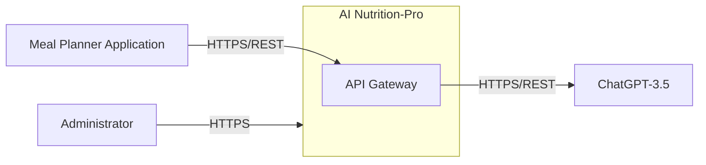
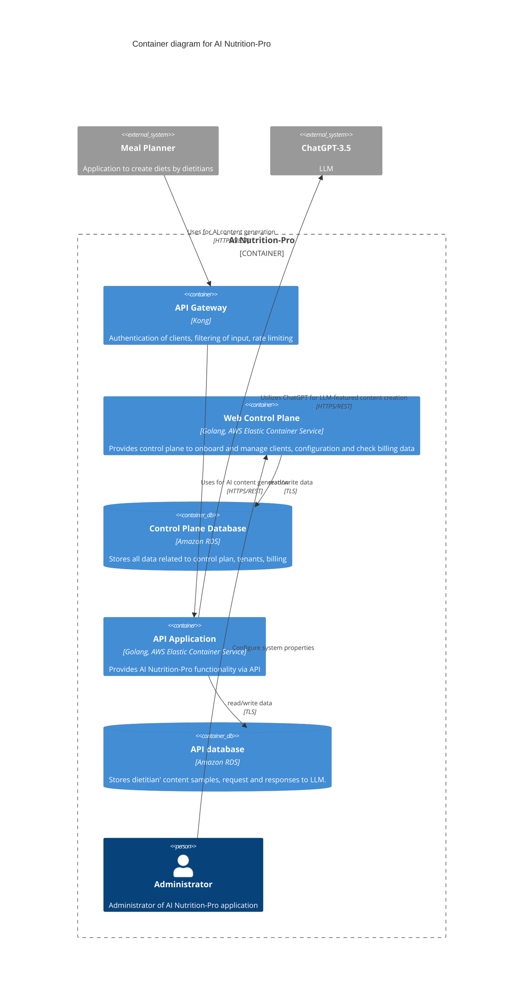

# BUSINESS POSTURE

The AI Nutrition-Pro application aims to provide AI-powered content generation for meal planning applications used by dietitians. The primary business goal is to offer a valuable service that enhances the capabilities of existing meal planner applications by integrating AI-driven content creation. This will enable dietitians to create more engaging and personalized meal plans for their clients, potentially leading to increased user satisfaction and business growth for meal planner application providers.

Key business priorities include:
- Seamless integration with existing meal planner applications.
- Reliable and scalable AI content generation service.
- Secure handling of sensitive dietitian and client data.
- Cost-effective operation and infrastructure.

Important business risks to address:
- Data breaches exposing sensitive dietitian content or client data.
- Service disruptions impacting meal planner application functionality.
- Compliance violations related to data privacy and security regulations.
- Inaccurate or biased AI-generated content damaging reputation.
- Integration challenges with diverse meal planner applications.

# SECURITY POSTURE

Existing security controls:
- security control: Authentication with Meal Planner applications - each application uses individual API key. Described in "Security" section of the input document.
- security control: Authorization of Meal Planner applications - API Gateway has ACL rules that allow or deny certain actions. Described in "Security" section of the input document.
- security control: Encrypted network traffic - network traffic between Meal Planner applications and API Gateway is encrypted using TLS. Described in "Security" section of the input document.

Accepted risks:
- accepted risk: Reliance on API keys for authentication might be vulnerable to key compromise if not managed securely by Meal Planner applications.
- accepted risk: Authorization rules in API Gateway need to be regularly reviewed and updated to prevent unauthorized access.
- accepted risk: TLS encryption protects data in transit, but data at rest security needs to be addressed separately.

Recommended security controls:
- security control: Implement robust input validation on API Gateway to prevent injection attacks and ensure data integrity.
- security control: Introduce rate limiting on API Gateway to protect against denial-of-service attacks and abuse.
- security control: Implement security scanning (SAST/DAST) in the software development lifecycle to identify and remediate vulnerabilities.
- security control: Establish a secure software development lifecycle (SSDLC) incorporating security best practices at each stage.
- security control: Regularly perform security audits and penetration testing to identify and address security weaknesses.
- security control: Implement monitoring and logging of security-relevant events for incident detection and response.

Security requirements:
- Authentication:
    - Meal Planner applications must be securely authenticated to access the AI Nutrition-Pro API. API keys are currently used. Consider stronger authentication methods like OAuth 2.0 in the future for enhanced security and flexibility.
    - Administrators accessing the Web Control Plane should use strong multi-factor authentication.
- Authorization:
    - Access to API endpoints and control plane functionalities must be strictly authorized based on the principle of least privilege.
    - API Gateway should enforce authorization policies based on the authenticated Meal Planner application and the requested action.
    - Web Control Plane should enforce role-based access control (RBAC) for administrator and manager roles.
- Input Validation:
    - All inputs from Meal Planner applications and administrators must be thoroughly validated to prevent injection attacks (e.g., SQL injection, command injection, cross-site scripting).
    - Input validation should be implemented at the API Gateway and within the API Application and Web Control Plane.
- Cryptography:
    - Sensitive data at rest in databases (Control Plane Database, API database) should be encrypted. Consider using database encryption features or transparent data encryption (TDE).
    - All communication channels, both internal and external, should use TLS encryption.
    - Securely store and manage API keys and other secrets using a secrets management solution.

# DESIGN

## C4 Context



### C4 Context elements

- Element:
    - Name: Meal Planner Application
    - Type: External System
    - Description: Web application used by dietitians to create meal plans. Integrates with AI Nutrition-Pro for AI-powered content generation.
    - Responsibilities:
        - Uploads samples of dietitian content to AI Nutrition-Pro.
        - Fetches AI-generated content (e.g., diet introductions) from AI Nutrition-Pro.
    - Security controls:
        - API key based authentication when accessing AI Nutrition-Pro.
        - TLS encryption for communication with AI Nutrition-Pro.

- Element:
    - Name: ChatGPT-3.5
    - Type: External System
    - Description: OpenAI's Large Language Model (LLM) used for AI content generation.
    - Responsibilities:
        - Generates content based on provided dietitian content samples and prompts from AI Nutrition-Pro.
    - Security controls:
        - Rely on OpenAI's security measures for ChatGPT-3.5 API.
        - Secure API key management for accessing ChatGPT-3.5.

- Element:
    - Name: Administrator
    - Type: Person
    - Description: Internal administrator responsible for managing and maintaining the AI Nutrition-Pro application.
    - Responsibilities:
        - Manages server configuration.
        - Resolves system problems.
        - Monitors system health and performance.
    - Security controls:
        - Strong authentication (Multi-Factor Authentication) for accessing Web Control Plane.
        - Role-Based Access Control (RBAC) within Web Control Plane.
        - Audit logging of administrative actions.

- Element:
    - Name: AI Nutrition-Pro
    - Type: System
    - Description: AI-powered content generation application for meal planning.
    - Responsibilities:
        - Provides API for meal planner applications to request AI content generation.
        - Manages dietitian content samples and AI model interactions.
        - Provides control plane for administration and client management.
    - Security controls:
        - API Gateway for authentication, authorization, and rate limiting.
        - Securely designed and developed containers and databases.
        - Encryption of data in transit and at rest.
        - Security monitoring and logging.

## C4 Container



### C4 Container elements

- Element:
    - Name: API Gateway
    - Type: Container
    - Description: Kong API Gateway. Handles external requests from Meal Planner applications.
    - Responsibilities:
        - Authenticates Meal Planner applications using API keys.
        - Authorizes requests based on ACL rules.
        - Rate limiting to prevent abuse and DoS attacks.
        - Input filtering and validation.
        - Routes requests to Backend API.
    - Security controls:
        - API key authentication.
        - Access Control Lists (ACLs) for authorization.
        - Rate limiting policies.
        - Input validation rules.
        - TLS termination for external HTTPS traffic.
        - Web Application Firewall (WAF) integration (recommended).

- Element:
    - Name: Web Control Plane
    - Type: Container
    - Description: Golang application deployed on AWS ECS. Provides a web interface for administrators and managers.
    - Responsibilities:
        - User authentication and authorization for administrators and managers.
        - Client onboarding and management.
        - Configuration management for AI Nutrition-Pro.
        - Billing data management and reporting.
    - Security controls:
        - Strong authentication for administrators (MFA recommended).
        - Role-Based Access Control (RBAC).
        - Input validation on web forms and API endpoints.
        - Secure session management.
        - Audit logging of administrative actions.
        - TLS encryption for web interface and API communication.

- Element:
    - Name: Control Plane Database
    - Type: Container Database
    - Description: Amazon RDS instance. Stores data for the Web Control Plane.
    - Responsibilities:
        - Stores tenant information, billing data, user accounts, and configuration settings.
    - Security controls:
        - Database access control (least privilege).
        - Encryption at rest (RDS encryption).
        - Regular database backups.
        - Database activity logging and monitoring.
        - Network isolation (private subnet).
        - Vulnerability scanning and patching.

- Element:
    - Name: API Application
    - Type: Container
    - Description: Golang application deployed on AWS ECS. Implements the core AI Nutrition-Pro API functionality.
    - Responsibilities:
        - Receives requests from API Gateway.
        - Interacts with API database to retrieve and store data.
        - Communicates with ChatGPT-3.5 for AI content generation.
        - Implements business logic for AI content generation.
    - Security controls:
        - Input validation for all API requests.
        - Secure communication with ChatGPT-3.5 (API key management).
        - Output encoding to prevent injection attacks.
        - Error handling and logging.
        - Rate limiting (if needed, in addition to API Gateway).
        - Vulnerability scanning and patching of application dependencies.

- Element:
    - Name: API database
    - Type: Container Database
    - Description: Amazon RDS instance. Stores data for the API Application.
    - Responsibilities:
        - Stores dietitian content samples.
        - Stores requests and responses to ChatGPT-3.5.
        - Stores AI-generated content.
    - Security controls:
        - Database access control (least privilege).
        - Encryption at rest (RDS encryption).
        - Regular database backups.
        - Database activity logging and monitoring.
        - Network isolation (private subnet).
        - Vulnerability scanning and patching.

## DEPLOYMENT

Deployment Solution: AWS Cloud

Detailed Deployment Architecture:

```mermaid
flowchart LR
    subgraph AWS [AWS Cloud]
        subgraph VPC [Virtual Private Cloud]
            subgraph PublicSubnet [Public Subnet]
                api_gateway_instance["API Gateway (Kong) Instance"]
                lb_api_gateway["Load Balancer (API Gateway)"]
            end
            subgraph PrivateSubnet [Private Subnet]
                ecs_cluster["ECS Cluster"]
                subgraph ECS_Service_API [ECS Service (API Application)]
                    backend_api_container_1["Backend API Container 1"]
                    backend_api_container_2["Backend API Container 2"]
                    backend_api_container_N["Backend API Container N"]
                end
                 subgraph ECS_Service_ControlPlane [ECS Service (Web Control Plane)]
                    control_plane_container_1["Web Control Plane Container 1"]
                    control_plane_container_2["Web Control Plane Container 2"]
                    control_plane_container_N["Web Control Plane Container N"]
                end
                api_db_instance["API Database (RDS)"]
                control_plane_db_instance["Control Plane Database (RDS)"]
            end
        end
        internet["Internet"]
        mealApp_ext["Meal Planner Application"]
        admin_ext["Administrator"]
    end

    internet -- HTTPS --> lb_api_gateway
    lb_api_gateway --> api_gateway_instance
    api_gateway_instance -- HTTPS/REST --> ECS_Service_API
    ECS_Service_API --> api_db_instance
    admin_ext -- HTTPS --> ECS_Service_ControlPlane
    ECS_Service_ControlPlane --> control_plane_db_instance
```

### Deployment elements

- Element:
    - Name: Internet
    - Type: External Network
    - Description: Public internet network.
    - Responsibilities:
        - Provides access for Meal Planner Applications and Administrators to AI Nutrition-Pro.
    - Security controls:
        - N/A - external network.

- Element:
    - Name: Load Balancer (API Gateway)
    - Type: AWS Service (Elastic Load Balancer)
    - Description: Distributes incoming HTTPS traffic to API Gateway instances.
    - Responsibilities:
        - Load balancing for API Gateway instances.
        - TLS termination.
        - Health checks for API Gateway instances.
    - Security controls:
        - HTTPS listener configuration.
        - Security groups to control inbound and outbound traffic.

- Element:
    - Name: API Gateway (Kong) Instance
    - Type: EC2 Instance (or Container in ECS)
    - Description: Instance running Kong API Gateway software.
    - Responsibilities:
        - API Gateway functionalities (authentication, authorization, rate limiting, routing).
    - Security controls:
        - Security hardening of the instance/container.
        - Security groups to restrict access.
        - Regular patching and updates.

- Element:
    - Name: ECS Cluster
    - Type: AWS Service (Elastic Container Service)
    - Description: Managed container orchestration service for running containers.
    - Responsibilities:
        - Container orchestration and management.
        - Scaling and health management of containers.
    - Security controls:
        - IAM roles for ECS tasks with least privilege.
        - Container image security scanning (recommended).
        - Network isolation using VPC and security groups.

- Element:
    - Name: ECS Service (API Application)
    - Type: AWS Service (Elastic Container Service)
    - Description: ECS service running Backend API containers.
    - Responsibilities:
        - Running and managing Backend API containers.
        - Scaling Backend API based on demand.
    - Security controls:
        - Security context for containers (least privilege).
        - Resource limits for containers.
        - Regular patching and updates of container images.

- Element:
    - Name: ECS Service (Web Control Plane)
    - Type: AWS Service (Elastic Container Service)
    - Description: ECS service running Web Control Plane containers.
    - Responsibilities:
        - Running and managing Web Control Plane containers.
        - Scaling Web Control Plane based on demand.
    - Security controls:
        - Security context for containers (least privilege).
        - Resource limits for containers.
        - Regular patching and updates of container images.

- Element:
    - Name: API Database (RDS)
    - Type: AWS Service (Relational Database Service)
    - Description: Managed relational database service for API database.
    - Responsibilities:
        - Data persistence for API Application.
    - Security controls:
        - Encryption at rest (RDS encryption).
        - Database access control (security groups, IAM authentication).
        - Regular backups.
        - Vulnerability scanning and patching.
        - Network isolation (private subnet).

- Element:
    - Name: Control Plane Database (RDS)
    - Type: AWS Service (Relational Database Service)
    - Description: Managed relational database service for Control Plane database.
    - Responsibilities:
        - Data persistence for Web Control Plane.
    - Security controls:
        - Encryption at rest (RDS encryption).
        - Database access control (security groups, IAM authentication).
        - Regular backups.
        - Vulnerability scanning and patching.
        - Network isolation (private subnet).

## BUILD

Build process will be based on CI/CD pipeline using GitHub Actions.

```mermaid
flowchart LR
    subgraph Developer_Environment [Developer Environment]
        developer["Developer"]
        source_code["Source Code (GitHub)"]
    end
    subgraph CI_Pipeline [CI Pipeline (GitHub Actions)]
        build_action["Build Action"]
        test_action["Test Action"]
        security_scan_action["Security Scan Action (SAST/DAST)"]
        container_registry["Container Registry (AWS ECR)"]
    end

    developer -- Code Changes --> source_code
    source_code -- Push --> build_action
    build_action -- Build Artifacts --> test_action
    test_action -- Test Results --> security_scan_action
    security_scan_action -- Container Image --> container_registry
    container_registry -- Deploy --> Deployment_Environment

    style container_registry fill:#ccf,stroke:#99f,stroke-width:2px
```

### Build elements

- Element:
    - Name: Developer
    - Type: Person
    - Description: Software developer contributing to the project.
    - Responsibilities:
        - Writing and committing code changes.
        - Running local tests.
    - Security controls:
        - Secure coding practices training.
        - Code review process.
        - Access control to source code repository.

- Element:
    - Name: Source Code (GitHub)
    - Type: Code Repository
    - Description: GitHub repository hosting the project's source code.
    - Responsibilities:
        - Version control of source code.
        - Collaboration platform for developers.
    - Security controls:
        - Access control (branch permissions, user roles).
        - Audit logging of code changes.
        - Branch protection rules.

- Element:
    - Name: Build Action (GitHub Actions)
    - Type: CI/CD Pipeline Stage
    - Description: GitHub Actions workflow responsible for building the application.
    - Responsibilities:
        - Compiling code.
        - Packaging application artifacts.
        - Creating container images.
    - Security controls:
        - Secure build environment (managed by GitHub Actions).
        - Dependency scanning (e.g., using Dependabot).
        - Secrets management for build process (GitHub Secrets).

- Element:
    - Name: Test Action (GitHub Actions)
    - Type: CI/CD Pipeline Stage
    - Description: GitHub Actions workflow responsible for running automated tests.
    - Responsibilities:
        - Unit testing.
        - Integration testing.
    - Security controls:
        - Automated security testing (SAST/DAST integration in security scan action).
        - Test environment isolation.

- Element:
    - Name: Security Scan Action (SAST/DAST)
    - Type: CI/CD Pipeline Stage
    - Description: GitHub Actions workflow integrating security scanning tools.
    - Responsibilities:
        - Static Application Security Testing (SAST) to identify vulnerabilities in code.
        - Dynamic Application Security Testing (DAST) to identify vulnerabilities in running application (optional in CI, can be in separate pipeline).
        - Reporting security vulnerabilities.
    - Security controls:
        - Integration with SAST/DAST tools.
        - Configuration of security scanning tools.
        - Vulnerability reporting and tracking.

- Element:
    - Name: Container Registry (AWS ECR)
    - Type: Container Image Registry
    - Description: AWS Elastic Container Registry for storing container images.
    - Responsibilities:
        - Secure storage of container images.
        - Versioning of container images.
        - Distribution of container images to deployment environment.
    - Security controls:
        - Access control policies for container registry.
        - Image scanning for vulnerabilities (AWS ECR image scanning).
        - Encryption of container images at rest.

# RISK ASSESSMENT

Critical business processes to protect:
- AI Content Generation Service Availability: Disruption of the service would directly impact meal planner applications and their users.
- Client Onboarding and Management: Compromise of control plane could lead to unauthorized access and data breaches.
- Data Integrity and Confidentiality: Loss or exposure of dietitian content samples, AI generated content, or client data would have significant business and reputational impact.

Data to protect and their sensitivity:
- Dietitian Content Samples: Sensitive. Contains proprietary content from dietitians, potentially including personal or health-related information. Confidentiality and integrity are important.
- AI Generated Content: Sensitive. Output of AI models, may contain sensitive or business-critical information. Integrity and availability are important.
- Requests and Responses to LLM: Sensitive. Contains prompts and responses exchanged with ChatGPT-3.5, potentially including sensitive data. Confidentiality is important.
- Tenant Information: Sensitive. Client details, billing information, and configuration data. Confidentiality, integrity, and availability are critical.
- Administrator Credentials: Highly Sensitive. Access to control plane and infrastructure. Confidentiality and integrity are paramount.

# QUESTIONS & ASSUMPTIONS

Questions:
- What is the data classification policy for AI Nutrition-Pro?
- What are the specific compliance requirements (e.g., GDPR, HIPAA)?
- What is the threat model for AI Nutrition-Pro? Are there specific threat actors or attack vectors of concern?
- What is the incident response plan in case of a security breach?
- What are the data retention policies for different types of data?
- What are the performance and scalability requirements for the application?

Assumptions:
- Business Posture:
    - AI Nutrition-Pro is a new startup project with a moderate risk appetite, prioritizing speed of development and time to market.
    - The primary business goal is to acquire customers and demonstrate value quickly.
- Security Posture:
    - Security is considered important but might be balanced against development speed and cost.
    - Initial security controls are focused on basic authentication, authorization, and encryption.
    - There is a willingness to implement recommended security controls in iterative phases.
- Design:
    - Cloud-native architecture on AWS is preferred for scalability and agility.
    - Containerization and microservices are used for modularity and maintainability.
    - Open-source technologies are favored where possible to reduce costs.
