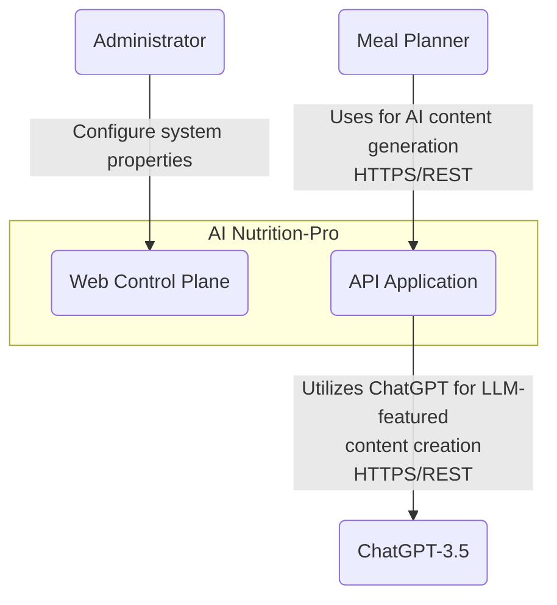
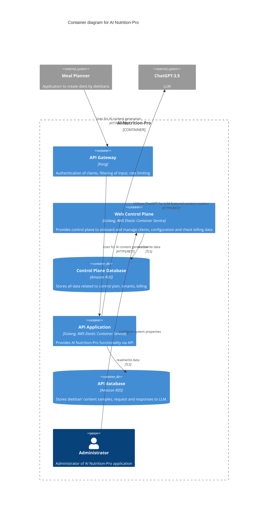
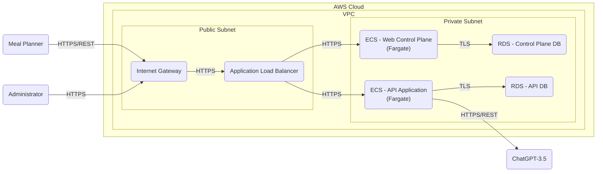
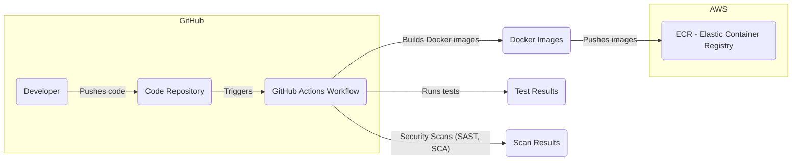

# BUSINESS POSTURE

## Priorities and Goals

*   Provide AI-powered content generation capabilities to enhance the functionality of existing Meal Planner applications.
*   Enable efficient onboarding and management of clients (Meal Planner applications).
*   Offer a secure and reliable API for integration with Meal Planner applications.
*   Utilize a Large Language Model (LLM), specifically ChatGPT-3.5, for content creation.
*   Maintain a clear separation between control plane (management) and data plane (API functionality) operations.

## Business Risks

*   **Data Privacy and Security:** Unauthorized access to sensitive data, including dietitian content samples, LLM requests, and responses, could lead to reputational damage and legal consequences.
*   **Service Availability:** Downtime or performance issues with the API or control plane could disrupt the operations of integrated Meal Planner applications.
*   **Integration Challenges:** Difficulties in integrating with various Meal Planner applications due to API incompatibilities or lack of standardization.
*   **LLM Dependency:** Reliance on an external service (ChatGPT-3.5) introduces a dependency that could impact service availability and cost.
*   **Scalability:** The system needs to be able to handle an increasing number of Meal Planner applications and user requests.
*   **Compliance:** Adherence to relevant data privacy regulations (e.g., GDPR, HIPAA) is crucial.

# SECURITY POSTURE

*   security control: Authentication of Meal Planner applications using individual API keys. Implemented in API Gateway.
*   security control: Authorization of Meal Planner applications via Access Control List (ACL) rules in the API Gateway. Implemented in API Gateway.
*   security control: Encrypted network traffic between Meal Planner applications and the API Gateway using TLS. Implemented in network communication layer.

## Recommended Security Controls

*   security control: Implement robust input validation and sanitization to prevent injection attacks and other vulnerabilities.
*   security control: Implement regular security audits and penetration testing to identify and address potential weaknesses.
*   security control: Implement a comprehensive logging and monitoring system to detect and respond to security incidents.
*   security control: Enforce the principle of least privilege, ensuring that users and services have only the necessary permissions.
*   security control: Implement data encryption at rest for both databases (Control Plane Database and API Database).
*   security control: Implement a Web Application Firewall (WAF) to protect against common web attacks.

## Security Requirements

*   **Authentication:**
    *   All external system access must be authenticated.
    *   API keys should be securely stored and managed.
    *   Consider implementing multi-factor authentication for administrative users.
*   **Authorization:**
    *   Access control mechanisms must be in place to restrict access to resources based on roles and permissions.
    *   Regularly review and update access control policies.
*   **Input Validation:**
    *   All input from external systems and users must be validated and sanitized to prevent injection attacks.
    *   Implement whitelisting where possible, rather than blacklisting.
*   **Cryptography:**
    *   All sensitive data in transit must be encrypted using TLS.
    *   All sensitive data at rest must be encrypted.
    *   Use strong, industry-standard cryptographic algorithms and key lengths.
*   **Data Protection**
    *   Implement data loss prevention (DLP) measures.
    *   Regularly back up data and test restoration procedures.

# DESIGN

## C4 CONTEXT

*   **Elements:**
    *   **Name:** Meal Planner
        *   **Type:** External System
        *   **Description:** Application to create diets by dietitians.
        *   **Responsibilities:**
            *   Uploads samples of dietitians' content to AI Nutrition-Pro.
            *   Fetches AI-generated results, e.g., diet introduction, from AI Nutrition-Pro.
        *   **Security controls:**
            *   Authentication with API key.
            *   Authorization via ACL rules.
            *   TLS encryption for network traffic.

    *   **Name:** ChatGPT-3.5
        *   **Type:** External System
        *   **Description:** LLM (Large Language Model).
        *   **Responsibilities:**
            *   Generates content based on provided samples.
        *   **Security controls:**
            *   Secure communication with API Application (HTTPS/REST).

    *   **Name:** Administrator
        *   **Type:** Person
        *   **Description:** Administrator of AI Nutrition-Pro application.
        *   **Responsibilities:**
            *   Manage server configuration.
            *   Resolve problems.
        *   **Security controls:**
            *   Strong authentication (potentially multi-factor).
            *   Access control based on roles and permissions.

    *   **Name:** Web Control Plane
        *   **Type:** Internal System
        *   **Description:** Provides control plane to onboard and manage clients, configuration and check billing data.
        *   **Responsibilities:**
            *   Client onboarding and management.
            *   Configuration management.
            *   Billing data management.
        *   **Security controls:**
            *   Authentication and authorization for administrative users.
            *   Secure communication with Control Plane Database (TLS).

    *   **Name:** API Application
        *   **Type:** Internal System
        *   **Description:** Provides AI Nutrition-Pro functionality via API.
        *   **Responsibilities:**
            *   Handles requests from Meal Planner applications.
            *   Interacts with ChatGPT-3.5 for content generation.
            *   Stores and retrieves data from the API database.
        *   **Security controls:**
            *   Authentication and authorization via API Gateway.
            *   Input validation and sanitization.
            *   Secure communication with API Database (TLS).
            *   Secure communication with ChatGPT-3.5 (HTTPS/REST).

## C4 CONTAINER

*   **Elements:**

    *   **Name:** API Gateway
        *   **Type:** Container (Kong)
        *   **Description:** Authentication of clients, filtering of input, rate limiting.
        *   **Responsibilities:**
            *   Handles incoming requests from Meal Planner applications.
            *   Authenticates clients using API keys.
            *   Enforces authorization rules (ACLs).
            *   Performs rate limiting to prevent abuse.
            *   Filters input to prevent malicious requests.
        *   **Security controls:**
            *   API key authentication.
            *   ACL-based authorization.
            *   Input filtering.
            *   Rate limiting.

    *   **Name:** Web Control Plane
        *   **Type:** Container (Golang, AWS Elastic Container Service)
        *   **Description:** Provides control plane to onboard and manage clients, configuration and check billing data.
        *   **Responsibilities:**
            *   Client onboarding and management.
            *   Configuration management.
            *   Billing data management.
        *   **Security controls:**
            *   Authentication and authorization for administrative users.
            *   Secure communication with Control Plane Database (TLS).
            *   Input validation.

    *   **Name:** Control Plane Database
        *   **Type:** Container (Amazon RDS)
        *   **Description:** Stores all data related to control plan, tenants, billing.
        *   **Responsibilities:**
            *   Stores and retrieves control plane data.
        *   **Security controls:**
            *   Access control via database user accounts and permissions.
            *   Encryption at rest (recommended).
            *   TLS encryption for network communication.
            *   Regular backups.

    *   **Name:** API Application
        *   **Type:** Container (Golang, AWS Elastic Container Service)
        *   **Description:** Provides AI Nutrition-Pro functionality via API.
        *   **Responsibilities:**
            *   Handles API requests from the API Gateway.
            *   Interacts with ChatGPT-3.5 for content generation.
            *   Stores and retrieves data from the API database.
        *   **Security controls:**
            *   Input validation and sanitization.
            *   Secure communication with API Database (TLS).
            *   Secure communication with ChatGPT-3.5 (HTTPS/REST).

    *   **Name:** API database
        *   **Type:** Container (Amazon RDS)
        *   **Description:** Stores dietitian' content samples, request and responses to LLM.
        *   **Responsibilities:**
            *   Stores and retrieves API data.
        *   **Security controls:**
            *   Access control via database user accounts and permissions.
            *   Encryption at rest (recommended).
            *   TLS encryption for network communication.
            *   Regular backups.

    *   **Name:** Administrator
        *   **Type:** Person
        *   **Description:** Administrator of AI Nutrition-Pro application.
        *   **Responsibilities:**
            *   Manage server configuration.
            *   Resolve problems.
        *   **Security controls:**
            *   Strong authentication (potentially multi-factor).
            *   Access control based on roles and permissions.

    *   **Name:** Meal Planner
        *   **Type:** External System
        *   **Description:** Application to create diets by dietitians.
        *   **Responsibilities:**
            *   Uploads samples of dietitians' content to AI Nutrition-Pro.
            *   Fetches AI-generated results.
        *   **Security controls:**
            *   Authentication with API key (via API Gateway).
            *   Authorization via ACL rules (via API Gateway).
            *   TLS encryption for network traffic (via API Gateway).

    *   **Name:** ChatGPT-3.5
        *   **Type:** External System
        *   **Description:** LLM (Large Language Model).
        *   **Responsibilities:**
            *   Generates content based on provided samples.
        *   **Security controls:**
            *   Secure communication with API Application (HTTPS/REST).

## DEPLOYMENT

Possible deployment solutions:

1.  **AWS ECS with Fargate:** Deploy the Golang applications (Web Control Plane and API Application) as containers within AWS Elastic Container Service (ECS) using the Fargate launch type. This provides a serverless compute engine for containers.
2.  **AWS ECS with EC2:** Deploy the Golang applications as containers within ECS, but use EC2 instances as the underlying infrastructure. This offers more control over the infrastructure but requires more management overhead.
3.  **AWS Elastic Beanstalk:** Use Elastic Beanstalk to deploy and manage the Golang applications. This simplifies deployment and scaling but may offer less flexibility than ECS.
4.  **Kubernetes (Amazon EKS):** Deploy the applications as containers within a Kubernetes cluster managed by Amazon Elastic Kubernetes Service (EKS). This provides a highly scalable and flexible platform but adds complexity.

**Chosen Solution: AWS ECS with Fargate**

This solution provides a good balance between ease of management, scalability, and cost-effectiveness.

*   **Elements:**

    *   **Name:** Internet Gateway
        *   **Type:** AWS Resource
        *   **Description:** Provides internet access to the VPC.
        *   **Responsibilities:**
            *   Routes traffic between the VPC and the internet.
        *   **Security controls:**
            *   Controlled by AWS security groups and network ACLs.

    *   **Name:** Application Load Balancer
        *   **Type:** AWS Resource
        *   **Description:** Distributes incoming traffic across multiple targets (ECS tasks).
        *   **Responsibilities:**
            *   Load balances traffic to the Web Control Plane and API Application.
            *   Performs health checks on targets.
        *   **Security controls:**
            *   Integrated with AWS WAF (Web Application Firewall) (recommended).
            *   TLS termination.

    *   **Name:** ECS - Web Control Plane (Fargate)
        *   **Type:** AWS ECS Task (Fargate)
        *   **Description:** Runs the Web Control Plane application as a serverless container.
        *   **Responsibilities:**
            *   Executes the Web Control Plane logic.
        *   **Security controls:**
            *   IAM roles for task execution.
            *   Security groups to control network access.

    *   **Name:** ECS - API Application (Fargate)
        *   **Type:** AWS ECS Task (Fargate)
        *   **Description:** Runs the API Application as a serverless container.
        *   **Responsibilities:**
            *   Executes the API Application logic.
        *   **Security controls:**
            *   IAM roles for task execution.
            *   Security groups to control network access.

    *   **Name:** RDS - Control Plane DB
        *   **Type:** AWS RDS Instance
        *   **Description:** Hosts the Control Plane Database.
        *   **Responsibilities:**
            *   Stores and retrieves control plane data.
        *   **Security controls:**
            *   Database user accounts and permissions.
            *   Encryption at rest (recommended).
            *   TLS encryption for network communication.
            *   Security groups to control network access.
            *   Regular backups.

    *   **Name:** RDS - API DB
        *   **Type:** AWS RDS Instance
        *   **Description:** Hosts the API Database.
        *   **Responsibilities:**
            *   Stores and retrieves API data.
        *   **Security controls:**
            *   Database user accounts and permissions.
            *   Encryption at rest (recommended).
            *   TLS encryption for network communication.
            *   Security groups to control network access.
            *   Regular backups.

    *   **Name:** Meal Planner
        *   **Type:** External System
        *   **Description:** Application to create diets by dietitians.
        *   **Responsibilities:**
            *   Connects to AI Nutrition-Pro via the internet.
        *   **Security controls:** N/A

    *   **Name:** Administrator
        *   **Type:** Person
        *   **Description:** Administrator of AI Nutrition-Pro application.
        *   **Responsibilities:**
            *   Connects to AI Nutrition-Pro via the internet.
        *   **Security controls:** N/A

    *   **Name:** ChatGPT-3.5
        *   **Type:** External System
        *   **Description:** LLM (Large Language Model).
        *   **Responsibilities:**
            *   Provides responses to API Application.
        *   **Security controls:** N/A

## BUILD

The build process for AI Nutrition-Pro involves building and publishing Docker images for the Web Control Plane and API Application.  A CI/CD pipeline using GitHub Actions is used to automate this process.

*   **Steps:**

    1.  **Code Push:** A developer pushes code changes to the GitHub repository.
    2.  **Trigger Workflow:** The push triggers a GitHub Actions workflow.
    3.  **Checkout Code:** The workflow checks out the code from the repository.
    4.  **Build Docker Images:** The workflow builds Docker images for the Web Control Plane and API Application using Dockerfiles.
    5.  **Run Tests:** The workflow runs unit and integration tests.
    6.  **Security Scans:**
        *   **SAST (Static Application Security Testing):** A SAST tool (e.g., Semgrep, SonarQube) scans the code for vulnerabilities.
        *   **SCA (Software Composition Analysis):** An SCA tool (e.g., Snyk, Dependabot) scans the project's dependencies for known vulnerabilities.
    7.  **Push Images:** If all tests and scans pass, the workflow pushes the Docker images to Amazon Elastic Container Registry (ECR).
    8.  **Deploy (Not part of build):** A separate deployment process (triggered manually or automatically) deploys the new images from ECR to the ECS cluster.

*   **Security Controls:**

    *   security control: **Code Review:** All code changes are reviewed by another developer before being merged.
    *   security control: **SAST:** Static Application Security Testing is performed to identify vulnerabilities in the code.
    *   security control: **SCA:** Software Composition Analysis is performed to identify vulnerabilities in third-party dependencies.
    *   security control: **Least Privilege:** The GitHub Actions workflow has only the necessary permissions to build and push images to ECR.
    *   security control: **Image Signing (Recommended):** Docker images should be signed to ensure their integrity.

# RISK ASSESSMENT

*   **Critical Business Processes:**
    *   AI-powered content generation for Meal Planner applications.
    *   Onboarding and management of Meal Planner application clients.
    *   API access for Meal Planner applications.

*   **Data Sensitivity:**

    *   **Dietitian Content Samples:** This data may contain personal health information (PHI) or personally identifiable information (PII), making it highly sensitive.
    *   **LLM Requests and Responses:** These may also contain PHI or PII, depending on the content provided by dietitians.
    *   **Control Plane Data:** This includes client information, billing data, and configuration settings, which are considered sensitive.
    *   **API Database:** Contains dietitian' content samples, request and responses to LLM - considered sensitive.
    *   **Control Plane Database:** Contains data related to control plan, tenants, billing - considered sensitive.

# QUESTIONS & ASSUMPTIONS

*   **Questions:**
    *   What specific types of data will be included in the dietitian content samples? This is crucial for determining the appropriate security controls and compliance requirements.
    *   What are the expected traffic patterns and scalability requirements for the API?
    *   What are the specific compliance requirements (e.g., GDPR, HIPAA) that need to be addressed?
    *   What is the budget for security tools and services?
    *   What level of access will administrators have to the system and data?
    *   Are there any existing security policies or guidelines that need to be followed?
    *   What is the process for managing API keys and secrets?
    *   What monitoring and logging capabilities are required?
    *   What is the disaster recovery and business continuity plan?

*   **Assumptions:**
    *   **Business Posture:** The primary goal is to provide a secure and reliable service to Meal Planner applications.
    *   **Security Posture:** Security is a high priority, and appropriate measures will be taken to protect sensitive data.
    *   **Design:** The system will be designed with scalability and maintainability in mind. The use of AWS services implies a cloud-native approach.
    *   **ChatGPT-3.5:** It's assumed that usage of ChatGPT will be according to OpenAI terms of use.
