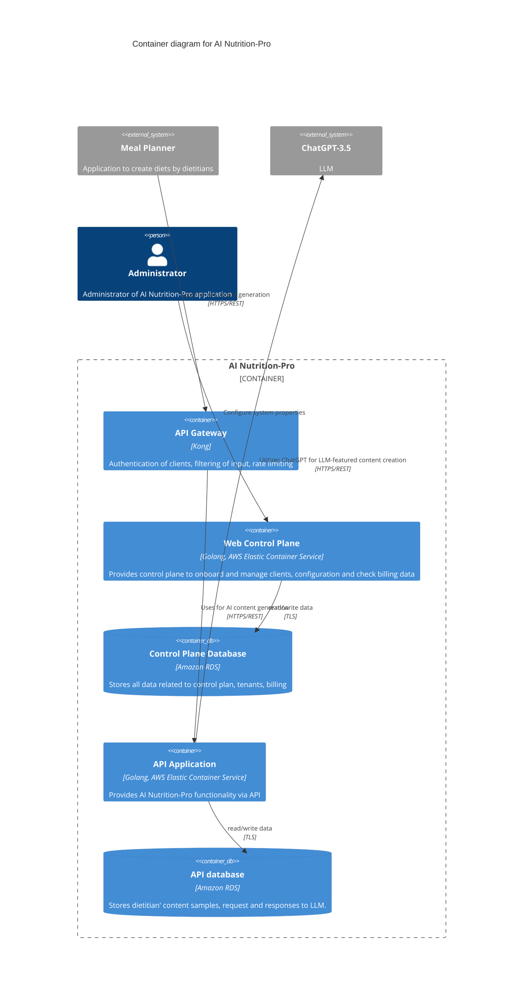
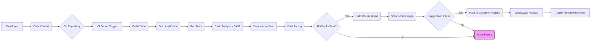

BUSINESS POSTURE

The primary business goal of the AI Nutrition-Pro project is to provide AI-powered content generation capabilities to dietitians by integrating with existing Meal Planner applications. This allows dietitians to leverage large language models (LLMs) to create content like diet introductions, potentially increasing their efficiency and the quality of their output within the platforms they already use. Key business priorities include:
*   Enabling seamless integration with various Meal Planner applications.
*   Providing reliable and performant AI content generation.
*   Establishing a scalable platform for onboarding and managing clients (Meal Planner apps and their users).
*   Ensuring the privacy and security of dietitian content samples and generated data.
*   Implementing a functional billing system based on usage.

Most important business risks that need to be addressed are:
*   Data breaches exposing sensitive dietitian content samples or client billing data.
*   Service downtime impacting the ability of dietitians to generate content.
*   Poor quality or inappropriate content generated by the LLM impacting user trust.
*   Failure to integrate correctly or reliably with diverse Meal Planner applications.
*   Inaccurate billing leading to financial loss or customer disputes.
*   Regulatory non-compliance regarding data handling (e.g., GDPR, HIPAA, depending on data type).

SECURITY POSTURE

Existing security controls identified:
*   security control: Authentication with Meal Planner applications using individual API keys (Implemented by API Gateway, described in Security section).
*   security control: Authorization of Meal Planner applications using ACL rules allowing or denying certain actions (Implemented by API Gateway, described in Security section).
*   security control: Encrypted network traffic between Meal Planner applications and API Gateway using TLS (Implemented by API Gateway, described in Security section).
*   security control: Encrypted network traffic between internal containers (Web Control Plane to Control Plane DB, API Application to API database) using TLS (Described in Container diagram relationships).

Accepted risks:
*   No explicit accepted risks were mentioned in the provided file.

Recommended security controls (high priority):
*   Recommended security control: Implement robust input validation and sanitization on all data received from external systems (Meal Planner Apps, potential Admin input) and internal components before processing or sending to the LLM.
*   Recommended security control: Implement output sanitization and potentially content filtering on responses received from the LLM before returning them to the client.
*   Recommended security control: Implement detailed logging and monitoring of security events (authentication failures, authorization denials, suspicious requests, data access) across all components.
*   Recommended security control: Securely manage API keys and other secrets (e.g., database credentials, LLM API keys) using a dedicated secrets management system.
*   Recommended security control: Implement rate limiting not only at the API Gateway but also potentially within the backend API to protect against abuse if the gateway is bypassed or misconfigured.
*   Recommended security control: Conduct regular security testing, including vulnerability scanning and penetration testing.
*   Recommended security control: Implement secure software development lifecycle (SSDLC) practices, including code reviews focused on security, static application security testing (SAST), and dependency vulnerability scanning as part of the build process.
*   Recommended security control: Implement network segmentation to restrict traffic flow between different containers and databases based on the principle of least privilege.

Security Requirements:
*   Authentication: All external access to the API Gateway must be authenticated using unique API keys. Administrator access to the Web Control Plane must be authenticated using strong credentials, preferably multi-factor authentication. Internal component communication should ideally use authenticated methods where appropriate (e.g., service accounts, mTLS).
*   Authorization: Access to API endpoints must be authorized based on the authenticated identity (API key/client). Administrator actions on the Web Control Plane must be authorized based on roles and permissions. Internal components should only have permissions necessary for their function (least privilege).
*   Input Validation: All input received from external users (Meal Planner Apps) and internal users (Admin) must be validated against expected formats, types, and constraints to prevent injection attacks, data corruption, and other vulnerabilities. This includes data sent to the LLM.
*   Cryptography: All data transmitted over public networks must be encrypted using strong TLS versions and cipher suites. Sensitive data at rest (e.g., API keys, potentially sensitive content samples depending on classification) should be encrypted. Secrets (database credentials, LLM API keys) must be stored and managed securely using encryption.

DESIGN

C4 CONTEXT

```mermaid
C4Context
    title Context diagram for AI Nutrition-Pro

    Person(dietitian, "Dietitian", "User creating meal plans and seeking AI content")
    Person(admin, "Administrator", "Manages the AI Nutrition-Pro system")

    System(meal_planner_app, "Meal Planner Application", "Web/mobile application used by dietitians")
    System(chatgpt, "ChatGPT-3.5", "External Large Language Model service")

    System_Boundary(ai_nutrition_pro, "AI Nutrition-Pro") {
        System(api_gw, "API Gateway", "Entry point for external API consumers")
        System(control_plane, "Web Control Plane", "Manages clients, configuration, and billing")
        System(backend_api, "API Application", "Provides core AI content generation functionality")
    }

    Rel(dietitian, meal_planner_app, "Uses")
    Rel(meal_planner_app, api_gw, "Uses API for content generation", "HTTPS/REST")
    Rel(admin, control_plane, "Manages system configuration and clients", "HTTPS/REST")
    Rel(ai_nutrition_pro, chatgpt, "Uses for LLM-featured content creation", "HTTPS/REST")
```

| Name                   | Type                     | Description                                                                 | Responsibilities                                                                                                | Security controls                                  |
| :--------------------- | :----------------------- | :-------------------------------------------------------------------------- | :-------------------------------------------------------------------------------------------------------------- | :------------------------------------------------- |
| Dietitian              | Person                   | The end user who utilizes a Meal Planner Application.                       | Creates meal plans, uses AI features provided via the Meal Planner App.                                         | N/A                                                |
| Administrator          | Person                   | Manages the AI Nutrition-Pro application directly.                          | Configures system properties, manages clients, resolves operational issues.                                     | Authentication/Authorization for access.           |
| Meal Planner Application | External System          | A third-party application used by dietitians.                               | Integrates with AI Nutrition-Pro to provide AI content generation features to its users.                        | Manages dietitian users, interacts with AI-NP API. |
| ChatGPT-3.5            | External System          | OpenAI's Large Language Model service.                                      | Provides text generation capabilities based on prompts and samples.                                             | Provides its own API security.                     |
| AI Nutrition-Pro       | System Boundary          | The overall system providing AI content generation services.                | Provides API access, manages clients, orchestrates LLM calls, stores data.                                      | Enforces overall system security policies.         |
| API Gateway            | Internal System (within AI-NP) | The public-facing entry point for API consumers.                            | Authentication of clients, filtering of input, rate limiting, routing requests to backend API.                  | security control: API key authentication, security control: ACL authorization, security control: TLS encryption. |
| Web Control Plane      | Internal System (within AI-NP) | Manages client onboarding, configuration, and billing data.                 | Provides a web interface for administrators, interacts with the Control Plane Database.                         | Authentication/Authorization for admin access.     |
| API Application        | Internal System (within AI-NP) | Contains the core logic for processing content generation requests.       | Receives requests from API Gateway, interacts with the API database, calls the external LLM (ChatGPT).          | Input validation, output sanitization, logging.    |

C4 CONTAINER



| Name                   | Type                                   | Description                                                                                                | Responsibilities                                                                                                | Security controls                                  |
| :--------------------- | :------------------------------------- | :--------------------------------------------------------------------------------------------------------- | :-------------------------------------------------------------------------------------------------------------- | :------------------------------------------------- |
| API Gateway            | Container (Kong)                       | The public-facing entry point for API consumers. Deployed as a container.                                  | Authentication of clients, filtering of input, rate limiting, routing requests to backend API.                  | security control: API key authentication, security control: ACL authorization, security control: TLS encryption. |
| Web Control Plane      | Container (Golang, AWS ECS)            | Provides control plane functionality for administrators and potentially automated tasks. Deployed on AWS ECS. | Onboard and manage clients, manage configuration, check billing data, interact with Control Plane Database.     | Authentication/Authorization for admin access.     |
| Control Plane Database | Container (Amazon RDS)                 | Relational database storing data related to control plane operations, clients, and billing. Managed RDS instance. | Store data for Web Control Plane.                                                                               | security control: TLS for connections, Access control (security groups, IAM). |
| API Application        | Container (Golang, AWS ECS)            | Provides the core AI Nutrition-Pro functionality via API. Deployed on AWS ECS.                             | Receive requests from API Gateway, interact with API database, call ChatGPT API, process LLM responses.         | Input validation, output sanitization, logging, secure calls to LLM. |
| API database           | Container (Amazon RDS)                 | Relational database storing dietitian content samples, LLM requests, and responses. Managed RDS instance.    | Store data for API Application.                                                                                 | security control: TLS for connections, Access control (security groups, IAM). |
| Meal Planner           | External System                        | Application used by dietitians.                                                                            | Uses AI Nutrition-Pro API.                                                                                      | N/A                                                |
| ChatGPT-3.5            | External System                        | External LLM service.                                                                                      | Provides AI text generation.                                                                                    | Provides its own API security.                     |
| Administrator          | Person                                 | Manages the system.                                                                                        | Interacts with the Web Control Plane.                                                                           | N/A                                                |

DEPLOYMENT

The AI Nutrition-Pro system is designed to be deployed on AWS. A typical deployment architecture would involve deploying the containerized applications (API Gateway, Web Control Plane, API Application) onto an AWS Elastic Container Service (ECS) cluster within a Virtual Private Cloud (VPC). The databases (Control Plane Database, API Database) would be deployed as Amazon RDS instances within the same VPC, ideally in private subnets. Access from the internet would be managed via an Application Load Balancer (ALB) routing traffic to the API Gateway. Administrator access to the Web Control Plane might be via a separate protected endpoint, VPN, or bastion host.

Deployment Architecture Option: AWS ECS/RDS within a VPC

This option provides scalability, managed services, and network isolation.

```mermaid
C4Deployment
    title Deployment diagram for AI Nutrition-Pro (AWS)

    Deployment_Node(aws_region, "AWS Region", "Production Environment") {
        Deployment_Node(vpc, "Virtual Private Cloud (VPC)", "Isolated network") {
            Deployment_Node(public_subnet, "Public Subnet", "Internet facing") {
                Deployment_Node(alb, "Application Load Balancer", "Distributes traffic")
            }
            Deployment_Node(private_subnets, "Private Subnets", "Internal network") {
                Deployment_Node(ecs_cluster, "ECS Cluster", "Container orchestration") {
                    Container(api_gateway_inst, "API Gateway Instance", "Kong Container")
                    Container(app_control_plane_inst, "Web Control Plane Instance", "Golang Container")
                    Container(backend_api_inst, "API Application Instance", "Golang Container")
                }
                Deployment_Node(rds_subnet_group, "RDS Subnet Group", "Database network") {
                    ContainerDb(control_plan_db_inst, "Control Plane DB Instance", "Amazon RDS Instance")
                    ContainerDb(api_db_inst, "API DB Instance", "Amazon RDS Instance")
                }
            }
            Deployment_Node(vpn_bastion, "VPN / Bastion Host", "Admin access point")
        }
    }

    System_Ext(mealApp, "Meal Planner Application", "External")
    System_Ext(chatgpt, "ChatGPT-3.5", "External")
    Person(admin, "Administrator", "Internal")

    Rel(mealApp, alb, "Connects to", "HTTPS")
    Rel(alb, api_gateway_inst, "Routes traffic to", "HTTPS")
    Rel(api_gateway_inst, backend_api_inst, "Uses", "HTTPS")
    Rel(backend_api_inst, api_db_inst, "Read/Write", "TLS")
    Rel(app_control_plane_inst, control_plan_db_inst, "Read/Write", "TLS")
    Rel(backend_api_inst, chatgpt, "Uses", "HTTPS/REST")
    Rel(admin, vpn_bastion, "Connects via")
    Rel(vpn_bastion, app_control_plane_inst, "Manages")
```

| Name                      | Type                             | Description                                                                     | Responsibilities                                                                 | Security controls                                                                 |
| :------------------------ | :------------------------------- | :------------------------------------------------------------------------------ | :------------------------------------------------------------------------------- | :-------------------------------------------------------------------------------- |
| AWS Region                | Deployment Node (Region)         | A geographical area hosting AWS data centers.                                   | Hosts the entire deployment infrastructure.                                      | Physical security of data centers, regional compliance.                           |
| Virtual Private Cloud (VPC)| Deployment Node (Network)        | A virtual network dedicated to the AWS account.                                 | Provides network isolation and control over IP addressing, subnets, and routing. | Network access control lists (NACLs), Security Groups, Routing configuration.     |
| Public Subnet             | Deployment Node (Subnet)         | Subnet with a route to an Internet Gateway.                                     | Hosts internet-facing resources like the ALB.                                    | NACLs, Security Groups.                                                           |
| Private Subnets           | Deployment Node (Subnet)         | Subnets without a direct route to an Internet Gateway.                          | Hosts internal resources like ECS containers and RDS databases.                  | NACLs, Security Groups, No direct internet ingress.                               |
| Application Load Balancer | Deployment Node (Load Balancer)  | Distributes incoming application traffic across multiple targets, such as ECS tasks. | Routes external requests to the API Gateway. Provides SSL termination.           | TLS termination, WAF integration, Security Groups.                                |
| ECS Cluster               | Deployment Node (Cluster)        | A logical grouping of tasks or services.                                        | Orchestrates the deployment and scaling of container instances.                | IAM roles for tasks, Security Groups, Integration with VPC.                       |
| API Gateway Instance      | Container Instance               | A running instance of the Kong API Gateway container.                             | Handles incoming API requests.                                                   | security control: API key authentication, security control: ACL authorization, Input filtering, Rate limiting. |
| Web Control Plane Instance| Container Instance               | A running instance of the Web Control Plane container.                            | Handles administrator interactions and control plane logic.                        | Authentication/Authorization for admin access.                                    |
| API Application Instance  | Container Instance               | A running instance of the API Application container.                              | Processes core AI content generation requests.                                   | Input validation, Output sanitization, Secure communication with DB and LLM.      |
| RDS Subnet Group          | Deployment Node (Subnet Group)   | A collection of subnets where RDS instances are deployed.                       | Ensures RDS instances are deployed in desired VPC subnets.                       | Network isolation.                                                                |
| Control Plane DB Instance | Container Instance (Database)    | A running instance of the Amazon RDS database for the control plane.              | Stores control plane data.                                                       | security control: TLS for connections, Access control (Security Groups, IAM), Encryption at rest. |
| API DB Instance           | Container Instance (Database)    | A running instance of the Amazon RDS database for the API application.            | Stores API application data (samples, requests, responses).                      | security control: TLS for connections, Access control (Security Groups, IAM), Encryption at rest. |
| VPN / Bastion Host        | Deployment Node (Access Point)   | Secure entry point for administrators to access internal resources.               | Provides controlled access for management tasks.                                 | Strong authentication (MFA), Least privilege access.                              |
| Meal Planner Application  | External System                  | External application consuming the API.                                         | Origin of external requests.                                                     | N/A                                                                               |
| ChatGPT-3.5               | External System                  | External LLM service.                                                           | Provides AI generation.                                                          | N/A                                                                               |
| Administrator             | Person                           | System administrator.                                                           | Connects to the system for management.                                           | N/A                                                                               |

BUILD

The build process for the AI Nutrition-Pro components (Web Control Plane, API Application) would typically follow a Continuous Integration (CI) pipeline. When a developer pushes code changes to a version control repository (e.g., Git), a CI server (e.g., Jenkins, GitHub Actions, GitLab CI) is triggered. The server fetches the code, builds the application binaries, runs unit and integration tests, performs static analysis (SAST), checks for vulnerable dependencies, and potentially performs code linting. If all checks pass, Docker images for the application components are built. These images are then scanned for known vulnerabilities. Finally, the approved Docker images are pushed to a secure container registry (e.g., Amazon ECR). These images then become the artifacts used for deployment.

Security controls in the build process include:
*   Using a secure version control system with access control and audit trails.
*   Automating builds to ensure consistency and prevent manual tampering.
*   Integrating SAST tools to identify common code vulnerabilities.
*   Integrating dependency scanning tools to detect known vulnerabilities in third-party libraries.
*   Scanning container images for vulnerabilities before pushing to the registry.
*   Using signed commits and potentially signed build artifacts.
*   Implementing access controls on the CI server and artifact repository.



RISK ASSESSMENT

Critical business processes we are trying to protect:
1.  AI Content Generation Flow: The process where a request from a Meal Planner App is received, potentially combined with dietitian samples, sent to the LLM, and the response is returned. This is the core value proposition.
2.  Client Onboarding and Management: The process of adding new Meal Planner Apps as clients, configuring their access, and managing billing information. This is critical for business operations and revenue.
3.  Dietitian Content Sample Management: The process of receiving, storing, and using dietitian samples for LLM prompts. This data is sensitive and directly impacts the quality of the AI output.

Data we are trying to protect and their sensitivity:
1.  Dietitian Content Samples: Text content provided by dietitians to guide the LLM. Sensitivity depends on the content, but could include proprietary writing styles, potentially sensitive dietary information if dietitians include case studies, or even PII if not properly anonymized before submission. Generally considered sensitive business data.
2.  LLM Requests and Responses: The prompts sent to ChatGPT and the generated text received back. Prompts may contain parts of dietitian samples and specific user requirements. Responses are the AI-generated content. Sensitivity is linked to the samples and the generated output, which could be considered confidential until delivered to the end user.
3.  Client Configuration Data: API keys, ACL rules, integration settings for each Meal Planner App. Sensitive as compromise could lead to unauthorized access or service disruption.
4.  Billing Data: Usage metrics, client details relevant for billing. Sensitive financial and business data.
5.  Administrator Credentials and Configuration: Highly sensitive data granting access to manage the entire system.

QUESTIONS & ASSUMPTIONS

Questions:
1.  What is the expected volume of requests and data storage requirements?
2.  Are there specific compliance requirements (e.g., HIPAA, GDPR) that dictate how dietitian samples or user data must be handled?
3.  What is the data retention policy for dietitian samples and LLM requests/responses?
4.  What are the specific security requirements or constraints imposed by integrating with ChatGPT-3.5 (e.g., data usage policies by OpenAI)?
5.  Is there a requirement for multi-tenancy isolation beyond just API key authentication (e.g., data segregation)?
6.  What level of availability and disaster recovery is required for the platform?
7.  Are there specific requirements for administrator access security (e.g., mandatory MFA)?
8.  How is PII handled within the dietitian content samples, or is it assumed samples are anonymized?

Assumptions:
*   Standard AWS security practices (e.g., patching, monitoring infrastructure logs) are followed for the underlying cloud environment.
*   The internal network within the VPC is generally more trusted than the public internet, but container-level security controls are still necessary.
*   API keys are treated as secrets and managed securely by both AI Nutrition-Pro and the consuming Meal Planner Applications.
*   The primary threat vectors are external attacks via the API Gateway and administrator interface, as well as potential vulnerabilities within the application code or third-party libraries.
*   The quality and security of the external ChatGPT-3.5 service and API are assumed to be managed by OpenAI.
*   The system will initially be deployed in a single AWS region.
