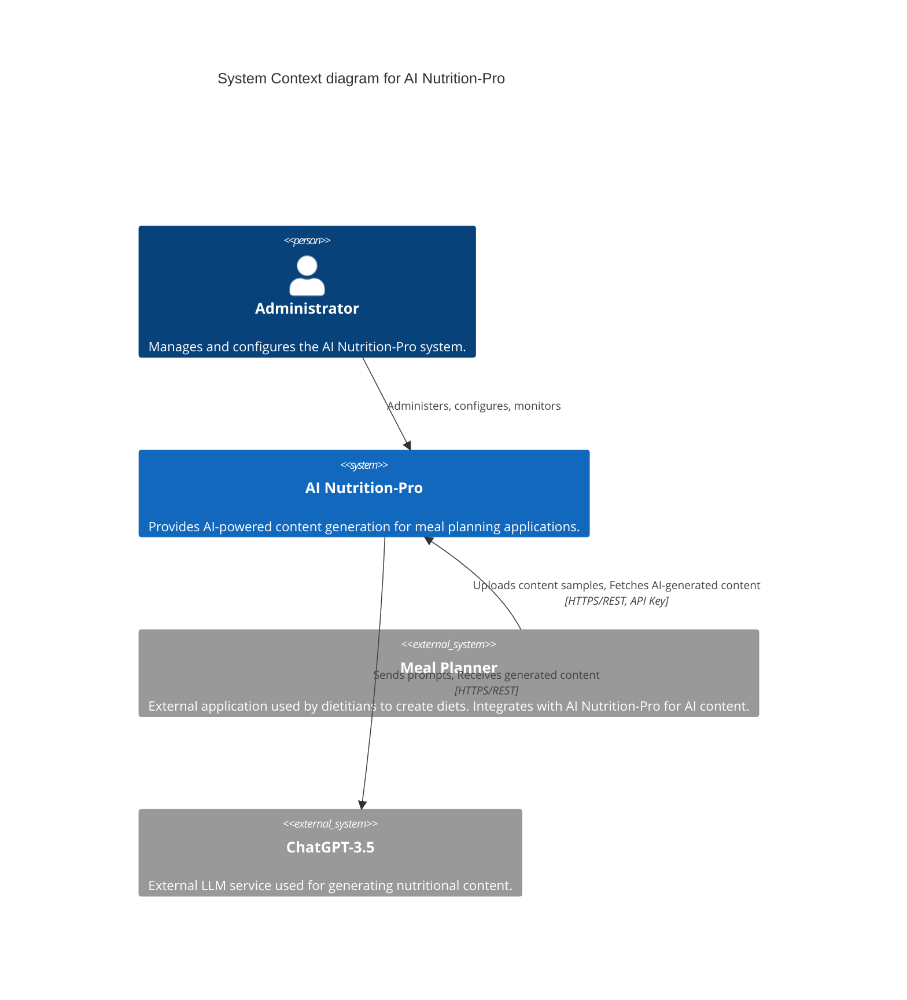
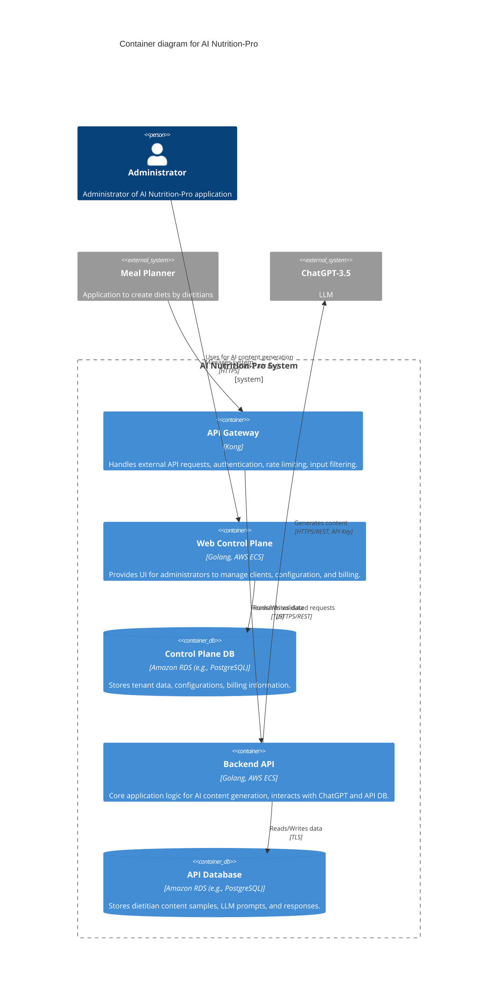

# BUSINESS POSTURE

The AI Nutrition-Pro application aims to provide a robust, scalable, and secure platform for generating AI-powered nutritional content. Its primary goal is to serve as a backend service for various "Meal Planner" applications, enabling dietitians and end-users of those applications to leverage advanced AI for creating personalized and relevant dietary information, such as diet introductions and other textual content.

Key business priorities include:
1.  Service Reliability and Availability: Ensuring the API is consistently accessible to integrated Meal Planner applications.
2.  Content Quality and Relevance: Providing accurate, helpful, and contextually appropriate AI-generated nutritional content.
3.  Scalability: Ability to handle a growing number of client applications and API requests.
4.  Client Management: Efficient onboarding, configuration, and billing management for Meal Planner application clients.
5.  Data Security and Privacy: Protecting proprietary dietitian content, client data, and operational data.

Most important business risks that need to be addressed:
1.  Data Breach: Unauthorized access to or leakage of dietitian content samples, LLM interaction logs, client administrative data, or API keys, leading to loss of intellectual property, reputational damage, and potential legal liabilities.
2.  Service Disruption: Downtime or performance degradation of the API, directly impacting the functionality of client Meal Planner applications and their users.
3.  Inaccurate or Harmful AI Content: Generation of incorrect, misleading, or harmful nutritional advice by the LLM, potentially leading to health risks for end-users and liability for AI Nutrition-Pro and its clients.
4.  Loss of Client Trust: Stemming from security incidents, service instability, or poor quality of AI-generated content.
5.  Compliance Failures: Non-adherence to data protection regulations (e.g., GDPR, CCPA) if PII is handled, or health-specific regulations (e.g., HIPAA) if PHI is involved, leading to fines and legal action.
6.  API Abuse: Unauthorized or excessive use of the API through compromised client API keys or exploitation of the ChatGPT integration, leading to unexpected costs or service degradation.

# SECURITY POSTURE

This section outlines the current security controls, accepted risks (if any), recommended controls, and security requirements for the AI Nutrition-Pro project.

Existing Security Controls:
- security control: API Key Authentication for Meal Planner Applications: Each Meal Planner application is assigned an individual API key for authenticating to the API Gateway. This is described in the "Security" section of the input file.
- security control: API Gateway Authorization for Meal Planner Applications: The API Gateway (Kong) uses Access Control Lists (ACLs) to enforce rules determining which actions Meal Planner applications are allowed to perform. This is described in the "Security" section of the input file.
- security control: Encrypted Network Traffic (External): Communication between Meal Planner applications and the API Gateway is secured using TLS. This is described in the "Security" section of the input file.
- security control: API Gateway Core Functions: The Kong API Gateway is responsible for client authentication, input filtering, and rate limiting. This is described in the "Containers Context diagram" section of the input file.
- security control: Encrypted Network Traffic (Internal Database): Connections from the `app_control_plane` to `control_plan_db` and from `backend_api` to `api_db` are secured using TLS. This is described in the `Rel` statements within the "Containers Context diagram" in the input file.

Accepted Risks:
- No explicitly accepted risks have been documented from the input. A formal risk assessment and acceptance process should be established.

Recommended Security Controls (High Priority):
- Secrets Management: Implement a dedicated secrets management solution (e.g., AWS Secrets Manager, HashiCorp Vault) for storing and managing API keys (for ChatGPT access, internal services), database credentials, and other sensitive configuration data. Ensure regular rotation of these secrets.
- Comprehensive Input Validation: Implement robust input validation and sanitization in the Backend API and Web Control Plane, in addition to the API Gateway, to protect against injection attacks (SQLi, XSS, Prompt Injection), data corruption, and other input-based vulnerabilities.
- Centralized Logging and Monitoring: Establish comprehensive logging across all components (API Gateway, Web Control Plane, Backend API, Databases). Centralize logs (e.g., using AWS CloudWatch Logs or an ELK stack) for security monitoring, anomaly detection, and incident response.
- Web Application Firewall (WAF): Deploy a WAF (e.g., AWS WAF) in front of the API Gateway and the Web Control Plane to protect against common web exploits.
- Data Encryption at Rest: Ensure all sensitive data stored in the Control Plane Database and API Database (Amazon RDS) is encrypted at rest (e.g., using AWS KMS).
- Principle of Least Privilege (IAM): Configure AWS IAM roles for ECS tasks (API Gateway, Backend API, Web Control Plane) and other services with the minimum necessary permissions.
- Vulnerability Management Program:
    - Static Analysis Security Testing (SAST): Integrate SAST tools into the CI/CD pipeline for Golang code.
    - Software Composition Analysis (SCA): Scan dependencies for known vulnerabilities.
    - Container Image Scanning: Scan Docker images for vulnerabilities before deployment to ECR and ECS.
- Multi-Factor Authentication (MFA) for Administrators: Enforce MFA for all administrative access to the Web Control Plane and the AWS management console.
- Regular Security Audits and Penetration Testing: Conduct periodic independent security assessments of the application and infrastructure.
- Incident Response Plan: Develop and maintain a documented incident response plan to address security breaches effectively.

Security Requirements:
- Authentication:
    - External Systems (Meal Planner Apps): Must authenticate using unique, strong API keys. API keys should be securely provisioned and managed.
    - Internal Users (Administrators): Must authenticate to the Web Control Plane using strong credentials, with MFA enforced.
    - Service-to-Service: Internal services should authenticate to each other where appropriate, using secure mechanisms (e.g., IAM roles for AWS services, mutual TLS, or tokens).
- Authorization:
    - External Systems: Access to API endpoints and resources must be strictly controlled based on the authenticated API key, using ACLs or similar mechanisms at the API Gateway.
    - Internal Users: Role-Based Access Control (RBAC) must be implemented within the Web Control Plane to ensure administrators only have access to functionalities relevant to their roles and responsibilities (Principle of Least Privilege).
    - System Components: All components (ECS tasks, database access) must operate with the minimum necessary permissions.
- Input Validation:
    - All inputs from untrusted sources (Meal Planner apps, Administrator users via Web Control Plane, ChatGPT responses) must be validated for type, format, length, range, and character set before processing.
    - Inputs must be sanitized or encoded to prevent injection attacks (e.g., XSS, SQLi, command injection, prompt injection into LLM).
    - Business logic validation must be performed to ensure data integrity.
- Cryptography:
    - Data in Transit: All external and internal network communication, including connections to databases and external services like ChatGPT, must use strong TLS protocols (TLS 1.2 or higher).
    - Data at Rest: All sensitive data, including dietitian content samples, LLM interactions, client data in databases, and configuration secrets, must be encrypted at rest using strong encryption algorithms (e.g., AES-256).
    - Secrets Management: API keys, passwords, certificates, and other cryptographic secrets must be stored securely in a dedicated secrets management system, not in code or configuration files.

# DESIGN

This section details the design of the AI Nutrition-Pro application, including its context, container structure, deployment, and build process.

## C4 CONTEXT

The C4 Context diagram shows AI Nutrition-Pro as a system at the center, interacting with its users and other external systems.



Context Diagram Elements:

| Name                 | Type                        | Description                                                                                                   | Responsibilities                                                                                                | Security controls                                                                                                                               |
|----------------------|-----------------------------|---------------------------------------------------------------------------------------------------------------|-----------------------------------------------------------------------------------------------------------------|-------------------------------------------------------------------------------------------------------------------------------------------------|
| Administrator        | Person                      | Administrator of AI Nutrition-Pro application.                                                                | - Manage system configuration <br/> - Onboard and manage clients <br/> - Monitor system health <br/> - Resolve problems | - Strong authentication (MFA recommended) to Web Control Plane <br/> - Role-Based Access Control (RBAC) within AI Nutrition-Pro's control plane |
| AI Nutrition-Pro     | Software System (This System) | Provides AI-powered content generation for meal planning applications, managing clients and billing.          | - Generate AI nutritional content <br/> - Manage client accounts and configurations <br/> - Process API requests | - API Gateway for external access <br/> - Internal authentication & authorization <br/> - Data encryption (transit & rest) <br/> - Logging & Monitoring |
| Meal Planner         | External System             | Application used by dietitians to create diets. Integrates with AI Nutrition-Pro for AI-enhanced content.       | - Upload dietitian content samples <br/> - Request and display AI-generated nutritional content                | - API Key authentication to AI Nutrition-Pro <br/> - HTTPS for communication                                                                     |
| ChatGPT-3.5          | External System             | OpenAI's Large Language Model used for content generation.                                                    | - Generate text based on prompts provided by AI Nutrition-Pro                                                   | - API Key authentication from AI Nutrition-Pro (key managed securely) <br/> - HTTPS for communication                                          |

## C4 CONTAINER

The C4 Container diagram zooms into the AI Nutrition-Pro system boundary, showing its major building blocks (containers) and their interactions.



Container Diagram Elements:

| Name                 | Type                      | Description                                                                                                   | Responsibilities                                                                                                                               | Security controls                                                                                                                                                                                                                            |
|----------------------|---------------------------|---------------------------------------------------------------------------------------------------------------|------------------------------------------------------------------------------------------------------------------------------------------------|----------------------------------------------------------------------------------------------------------------------------------------------------------------------------------------------------------------------------------------------|
| Administrator        | Person (Interacts with system) | Administrator of AI Nutrition-Pro application.                                                                | - Configure system properties <br/> - Manage clients and billing <br/> - Monitor system                                                        | - Strong authentication (MFA) to Web Control Plane <br/> - Authorization via RBAC in Web Control Plane <br/> - Secure session management <br/> - HTTPS communication                                                                                     |
| Meal Planner         | External System           | Application to create diets by dietitians, integrates with AI Nutrition-Pro.                                  | - Uploads samples of dietitians' content <br/> - Fetches AI generated results                                                                 | - Authenticates via unique API Key to API Gateway <br/> - Communicates over HTTPS                                                                                                                                                                    |
| ChatGPT-3.5          | External System           | LLM service used for content generation.                                                                      | - Generates text based on prompts.                                                                                                             | - Accessed via API Key (managed securely by Backend API, e.g., via Secrets Manager) <br/> - Communicates over HTTPS                                                                                                                                |
| API Gateway          | Container (Kong)          | Entry point for external API calls from Meal Planner applications. Deployed on AWS ECS.                         | - Authenticate clients (API Key validation) <br/> - Authorize requests (ACL enforcement) <br/> - Rate limiting <br/> - Basic input filtering/validation <br/> - Route requests to Backend API | - API Key validation <br/> - ACL enforcement <br/> - TLS termination <br/> - Integration with WAF (recommended) <br/> - Request logging <br/> - Input validation (e.g., request size, basic format)                                                              |
| Web Control Plane    | Container (Golang, AWS ECS) | Provides a web interface for administrators to manage the system.                                               | - Onboard and manage clients <br/> - Manage system configuration <br/> - View billing data <br/> - User management for administrators             | - User authentication (strong passwords, MFA) <br/> - RBAC for admin functions <br/> - Comprehensive input validation <br/> - Output encoding <br/> - CSRF protection <br/> - Secure session management <br/> - HTTPS communication <br/> - Security headers |
| Control Plane Database | Container (Amazon RDS)    | Stores data related to the control plane, such as tenants, configurations, and billing information.           | - Persist and retrieve control plane data (tenants, users, configurations, billing).                                                         | - Data encryption at rest <br/> - Data encryption in transit (TLS from Web Control Plane) <br/> - Network isolation (VPC, security groups) <br/> - Regular automated backups <br/> - Access control (least privilege for app_control_plane service account) |
| Backend API          | Container (Golang, AWS ECS) | Handles the core business logic for AI content generation and interaction with external/internal services.    | - Process API requests from API Gateway <br/> - Construct prompts and interact with ChatGPT <br/> - Store/retrieve data from API Database (samples, LLM I/O) | - Comprehensive input validation <br/> - Secure management and use of ChatGPT API key (via Secrets Manager) <br/> - Secure communication with API DB (TLS) <br/> - Error handling and logging <br/> - Output validation of LLM responses               |
| API Database         | Container (Amazon RDS)    | Stores dietitian content samples, prompts sent to LLM, and responses received from LLM.                       | - Persist and retrieve dietitian content samples, LLM prompts, and LLM responses.                                                            | - Data encryption at rest <br/> - Data encryption in transit (TLS from Backend API) <br/> - Network isolation (VPC, security groups) <br/> - Regular automated backups <br/> - Access control (least privilege for backend_api service account)         |

## DEPLOYMENT

The AI Nutrition-Pro application is designed for deployment on AWS, primarily utilizing AWS Elastic Container Service (ECS) with Fargate for running its containerized components (API Gateway, Web Control Plane, Backend API) and Amazon RDS for its databases.

Possible deployment solutions considered:
1.  AWS ECS with Fargate (Chosen): Offers serverless compute for containers, simplifying management.
2.  AWS EKS (Kubernetes): More complex orchestration, suitable for larger microservice ecosystems.
3.  AWS Lambda with API Gateway: Suitable for purely event-driven, serverless APIs, might be complex for stateful control plane.
4.  EC2 Instances: Traditional IaaS, requires more operational overhead.

The chosen deployment architecture leverages AWS ECS with Fargate for its balance of control, scalability, and managed infrastructure.

```mermaid
deploymentDiagram
  title Deployment Diagram for AI Nutrition-Pro on AWS

  node "Internet" as internet {
    node "User/Client Devices" as users {
      actor "Meal Planner App" as meal_planner_app_actor
      actor "Administrator User" as admin_user_actor
    }
  }

  node "AWS Cloud" as aws_cloud {
    node "AWS Region" as aws_region {
      node "Amazon Route 53" as route53 (label="Route 53 (DNS)")
      node "AWS WAF" as waf (label="WAF")
      node "VPC" as vpc {
        node "Public Subnets" as public_subnets {
          node "Application Load Balancer (ALB)" as alb {
            artifact "HTTPS Listener" as alb_listener
          }
          node "NAT Gateway" as nat_gateway
        }
        node "Private Subnets" as private_subnets {
          node "ECS (Fargate)" as ecs_fargate {
            node "API Gateway Task (Kong)" as kong_task_def {
              artifact "Kong Container" as kong_container
            }
            node "Backend API Task" as backend_api_task_def {
              artifact "Backend API Container" as backend_api_container
            }
            node "Web Control Plane Task" as web_cp_task_def {
              artifact "Web CP Container" as web_cp_container
            }
          }
          node "Amazon RDS Instances" as rds_instances {
            node "Control Plane DB (PostgreSQL)" as rds_cp_db {
              artifact "CP Data"
            }
            node "API DB (PostgreSQL)" as rds_api_db {
              artifact "API Data"
            }
          }
        }
      }
      node "AWS Secrets Manager" as secrets_manager (label="Secrets Manager")
      node "Amazon CloudWatch" as cloudwatch (label="CloudWatch (Logs, Metrics, Alarms)")
      node "AWS ECR" as ecr (label="ECR (Container Registry)")
    }
  }

  node "External Services Provider" as ext_services_provider {
    node "OpenAI API" as openai_api (label="ChatGPT API")
  }

  connect meal_planner_app_actor to route53 (label="DNS Query")
  connect admin_user_actor to route53 (label="DNS Query")
  connect route53 to alb (label="Resolves to ALB IP")
  connect internet to waf (label="HTTPS")
  connect waf to alb (label="Filtered HTTPS Traffic")

  connect alb to kong_task_def (label="HTTPS (to API Gateway)")
  connect alb to web_cp_task_def (label="HTTPS (to Web CP)")

  connect kong_task_def to backend_api_task_def (label="HTTPS/Internal")
  connect backend_api_task_def to rds_api_db (label="TLS/SQL")
  connect web_cp_task_def to rds_cp_db (label="TLS/SQL")

  connect backend_api_task_def to nat_gateway (label="Outbound HTTPS")
  connect nat_gateway to openai_api (label="HTTPS/REST")

  connect ecs_fargate to secrets_manager (label="Fetch Secrets")
  connect ecs_fargate to cloudwatch (label="Send Logs/Metrics")
  connect rds_instances to cloudwatch (label="Send Logs/Metrics")
  connect ecs_fargate to ecr (label="Pull Image")
```

Deployment Diagram Elements:

| Name                          | Type                                  | Description                                                                                                 | Responsibilities                                                                                                                                                              | Security controls                                                                                                                                                                                                                                                           |
|-------------------------------|---------------------------------------|-------------------------------------------------------------------------------------------------------------|-------------------------------------------------------------------------------------------------------------------------------------------------------------------------------|---------------------------------------------------------------------------------------------------------------------------------------------------------------------------------------------------------------------------------------------------------------------------|
| Meal Planner App (Actor)      | External Actor                        | Represents client applications integrating with AI Nutrition-Pro.                                           | - Initiates API requests to AI Nutrition-Pro.                                                                                                                                 | - Uses API keys for authentication. <br/> - Communicates over HTTPS.                                                                                                                                                                                                       |
| Administrator User (Actor)    | External Actor                        | Represents human administrators managing the system.                                                        | - Accesses Web Control Plane for management tasks.                                                                                                                            | - Authenticates to Web Control Plane (MFA enforced). <br/> - Communicates over HTTPS.                                                                                                                                                                                  |
| Amazon Route 53               | AWS Service (DNS)                     | Amazon's scalable Domain Name System.                                                                       | - Resolves application domain names (e.g., api.ainutritionpro.com) to ALB IP addresses.                                                                                      | - DDoS protection capabilities (especially with AWS Shield Advanced).                                                                                                                                                                                                     |
| AWS WAF                       | AWS Service (Web Application Firewall)| Protects web applications from common web exploits.                                                         | - Filters malicious HTTP/S traffic (e.g., SQL injection, XSS attempts) before it reaches the ALB.                                                                           | - Configured with rulesets (managed or custom). <br/> - Rate-based rules to mitigate DDoS. <br/> - Logs blocked/allowed requests.                                                                                                                                       |
| Application Load Balancer (ALB) | AWS Service (Load Balancer)           | Distributes incoming application traffic across multiple targets (ECS tasks) in various Availability Zones.   | - Terminates TLS (HTTPS). <br/> - Routes traffic to API Gateway (Kong) or Web Control Plane tasks based on rules (e.g., host header, path). <br/> - Provides load balancing.       | - Uses ACM for TLS certificates. <br/> - Integrates with WAF. <br/> - Generates access logs. <br/> - Security Groups to control inbound traffic. <br/> - Listener rules for routing.                                                                                 |
| NAT Gateway                   | AWS Service                           | Enables instances in private subnets to connect to the internet or other AWS services.                      | - Provides outbound internet connectivity for ECS tasks in private subnets (e.g., Backend API to ChatGPT).                                                                      | - Resides in public subnet with an Elastic IP. <br/> - Prevents inbound connections from the internet to private subnet resources.                                                                                                                                   |
| ECS (Fargate) Tasks           | AWS Compute (Containers)              | Serverless compute instances for running Docker containers (Kong, Backend API, Web CP).                       | - Execute application code within containers. <br/> - Scale based on demand.                                                                                                 | - Run in private subnets. <br/> - ECS Task IAM Roles with least privilege permissions. <br/> - Security Groups to control network traffic to/from tasks. <br/> - Secrets fetched from AWS Secrets Manager. <br/> - Images pulled from private ECR.                           |
| Amazon RDS Instances          | AWS Service (Managed Database)        | Managed relational database instances (e.g., PostgreSQL) for Control Plane DB and API DB.                   | - Store and retrieve application data persistently.                                                                                                                           | - Located in private subnets. <br/> - Encryption at rest (KMS). <br/> - Encryption in transit (TLS enforced). <br/> - Security Groups to restrict access. <br/> - IAM database authentication (recommended). <br/> - Automated backups and point-in-time recovery. |
| AWS Secrets Manager           | AWS Service (Secrets Management)      | Service to manage, retrieve, and rotate secrets like database credentials and API keys.                     | - Securely stores and provides access to secrets needed by ECS tasks.                                                                                                         | - Encryption of secrets at rest. <br/> - Fine-grained access control using IAM. <br/> - Automated rotation capabilities for supported secrets.                                                                                                                        |
| Amazon CloudWatch             | AWS Service (Monitoring & Logging)  | Monitoring and observability service for AWS cloud resources and applications.                              | - Collects logs from ECS tasks, ALB, RDS. <br/> - Stores metrics for performance monitoring. <br/> - Triggers alarms based on defined thresholds (e.g., high error rates, CPU usage). | - Centralized logging for audit and security analysis. <br/> - Secure access to logs and metrics via IAM. <br/> - Alarms for security events.                                                                                                                        |
| AWS ECR                       | AWS Service (Container Registry)      | Managed Docker container registry.                                                                          | - Stores and manages Docker images for API Gateway, Backend API, and Web Control Plane.                                                                                       | - Private registry with IAM-based access control. <br/> - Supports image scanning for vulnerabilities. <br/> - Can integrate with image signing solutions.                                                                                                     |
| OpenAI API (ChatGPT)          | External Service                      | External Large Language Model API used for content generation.                                              | - Receives prompts from Backend API and returns generated text.                                                                                                               | - Communication over HTTPS. <br/> - API key for authentication (managed by Backend API via Secrets Manager).                                                                                                                                                     |

## BUILD

The build process for AI Nutrition-Pro's Golang applications (Web Control Plane, Backend API) and the Kong API Gateway configuration focuses on creating secure, versioned Docker images that are stored in AWS ECR and deployed to AWS ECS Fargate. A CI/CD pipeline, for example using GitHub Actions or AWS CodePipeline, automates this process.

```mermaid
graph LR
    subgraph "Developer Environment"
        Dev[Developer] -- "1. Writes Code" --> IDE[Local IDE with Linters/Formatters]
        IDE -- "2. Code Feedback" --> Dev
        Dev -- "3. Git Commit & Push" --> Repo[Git Repository (e.g., GitHub)]
    end

    subgraph "CI/CD Pipeline (e.g., GitHub Actions / AWS CodePipeline)"
        Repo -- "4. Triggers Workflow" --> Checkout[Checkout Code]
        Checkout -- "5. Source Code" --> SCA[Software Composition Analysis (SCA) <br/> (e.g., Snyk, Dependabot on go.mod)]
        SCA -- "6. Code + Dependencies" --> SAST[Static Analysis Security Testing (SAST) <br/> (e.g., GoSec, CodeQL)]
        SAST -- "7. Analyzed Code" --> Build[Build Golang Binaries <br/> & Docker Images]
        Build -- "8. Docker Image" --> ImageScan[Container Image Scanning <br/> (e.g., Trivy, AWS ECR Scan)]
        ImageScan -- "9. Security Report" --> Approval{Security Gate}
        Approval -- "10a. Approved Image" --> PushImage[Push to AWS ECR]
        Approval -- "10b. Issues Found" --> Notify[Notify Developers / Fail Build]
    end

    subgraph "AWS Environment"
        PushImage -- "11. Docker Image" --> ECR[AWS ECR (Elastic Container Registry)]
        ECR -- "12. Image for Deployment" --> Deploy[CD Process: Deploy to ECS Fargate]
    end
```

Build Process Description:

1.  Development: Developers write Golang code for the Backend API and Web Control Plane, and potentially configuration for Kong (if managed as code). They use local linters (`golangci-lint`) and formatters (`gofmt`).
2.  Version Control: Code is committed to a Git repository (e.g., GitHub).
3.  CI/CD Trigger: A push to a designated branch (e.g., `main`, `develop`) or a pull request triggers the CI/CD pipeline.
4.  Checkout & Setup: The pipeline checks out the code and sets up the build environment (e.g., Golang version).
5.  Security Checks (Pre-Build):
    - security control: Software Composition Analysis (SCA): Tools scan `go.mod` and `go.sum` files to identify known vulnerabilities in third-party dependencies. The build may fail if critical/high vulnerabilities are found.
    - security control: Static Analysis Security Testing (SAST): Golang source code is analyzed for security vulnerabilities, anti-patterns, and bugs using tools like GoSec or integrated solutions like SonarQube/CodeQL.
6.  Compilation & Packaging:
    - Golang applications are compiled into static executables.
    - Dockerfiles are used to build container images for each service (Backend API, Web Control Plane, API Gateway). These Dockerfiles specify minimal, trusted base images (e.g., official Golang Alpine, Kong official image).
7.  Security Checks (Post-Build):
    - security control: Container Image Scanning: The built Docker images are scanned for known vulnerabilities within the OS packages and application layers using tools like Trivy, Clair, or AWS ECR's native scanning feature.
8.  Testing: Automated tests (unit, integration) are executed.
9.  Artifact Storage:
    - security control: If all checks and tests pass, the Docker images are tagged (e.g., with Git commit hash, semantic version) and pushed to a private AWS Elastic Container Registry (ECR). Access to ECR is tightly controlled using IAM permissions.
10. Deployment: A separate Continuous Deployment (CD) pipeline or a subsequent stage in the CI pipeline triggers deployment of the new images from ECR to the respective AWS ECS Fargate services. This typically involves updating the ECS task definitions and services.

Build Automation and Supply Chain Security Controls:
- security control: Build Automation: The entire build and test process is automated to ensure consistency and reduce human error.
- security control: Dependency Pinning: Go modules (`go.mod`, `go.sum`) ensure reproducible builds by pinning dependency versions.
- security control: Trusted Base Images: Use minimal, official, and regularly updated base images for Docker containers.
- security control: Image Signing (Recommended): Consider implementing Docker Content Trust or similar mechanisms to sign and verify image integrity.
- security control: Secrets Handling: No secrets are baked into container images. Secrets are injected at runtime via AWS Secrets Manager or environment variables populated from secure sources.

# RISK ASSESSMENT

What are critical business processes we are trying to protect?
1.  AI-Powered Content Generation: The core functionality of providing accurate, relevant, and timely nutritional content via the API. This includes the interaction with ChatGPT and the use of dietitian content samples.
2.  Client Onboarding and Management: The process by which Meal Planner applications are registered, configured, and managed within the AI Nutrition-Pro system, including API key provisioning and access control.
3.  Billing and Usage Tracking: Accurately tracking API usage for each client and potentially facilitating billing processes.
4.  System Administration and Configuration: The ability for authorized administrators to securely configure and maintain the AI Nutrition-Pro platform.
5.  Data Ingestion and Management (Dietitian Samples): The secure uploading, storage, and processing of dietitian content samples used to guide or fine-tune LLM responses.

What data we are trying to protect and what is their sensitivity?
1.  Dietitian Content Samples (stored in API Database):
    - Sensitivity: High. This is proprietary intellectual property of dietitians or their organizations. Unauthorized disclosure could lead to competitive disadvantage, loss of trust, and financial harm.
2.  LLM Prompts and Responses (stored in API Database):
    - Sensitivity: Medium to High. Prompts could inadvertently contain sensitive data fragments if not carefully engineered. Responses constitute the generated content, whose integrity is critical. Logs of these interactions could reveal prompting strategies or sensitive aspects of the dietitian samples.
3.  Client Data (stored in Control Plane Database):
    - Tenant Information (e.g., Meal Planner application names, contact persons, email addresses): Medium. This is PII and business-sensitive information.
    - Client Configuration Data (e.g., API usage limits, specific settings): Medium. Sensitive to the client's business operations.
    - Billing Data (e.g., usage records, subscription details): High. Commercially sensitive and potentially subject to financial regulations.
4.  API Keys:
    - Meal Planner Application API Keys (managed by API Gateway, potentially stored/referenced in Control Plane DB): Critical. Compromise allows unauthorized API access, data exfiltration, and service abuse attributed to the legitimate client.
    - ChatGPT API Key (used by Backend API, stored in Secrets Manager): Critical. Compromise leads to unauthorized use of the OpenAI API, resulting in financial costs and potential rate limiting/suspension affecting the service.
5.  Administrator Credentials (for Web Control Plane):
    - Sensitivity: Critical. Compromise grants extensive control over the AI Nutrition-Pro system, including access to client data, system configurations, and potentially all other sensitive data.
6.  System Configuration Data (e.g., database connection strings, service parameters, Kong configurations):
    - Sensitivity: High. While secrets like DB credentials should be in Secrets Manager, other configurations can reveal system architecture or operational details if exposed.
7.  Application and System Logs (e.g., CloudWatch Logs):
    - Sensitivity: Medium. Logs may contain IP addresses, request parameters, error messages with stack traces, or user activity, which can be sensitive or useful to an attacker.

# QUESTIONS & ASSUMPTIONS

Questions:
1.  What is the detailed data flow for dietitian content samples? How are they used in conjunction with LLM prompts, and what measures prevent these samples from being inadvertently leaked or memorized by the LLM beyond the intended use?
2.  Are there any specific data residency requirements for any of the data processed or stored (e.g., dietitian samples, client data)?
3.  What are the RTO (Recovery Time Objective) and RPO (Recovery Point Objective) for the system, particularly for the databases?
4.  How will the "filtering of input" mentioned for the API Gateway be implemented? What specific types of filtering will be performed?
5.  What are the plans for handling potentially biased or harmful content generated by the LLM? Are there any review or moderation mechanisms?
6.  How is the uniqueness and secure distribution of Meal Planner API keys ensured during the onboarding process via the Web Control Plane?
7.  Are there any plans for role differentiation within the "Administrator" role (e.g., Super Admin, Billing Admin, Technical Admin) in the Web Control Plane?
8.  What is the strategy for updating and patching the underlying Golang versions, Kong API Gateway, and base Docker images?
9.  How will prompt injection attacks against the Backend API (targeting ChatGPT) be specifically mitigated?
10. What are the expected transaction volumes and data storage growth rates to plan for scalability and cost?

Assumptions:
1.  The "AI Nutrition-Pro" system is a new project, and the provided architecture document is an initial draft.
2.  The primary users of the API are other software systems ("Meal Planner" applications), not individual end-users directly.
3.  The "Administrator" persona refers to internal trusted users responsible for maintaining and managing the AI Nutrition-Pro platform.
4.  Cost optimization is a consideration, but security and reliability are higher priorities for the core service.
5.  The Golang applications will be developed following modern software engineering best practices, including comprehensive automated testing.
6.  The input "dietitian' content samples" are text-based and do not contain PII or PHI unless explicitly stated otherwise and handled with appropriate safeguards.
7.  The organization has or will acquire the necessary AWS expertise to implement and manage the proposed deployment architecture securely.
8.  The interaction with ChatGPT is purely API-based, and no fine-tuning of the base ChatGPT model with proprietary data is occurring directly on OpenAI's platform without specific contractual agreements addressing data privacy.
9.  The term "filtering of input" at the API Gateway implies basic validation (e.g., request size, method, content-type) and potentially some pattern matching, but more complex business logic validation occurs in the Backend API.
10. All data classified as "Critical" or "High" sensitivity requires encryption both in transit and at rest.
