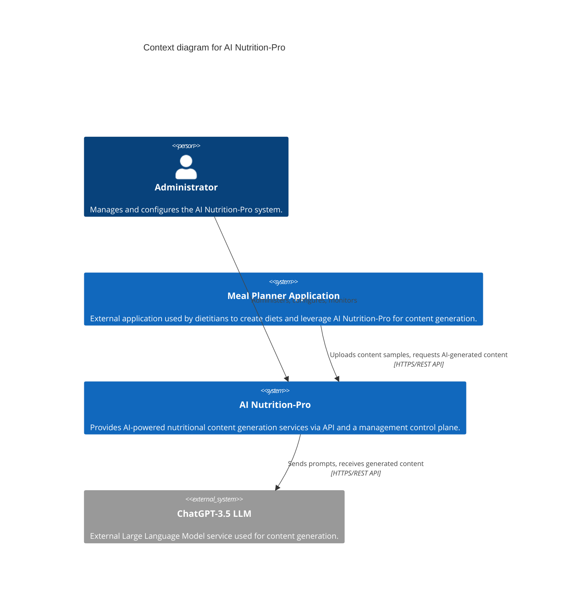
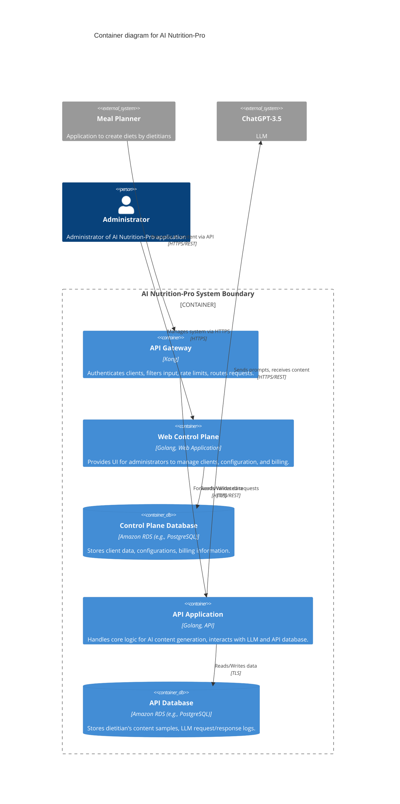
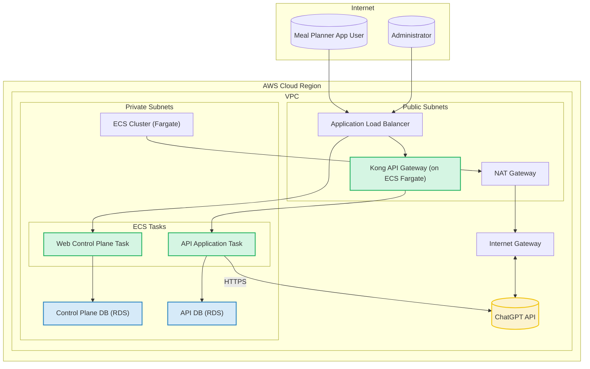
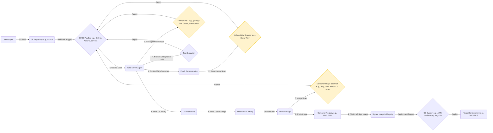

# BUSINESS POSTURE

The AI Nutrition-Pro application is designed to provide AI-powered content generation services, primarily for "Meal Planner" applications. The core business goal is to enable these applications, and by extension, dietitians using them, to leverage Large Language Models (LLMs) like ChatGPT-3.5 for creating nutritional content, such as diet introductions, based on provided samples of a dietitian's work.

Key business priorities include:
1.  Delivering high-quality, relevant AI-generated nutritional content.
2.  Providing a stable and reliable API service for integrated Meal Planner applications.
3.  Efficiently onboarding and managing client applications (Meal Planners).
4.  Ensuring the security and privacy of dietitian's content samples and client data.
5.  Offering a configurable system that can be administered effectively.

Most important business risks that need to be addressed:
1.  Reputational Damage: Generation of inaccurate, harmful, or inappropriate nutritional advice by the LLM could lead to health issues for end-users, damaging the reputation of AI Nutrition-Pro and its clients.
2.  Data Breach: Unauthorized access to or leakage of sensitive data, including dietitian's content samples, LLM interaction logs, client API keys, or administrative credentials.
3.  Service Unavailability: Disruptions to the AI Nutrition-Pro service would directly impact the functionality of integrated Meal Planner applications, potentially leading to client dissatisfaction and churn.
4.  Vendor Dependency: Over-reliance on a single LLM provider (e.g., OpenAI's ChatGPT) poses risks related to cost changes, API modifications, or service termination.
5.  Scalability Issues: Inability to scale the service to meet growing demand from an increasing number of Meal Planner integrations could degrade performance and user experience.
6.  Intellectual Property Infringement: The system might inadvertently generate content that infringes on existing copyrighted material, or misuse dietitian's sample content.

# SECURITY POSTURE

Existing security controls:
- `security control`: Authentication with Meal Planner applications - each has an individual API key. (Implemented at: API Gateway)
- `security control`: Authorization of Meal Planner applications - API Gateway has ACL rules that allow or deny certain actions. (Implemented at: API Gateway)
- `security control`: Encrypted network traffic - network traffic between Meal Planner applications and API Gateway is encrypted using TLS. (Implemented at: Network layer between Meal Planner applications and API Gateway)
- `security control`: API Gateway (Kong) provides input filtering and rate limiting. (Implemented at: API Gateway)
- `security control`: Database connections use TLS encryption. (Implemented at: Connections to Control Plane Database and API Database)

Accepted risks:
- No accepted risks have been explicitly documented in the provided information.

Recommended security controls (high priority):
1.  Robust Input Validation and Sanitization: Implement comprehensive validation for all inputs, especially for prompts sent to LLMs to prevent prompt injection attacks. This should go beyond basic filtering at the API Gateway and be enforced at the API Application level.
2.  Output Validation and Filtering: Implement mechanisms to validate and filter LLM-generated content for appropriateness, harmfulness, and potential biases before returning it to the client.
3.  Secrets Management: Utilize a dedicated secrets management solution (e.g., AWS Secrets Manager, HashiCorp Vault) for storing and managing API keys (for Meal Planners, ChatGPT), database credentials, and other sensitive secrets. Implement regular rotation of these secrets.
4.  Comprehensive Logging and Monitoring: Establish detailed logging for all components, focusing on security events, API calls, errors, and administrative actions. Implement real-time monitoring and alerting for suspicious activities.
5.  Web Application Firewall (WAF): Deploy a WAF in front of the API Gateway to protect against common web exploits (e.g., SQL injection, XSS, OWASP Top 10).
6.  Secure Software Development Lifecycle (SSDLC): Integrate security practices throughout the software development lifecycle, including threat modeling, secure code reviews, SAST/DAST scanning, and dependency checking.
7.  Principle of Least Privilege: Ensure all system components, user accounts (including administrators), and service roles operate with the minimum necessary permissions.
8.  Data Encryption at Rest: Confirm and enforce encryption at rest for all sensitive data stored in databases (Control Plane DB, API DB) using robust encryption mechanisms (e.g., AES-256 via AWS KMS).
9.  Regular Security Assessments: Conduct periodic vulnerability assessments and penetration tests by independent third parties.
10. Multi-Factor Authentication (MFA) for Administrators: Enforce MFA for all administrative access to the Web Control Plane and underlying infrastructure.

Security requirements:
1.  Authentication:
    - External Clients (Meal Planner Applications): Must authenticate using unique, strong API keys. API keys should be revocable and support rotation.
    - Administrators: Must authenticate to the Web Control Plane using strong credentials, with MFA enforced.
    - Internal Services: Service-to-service communication should be authenticated (e.g., using IAM roles within AWS or mTLS).
2.  Authorization:
    - External Clients: Access to API resources must be restricted based on client identity and defined permissions (e.g., ACLs at the API Gateway, potentially finer-grained within the API Application).
    - Administrators: Role-Based Access Control (RBAC) should be implemented within the Web Control Plane to segregate duties (e.g., super admin, client onboarding manager).
    - Internal Services: Services must only be granted permissions necessary to perform their functions (e.g., API Application access to API DB and ChatGPT, Web Control Plane access to Control Plane DB).
3.  Input Validation:
    - All data received from external sources (Meal Planner applications, administrators) must be strictly validated against expected types, formats, lengths, and ranges.
    - Prompts sent to the LLM must be sanitized to prevent injection attacks. This includes checking for malicious payloads, control characters, and attempts to manipulate LLM instructions.
    - Content samples uploaded by dietitians must be validated for format and size, and scanned for malicious content if applicable.
4.  Cryptography:
    - Data in Transit: All external network communication (Meal Planner to API Gateway, API Application to ChatGPT) must use TLS 1.2 or higher. All internal HTTP communication between services should also use TLS. Database connections must use TLS.
    - Data at Rest: All sensitive data stored in the Control Plane Database and API Database (e.g., client data, dietitian content samples, LLM interactions, API keys if stored) must be encrypted using strong, industry-standard encryption algorithms (e.g., AES-256).
    - Secrets Management: Cryptographic keys, API tokens, and passwords must be stored securely in a dedicated secrets management system, not in code or configuration files.

# DESIGN

## C4 CONTEXT

The C4 Context diagram shows AI Nutrition-Pro as a system at the center, with its key users and system dependencies.

C4 Context Diagram Elements:

| Name                      | Type            | Description                                                                                                | Responsibilities                                                                                                                               | Security Controls                                                                                                                                                              |
| ------------------------- | --------------- | ---------------------------------------------------------------------------------------------------------- | ---------------------------------------------------------------------------------------------------------------------------------------------- | ------------------------------------------------------------------------------------------------------------------------------------------------------------------------------ |
| Administrator             | Person          | An internal user responsible for the overall management and operation of the AI Nutrition-Pro system.      | - Configure system properties   - Onboard and manage clients (Meal Planner apps)   - Monitor system health and usage   - Resolve problems | - Strong authentication (username/password + MFA) to Web Control Plane   - Role-Based Access Control (RBAC) within the control plane                                          |
| Meal Planner Application  | External System | A third-party web or mobile application used by dietitians to plan meals and diets.                        | - Integrate with AI Nutrition-Pro API   - Send dietitian's content samples   - Request AI-generated content (e.g., diet introductions)     | - API Key authentication   - Authorization via ACLs at API Gateway   - TLS for communication                                                                             |
| AI Nutrition-Pro          | System          | The core system providing AI-driven content generation for nutrition.                                      | - Provide API for AI content generation   - Manage client integrations   - Interact with LLM for content creation   - Store relevant data | - Authentication and authorization of clients   - Input validation   - Secure interaction with LLM   - Data encryption (transit/rest)   - Secure administration interface |
| ChatGPT-3.5 LLM           | External System | OpenAI's Large Language Model used by AI Nutrition-Pro to generate text-based content.                     | - Process input prompts   - Generate text content based on prompts                                                                         | - API Key authentication (AI Nutrition-Pro's key for ChatGPT)   - TLS for communication   - Subject to OpenAI's security and privacy policies                               |

## C4 CONTAINER

The C4 Container diagram shows the high-level architectural building blocks (containers) of the AI Nutrition-Pro system and their interactions.

C4 Container Diagram Elements:

| Name                   | Type                        | Description                                                                                                   | Responsibilities                                                                                                                                                             | Security Controls                                                                                                                                                                                                      |
| ---------------------- | --------------------------- | ------------------------------------------------------------------------------------------------------------- | ---------------------------------------------------------------------------------------------------------------------------------------------------------------------------- | ---------------------------------------------------------------------------------------------------------------------------------------------------------------------------------------------------------------------- |
| Meal Planner           | External System             | Application used by dietitians that integrates with AI Nutrition-Pro.                                         | - Uploads dietitian content samples   - Fetches AI-generated results (e.g., diet introduction)                                                                              | - Uses API Key for authentication   - Communicates over HTTPS                                                                                                                                                        |
| ChatGPT-3.5            | External System             | OpenAI's LLM service.                                                                                         | - Generates content based on provided prompts.                                                                                                                               | - Accessed via API Key (managed by AI Nutrition-Pro)   - Communicates over HTTPS                                                                                                                                    |
| Administrator          | Person                      | Manages the AI Nutrition-Pro application.                                                                     | - Manage server configuration   - Onboard and manage clients   - Check billing data   - Resolve problems                                                              | - Strong authentication (MFA) to Web Control Plane   - Access restricted by RBAC                                                                                                                                    |
| API Gateway            | Container (Kong)            | Entry point for all API requests from Meal Planner applications.                                              | - Authenticate clients (API Key)   - Authorize requests (ACLs)   - Rate limiting   - Input filtering (basic)   - Route requests to API Application                   | - API key validation   - ACL enforcement   - TLS termination   - Request/response logging   - Potential WAF integration                                                                                  |
| Web Control Plane      | Container (Golang Web App)  | Web application for system administration. Deployed on AWS ECS.                                               | - Provide UI for client onboarding and management   - System configuration management   - Billing data access                                                              | - User authentication (admin credentials + MFA)   - RBAC for administrative functions   - CSRF protection, XSS prevention   - Secure session management   - Input validation for all admin inputs              |
| Control Plane Database | Container (Amazon RDS)      | Stores data related to the control plane, tenants, and billing.                                               | - Persist client information (tenants)   - Store system configurations   - Store billing metadata                                                                        | - Encryption at rest (e.g., AWS KMS)   - Encryption in transit (TLS for connections)   - Network isolation (e.g., private subnet)   - Regular backups   - Access control (least privilege for app_control_plane) |
| API Application        | Container (Golang API)      | Backend service handling the core logic of AI content generation. Deployed on AWS ECS.                        | - Process API requests from API Gateway   - Interact with ChatGPT for content generation   - Manage dietitian content samples   - Log LLM interactions             | - Service-to-service authentication with API Gateway (if applicable)   - Input validation (prompts, content samples)   - Output validation/sanitization of LLM responses   - Securely manage ChatGPT API key |
| API Database           | Container (Amazon RDS)      | Stores data related to the API functionality, including content samples and LLM interactions.                 | - Store dietitian's content samples   - Store LLM prompts and generated responses   - Store metadata related to API requests                                            | - Encryption at rest (e.g., AWS KMS)   - Encryption in transit (TLS for connections)   - Network isolation (e.g., private subnet)   - Regular backups   - Access control (least privilege for backend_api)   |

## DEPLOYMENT

The AI Nutrition-Pro system is designed for deployment on Amazon Web Services (AWS). The primary compute services are AWS Elastic Container Service (ECS) for the Golang applications (Web Control Plane, API Application) and Amazon RDS for the databases. Kong API Gateway can be deployed on ECS or EC2 instances, or AWS API Gateway could be used if Kong is not a hard requirement. This description assumes Kong deployed on ECS.

Deployment Architecture: AWS ECS with Fargate

Deployment Diagram Elements:

| Name                      | Type                             | Description                                                                                                   | Responsibilities                                                                                                         | Security Controls                                                                                                                                                                                                                                                                   |
| ------------------------- | -------------------------------- | ------------------------------------------------------------------------------------------------------------- | ------------------------------------------------------------------------------------------------------------------------ | ----------------------------------------------------------------------------------------------------------------------------------------------------------------------------------------------------------------------------------------------------------------------- |
| AWS Cloud Region          | Cloud Environment                | A specific AWS geographical area.                                                                             | Hosts all AWS resources.                                                                                                 | - Physical security by AWS   - Region selection based on latency/compliance.                                                                                                                                                                                          |
| VPC                       | Virtual Private Cloud            | Isolated network environment within AWS.                                                                      | Provides network isolation and segmentation.                                                                             | - Security Groups (stateful firewall)   - Network ACLs (stateless firewall)   - Private/Public subnets.                                                                                                                                                            |
| Internet Gateway (IGW)    | AWS Networking                   | Allows communication between the VPC and the internet.                                                        | Enables internet access for public subnets.                                                                              | - Attached to VPC.                                                                                                                                                                                                                                                      |
| NAT Gateway               | AWS Networking                   | Enables instances in private subnets to connect to the internet or other AWS services, but prevents incoming connections. | Provides outbound internet access for ECS tasks in private subnets (e.g., to reach ChatGPT API).                         | - Deployed in public subnet with Elastic IP.                                                                                                                                                                                                                            |
| Application Load Balancer (ALB) | AWS Load Balancer            | Distributes incoming application traffic across multiple targets, such as ECS tasks.                          | - Load balancing   - SSL/TLS termination   - Routing requests to Web Control Plane and API Gateway.               | - WAF integration   - TLS termination with ACM certificates   - Access logs   - Security groups.                                                                                                                                                              |
| Kong API Gateway          | ECS Fargate Service              | Deployed Kong instance acting as the API Gateway.                                                             | - Authentication, authorization, rate limiting, request routing to API Application.                                        | - Runs in public or private subnet (if ALB handles public traffic)   - Security Groups   - Configuration security (e.g., admin API protection)   - Regular updates and patching.                                                                                    |
| ECS Cluster (Fargate)     | AWS Compute Service              | Manages and runs Docker containers using AWS Fargate (serverless compute for containers).                     | Hosts and orchestrates the Web Control Plane and API Application tasks.                                                  | - IAM roles for tasks (least privilege)   - Security Groups for tasks   - Secrets management integration (e.g., AWS Secrets Manager for environment variables).                                                                                                     |
| Web Control Plane Task    | ECS Fargate Task                 | Running instance(s) of the Web Control Plane application.                                                     | Provides administrative interface.                                                                                       | - Deployed in private subnet (accessed via ALB)   - IAM role with access to Control Plane DB   - Security Groups.                                                                                                                                                        |
| API Application Task      | ECS Fargate Task                 | Running instance(s) of the API Application.                                                                   | Handles AI content generation logic.                                                                                     | - Deployed in private subnet (accessed via API Gateway/ALB)   - IAM role with access to API DB and permissions to call ChatGPT API   - Security Groups.                                                                                                                 |
| Control Plane DB (RDS)    | AWS Managed Database (PostgreSQL/MySQL) | Managed relational database for the Web Control Plane.                                                        | Stores client, configuration, and billing data.                                                                          | - Deployed in private subnet   - Encryption at rest (KMS) and in transit (TLS)   - Security Groups (restricting access to Web Control Plane task)   - Automated backups, Point-in-Time Recovery   - Strong credentials.                                         |
| API DB (RDS)              | AWS Managed Database (PostgreSQL/MySQL) | Managed relational database for the API Application.                                                          | Stores dietitian samples, LLM interaction logs.                                                                          | - Deployed in private subnet   - Encryption at rest (KMS) and in transit (TLS)   - Security Groups (restricting access to API Application task)   - Automated backups, Point-in-Time Recovery   - Strong credentials.                                         |
| ChatGPT API               | External System API              | OpenAI's LLM API endpoint.                                                                                    | Provides LLM capabilities.                                                                                               | - Communication over HTTPS   - Secure management of AI Nutrition-Pro's API key for ChatGPT.                                                                                                                                                                          |

## BUILD

The build process for AI Nutrition-Pro's Golang applications (Web Control Plane, API Application) should be automated using a CI/CD pipeline to ensure consistency, security, and rapid iteration.

Build Process Steps and Security Controls:
1.  Source Code Management:
    - `security control`: Code is stored in a version control system (e.g., Git) with branch protection rules.
    - `security control`: Code reviews are mandatory, including security considerations.
2.  CI/CD Pipeline Automation:
    - `security control`: The entire build, test, and packaging process is automated.
    - `security control`: Secure access to the CI/CD system and its configurations.
3.  Dependency Management:
    - `security control`: `go.mod` and `go.sum` files are committed to manage dependencies.
    - `security control`: Automated dependency scanning (e.g., `trivy fs .`, Snyk) to identify known vulnerabilities in third-party libraries. Alerts for high/critical vulnerabilities.
4.  Static Code Analysis:
    - `security control`: SAST tools (e.g., Gosec, SonarQube, Semgrep) are integrated into the pipeline to identify potential security flaws in the source code.
    - `security control`: Linters (e.g., `golangci-lint`) are used to enforce code quality and style, which can indirectly improve security.
5.  Testing:
    - `security control`: Automated unit, integration, and potentially API contract tests are executed. Security-focused tests should be included.
6.  Compilation and Packaging:
    - `security control`: Golang applications are compiled into static binaries.
    - `security control`: Docker images are built using minimal, trusted base images (e.g., `distroless` or minimal Alpine).
    - `security control`: Dockerfiles are hardened (e.g., run as non-root user, remove unnecessary tools, least privilege).
7.  Container Image Scanning:
    - `security control`: Built Docker images are scanned for known vulnerabilities in OS packages and application dependencies (e.g., Trivy, Clair, AWS ECR Enhanced Scanning). Builds fail or alert on high/critical vulnerabilities.
8.  Artifact Management:
    - `security control`: Docker images are stored in a secure, private container registry (e.g., AWS ECR).
    - `security control`: (Recommended) Container images are signed to ensure integrity and provenance.
9.  Deployment:
    - `security control`: The CD part of the pipeline uses secure methods to deploy images to the target environment (e.g., AWS ECS), leveraging IAM roles for permissions.
    - `security control`: Configuration and secrets are managed securely, not hardcoded in images (e.g., injected via AWS Secrets Manager or Parameter Store).

# RISK ASSESSMENT

What are critical business process we are trying to protect?
1.  AI Content Generation Service: The core functionality of receiving requests from Meal Planner applications, processing them (including interaction with ChatGPT), and returning AI-generated nutritional content. Disruption or compromise here directly impacts clients.
2.  Client Onboarding and Management: The process handled by the Web Control Plane for adding new Meal Planner applications, configuring their access, and managing their accounts (including billing data). Failures can lead to inability to grow the customer base or manage existing clients.
3.  Secure API Access: Ensuring that only authenticated and authorized Meal Planner applications can access the API and their respective data.
4.  Data Integrity of Nutritional Content: Ensuring the dietitian samples are accurately used and the generated content is not maliciously altered before delivery.

What data we are trying to protect and what is their sensitivity?
1.  Dietitian's Content Samples (stored in API Database):
    - Sensitivity: Medium to High. This is intellectual property of the dietitians/Meal Planner applications. It may contain unique methods or styles. Unauthorized disclosure or misuse could be detrimental.
2.  LLM Prompts and Responses (stored in API Database, logs):
    - Sensitivity: Medium. Prompts are derived from dietitian content. Responses are the generated content. Could reveal patterns of use or sensitive information if prompts are poorly designed or if responses are not handled carefully.
3.  Client (Meal Planner) Configuration Data (stored in Control Plane Database):
    - Sensitivity: High. Includes client identifiers, API keys (if stored, though ideally managed via secrets manager), billing information, contact details. Compromise could lead to unauthorized access or financial fraud.
4.  Administrator Credentials and Session Data (for Web Control Plane):
    - Sensitivity: High. Compromise allows full administrative control over the system.
5.  System Configuration Data (e.g., database credentials, ChatGPT API key):
    - Sensitivity: High. These are critical secrets; compromise could lead to full system takeover or abuse of external services.
6.  API Keys for Meal Planner Applications:
    - Sensitivity: High. These keys grant access to the AI Nutrition-Pro API.
7.  API Key for ChatGPT:
    - Sensitivity: High. This key allows interaction with the ChatGPT service and incurs costs.

# QUESTIONS & ASSUMPTIONS

Questions:
1.  What are the specific data retention policies for dietitian content samples and LLM interaction logs?
2.  Are there any compliance frameworks (e.g., GDPR, CCPA, HIPAA if health data is involved beyond "samples") that AI Nutrition-Pro must adhere to?
3.  What are the Recovery Time Objective (RTO) and Recovery Point Objective (RPO) for the system?
4.  How is the "Administrator" role granularly defined and managed within the Web Control Plane (e.g., segregation of duties for "App Onboarding Manager," "Meal Planner application manager")?
5.  What specific strategies are planned for detecting and mitigating prompt injection attacks against the LLM?
6.  What is the detailed logging and security event monitoring strategy (tools, specific events monitored, alerting)? Is a SIEM planned?
7.  Is there a formal incident response plan in place or under development?
8.  How are API keys for Meal Planner applications generated, securely distributed, managed (e.g., rotation, revocation)?
9.  How is the API key for ChatGPT provisioned, stored, rotated, and monitored for an_authorized use?
10. What are the expected transaction volumes (API requests per second/minute) and data storage requirements?
11. Are there plans for auditing access to sensitive data within the databases?

Assumptions:
1.  Business Posture: The primary business model is B2B, providing a specialized AI service. The company is agile and values innovation but understands the need for foundational security.
2.  Security Posture: The current security posture is evolving. While basic controls are mentioned, a comprehensive security program (including SSDLC, advanced threat detection, incident response) is likely still being developed or needs to be formalized.
3.  Design - Deployment: The system will be deployed exclusively on AWS, leveraging its managed services where possible (ECS Fargate, RDS).
4.  Design - Technology Choices: Golang for backend services and Kong as the API Gateway are established choices.
5.  Design - External Dependencies: ChatGPT-3.5 is the current LLM, but this could evolve. The Meal Planner application is representative of various external client systems.
6.  Data Sensitivity: "Content samples" from dietitians are considered proprietary but not necessarily Personal Identifiable Information (PII) or Protected Health Information (PHI) unless explicitly stated otherwise. If they do contain PII/PHI, security requirements would significantly increase.
7.  User Base: The number of direct "Administrator" users for the Web Control Plane is small.
8.  Threat Actors: Primary threats are external attackers seeking to compromise API keys, steal data, or disrupt service, and potentially malicious inputs from client applications (intentional or unintentional).
