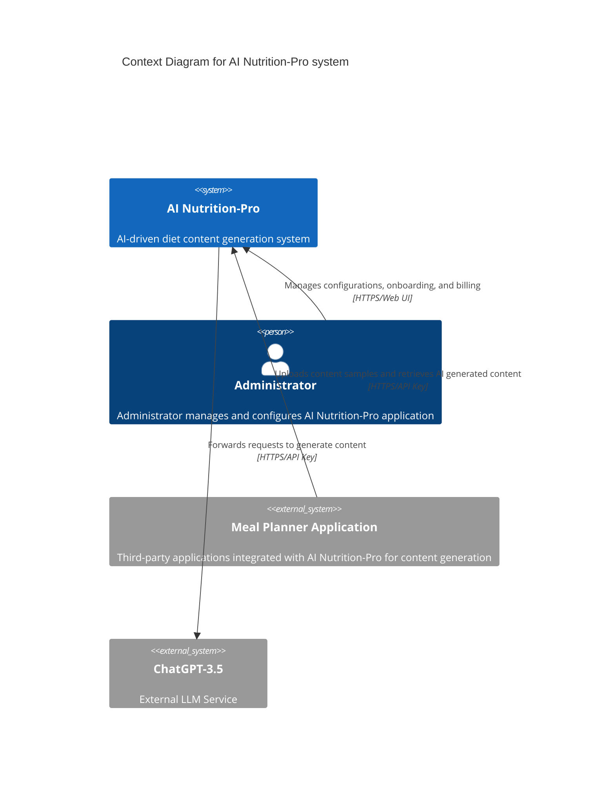
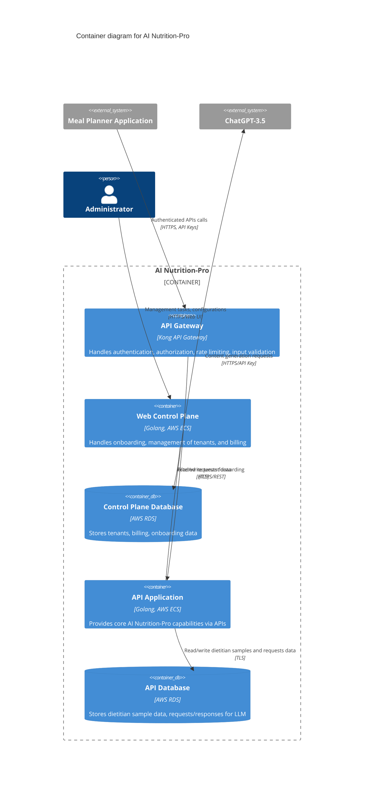
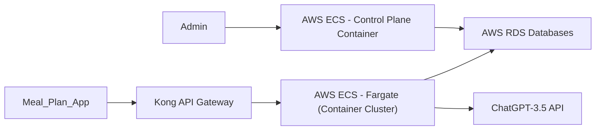

# DESIGN DOCUMENT FOR AI NUTRITION-PRO

## BUSINESS POSTURE

The AI Nutrition-Pro application aims to provide streamlined and intelligent AI-driven content generation for meal planning applications. Utilizing advanced Large Language Models (LLM) such as ChatGPT-3.5, it automates the content generation process traditionally done by qualified dietitians. The primary business goals include:

- Scaling diet content creation for various Meal Planner applications efficiently.
- Reduction of manual content generation overhead.
- Providing a managed platform for onboarding Meal Planner applications.
- Ensuring reliable operation and billing management.
- Offering secure and reliable integration with third-party applications.

### Important Business Risks:

- Dependence on LLM systems availability (ChatGPT services downtimes).
- Mismanagement of clients onboarding and configuration could impact platform reputation.
- Billing errors potentially affecting client trust and revenue.
- Poor content quality due to inadequate input data or model issues.
- Security breaches affecting API keys and sensitive client/tenant data.

## SECURITY POSTURE

### Existing Security Controls:

- security control Authentication: Implemented at API Gateway (Kong), individual API keys for Meal Planner applications.
- security control Authorization: Access Control Lists (ACL) implemented at API Gateway (Kong), enforcing specified action permissions.
- security control Encryption: Network traffic encrypted via TLS between external applications and API Gateway, and between internal elements and databases.

### Accepted Risks:

- accepted risk Dependency risk due to reliance on external ChatGPT APIs for LLM generating functionalities.

### Recommended Security Controls:

- security control Audit Logging and Monitoring: Implement comprehensive logging and monitoring across containers to detect suspicious activities early and perform investigations proactively.
- security control Incident Response Processes: Define and rehearse incident response procedures for security incidents.
- security control Secrets Management: Introduce a secure secrets management solution (e.g., AWS Secrets Manager) for secure storage and rotational management of API keys and database credentials.
- security control Regular Vulnerability Assessments: Schedule automated vulnerability scanning and assessments of all containerized applications.
- security control Data at rest encryption: Databases should enforce encryption at rest using AWS-managed keys (KMS).
- security control Input validation and sanitization: Improved input validation beyond what Kong provides at application code level to avoid injection and content poisoning attacks.

### Security Requirements:

- Authentication:
  - Each Meal Planner application must have securely stored API keys.
  - Administrator role should be authenticated through secure login.
- Authorization:
  - Clearly defined ACL policies within API Gateway to strictly control allowed operations per client.
  - Administrator role responsible for managing roles and permissions.
- Input validation:
  - API Gateway enforces initial input validation.
  - Additional validation implemented at API Application level to sanitize and validate all external inputs.
- Cryptography:
  - Use of TLS encryption for all external and database communications.
  - Database encryption at rest with AWS KMS-managed keys.

## DESIGN

### C4 CONTEXT

| Name                        | Type             | Description                                               | Responsibilities                                      | Security controls                      |
|-----------------------------|------------------|-----------------------------------------------------------|-------------------------------------------------------|----------------------------------------|
| AI Nutrition-Pro            | System           | AI-driven content generation platform                     | Manages AI-generated dietetic content                | Authentication, Authorization, TLS      |
| Meal Planner Application    | External system  | Third-party application                                   | Provides samples and retrieves generated texts       | API Key authentication, TLS            |
| ChatGPT-3.5                 | External system  | External OpenAI LLM API                                   | Processes requests for textual content generation     | API Key authentication, TLS            |
| Administrator               | Person           | System administrator                                      | Configuration, management, operations                 | Secure login (Authentication)          |

### C4 CONTAINER

| Name                       | Type                                     | Description                                               | Responsibilities                                                         | Security controls                                                |
|----------------------------|------------------------------------------|-----------------------------------------------------------|--------------------------------------------------------------------------|------------------------------------------------------------------|
| API Gateway                | Container (Kong)                          | API request gateway                                       | Authentication, authorization, rate limiting, input filtering            | Authentication, Authorization, TLS                               |
| Web Control Plane          | Container (Go, AWS ECS)                   | Management and configuration application                  | Tenant onboarding, configuration, billing data                           | Authentication, Encryption, Input Validation                     |
| Control Plane Database     | ContainerDB (AWS RDS)                     | Stores tenants and billing data                           | Data persistence for Web Control Plane                                   | Encryption at rest, TLS                                          |
| API Application            | Container (Go, AWS ECS)                   | Main logic application                                    | Core AI capabilities, handles requests to LLM-service                    | Input Validation, Encryption, TLS                                |
| API Database               | ContainerDB (AWS RDS)                     | Stores samples, requests, responses                       | Persistence layer for core API Application functionality                 | Encryption at rest, TLS                                          |

### DEPLOYMENT

Currently considered deployment architectures: AWS ECS Fargate (serverless), Kubernetes-based, Traditional EC2 deployment, managed serverless (Lambda functions).
Chosen deployment: AWS ECS (Elastic Container Service) with Fargate (serverless container orchestrator).

| Name                  | Type                      | Description                 | Responsibilities                                 | Security controls                    |
|-----------------------|---------------------------|-----------------------------|--------------------------------------------------|--------------------------------------|
| AWS ECS - Fargate     | Container Orchestration   | Serverless container runner | Running API & Control Plane containers           | IAM permissions, Container security  |
| Kong API Gateway      | Gateway                   | API management gateway      | Gateway control                                  | API Keys, ACL, TLS                   |
| AWS RDS Databases     | Managed Database storage  | Amazon RDS Instances        | Persistent storage                               | Encryption at rest, TLS              |

### BUILD

Repository (GitHub) → Developer Push → GitHub Actions (CI/CD) → SAST & lint checks → Container Build → Secure Artifact Storage (Docker Registry/ ECR) → Deployed to AWS ECS

## RISK ASSESSMENT

- Critical Business Processes: AI-generated diet plan generation, client onboarding, management, and billing
- Data sensitivity: API Keys, client billing data, client tenant and administrator credentials, and proprietary dietitian content samples.

## QUESTIONS & ASSUMPTIONS

- Is there a disaster recovery and backup policy in place?
- Default assumption: modern startup culture and high flexibility are assumed, enabling rapid feature iteration and higher tolerance for minor business risks and agile adoption of recommended security improvements.
