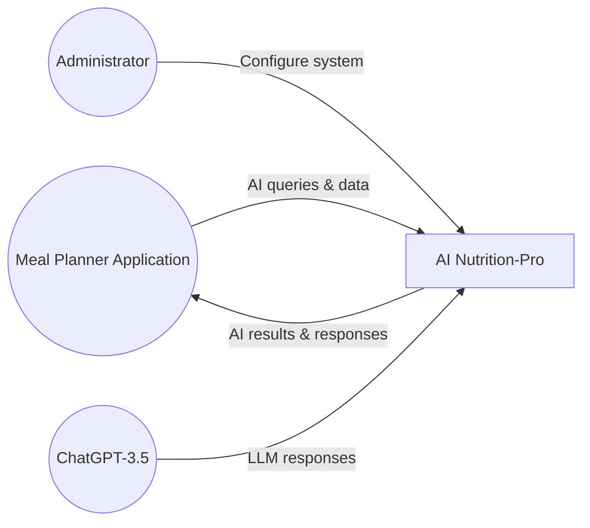
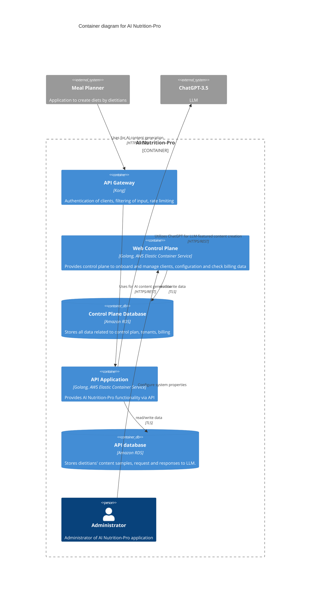
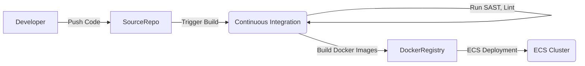

# BUSINESS POSTURE
The AI Nutrition-Pro application aims to provide AI-driven meal planning assistance by leveraging dietitians’ content samples and ChatGPT for content generation. The business priorities and goals include:
- Delivering fast, reliable, and user-friendly AI-based nutrition suggestions to integrated Meal Planner applications.
- Providing a scalable and flexible platform to manage clients, configuration, and billing.
- Enabling administrators to efficiently configure and monitor the system.
- Ensuring integration with external LLM services while maintaining confidentiality and integrity of dietitians’ data.

Key business risks include:
- Disruption of service (e.g., unavailability caused by scaling issues or attacks).
- Inaccurate or inappropriate AI-generated content that might lead to reputational damage or liability concerns.
- Data leakage or unauthorized access to sensitive dietitian or end-user data (e.g., personal dietary information).
- Dependence on third-party LLM provider (ChatGPT) and potential vendor lock-in risks.

# SECURITY POSTURE

## Existing Security Controls
- security control: Authentication with Meal Planner applications using individual API keys. (Implemented in the API Gateway.)
- security control: Authorization of Meal Planner applications using API Gateway ACL rules that allow or deny certain actions. (Implemented in the API Gateway.)
- security control: Encrypted network traffic with TLS between Meal Planner applications and API Gateway. (Described in the architecture sections outlining TLS usage.)

## Accepted Risks
- accepted risk: Reliance on external LLM (ChatGPT) introduces potential vendor exposure of dietitian and meal-planner data.
- accepted risk: Data stored in RDS might potentially be accessed if AWS misconfiguration occurs. Some organizations accept this risk if it is addressed with standard AWS best practices and security policies.

## Recommended Security Controls
- security control: Implement Multi-Factor Authentication (MFA) for administrator login to the Web Control Plane.
- security control: Integrate security scanners (SAST, DAST) in the build pipeline to detect code vulnerabilities and insecure dependencies.
- security control: Implement Web Application Firewall (WAF) rules within or upstream of the API Gateway to further filter malicious input.
- security control: Audit logging and centralized monitoring for all API calls and administrative actions.
- security control: Role-Based Access Control (RBAC) for different types of administrator and system maintenance activities.
- security control: Regular key rotation for API keys used by external Meal Planner applications.

## Security Requirements
- Authentication:
  - API key-based authentication for Meal Planner applications.
  - MFA for administrators in the Web Control Plane.
- Authorization:
  - ACL rules configured in API Gateway.
  - RBAC for granular role management in the Web Control Plane.
- Input Validation:
  - Validate/purify user-provided or externally obtained data (especially content from Meal Planner applications).
  - Limit potential prompt injection risks to ChatGPT by sanitizing data before forwarding.
- Cryptography:
  - TLS for all external and internal communications.
  - Secure key storage for API keys and secrets.

# DESIGN

## C4 CONTEXT


### Context Diagram Table
| Name                           | Type                    | Description                                                                             | Responsibilities                                                                       | Security controls                                                                                       |
| ------------------------------ | ----------------------- | --------------------------------------------------------------------------------------- | --------------------------------------------------------------------------------------- | -------------------------------------------------------------------------------------------------------- |
| Meal Planner Application       | External System         | A web application that integrates AI content generation for dietitians.                 | - Upload samples of dietitians' content <br/> - Fetch AI-generated content and suggestions | API key authentication (API Gateway), TLS                                                                |
| Administrator                  | Internal Person         | Performs system administration for AI Nutrition-Pro.                                    | - Manage server settings <br/> - Resolve system issues  | MFA (recommended), RBAC, TLS for connecting to the Web Control Plane                                     |
| ChatGPT-3.5                    | External System (LLM)   | Third-party large language model used for generating nutrition-related text or advice.  | - Produce AI-generated suggestions based on requests and data from the API              | TLS, requests sanitized before being sent, API key management (to access external LLM)                   |
| AI Nutrition-Pro (Core System) | Internal System (Center)| The overall system providing nutritional AI services and management interfaces.         | - Handle meal planner requests <br/> - Store and retrieve data <br/> - Interact with ChatGPT | TLS, secure configuration, input validation, RBAC, centralized audit logging                             |

## C4 CONTAINER
Below is the container diagram representing AI Nutrition-Pro’s major components and how they communicate:



### Container Diagram Table
| Name                   | Type             | Description                                                                               | Responsibilities                                                                                         | Security controls                                                                                 |
| ---------------------- | ---------------- | ----------------------------------------------------------------------------------------- | -------------------------------------------------------------------------------------------------------- | -------------------------------------------------------------------------------------------------- |
| API Gateway            | Container        | Kong API Gateway                                                                          | - Authentication <br/> - Input filtering <br/> - Rate limiting <br/> - Forwarding requests to backend    | API key authentication, ACL rules, TLS, potential WAF rules                                        |
| Web Control Plane      | Container        | Golang web application, deployed on AWS ECS                                              | - Onboard and manage clients <br/> - System configuration <br/> - Billing data overview                   | TLS, MFA (recommended), RBAC, auditing of admin actions                                           |
| Control Plane Database | Container (DB)   | Amazon RDS database for control plane data                                               | - Store control plane data <br/> - Store tenant information and billing data                             | Encrypted storage at rest (RDS encryption), TLS connections                                        |
| API Application        | Container        | Golang web application, deployed on AWS ECS                                              | - Provides AI-based meal planning functionality via API <br/> - Integrates with ChatGPT                   | TLS, secure logging, input validation, scanning (SAST/DAST recommended)                            |
| API Database           | Container (DB)   | Amazon RDS for storing request/response data and dietitians' content samples             | - Store content samples <br/> - Log requests/responses                                                   | Encrypted storage at rest (RDS encryption), TLS connections                                        |
| Administrator          | Person           | Internal user with privileges to administer AI Nutrition-Pro                             | - Manage system configuration <br/> - Resolve issues                                                      | MFA (recommended), RBAC                                                                            |
| Meal Planner (External)| External System  | Web application integrating with AI Nutrition-Pro                                        | - Upload dietitians' content <br/> - Fetch AI-generated content                                           | API key authentication, TLS                                                                        |
| ChatGPT-3.5            | External System  | Third-party LLM service                                                                  | - Provide AI-generated responses                                                                          | TLS, API key management                                                                            |

## DEPLOYMENT
AI Nutrition-Pro can be deployed in multiple ways, including on-premises or in a fully managed cloud environment. Here we focus on AWS ECS (Elastic Container Service) with Amazon RDS for database storage.

Possible Deployment Approaches:
- Docker containers on AWS ECS, with AWS RDS for relational data.
- Kubernetes deployment on AWS EKS.
- On-prem Docker orchestration with local or managed databases.

Chosen Deployment Approach (AWS ECS with RDS):
```mermaid
flowchart LR
    A[User / Meal Planner] -->|HTTPS| B(API Gateway)
    B(API Gateway) -->|Forward Requests| C(API Application)
    C(API Application) -->|TLS| D[API Database (RDS)]
    E[Web Control Plane] -->|TLS| F[Control Plane Database (RDS)]
    C(API Application) -->|HTTPS| G[ChatGPT-3.5]

    subgraph AWS ECS
    B(API Gateway)
    C(API Application)
    E[Web Control Plane]
    end
    subgraph AWS RDS
    D[API Database (RDS)]
    F[Control Plane Database (RDS)]
    end
    G[ChatGPT-3.5]
```

### Deployment Diagram Table
| Name                      | Type                   | Description                                                                           | Responsibilities                                                                                       | Security controls                                                                                   |
| ------------------------- | ---------------------- | ------------------------------------------------------------------------------------- | ------------------------------------------------------------------------------------------------------ | ---------------------------------------------------------------------------------------------------- |
| API Gateway (ECS)         | AWS ECS Service        | Kong Gateway container running on ECS instances                                       | - Routes requests from Meal Planner to the API Application <br/> - Provides authentication, ACL, etc.  | TLS in-transit, Amazon VPC security groups, WAF integration (recommended)                           |
| API Application (ECS)     | AWS ECS Service        | Containers running Golang-based AI Nutrition-Pro backend                              | - Process requests <br/> - Integrate with ChatGPT <br/> - Query/store data in API DB                   | TLS in-transit, locked-down security groups, AWS IAM roles, scanning (recommended)                 |
| Web Control Plane (ECS)   | AWS ECS Service        | Deployment of Golang-based administration and configuration interface                 | - Provides management interface for administrators <br/> - Interacts with the Control Plane Database   | TLS in-transit, IAM-based access, possible MFA enforcement, scanning (recommended)                 |
| API Database (RDS)        | AWS RDS Instance       | Relational database storing API requests/responses and diet content                   | - Maintain consistent data for the API Application                                                    | Encryption at rest, TLS in-transit, AWS security best practices                                     |
| Control Plane Database    | AWS RDS Instance       | Relational database storing tenant, billing, and control plane data                   | - Maintain data for the Web Control Plane                                                              | Encryption at rest, TLS in-transit, AWS security best practices                                     |
| ChatGPT-3.5               | External Service (LLM) | OpenAI LLM service used for generating diet content                                   | - Respond to requests with AI-generated text, based on user inputs                                     | TLS, secret management for API keys                                                                 |
| Meal Planner              | External System        | Consumer-facing web application that interacts with AI Nutrition-Pro                  | - Sends content samples, requests AI-based suggestions                                                 | TLS, API key authentication                                                                         |

## BUILD
The project uses Docker-based microservices built on Golang. The diagram below illustrates a possible pipeline for building and publishing AI Nutrition-Pro:



Build Process Steps:
- Developer writes code in Golang (including unit tests).
- Code is pushed to a source repository (e.g., GitHub or AWS CodeCommit).
- A CI pipeline (e.g., GitHub Actions, Jenkins, or AWS CodePipeline) is triggered:
  - SAST and static linting checks are performed.
  - Docker images are built and scanned for known vulnerabilities (container image scanning).
  - The images are pushed to a container registry (e.g., Docker Hub, ECR).
- A deployment pipeline (CD) releases the new images to AWS ECS.

Security Controls in Build Process:
- Source code scanning (SAST).
- Container image scanning for vulnerabilities.
- Automated tests to validate input handling and logic.
- Access control on source repository and build environment.
- Signed container images (recommended for supply chain security).

# RISK ASSESSMENT

- Critical Business Processes to Protect:
  - Generating AI-based nutrition guidance and content for dietitians.
  - Maintaining accurate billing and client/tenant data.
  - Ensuring availability for integrated Meal Planner applications.

- Data to Protect and Their Sensitivity:
  - Dietitian content samples and meal plan data (Potentially sensitive privacy data).
  - Request and response logs stored in the API Database (Possibility of containing personal dietary information).
  - Tenant and billing information (Confidential business data).

# QUESTIONS & ASSUMPTIONS

1. What is the level of acceptable risk regarding potential data exposure through ChatGPT?
   - Assumption: ChatGPT usage follows OpenAI’s compliance guidelines and no highly sensitive information is passed unless anonymized.

2. How often are API keys rotated for external Meal Planner applications?
   - Assumption: API key rotation is done periodically (e.g., every 90 days) and enforced through policy controls in the API Gateway.

3. How do we handle user concurrency limits or scaling events in AI Nutrition-Pro if requests spike?
   - Assumption: AWS ECS Fargate or EC2-based autoscaling is in place to handle usage surges.

4. Are there any business continuity or disaster recovery SLAs?
   - Assumption: Regular backups of RDS databases and minimal RTO/RPO are enforced.

5. Is MFA enforced at the AWS IAM level for administrators?
   - Assumption: Yes, it is enforced for all privileged IAM users.

6. How is ChatGPT billing managed and monitored?
   - Assumption: Billing data for ChatGPT usage is collected and monitored by the Web Control Plane for cost transparency.

These questions and assumptions guide future threat modeling and solution refinement.
