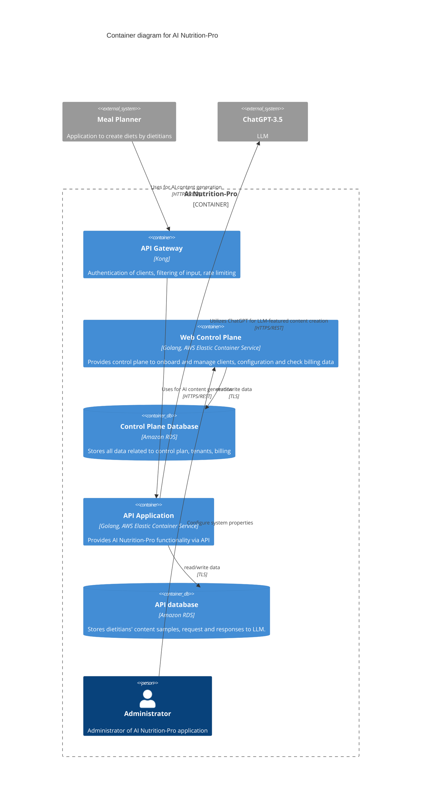
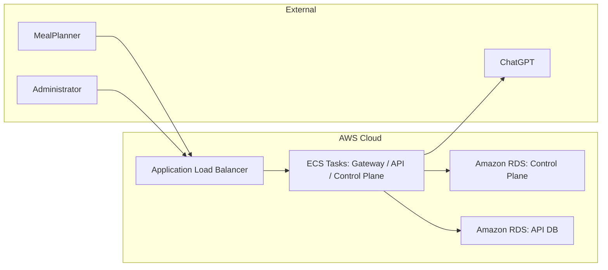
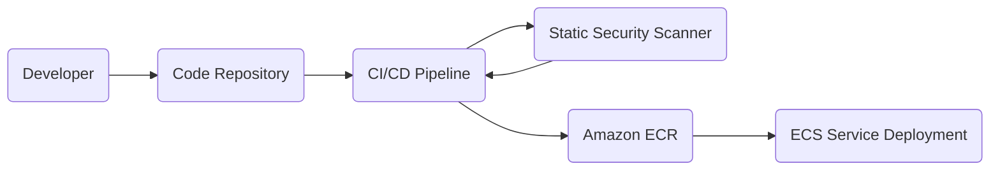

# BUSINESS POSTURE

- AI Nutrition-Pro aims to provide advanced AI-based nutrition content generation for Meal Planner applications.
- The primary goal is to generate revenue by integrating with multiple Meal Planner applications, offering them automated, high-quality dietary content.
- A secondary goal is to sustain a positive reputation by securely handling sensitive data (dietitian content, personal health data if any).
- The business strategy includes ensuring scalability to handle potentially high volumes of requests.
- Key business risks include potential reputational damage in the event of data breaches, compliance risks if sensitive health data is mishandled, scalability issues leading to service degradation, and cost overruns from external API usage (ChatGPT-3.5).

# SECURITY POSTURE

Existing security controls (from the file)
- security control: Authentication with Meal Planner applications via individual API keys.
- security control: Authorization of Meal Planner applications using ACL rules at the API Gateway.
- security control: Encrypted network traffic via TLS between Meal Planner and API Gateway as well as between internal components.

Accepted risks
- accepted risk: Reliance on OpenAI’s ChatGPT-3.5 for content generation, which may introduce external dependencies and potential data exposure if not configured properly.
- accepted risk: Data at rest in the database (if not encrypted) could be disclosed if the underlying infrastructure is compromised.

Recommended security controls (high priority, not explicitly mentioned in the file)
- security control: Implement a Web Application Firewall (WAF) in front of the API Gateway to help prevent common web vulnerabilities (SQL injection, XSS, etc.).
- security control: Perform input validation at the API Application layer (backend_api) to mitigate injection and malformed data risks.
- security control: Ensure encryption at rest for database instances (e.g., AWS RDS encryption).
- security control: Establish secrets management (e.g., AWS Secrets Manager or HashiCorp Vault) for API keys and database credentials.
- security control: Implement monitoring and logging (with real-time alerting) for anomaly detection and possible intrusion attempts.

Security requirements
- Authentication: The solution must authenticate every request from Meal Planner applications using unique API keys or other strong credential methods (e.g., JWT).
- Authorization: Fine-grained authorization rules managed centrally by the API Gateway and enforced by the backend services.
- Input validation: All inputs must be verified at both the API Gateway (where applicable) and the backend API to filter out malicious content.
- Cryptography:
  - All traffic in transit must be encrypted with TLS.
  - Data at rest in databases should be encrypted with AES-256 (or equivalent).
  - External API keys and secrets must be stored securely.

# DESIGN

## C4 CONTEXT

```mermaid
flowchart LR
    A(Administrator)
    B(Meal Planner)
    C(ChatGPT-3.5)

    D[AI Nutrition-Pro]

    A --> D : Management & Configuration
    B --> D : API Requests (Content Generation)
    D --> C : LLM Feature Integration
```

### Context Diagram Elements

| Name             | Type         | Description                                                                 | Responsibilities                                                                                   | Security controls                                                                  |
|------------------|-------------|-----------------------------------------------------------------------------|----------------------------------------------------------------------------------------------------|-------------------------------------------------------------------------------------|
| Administrator    | Person       | The internal user who manages AI Nutrition-Pro settings and deployments.    | Configures system properties. Tracks system health and manages user/tenant onboarding.             | Uses strong authentication and role-based access controls in the Web Control Plane. |
| Meal Planner     | External App | One or more third-party meal planner applications that consume the AI API.  | Sends requests with dietitians' content samples, retrieves AI-generated nutrition plans.           | Must use API keys for authentication and enforced ACL rules at the API Gateway.    |
| ChatGPT-3.5      | External API | The OpenAI LLM used to generate nutrition-related text content.             | Provides language-based nutritional guidance and diet intros upon request.                          | Communication over TLS, usage of secure API tokens if required.                     |
| AI Nutrition-Pro | System       | The main system. Combines Web Control Plane, API Gateway, API Application.  | Core logic. Manages data, orchestrates requests to ChatGPT, and provides back-end functionalities. | TLS for in-transit data, access control via API Gateway, encryption at rest.        |

## C4 CONTAINER



### Container Diagram Elements

| Name                | Type            | Description                                                                                                    | Responsibilities                                                                                | Security controls                                                                                                                      |
|---------------------|----------------|----------------------------------------------------------------------------------------------------------------|------------------------------------------------------------------------------------------------|-----------------------------------------------------------------------------------------------------------------------------------------|
| API Gateway         | Container       | Kong API Gateway, handles inbound requests from Meal Planner apps.                                             | - Authenticates clients  <br/> - Performs rate limiting  <br/> - Filters input                   | - security control: API key authentication  <br/> - filtered input checks  <br/> - recommended WAF integration                            |
| Web Control Plane   | Container       | Golang-based web application running on AWS ECS.                                                               | - Onboards and manages new clients  <br/> - Configures billing details  <br/> - Admin UI        | - security control: role-based access for administrators  <br/> - encryption at rest in DB  <br/> - secure session management          |
| Control Plane DB    | Container (DB)  | Amazon RDS instance that stores control plane data (clients, billing, configurations).                          | - Persists all administrative and billing data  <br/> - Maintains tenant-related information    | - security control: RDS encryption  <br/> - access restricted to Web Control Plane only  <br/> - TLS in transit                         |
| API Application     | Container       | Golang-based microservice on AWS ECS that handles logic for AI nutrition functionality.                         | - Receives requests from API Gateway  <br/> - Invokes ChatGPT for AI text generation            | - security control: TLS-based calls from API Gateway  <br/> - recommended input validation  <br/> - recommended logs & monitoring      |
| API Database        | Container (DB)  | Amazon RDS instance used by the API Application to store dietitian content samples, requests, and responses.   | - Stores and retrieves content required for AI generation  <br/> - Maintains data for analytics | - security control: RDS encryption  <br/> - limited access only from API Application  <br/> - TLS in transit                            |
| Administrator       | Person          | Internal person who manages AI Nutrition-Pro system administration.                                            | - Configures system properties  <br/> - Manages environment variables and secrets               | - security control: dedicated IAM roles in AWS  <br/> - enforced multi-factor authentication (MFA)                                      |

## DEPLOYMENT

Possible deployment solutions:
- AWS ECS Fargate for container orchestration
- AWS EKS (Kubernetes) or on-premises orchestrations
- Traditional VMs hosting Docker containers

Chosen deployment in detail (AWS ECS):
- Services are defined as ECS tasks, each running in its own container environment.
- Databases run on Amazon RDS with encryption at rest.
- Networking is handled via Application Load Balancer in front of the API Gateway.
- ChatGPT is accessed over public internet with secured TLS endpoints.

Example deployment diagram:



### Deployment Diagram Elements

| Name                | Type           | Description                                                                                             | Responsibilities                                                     | Security controls                                                                                                              |
|---------------------|---------------|---------------------------------------------------------------------------------------------------------|-----------------------------------------------------------------------|---------------------------------------------------------------------------------------------------------------------------------|
| AWS Cloud           | Infrastructure | The environment hosting ECS, ALB, and RDS instances.                                                    | Runs the entire AI Nutrition-Pro platform.                           | - security control: VPC isolation  <br/> - security control: Security groups, NACLS                                             |
| Application LB      | Load Balancer  | AWS Application Load Balancer that routes traffic to ECS tasks.                                         | Directs inbound requests from external users and administrators.      | - security control: TLS termination with HTTPS only  <br/> - recommended WAF integration                                       |
| ECS Tasks: Gateway / API / Control Plane | Deployment Units | Docker containers running Kong (API Gateway), Web Control Plane, and API Application on Fargate. | Provide main functionality: gateway, control plane, and business logic. | - security control: restricted IAM roles for ECS tasks  <br/> - recommended SAST/DAST scanning of container images             |
| Amazon RDS: Control Plane            | Database        | Database instance for storing client, configuration, and billing data.                                  | Persists operational data for the control plane components.          | - security control: encryption at rest  <br/> - TLS in transit                                                                 |
| Amazon RDS: API DB                  | Database        | Database instance for storing requests, responses, and nutrition content.                               | Persists business logic data for the backend APIs.                    | - security control: encryption at rest  <br/> - TLS in transit                                                                 |
| ChatGPT                             | External System | OpenAI’s LLM endpoint.                                                                                  | Generates text responses based on prompts and samples.               | - security control: secure environment variables for API keys  <br/> - TLS in transit                                          |

## BUILD

AI Nutrition-Pro uses a CI/CD pipeline to automate build and deployment:

1. Developers commit code to a code repository (e.g., GitHub).
2. The build system (e.g., GitHub Actions) is triggered.
3. Automated pipelines run unit tests, static application security testing (SAST), and linters.
4. Upon success, Docker images are built and pushed to a container registry (e.g., Amazon ECR).
5. ECS is updated with the new container images for each service (API Gateway, Web Control Plane, API Application).

Example build process diagram:



Security controls of the build process:
- Automated SAST scanning to detect potential vulnerabilities in code.
- Automated linting and code testing.
- Dependency scanning for known vulnerabilities.
- Signing of Docker images before pushing to the registry.
- Role-based access for pipeline stages to avoid tampering.

# RISK ASSESSMENT

What are the critical business processes we are trying to protect?
- Onboarding and billing for new clients (ensuring accurate invoicing and revenue protection).
- Generation and handling of nutrition data (ensuring content integrity and data privacy).

What data are we trying to protect, and what is their sensitivity?
- Client billing and account information: confidentiality must be maintained to protect financial data.
- Dietitian content samples and AI-generated responses: might contain sensitive health-related content.
- Access credentials and API keys: high sensitivity to prevent unauthorized system access.

# QUESTIONS & ASSUMPTIONS

Questions:
1. Are there any regulatory or compliance requirements (e.g., HIPAA) for storing or processing dietitian content?
2. Do Meal Planner applications share personally identifiable health information (PII/PHI)?
3. How is usage of ChatGPT-3.5 billed and monitored to control costs?
4. Is a Web Application Firewall already part of the AWS stack or must it be newly implemented?

Assumptions:
1. TLS is enforced on all public endpoints and internal traffic where possible.
2. ChatGPT-3.5 usage is governed by OpenAI’s standard agreements and usage policies.
3. API Gateway (Kong) will remain the single ingress point for external requests.
4. RDS instances will be encrypted by default, with limited inbound connectivity via security groups.
