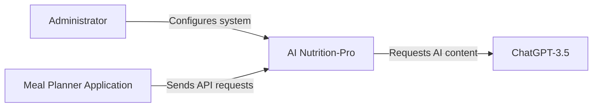
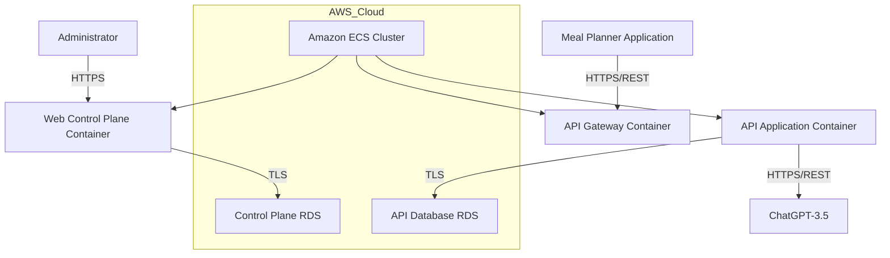
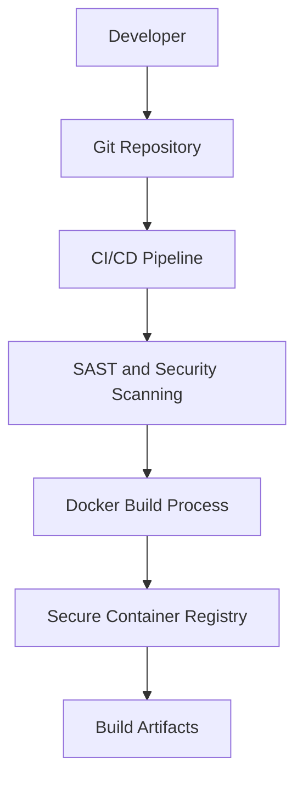

# BUSINESS POSTURE

The AI Nutrition-Pro project is intended to provide an AI-driven nutrition content service for partner Meal Planner applications. The project supports client onboarding, configuration management, billing, and content generation via an API backed by a scalable containerized architecture. The solution enables rapid client integration, operational agility, and market expansion by leveraging cutting-edge AI services while ensuring reliability and high performance.

Business priorities and goals:
- Deliver timely and accurate AI-generated nutrition content to Meal Planner applications.
- Ensure smooth client onboarding, configuration management, and billing tracking via an intuitive Web Control Plane.
- Scale the solution securely using containerized infrastructure on AWS.
- Leverage external AI technology (ChatGPT-3.5) to enhance content generation capabilities.
- Maintain high availability, performance, and operational resilience to support market competitiveness.

Most important business risks:
- Service downtime or degraded performance affecting client satisfaction and revenue.
- Unauthorized access or compromise of client configuration, billing data, or sensitive nutrition content.
- Potential misuse or compromise of API keys by external Meal Planner applications.
- Dependency on external LLM (ChatGPT-3.5) creating third‐party risk for content generation.

# SECURITY POSTURE

Existing security controls and accepted risks:
- security control: API Gateway handles client authentication; described in the API Gateway (Kong) container.
- security control: API Gateway enforces authorization with ACL rules; implemented as part of API Gateway configuration.
- security control: Encrypted network traffic using TLS between Meal Planner applications and API Gateway as well as between containers and databases.
- accepted risk: The risk of API key compromise is acknowledged and mitigated via rate limiting, but remains an inherent threat.

Recommended security controls to implement:
- security control: Strict input validation on all endpoints; to be implemented in the API Gateway and within the application code.
- security control: Implementation of logging, monitoring, and intrusion detection for all critical components; to be integrated with AWS CloudWatch and SIEM tools.
- security control: Multi-factor authentication for administrative access in the Web Control Plane.
- security control: Regular vulnerability scanning (SAST, DAST) and container image scanning in the CI/CD pipeline.
- security control: Automated certificate management and key rotation; to be enforced at both application and database levels.

Security requirements:
- Authentication: All components must enforce token-based or API key-based authentication. The API Gateway is responsible for enforcing authentication for external requests.
- Authorization: Implement granular access control lists and role-based access for internal administrative users and external Meal Planner applications.
- Input Validation: Validate and sanitize all incoming data at the API Gateway and within the application layers to thwart injection and other input-based attacks.
- Cryptography: Enforce data encryption both at rest (for RDS databases) and in transit (using TLS). Ensure proper certificate management and key rotation procedures.

# DESIGN

## C4 CONTEXT

Below is the project context diagram showing AI Nutrition-Pro as the central system interacting with external systems and actors.



Table: C4 CONTEXT Elements

| Name                     | Type              | Description                                                         | Responsibilities                                                                | Security Controls                                                        |
|--------------------------|-------------------|---------------------------------------------------------------------|---------------------------------------------------------------------------------|-------------------------------------------------------------------------|
| AI Nutrition-Pro         | Project/System    | Central system providing AI-generated nutrition content             | Process API requests, manage control plane operations, integrate with ChatGPT-3.5 | Enforces API security via API Gateway; internal encryption on data flows |
| Administrator            | Person            | Internal user managing configuration and operational aspects         | Configure system properties and manage onboarding and billing data              | Access controlled via MFA and RBAC                                      |
| Meal Planner Application | External System   | Partner application connecting via HTTPS/REST                       | Upload dietitian content samples; retrieve AI-generated nutrition content      | Authenticated via API keys; communication secured with TLS              |
| ChatGPT-3.5              | External System   | External LLM service for generating AI content                        | Generate content based on provided data                                         | Communication secured via HTTPS/REST protocols                          |

## C4 CONTAINER

The container diagram below provides a high-level view of the internal architecture and shows how responsibilities are distributed.

```mermaid
flowchart TD
    subgraph AI_Nutrition_Pro
        api_gateway[API Gateway (Kong)]
        control_plane[Web Control Plane (Golang on AWS ECS)]
        control_db[Control Plane Database (Amazon RDS)]
        backend_api[API Application (Golang on AWS ECS)]
        api_db[API Database (Amazon RDS)]
    end

    admin[Administrator] --> control_plane
    meal[Meal Planner Application] --> api_gateway
    api_gateway --> backend_api
    control_plane --> control_db
    backend_api --> api_db
    backend_api -->|Calls AI service| chatgpt[ChatGPT-3.5]
```

Table: C4 CONTAINER Elements

| Name                     | Type                | Description                                                                      | Responsibilities                                                                                      | Security Controls                                                                                          |
|--------------------------|---------------------|----------------------------------------------------------------------------------|-------------------------------------------------------------------------------------------------------|-----------------------------------------------------------------------------------------------------------|
| API Gateway              | Container/System    | Kong-based API Gateway acting as entry point for external requests               | Authentication, rate limiting, and input filtering for incoming requests                              | Enforces TLS encryption; implements API key authentication and ACL rules                                  |
| Web Control Plane        | Container/System    | Golang-based web application deployed on AWS ECS for client management           | Onboard clients, manage configuration, monitor billing data                                           | Secured with MFA for administrative access; communicates with Control Plane Database via TLS                |
| Control Plane Database   | Container/Database  | Amazon RDS instance storing client, tenant, and billing data                     | Persist control and configuration data                                                                | Data encryption at rest and in transit; access controlled via network security groups                     |
| API Application          | Container/System    | Golang-based API application deployed on AWS ECS providing nutrition APIs        | Process AI nutrition requests and interact with ChatGPT-3.5                                            | Secured communication with API Gateway; enforces input validation and carries out internal authorization    |
| API Database             | Container/Database  | Amazon RDS instance storing dietitian content samples, LLM requests and responses  | Persist API-related data including dietitian samples and generated nutrition content                  | Data encrypted at rest and in transit; access restricted through secure network channels                   |
| ChatGPT-3.5              | External System     | External LLM service used for AI content generation                              | Generate AI nutrition content based on input from the API Application                                  | Communication occurs over secure HTTPS/REST connections                                                   |

## DEPLOYMENT

The project is deployed in a multi-tier AWS environment. Containers are orchestrated via AWS Elastic Container Service (ECS) while data is stored in Amazon RDS. The API Gateway is exposed over the internet, with all external communication secured via TLS. The deployment is designed for high availability and scalability.

Below is a deployment diagram that illustrates the AWS deployment architecture.



Table: DEPLOYMENT Elements

| Name                          | Type                | Description                                                                      | Responsibilities                                                                         | Security Controls                                                    |
|-------------------------------|---------------------|----------------------------------------------------------------------------------|------------------------------------------------------------------------------------------|---------------------------------------------------------------------|
| Amazon ECS Cluster            | Infrastructure      | AWS-managed container orchestration service                                      | Hosts all containerized components (API Gateway, Web Control Plane, API Application)      | Managed with AWS security best practices; integrated with VPC controls|
| API Gateway Container         | Container/System    | Kong-based container exposing API endpoints for external access                  | Authenticate and filter external API requests                                             | Enforces TLS; implements API key authentication and ACL rules       |
| Web Control Plane Container   | Container/System    | Web application container enabling client onboarding, configuration, billing     | Manage system configuration and client management                                          | Secured via HTTPS and MFA; communicates over TLS with backend databases|
| API Application Container     | Container/System    | Backend container that processes AI nutrition requests and integrates with LLM     | Provide AI-based content generation and data processing                                    | Secure communication with API Gateway and databases; input validation |
| Control Plane Database (Amazon RDS) | Database      | Managed relational database storing configuration and billing data               | Persist control plane data                                                                 | Data encrypted at rest; access controlled by VPC and TLS encryption     |
| API Database (Amazon RDS)     | Database            | Managed relational database storing dietitian samples and AI request/response logs | Persist API-related data                                                                   | Data encryption at rest; secured communication with API Application   |
| Administrator                 | External Actor      | Internal user managing deployments and configurations                            | Configure and maintain system operations                                                   | Access managed via secure authentication methods                     |
| Meal Planner Application      | External System     | Partner application integrating with AI Nutrition-Pro via REST APIs              | Upload content samples; retrieve AI-generated nutrition information                        | Uses API keys; communication secured via TLS                         |
| ChatGPT-3.5                   | External System     | External LLM service used for generating AI nutrition content                    | Generate AI content based on requests from the API Application                              | Communication secured via HTTPS/REST                                  |

## BUILD

The build process for AI Nutrition-Pro is automated using a CI/CD pipeline running in a secure environment (e.g. GitHub Workflows or Jenkins). Developers commit code changes to a centrally managed Git repository. On commit, automated triggers initiate a series of security checks such as static code analysis (SAST), dependency scanning, and container image vulnerability assessments. Once the code passes security and quality gates, Docker images are built and signed, then pushed to a secure container registry.

Below is the build process flow diagram:



Security controls for the build process:
- Code repositories use branch protection and require peer reviews.
- The CI/CD pipeline enforces security scans (SAST, dependency analysis, container image scanning).
- Build artifacts are digitally signed and stored in a secured registry.
- Supply chain integrity is maintained through automated and reproducible build processes.

# RISK ASSESSMENT

Critical business processes to protect:
- Client onboarding, system configuration, and billing managed via the Web Control Plane.
- The API Application process that handles incoming requests and integrates with the AI content generation service.
- End-to-end processing of AI nutrition content from receiving requests to delivering outputs.

Data to protect and sensitivity:
- Client and tenant configuration data including billing information (high sensitivity).
- Dietitian content samples and AI-generated nutrition responses stored in the API Database (moderate sensitivity; proprietary and business-critical).
- Administrative access credentials and API keys that grant access to the system (high sensitivity).

# QUESTIONS & ASSUMPTIONS

Questions:
- How are API keys issued, managed, and revoked for Meal Planner applications?
- What is the strategy for managing TLS certificates and ensuring up-to-date encryption standards?
- Are there any plans to incorporate additional external services or LLMs beyond ChatGPT-3.5?
- How is logging and monitoring implemented across all containers and components?
- What is the incident response plan in case of a security breach or system failure?

Assumptions:
- The system is deployed on AWS using ECS for container orchestration and Amazon RDS for data storage.
- API communication is secured using TLS and external requests are authenticated via API keys managed by the API Gateway.
- The build process incorporates automated security checks and artifact signing to mitigate supply chain risks.
- Administrative access is limited and secured via multi-factor authentication and role-based access control.
- The design assumes that external systems (Meal Planner applications and ChatGPT-3.5) adhere to secure communication practices via HTTPS and REST APIs.
