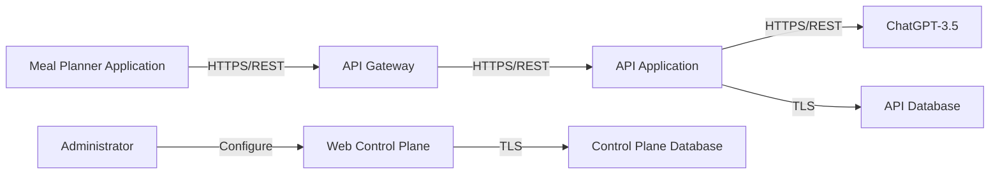
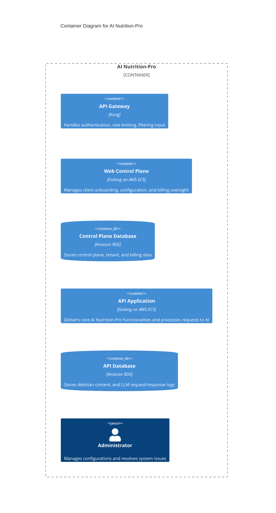
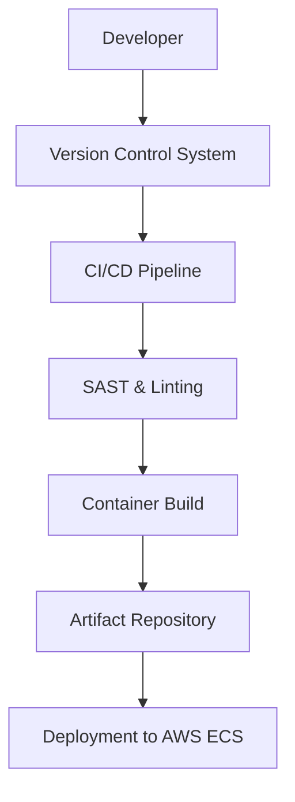

# BUSINESS POSTURE

The AI Nutrition-Pro application is designed to empower dietitians and meal planning services by providing robust, AI-powered nutrition content generation. It enables external applications—such as Meal Planner solutions—to integrate and leverage its capabilities for creating personalized diet recommendations and content. Business priorities include:

• Delivering reliable, scalable, and secure API services that integrate seamlessly with external systems.
• Empowering administrators with a control plane to manage client configurations, tenant onboarding, and billing data.
• Enabling AI-assisted content generation that leverages external LLM services (ChatGPT-3.5) with high availability.

The most important business risks to address are:

• Unauthorized access or misuse of sensitive tenant and billing data.
• Disruption of the AI content generation process due to integration or service outages (e.g., failure of ChatGPT-3.5 connectivity).
• Data integrity issues arising from unvalidated input or API misuse.
• Potential breaches through vulnerabilities in any of the containerized services or their build/deployment pipelines.

# SECURITY POSTURE

**Existing security controls (inherited from the FILE):**
• security control: Authentication is implemented through API keys at the API Gateway.
• security control: Authorization is enforced via ACL rules in the API Gateway.
• security control: Encrypted network traffic using TLS is required between Meal Planner applications and the API Gateway.

**Accepted risks:**
• accepted risk: Relying solely on API key authentication for external systems which might be susceptible to key compromise if not rotated or managed properly.

**Recommended security controls:**
• security control: Implement input validation at both the API Gateway and within the API Application to mitigate injection and malformed data risks.
• security control: Enhance monitoring and logging across all components for detection and analysis of suspicious activities.
• security control: Introduce periodic vulnerability scanning and automated SAST scans integrated into the CI/CD pipeline.
• security control: Consider multi-factor authentication (MFA) for administrative access on the Web Control Plane.
• security control: Enforce code signing and dependency integrity checks to secure the software supply chain.

**Security requirements:**
• Authentication: Enforce robust API key validation and consider integrating additional identity providers for administrative portals.
• Authorization: Use role-based access control (RBAC) mechanisms within both the API and control plane systems.
• Input validation: Apply stringent input sanitization and validation at all API endpoints and gateways.
• Cryptography: Use state-of-the-art TLS for data in transit, and ensure all databases use encryption at rest with proper key management.

For each control, note that:
– The API Gateway (Kong) handles authentication, rate limiting, and ACL-based authorization.
– The Web Control Plane implements administrative access controls and configuration management.
– Database communications (Amazon RDS instances) enforce TLS and data encryption.

# DESIGN

## C4 CONTEXT



| Name                      | Type             | Description                                               | Responsibilities                                                                               | Security Controls                                            |
|---------------------------|------------------|-----------------------------------------------------------|-----------------------------------------------------------------------------------------------|--------------------------------------------------------------|
| Meal Planner Application  | External system  | Application for creating diets by dietitians              | Upload dietitian content samples and fetch AI-generated nutrition/diet results                | API key authentication; encrypted HTTPS communication       |
| API Gateway               | Internal system  | Kong API Gateway                                          | Authenticate clients, apply rate limiting, and filter inputs                                  | API key authentication; ACL rules; TLS encryption             |
| API Application           | Internal system  | Backend service offering AI Nutrition-Pro functionality   | Process AI content generation requests and interact with external LLM (ChatGPT-3.5) and databases | Secure API endpoints; input validation; TLS encryption        |
| Web Control Plane         | Internal system  | Administrative interface for managing clients and billing | Handle client onboarding, configuration management, and billing data retrieval                | Role-based access control; secure session management; logging   |
| Control Plane Database    | Internal database| Amazon RDS storing control plane data                     | Persist tenant configurations, billing information, and administrative data                   | TLS in transit; encryption at rest                            |
| API Database              | Internal database| Amazon RDS storing API application data                   | Persist dietitian content samples, and log LLM requests and responses                          | TLS in transit; encryption at rest                            |
| ChatGPT-3.5               | External system  | External LLM service for content generation               | Generate AI-driven content based on provided dietitian samples                                | Secure HTTPS communication                                  |

## C4 CONTAINER



| Name                   | Type               | Description                                                       | Responsibilities                                                                               | Security Controls                                              |
|------------------------|--------------------|-------------------------------------------------------------------|-----------------------------------------------------------------------------------------------|----------------------------------------------------------------|
| API Gateway            | Container          | Kong deployment acting as the API gateway                         | Authenticate requests; enforce rate limits; filter inputs                                      | API key validation; ACL enforcement; TLS encryption             |
| Web Control Plane      | Container          | Golang-based control panel running on AWS ECS                       | Manage client onboarding, configuration, and billing                                          | Role-based access control; secure session management; logging     |
| Control Plane Database | Container/Database | Amazon RDS instance holding control plane data                      | Persist tenant configurations and billing information                                          | TLS for data in transit; encryption at rest                      |
| API Application        | Container          | Golang-based backend API deployed on AWS ECS                        | Provide core AI functionalities; process requests and interact with external LLM services        | Secure API development; input validation; TLS; logging            |
| API Database           | Container/Database | Amazon RDS instance for storing API application data                | Persist dietitian content and LLM interaction logs                                             | TLS for data in transit; encryption at rest                      |
| Administrator          | Person             | Administrative user for the system                                  | Configure system properties; resolve technical issues                                           | Secure admin access controls; MFA                               |

## DEPLOYMENT

The deployment strategy leverages a cloud-native architecture using AWS. Core components are containerized and orchestrated via AWS Elastic Container Service (ECS), while data persistence is managed by Amazon RDS instances. Kong is deployed as the API gateway, ensuring secure, managed access to the services with TLS encryption. External integrations (Meal Planner Application and ChatGPT-3.5) are accessed over secured HTTPS connections.

```mermaid
graph TD
    subgraph AWS Cloud
        ECS[Container Host (AWS ECS)]
        Kong[API Gateway (Kong)]
        ControlPlane[Web Control Plane Container]
        APIApp[API Application Container]
        RDS1[Control Plane Database (Amazon RDS)]
        RDS2[API Database (Amazon RDS)]
    end
    MealApp[Meal Planner Application]
    ChatGPT[ChatGPT-3.5]
    MealApp -->|HTTPS| Kong
    Kong -->|HTTPS| APIApp
    ChatGPT -->|HTTPS| APIApp
    ControlPlane -->|TLS| RDS1
    APIApp -->|TLS| RDS2
```

| Name                      | Type            | Description                                                        | Responsibilities                                                                                 | Security Controls                                           |
|---------------------------|-----------------|--------------------------------------------------------------------|-------------------------------------------------------------------------------------------------|-------------------------------------------------------------|
| Container Host (AWS ECS)  | Infrastructure  | AWS ECS cluster hosting containerized applications                 | Orchestrate container deployment and scaling; enforce network and isolation policies             | AWS security groups; VPC isolation; TLS enforcement          |
| API Gateway (Kong)        | Container/Service| Kong API Gateway for managing and securing API traffic              | Authenticate and filter external requests; apply rate limiting                                 | API key validation; ACL rules; TLS encryption                |
| Web Control Plane         | Container       | Golang based control panel deployed on AWS ECS                        | Manage client onboarding, configuration, and billing oversight                                  | Role-based access control; secure communication; logging       |
| API Application         | Container       | Core API service implementing AI-powered nutrition functionalities     | Process AI requests; interact with ChatGPT-3.5 and databases                                      | Input validation; TLS encrypted communication; audit logging   |
| Control Plane Database    | Database        | Amazon RDS instance for control plane data                           | Store tenant configurations, billing, and administrative data                                   | TLS in transit; encryption at rest                           |
| API Database              | Database        | Amazon RDS instance for API data                                      | Store dietitian content and LLM communication logs                                               | TLS in transit; encryption at rest                           |

## BUILD

The AI Nutrition-Pro build process integrates a CI/CD pipeline focused on security and quality assurance. Developers push code changes to the version control system (e.g., GitHub), which triggers automated builds. The CI/CD pipeline performs static analysis (SAST) and linter checks, runs dependency vulnerability scans, and executes unit and integration tests. Build artifacts are then packaged as container images, signed, and stored in a secure artifact repository before automated deployment to AWS ECS.



Security controls in the build process include:
• security control: Automated SAST and linter tools for code quality and security vulnerabilities.
• security control: Dependency scanning to detect and remediate vulnerable libraries.
• security control: Code signing of build artifacts to ensure integrity.
• security control: Access control on the CI/CD pipeline to prevent unauthorized changes.

# RISK ASSESSMENT

Critical business processes being protected include:
• Client onboarding and configuration management via the Web Control Plane.
• AI-driven content processing and generation through the API Application.
• Billing and tenant data management stored in the Control Plane Database.

Data and their sensitivities:
• Tenant, billing, and administrative configuration data – highly sensitive; require strong access controls and encryption (both in transit and at rest).
• Dietitian content and LLM request/response logs – sensitive intellectual property that must be protected against unauthorized access.
• API keys and authentication credentials – sensitive data that need secure storage and management.

# QUESTIONS & ASSUMPTIONS

Questions:
1. What is the expected load on each component (API Gateway, Web Control Plane, API Application) and are current scaling strategies sufficient?
2. Will there be additional user roles or identity integrations needed for administrative access beyond API keys and basic authentication?
3. How frequently should vulnerability assessments and penetration tests be conducted on both internal and external components?
4. What is the disaster recovery strategy, particularly for the RDS instances storing critical business data?
5. Are there plans to extend the integration with other external systems or LLM providers in the future?

Assumptions:
1. AWS ECS, RDS, and Kong are configured following current best practices for security and availability.
2. All communications between internal and external components are enforced with TLS.
3. The API key-based authentication model is adequate for current external integrations but may evolve to include additional mechanisms such as OAuth or MFA.
4. The CI/CD pipeline is already equipped with industry-standard security scanning and build automation tools.
5. The organization maintains a robust incident response and vulnerability management process to handle security issues as they arise.
