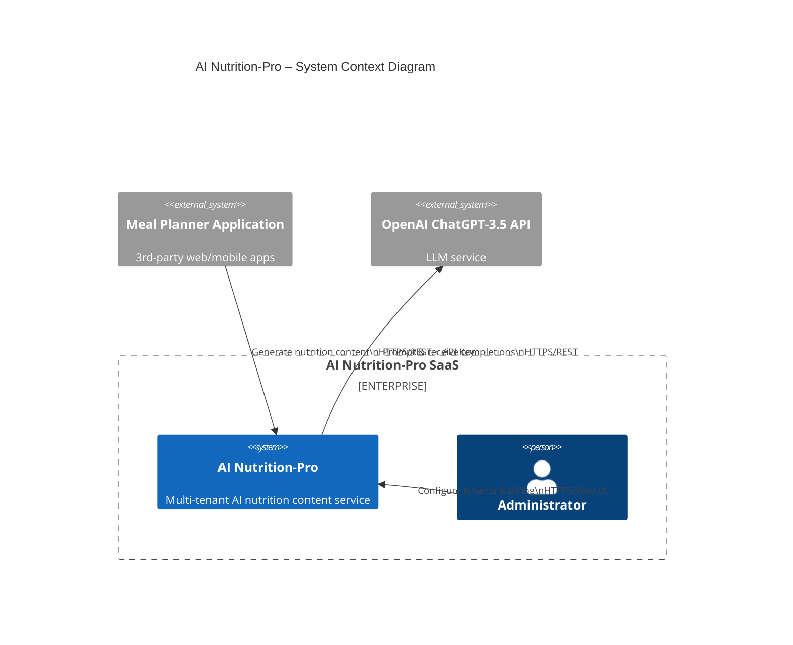
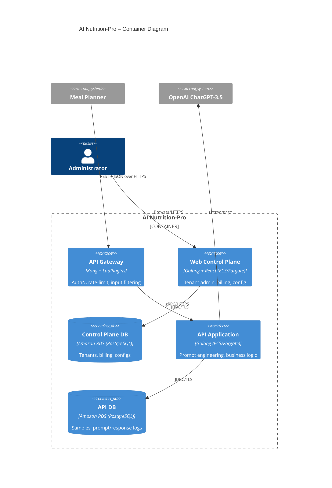
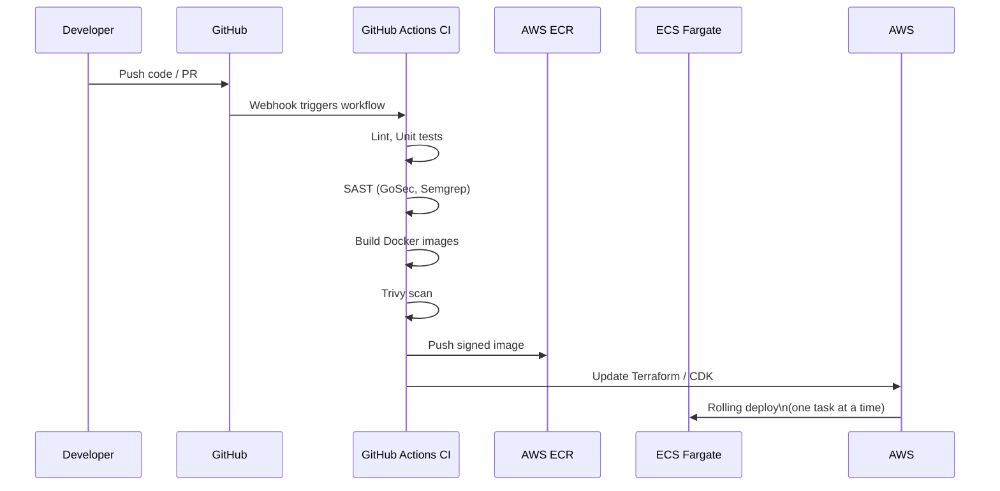

# AI Nutrition-Pro – Architecture & Security Design Document (v0.1)

## BUSINESS POSTURE
AI Nutrition-Pro is a multi-tenant SaaS component that enriches 3rd-party Meal Planner applications with AI-generated nutrition content.
Business goals
• Fast onboarding of B2B customers (Meal Planners).
• High-quality AI content while keeping operating costs (LLM, AWS) predictable.
• Continuous availability (24 × 7) and low latency.
• Compliance with typical SaaS customer requirements (GDPR, SOC 2).
• Capability to scale from a few to thousands of tenants without service interruption.

Business-critical risks
1. Leakage of tenant proprietary diet content or user PII through the LLM or mis-configuration.
2. LLM cost overrun impacting profit margin.
3. SLA breach due to cloud outage or backend saturation.
4. On-boarding friction caused by weak authN/authZ or missing self-service features.
5. Reputational damage if generated content is inaccurate, toxic or violates regulations.

Risk appetite: Medium – typical for early-stage SaaS that must move fast yet win enterprise customers.

## SECURITY POSTURE
Existing controls
security control – API keys issued per Meal Planner tenant, validated by Kong API Gateway.
security control – ACL-based authorization rules in API Gateway.
security control – TLS 1.2+ for all external HTTPS traffic.
security control – AWS security groups restrict east-west traffic to whitelisted ports.
security control – Administrator access to Control Plane protected by AWS IAM + MFA.

Accepted risks
accepted risk – Use of a 3rd-party LLM (OpenAI ChatGPT-3.5) which may process tenant data outside the organisation’s region.
accepted risk – Basic API key authN instead of more granular OAuth2/OpenID-Connect for first release.

High-priority recommended controls
security control – Encrypt data at rest (AWS RDS with KMS, S3 server-side encryption).
security control – mTLS between internal containers.
security control – Web Application Firewall (AWS WAF) in front of ALB/API Gateway.
security control – Secrets management via AWS Secrets Manager; no secrets in source code or images.
security control – Automated hardening and vulnerability scan of container images (Trivy/Grype).
security control – Centralised audit logging (CloudWatch Logs + AWS GuardDuty) with retention & alerting.
security control – Periodic penetration testing and LLM prompt-injection testing.

Security requirements summary
Authentication – Tenant API keys now; roadmap to OAuth2 client-credentials or signed JWTs.
Authorization – Role-based ACLs at Kong and inside Web Control Plane per tenant.
Input validation – API Gateway schema validation + application-level validation against OWASP cheatsheet.
Cryptography – TLS1.2+/mTLS, AES-256-GCM at rest with KMS, SHA-256 message digests for request signing.

## DESIGN

### C4 CONTEXT


| Name | Type | Description | Responsibilities | Security controls |
| ---- | ---- | ----------- | ---------------- | ----------------- |
| Meal Planner Application | External system | SaaS/web/mobile product by dietitians | Sends sample content, requests generated text | API key auth, TLS |
| Administrator | Person | Ops & support staff | Tenant onboarding, monitor, troubleshoot | IAM + MFA, audit logging |
| OpenAI ChatGPT-3.5 | External system | LLM endpoint | Generate text from prompts | HTTPS/TLS, data truncation |
| AI Nutrition-Pro | Internal system boundary | Target of this document | Expose REST API, manage tenants, call LLM | see container diagram |

### C4 CONTAINER


| Name | Type | Description | Responsibilities | Security controls |
| ---- | ---- | ----------- | ---------------- | ----------------- |
| API Gateway | Application container | Kong + plugins | Validate API key, rate limit, schema validation | security control: API key authN; security control: ACL; security control: WAF (planned); mTLS internal |
| Web Control Plane | Application container | Golang/React | Admin UI, tenant CRUD, billing view | security control: IAM federation, CSRF protection |
| Control Plane DB | Data store | RDS PostgreSQL | Store tenant + billing | security control: KMS encryption at rest; subnet isolation |
| API Application | Application container | Golang | Prompt building, async LLM calls, auditing | security control: mTLS, output filtering |
| API DB | Data store | RDS PostgreSQL | Prompt/response logs, samples | security control: KMS encryption; RBAC |
| Meal Planner App | External | Tenant system | Consume service | TLS |
| ChatGPT-3.5 | External | LLM | Generate text | TLS, usage quotas |
| Administrator | Person | Ops | Manage system | MFA, audit log |

### DEPLOYMENT
Possible deployment models
1. AWS ECS Fargate (chosen)
2. Amazon EKS Kubernetes
3. On-premises Docker Swarm for regulated customers

Detailed model – AWS ECS Fargate (multi-AZ)

```mermaid
graph TD
    subgraph AWS VPC
        ALB[Application Load Balancer + AWS WAF]
        ALB --> KongTask[Kong API Gateway<br>ECS Fargate Tasks (AutoScale)]
        subgraph Private Subnet
            KongTask --> ApiTask[API Application<br>ECS Fargate Tasks]
            CtrlTask[Web Control Plane<br>ECS Fargate Tasks]
            RDS1[(RDS PostgreSQL<br>Control Plane DB)]
            RDS2[(RDS PostgreSQL<br>API DB)]
            ApiTask --> RDS2
            CtrlTask --> RDS1
        end
        ApiTask -->|HTTPS| OpenAI[OpenAI ChatGPT<br>(Internet)]
    end
    Dev[Meal Planner Apps] -->|HTTPS| ALB
    AdminBrowser[Administrator Browser] -->|HTTPS| ALB
```

| Name | Type | Description | Responsibilities | Security controls |
| ---- | ---- | ----------- | ---------------- | ----------------- |
| AWS WAF | Security service | Filters OWASP Top-10 before ALB | Mitigate DDoS, injections | security control: AWS WAF rules |
| ALB | Network load balancer | TLS termination, routing | Forward to Kong tasks | TLS; access logs |
| Kong Task (Fargate) | ECS task | API Gateway | AuthN, rate-limit | security control: container image scan |
| API Task (Fargate) | ECS task | API Application | Core business logic | IAM role with least privilege |
| Ctrl Task (Fargate) | ECS task | Web Control Plane | Admin UI | SG restrict ports |
| RDS (Control) | AWS RDS | Multi-AZ PostgreSQL | Tenant/billing data | KMS, automatic backups |
| RDS (API) | AWS RDS | Multi-AZ PostgreSQL | Prompt logs | KMS, automatic backups |
| CloudWatch | Monitoring | Logs/metrics | Central logging | security control: log immutability |
| OpenAI | External | LLM endpoint | Generate text | TLS |

### BUILD


Build security controls
security control – Branch protection & mandatory code review.
security control – SAST and dependency scanning on every commit.
security control – Container image scanning (Trivy) fails build on critical CVEs.
security control – Images signed with cosign; verified by admission policy.
security control – Infrastructure-as-Code (Terraform) scanned with Checkov/Terraform-Compliance.
security control – Least-privilege GitHub OIDC role for CI to assume AWS deployment role.
security control – SBOM generated and stored with artifacts.

## RISK ASSESSMENT
Critical business processes
• Generation of nutrition content for paying tenants in real time.
• Accurate tenant billing and quota enforcement.

Data and sensitivity
• Dietitian proprietary meal plans and prompts – Confidential (tenant IP).
• Generated LLM content – Low to Medium sensitivity but may embed proprietary logic.
• Tenant administrative data & billing – Confidential/PII.
• Logs/metrics – Internal, may include partial prompts → treat as Confidential.

## QUESTIONS & ASSUMPTIONS
1. Will future enterprise customers require data residency in EU only?
2. Is there a requirement for HIPAA support (PHI) that would ban usage of external OpenAI?
3. Throughput expectation (requests/min) to size autoscaling policies?
4. Who is responsible for content moderation/toxicity filtering?
5. Should per-tenant encryption keys be used (KMS CMKs)?

Assumptions
• Startup stage with moderate compliance needs (GDPR/SOC 2).
• OpenAI usage is contractually allowed for tenant data.
• AWS us-east-1 is primary region; DR handled via multi-AZ + snapshots.
• All components deploy via IaC (Terraform) stored in same Git repo.
