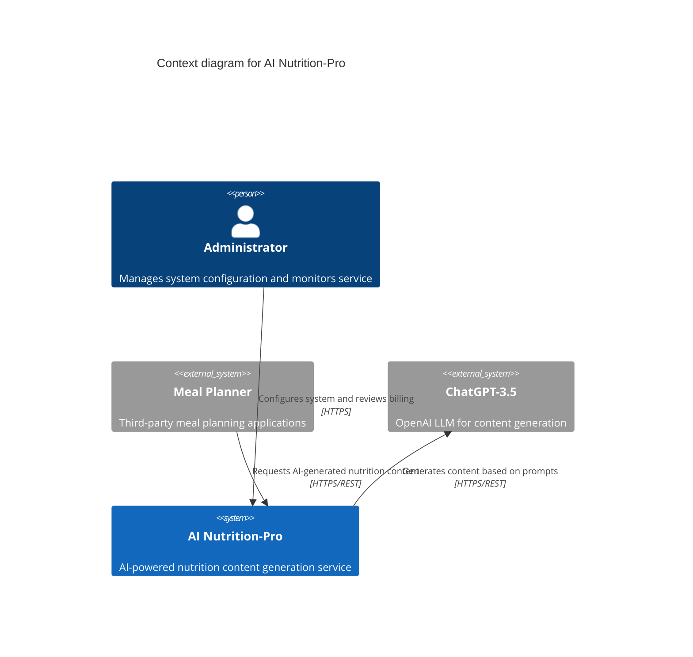
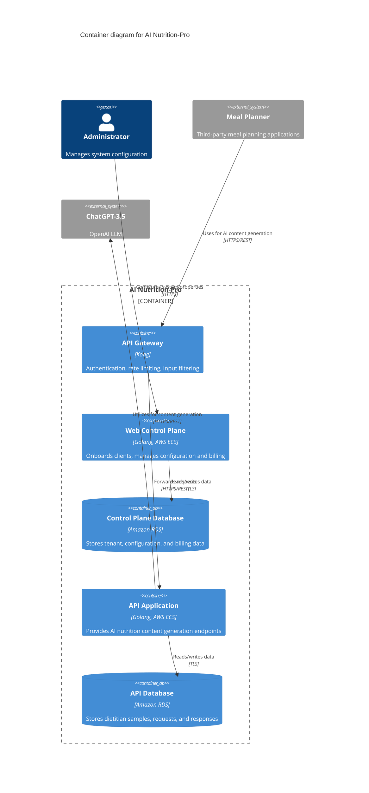

## BUSINESS POSTURE

This AI Nutrition-Pro service provides AI-driven nutrition content generation to third-party meal planning applications. It must support multi-tenant onboarding, billing management, and seamless REST integration while ensuring high availability, performance, and data security.

Key priorities and goals
- Seamless integration with multiple Meal Planner applications via REST/HTTPS
- Scalable, highly available AI content generation service
- Streamlined client onboarding and billing management
- Protection of proprietary dietitian content and billing data
- Rapid time-to-market and cost-effective operation

Most important business risks
- Service downtime leading to client churn and revenue loss
- Unauthorized access or data leakage of dietitian content and billing records
- API abuse or denial-of-service attacks driving up costs
- Inaccurate or misleading AI output (LLM hallucinations) affecting customer trust

## SECURITY POSTURE

Existing security controls:
- security control API Gateway (Kong) enforces authentication, rate limiting, and input filtering
- security control API key per Meal Planner application for client authentication
- security control ACL rules in API Gateway enforce authorization policies
- security control TLS encryption for all traffic between clients and API Gateway
- security control TLS encryption for service-to-database communications

Accepted risks:
- accepted risk reliance on third-party LLM (ChatGPT-3.5) outside direct control
- accepted risk potential for LLM to generate inaccurate or biased content

Recommended security controls:
- security control encrypt data at rest in all RDS instances using AWS KMS (AES-256)
- security control use AWS IAM roles with least privilege for ECS tasks and RDS access
- security control deploy AWS WAF in front of API Gateway to block common web threats
- security control centralize secrets management using AWS Secrets Manager or Parameter Store
- security control enable structured logging, monitoring, and alerting via CloudWatch, GuardDuty, and CloudTrail
- security control perform regular vulnerability scanning of application dependencies and container images
- security control implement automated backup and recovery for RDS with point-in-time restore

Security requirements:
- authentication: each client must present a valid API key; administrator access requires MFA via IAM Identity Center
- authorization: enforce tenant-scoped RBAC for control plane and API operations; implement fine-grained scopes at API Gateway
- input validation: strict JSON schema validation and sanitization at API Gateway and application layer to prevent injection
- cryptography: use TLS 1.2+ for all in-transit data; encrypt all sensitive data at rest with AWS KMS; use secure randomness for keys

## DESIGN

### C4 CONTEXT



| Name               | Type              | Description                                      | Responsibilities                                              | Security controls                                                     |
|--------------------|-------------------|--------------------------------------------------|---------------------------------------------------------------|------------------------------------------------------------------------|
| Administrator      | Person            | Internal person managing the service             | Configure system, manage tenants, review billing, monitor    | MFA via IAM Identity Center, least-privilege IAM roles, HTTPS         |
| Meal Planner       | External system   | Third-party meal planning applications           | Upload dietitian samples, fetch AI content                    | API key authentication, HTTPS/TLS                                      |
| ChatGPT-3.5        | External system   | OpenAI LLM for content generation                | Process prompts, return AI-generated nutrition content        | TLS encryption                                                       |
| AI Nutrition-Pro   | System            | Central service exposing REST APIs and control plane | Orchestrate API gateway, control plane, LLM integration, data persistence | API Gateway controls, TLS, logging, monitoring, database encryption |

### C4 CONTAINER



| Name                   | Type                        | Description                                               | Responsibilities                                                    | Security controls                                                   |
|------------------------|-----------------------------|-----------------------------------------------------------|---------------------------------------------------------------------|----------------------------------------------------------------------|
| API Gateway            | Kong API Gateway container  | Entry point for all API calls                             | Authentication, rate limiting, input validation                     | TLS termination, API key verification, ACL rules, WAF               |
| Web Control Plane      | Docker container (Golang)   | Web UI and API for onboarding and billing                 | Manage client onboarding, configuration, billing dashboard         | HTTPS, IAM role for RDS access, input validation, RBAC             |
| Control Plane Database | Amazon RDS                  | Relational database for control plane                     | Persist tenant metadata, billing, configuration                    | Encryption at rest (KMS), backups, security groups                 |
| API Application        | Docker container (Golang)   | Core API for AI nutrition content generation              | Handle client requests, orchestrate LLM calls, store logs         | HTTPS, IAM role for RDS access, input/output validation, logging   |
| API Database           | Amazon RDS                  | Relational database for API data                          | Persist dietitian content samples, LLM requests and responses      | Encryption at rest (KMS), backups, security groups                 |

### DEPLOYMENT

Possible deployment models
- AWS ECS on EC2 with Auto Scaling
- AWS ECS on Fargate (serverless compute)
- Amazon EKS (managed Kubernetes)
- On-premises Docker hosts

Chosen deployment: AWS ECS on Fargate (serverless compute), Amazon RDS, AWS VPC

```mermaid
C4Deployment
    title Deployment diagram for AI Nutrition-Pro
    Deployment_Node(vpc, "AWS VPC", "Isolated network") {
        Deployment_Node(public_subnet, "Public Subnet", "") {
            Deployment_Node(alb, "Application Load Balancer", "AWS ALB", "Routes external HTTPS traffic")
            Deployment_Node(api_gateway_task, "API Gateway Task", "Fargate", "Handles ingress and policy enforcement")
        }
        Deployment_Node(private_subnet, "Private Subnet", "") {
            Deployment_Node(ecs_cluster, "ECS Cluster", "") {
                Deployment_Node(app_control_plane_task, "Web Control Plane Task", "Fargate", "Runs control plane service")
                Deployment_Node(backend_api_task, "API Application Task", "Fargate", "Runs core API service")
            }
            Deployment_Node(rds, "Amazon RDS Instances", "", "Control Plane and API databases")
        }
    }
    System_Ext(mealApp, "Meal Planner", "Third-party meal planning applications")
    System_Ext(chatgpt, "ChatGPT-3.5", "OpenAI LLM")
    Rel(mealApp, alb, "HTTPS/REST")
    Rel(alb, api_gateway_task, "HTTPS")
    Rel(api_gateway_task, app_control_plane_task, "HTTPS/REST")
    Rel(api_gateway_task, backend_api_task, "HTTPS/REST")
    Rel(backend_api_task, chatgpt, "HTTPS/REST")
```

| Name                     | Type                    | Description                                       | Responsibilities                                      | Security controls                                                      |
|--------------------------|-------------------------|---------------------------------------------------|-------------------------------------------------------|---------------------------------------------------------------------------|
| AWS VPC                  | Infrastructure          | Virtual network housing all resources             | Network isolation, segmentation                       | Network ACLs, VPC flow logs, private subnets, VPC endpoints             |
| Public Subnet            | Infrastructure          | Hosts internet-facing components                  | Serve external traffic                                | Security groups, NAT gateway for outbound                              |
| Application Load Balancer| AWS ALB                 | Routes incoming client requests                   | SSL termination, health checks                        | TLS certificate (ACM), AWS WAF, access logs                             |
| API Gateway Task         | Fargate task            | Runs Kong API Gateway                             | Authentication, rate limiting, input filtering        | IAM role, task-level IAM policies, container isolation                  |
| Private Subnet           | Infrastructure          | Hosts internal compute and databases              | Isolate backend services and databases                | Security groups, no public IPs                                          |
| ECS Cluster              | Fargate cluster         | Orchestrates Fargate tasks                        | Scheduling and scaling control plane and API tasks    | IAM roles, auto scaling, service mesh (optional)                        |
| Web Control Plane Task   | Fargate task            | Runs control plane container                      | Client onboarding, configuration, billing management  | TLS, IAM role for RDS access, input validation                          |
| API Application Task     | Fargate task            | Runs core API container                           | Handle AI content generation requests                 | TLS, IAM role for RDS access, output sanitization, logging              |
| Amazon RDS Instances     | Managed database        | Hosts both control plane and API databases        | Persistent storage                                   | Encryption at rest (KMS), multi-AZ, automated backups, security groups  |

### BUILD

The codebase is stored in GitHub. A GitHub Actions CI pipeline performs build, test, and publish:

```mermaid
graph LR
    Developer -->|Push code| GitHubRepo
    GitHubRepo -->|Trigger CI| CI
    CI --> Checkout[Checkout code]
    Checkout --> SAST[Run SAST (CodeQL)]
    SAST --> SCA[Run SCA (Dependency-Check)]
    SCA --> UnitTests[Run unit tests]
    UnitTests --> BuildDocker[Build Docker image]
    BuildDocker --> ContainerScan[Container vulnerability scan]
    ContainerScan --> PushECR[Push image to ECR]
    PushECR --> DeployECS[Trigger ECS service update]
```

Key build-time security controls
- Supply chain security via locked dependencies and SCA
- Static analysis with CodeQL for code vulnerabilities
- Dependency scanning for known CVEs
- Container image vulnerability scanning
- Signed build artifacts and container images
- Automated unit and integration tests before deployment

## RISK ASSESSMENT

Critical business processes to protect
- AI content generation APIs serving client requests
- Client onboarding, configuration, and billing workflows
- Administrator access to system configuration and logs

Data and sensitivity
- Dietitian content samples (moderate sensitivity)
- LLM request and response data (low to moderate sensitivity)
- Client configuration and billing records (high sensitivity)
- API keys and credentials (high sensitivity)

## QUESTIONS & ASSUMPTIONS

Questions
- Should the service be deployed across multiple AWS regions for DR?
- Is there a regulatory requirement (HIPAA, GDPR) for dietitian or user data?
- What is the expected scale (requests per second) for sizing?
- Will ChatGPT traffic use a VPC endpoint or public internet?
- What is the retention policy for logs and AI interaction records?

Assumptions
- Deployment on AWS Fargate within a single region with multi-AZ support
- No PII beyond billing records; HIPAA compliance not required
- GitHub Actions is the CI/CD platform
- AWS KMS is used for key management and encryption at rest
- Clients are responsible for securing their API keys and tokens
