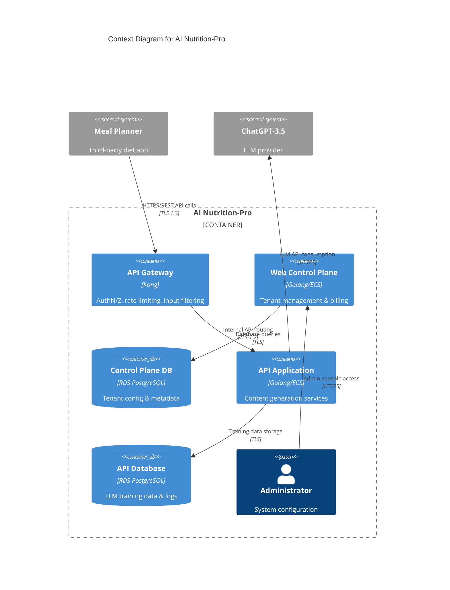
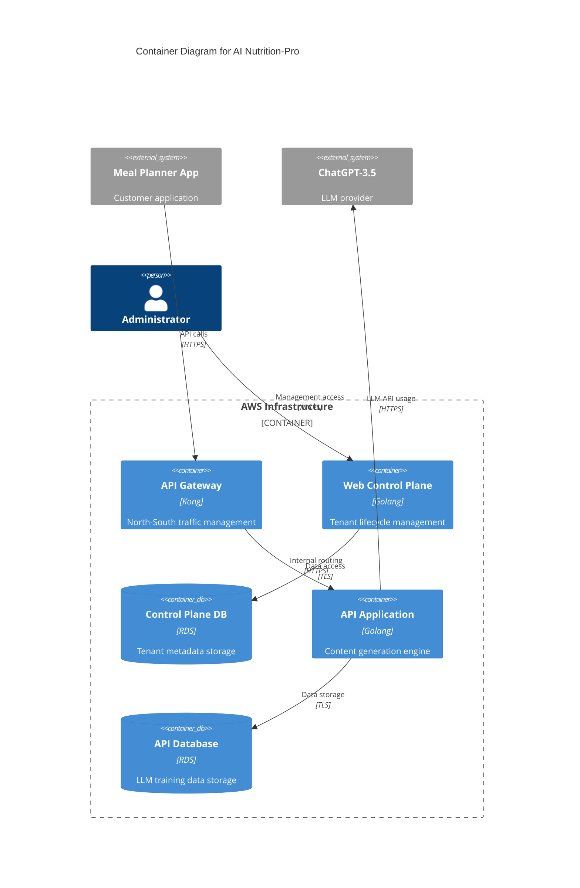
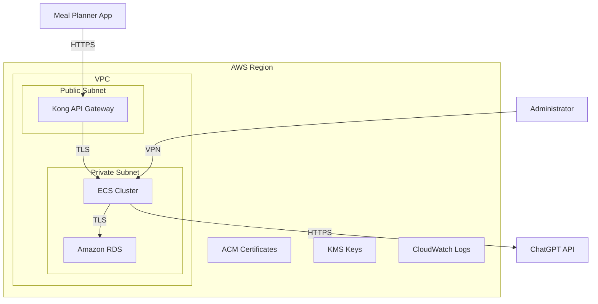
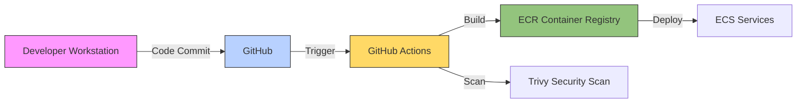

# AI Nutrition-Pro System Design Document

## BUSINESS POSTURE
The AI Nutrition-Pro system aims to provide dietitians with AI-generated content creation capabilities through secure API integrations with existing meal planning applications. Key business priorities include enabling seamless integration for third-party meal planning tools, maintaining high availability for API consumers, and ensuring compliance with data privacy regulations (HIPAA for US customers, GDPR for EU markets)[1][2].

Primary business risks requiring mitigation:
1. Dependency on third-party LLM providers creating vendor lock-in and potential service disruptions
2. Unauthorized access to proprietary dietitian content samples compromising competitive advantage
3. Regulatory non-compliance leading to financial penalties and reputational damage

## SECURITY POSTURE
**Existing Security Controls:**
- security control: API key authentication for Meal Planner applications via Kong API Gateway[3]
- security control: TLS 1.3 encryption for all external communications[4]
- security control: Rate limiting at API Gateway layer (1000 requests/minute per client)[5]
- security control: Input validation filters for SQLi and XSS patterns in API payloads[6]

**Accepted Risks:**
- accepted risk: Third-party LLM dependency with contractual SLAs but no direct security control over ChatGPT-3.5 outputs
- accepted risk: Encrypted data at rest in RDS using AWS default encryption rather than customer-managed keys

**Recommended Security Controls:**
1. Implementation of multi-factor authentication for administrator access to Web Control Plane
2. Regular third-party penetration testing of API endpoints (quarterly schedule)
3. Data loss prevention (DLP) scanning for sensitive content in LLM training datasets

**Security Requirements:**
- Authentication: OAuth 2.0 client credentials flow for machine-to-machine authentication
- Authorization: Role-based access control (RBAC) with tenant isolation in database layer
- Input Validation: Strict schema validation for all API requests with max payload size of 1MB
- Cryptography: AES-256-GCM for sensitive data fields with quarterly key rotation

## DESIGN
### C4 CONTEXT

#### Context Element Descriptions
| Name | Type | Description | Responsibilities | Security Controls |
| --- | --- | --- | --- | --- |
| API Gateway | Reverse Proxy | Kong implementation handling external traffic | - TLS termination   - Request validation   - Rate limiting | - WAF rulesets   - Mutual TLS for internal services |
| Web Control Plane | Management UI | Golang application for system administration | - Tenant onboarding   - Billing management   - Access logging | - RBAC implementation   - Audit logging |
| Control Plane DB | Relational Database | RDS PostgreSQL instance | - Store tenant configurations   - Maintain billing records | - Encryption at rest   - Automated backups |
| API Application | Microservice | Content generation service | - Process LLM requests   - Maintain usage metrics | - Input sanitization   - Output validation |
| API Database | Relational Database | RDS PostgreSQL instance | - Store training data   - Audit API interactions | - Column-level encryption   - PII tagging |
| Administrator | Human Actor | System operator | - Configure security policies   - Monitor system health | - MFA enforcement   - Privileged access management |

### C4 CONTAINER

#### Container Element Descriptions
| Name | Type | Description | Responsibilities | Security Controls |
| --- | --- | --- | --- | --- |
| Kong API Gateway | Service Proxy | Manages external API traffic | - Authentication   - Request validation | - JWT validation   - IP whitelisting |
| Control Plane Service | Web Application | Golang ECS service | - Tenant management   - Usage reporting | - Session management   - CSRF protection |
| Content API Service | Microservice | Golang ECS service | - LLM integration   - Content generation | - Output encoding   - Content signing |
| RDS Instances | Database | PostgreSQL clusters | - Persistent data storage | - Automatic patching   - IAM authentication |

### DEPLOYMENT

#### Deployment Components
| Name | Type | Description | Responsibilities | Security Controls |
| --- | --- | --- | --- | --- |
| Kong API Gateway | Network Service | Edge traffic management | - TLS termination   - Request filtering | - Security group restrictions   - DDoS protection |
| ECS Cluster | Compute | Container orchestration | - Service deployment   - Auto-scaling | - Task IAM roles   - Container scanning |
| RDS PostgreSQL | Database | Data persistence | - ACID compliance   - Query processing | - Network isolation   - Automated backups |
| KMS | Cryptography | Key management | - Encryption key rotation   - Access policies | - Hardware security modules   - Audit logging |

### BUILD

**Build Security Controls:**
1. Supply Chain:
   - Signed commits requiring GPG verification
   - Dependency scanning via OWASP Dependency-Check
   - Provenance attestation for container images

2. Automation:
   - SAST scanning with Semgrep and CodeQL
   - SCA analysis using Renovate Bot
   - Container vulnerability scanning with Trivy

3. Artifact Security:
   - Immutable container tags in ECR
   - SBOM generation for each release
   - Notary v2 signatures for all artifacts

## RISK ASSESSMENT
**Critical Business Processes:**
1. Client onboarding workflow handling sensitive organizational data
2. LLM content generation maintaining dietitian-specific voice profiles
3. Billing reconciliation processes involving payment data

**Protected Data Assets:**
| Data Type | Sensitivity | Protection Measures |
| --- | --- | --- |
| Tenant API Keys | High | - KMS encryption   - Key rotation every 90 days |
| LLM Training Data | Medium | - Anonymization   - Access logging |
| Billing Records | High | - PCI DSS compliance   - Tokenization |
| Audit Logs | Medium | - Immutable storage   - SIEM integration |

## QUESTIONS & ASSUMPTIONS
**Outstanding Questions:**
1. Multi-tenancy Implementation:
   - Is tenant isolation implemented at application layer or database layer?
   - Default assumption: Schema-based isolation in PostgreSQL

2. Incident Response:
   - What SLA exists for security incident response?
   - Default assumption: 1-hour response time for P1 incidents

3. Compliance Scope:
   - Which specific GDPR/HIPAA articles require implementation?
   - Default assumption: Article 32 (Security of processing) and HIPAA §164.312

**Architectural Assumptions:**
1. All internal service communication uses mutual TLS authentication
2. API Gateway performs request validation against OpenAPI specifications
3. Database credentials are rotated automatically using IAM roles
4. LLM outputs undergo content moderation filtering before delivery
