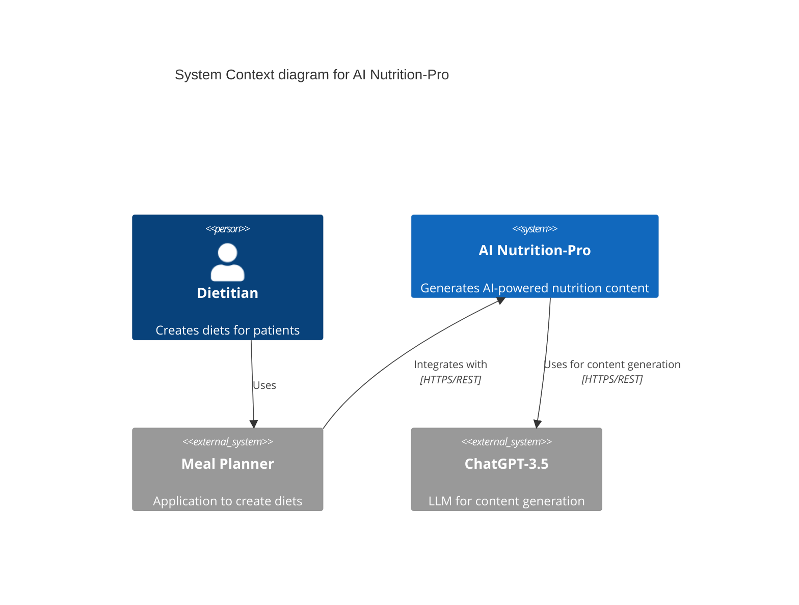
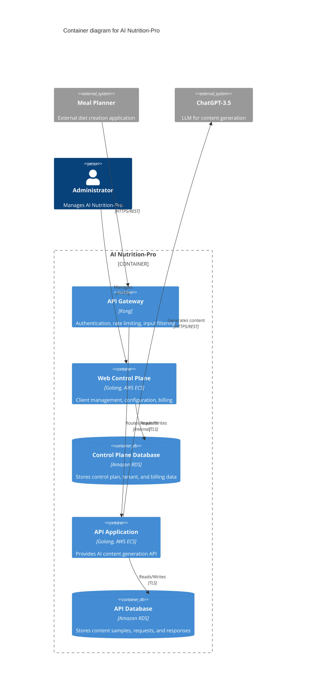
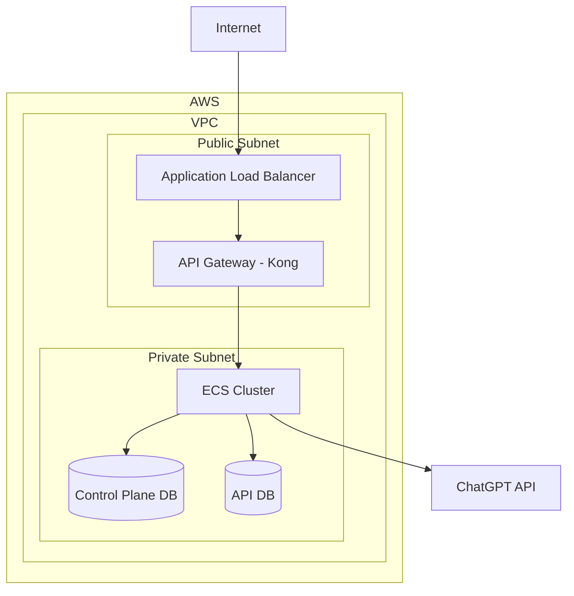
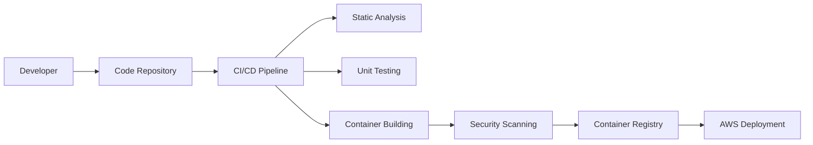

Based on the provided FILE, I will create an updated DESIGN DOCUMENT for the AI Nutrition-Pro application.

# BUSINESS POSTURE

The AI Nutrition-Pro application aims to provide AI-powered content generation for diet planning and nutrition advice. The primary business goals and priorities are:

1. Enable integration with multiple Meal Planner applications
2. Provide scalable and secure API services for content generation
3. Offer a control plane for managing clients, configuration, and billing
4. Leverage advanced AI (ChatGPT-3.5) for generating high-quality nutrition content

Key business risks to address:
- Ensuring data privacy and security for sensitive health information
- Maintaining high availability and performance of the API services
- Managing costs associated with AI content generation at scale

# SECURITY POSTURE

Existing security controls:
- Security control: Authentication using individual API keys for Meal Planner applications
- Security control: Authorization via ACL rules in the API Gateway
- Security control: Encrypted network traffic using TLS between Meal Planner applications and API Gateway
- Security control: Isolation of control plane and API functionality into separate containers

Accepted risks:
- Accepted risk: Reliance on external AI service (ChatGPT-3.5) for content generation

Recommended high-priority security controls:
- Implement robust input validation and sanitization in the API Gateway and API Application
- Set up monitoring and alerting for unusual API usage patterns
- Implement regular security audits and penetration testing

Security requirements:
- Authentication: Implement multi-factor authentication for administrator access to the Web Control Plane
- Authorization: Implement fine-grained access controls for different roles in the Web Control Plane
- Input validation: Validate and sanitize all input from Meal Planner applications before processing
- Cryptography: Use strong encryption for data at rest in the databases

# DESIGN

## C4 CONTEXT

| Name | Type | Description | Responsibilities | Security Controls |
|------|------|-------------|------------------|-------------------|
| Dietitian | Person | User of Meal Planner applications | Creates diets for patients | N/A |
| AI Nutrition-Pro | System | Core system for AI-powered nutrition content generation | Provides API for content generation, manages clients and billing | API key authentication, TLS encryption |
| Meal Planner | External System | Third-party application for diet creation | Integrates with AI Nutrition-Pro for enhanced content | Secure API integration |
| ChatGPT-3.5 | External System | Large Language Model | Generates nutrition content based on prompts | Secure API communication |

## C4 CONTAINER

| Name | Type | Description | Responsibilities | Security Controls |
|------|------|-------------|------------------|-------------------|
| API Gateway | Container | Kong API Gateway | Authentication, rate limiting, input filtering | API key validation, ACL rules |
| Web Control Plane | Container | Management interface | Client onboarding, configuration, billing management | Role-based access control |
| Control Plane Database | Container | Amazon RDS instance | Stores control plane data | Encryption at rest, TLS connection |
| API Application | Container | Core API service | Handles content generation requests | Input validation, secure API integration |
| API Database | Container | Amazon RDS instance | Stores API-related data | Encryption at rest, TLS connection |

## DEPLOYMENT

The AI Nutrition-Pro application is deployed on AWS using containerized services. Here's a high-level deployment diagram:

| Name | Type | Description | Responsibilities | Security Controls |
|------|------|-------------|------------------|-------------------|
| VPC | Network | AWS Virtual Private Cloud | Isolates resources | Network ACLs, Security Groups |
| Application Load Balancer | Network | AWS ALB | Distributes incoming traffic | SSL/TLS termination |
| API Gateway | Container | Kong in ECS | Handles API requests | API key validation, rate limiting |
| ECS Cluster | Compute | AWS Elastic Container Service | Runs application containers | Container isolation, IAM roles |
| RDS Instances | Database | Amazon RDS | Stores application data | Encryption at rest, network isolation |

## BUILD

The build process for AI Nutrition-Pro involves the following steps:

1. Code Repository: Source code is stored in a version-controlled repository (e.g., GitHub).
2. Continuous Integration: A CI tool (e.g., Jenkins, GitHub Actions) is triggered on code commits.
3. Static Analysis: Code is analyzed for quality and security issues using tools like SonarQube.
4. Unit Testing: Automated tests are run to ensure code functionality.
5. Container Building: Docker images are built for each component.
6. Security Scanning: Container images are scanned for vulnerabilities using tools like Trivy.
7. Artifact Storage: Approved images are pushed to a container registry (e.g., Amazon ECR).
8. Deployment: Infrastructure as Code (e.g., Terraform) is used to deploy updated containers to AWS.

# RISK ASSESSMENT

Critical business processes to protect:
1. API content generation
2. Client onboarding and management
3. Billing and financial transactions

Data to protect:
1. Dietitian content samples (Medium sensitivity)
2. Generated nutrition content (Medium sensitivity)
3. Client information and API keys (High sensitivity)
4. Billing and financial data (High sensitivity)

# QUESTIONS & ASSUMPTIONS

Questions:
1. What is the expected scale of API requests from Meal Planner applications?
2. Are there any specific compliance requirements (e.g., HIPAA) for handling nutrition data?
3. What is the disaster recovery strategy for the databases?

Assumptions:
1. The ChatGPT-3.5 API is considered reliable and available for content generation.
2. Meal Planner applications are responsible for user authentication and authorization on their end.
3. The system does not store or process personally identifiable information (PII) of end-users (patients).
