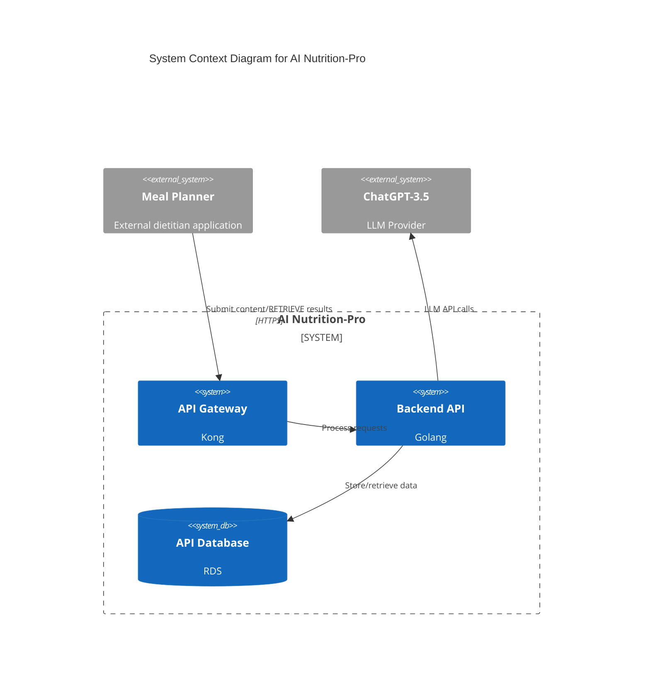
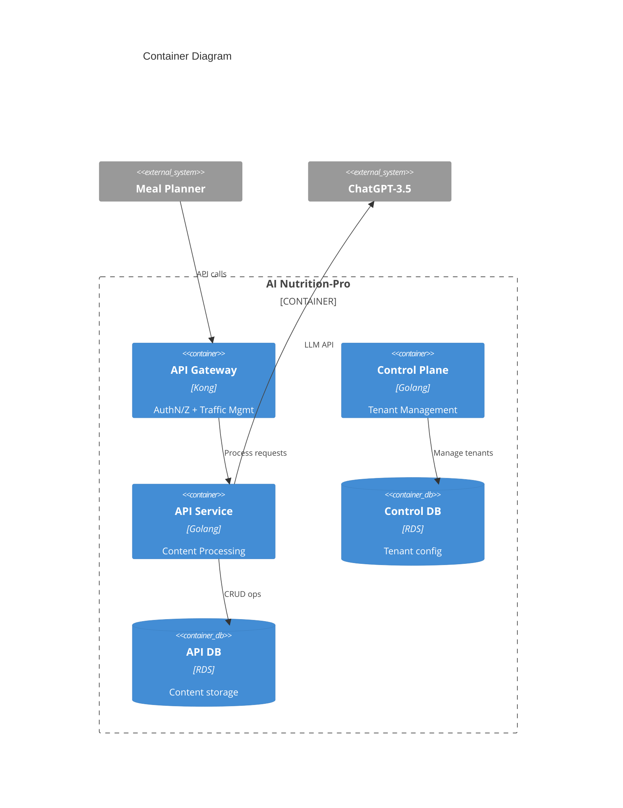
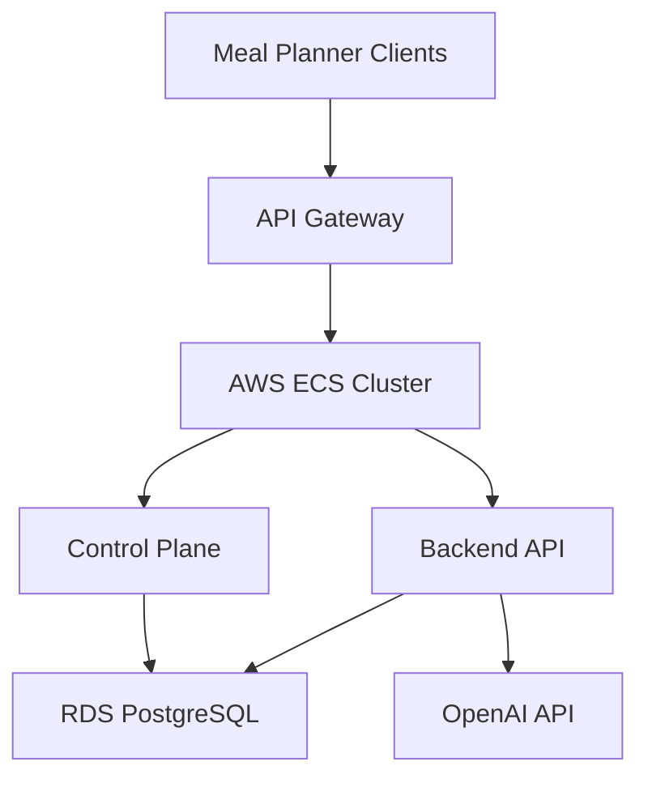
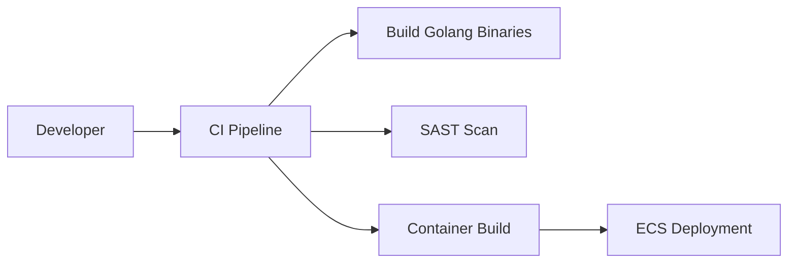

## BUSINESS POSTURE
The AI Nutrition-Pro application enables dietitians to generate AI-assisted nutritional content through integration with meal planner applications. Key business priorities:

- **Interoperability**: Support integration with multiple meal planner systems through standardized API
- **LLM Agnosticism**: Maintain flexibility to switch between different LLM providers
- **Tenant Isolation**: Ensure billing/configuration isolation between different meal planner clients

Key business risks needing mitigation:
- Vendor lock-in with ChatGPT-3.5 implementation
- Data leakage between meal planner tenants
- API availability impacting meal planner integrations

## SECURITY POSTURE

### Existing Security Controls
1. **security control**: API key authentication for external systems [1][3]
2. **security control**: TLS 1.3 encryption for database connections [1]
3. **security control**: Kong API Gateway ACL rules [1][3]

### Accepted Risks
- Reliance on OpenAI's API security practices for ChatGPT-3.5
- Absence of application-level encryption for stored dietitian content samples

### Recommended Security Controls
1. Implement input validation for meal planner content uploads
2. Add audit logging for administrator actions in control plane
3. Introduce rate limiting per API key/client

### Security Requirements
| Category | Requirement | Implementation Point |
|----------|-------------|-----------------------|
| Authentication | API key rotation every 90 days | API Gateway |
| Authorization | Meal planner tenant isolation | Control Plane DB |
| Input Validation | Content size/sanitization checks | API Gateway |
| Cryptography | AES-256 encryption at rest for API DB | RDS Configuration |

## DESIGN

### C4 CONTEXT

| Name | Type | Description | Responsibilities | Security Controls |
|------|------|-------------|-------------------|-------------------|
| Meal Planner | External System | Dietitian-facing application | Initiate content processing | API key authentication |
| API Gateway | Internal System | Kong implementation | Traffic management | ACL, Rate limiting |
| Backend API | Internal System | Golang service | Business logic | Input validation |
| API Database | Internal DB | RDS PostgreSQL | Data persistence | TLS, Encryption |

### C4 CONTAINER

| Name | Type | Description | Security Controls |
|------|------|-------------|-------------------|
| API Gateway | Kong | Request routing | TLS termination |
| Control Plane | Golang | Tenant management | RBAC |
| API Service | Golang | Content processing | Input validation |
| Control DB | RDS | Tenant config | Encryption at rest |

### DEPLOYMENT

| Component | Environment | Scaling | Security |
|-----------|-------------|---------|----------|
| API Gateway | AWS ECS | Auto-scaling | WAF Integration |
| Backend API | AWS ECS | Horizontal | IAM Roles |
| Databases | RDS Multi-AZ | Read replicas | KMS Encryption |

### BUILD

Build Security Controls:
1. Trivy container scanning
2. Bandit SAST for Python (CI/CD)
3. Sigstore signing for container images

## RISK ASSESSMENT
**Critical Data Assets**:
- Dietitian content samples (Confidentiality)
- LLM request/response logs (Integrity)
- Tenant billing information (Availability)

**Protection Requirements**:
- Prevent cross-tenant data access
- Ensure auditability of LLM usage
- Maintain API availability during peak loads

## QUESTIONS & ASSUMPTIONS
1. What retention policy applies to dietitian content samples?
   *Assumption*: 30-day retention unless specified otherwise
2. How are LLM costs allocated per tenant?
   *Assumption*: Usage-based billing via control plane tracking
3. What compliance frameworks apply (HIPAA, GDPR)?
   *Assumption*: Basic PCI-DSS controls implemented initially
