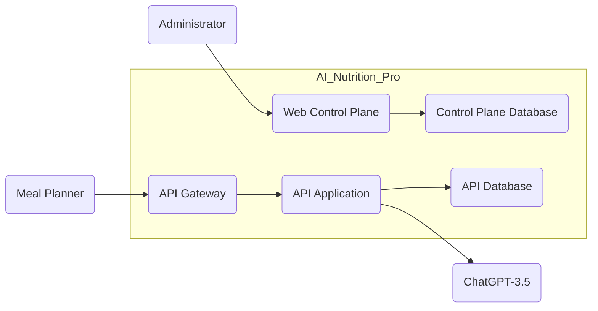
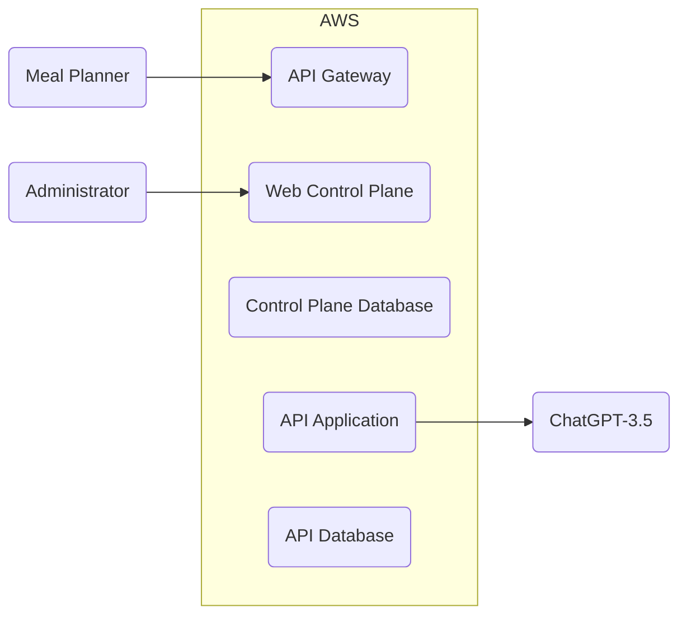
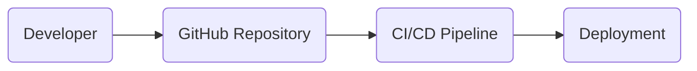

# DESIGN DOCUMENT

## BUSINESS POSTURE

### Business Priorities and Goals

- Onboard and manage meal planner applications effectively.
- Provide AI-driven content generation and management.
- Ensure seamless integration with external meal planner applications.
- Offer a secure and reliable platform for dietitians and administrators to manage content and billing data.

### Important Business Risks

- Unauthorized access to the API Gateway and backend services.
- Data breaches leading to loss or exposure of sensitive information.
- Downtime affecting the availability of the AI Nutrition-Pro application.

## SECURITY POSTURE

### Existing Security Controls

- security control: Authentication with Meal Planner applications - each has an individual API key.
- security control: Authorization of Meal Planner applications - API Gateway has ACL rules that allow or deny certain actions.
- security control: Encrypted network traffic - network traffic between Meal Planner applications and API Gateway is encrypted using TLS.

### Accepted Risks

- accepted risk: No multi-factor authentication for administrators.
- accepted risk: No DDoS protection for the API Gateway.

### Recommended Security Controls

- security control: Implement multi-factor authentication for administrative access.
- security control: Enable DDoS protection for the API Gateway.
- security control: Use input validation frameworks for the API Gateway.
- security control: Implement encryption for sensitive data at rest.
- security control: Use SAST and DAST scanning tools as part of the CI/CD pipeline.

### Security Requirements

- **Authentication**: Secure API keys for Meal Planner applications.
- **Authorization**: Fine-grained access control lists to manage permissions.
- **Input Validation**: Validating inputs to prevent injection attacks.
- **Cryptography**: Encrypt sensitive data both in transit and at rest.

### Security Control Implementation

- The API Gateway uses Kong, which supports rate limiting and input filtering (Implemented).
- Control Plane Database and API Database use Amazon RDS with encryption (Implemented).
- Meal Planner applications and backend APIs use TLS for encrypted network traffic (Implemented).

## DESIGN

### C4 CONTEXT

### C4 CONTEXT Elements Description

| Name          | Type             | Description                                        | Responsibilities                                                                 | Security Controls                                                                 |
|---------------|------------------|----------------------------------------------------|----------------------------------------------------------------------------------|-----------------------------------------------------------------------------------|
| Meal Planner  | External System  | Meal Planner application                            | Uploads samples of dietitians' content to AI Nutrition-Pro, fetches AI-generated results | None                                                                               |
| AI Nutrition-Pro | Internal System | Central application of the architecture             | Manages interaction between different components                                 | API Gateway authentication, rate limiting, input filtering                      |
| API Gateway   | Internal System  | Manages authentication, rate limiting, input filtering | Authenticates, filters, and rate limits incoming requests                       | API key authentication, rate limiting, input validation                          |
| Web Control Plane | Internal System | Manages clients, configurations, and billing data     | Onboards and manages clients, provides configuration interface and billing info  | Access control, encryption for database communication                           |
| API Application | Internal System | Provides AI functionality via API                    | Provides AI-generated content based on input from Meal Planner and ChatGPT      | Input validation, encryption for database communication                         |
| ChatGPT-3.5   | External System   | LLM for AI content generation                        | Provides AI content generation                                                  | None                                                                               |
| Administrator | Internal Person  | Administrator of AI Nutrition-Pro application          | Manages server configuration, resolves problems                              | Multi-factor authentication (recommended)                                         |

### C4 CONTAINER

### C4 CONTAINER Elements Description

| Name          | Type              | Description                                        | Responsibilities                                                                 | Security Controls                                                                 |
|---------------|-------------------|----------------------------------------------------|----------------------------------------------------------------------------------|-----------------------------------------------------------------------------------|
| API Gateway   | Container         | Manages authentication and rate limiting            | Authenticates, filters, and rate limits incoming requests                       | API key authentication, rate limiting, input validation                          |
| Web Control Plane | Container      | Manages clients, configurations, and billing data  | Onboards and manages clients, provides configuration interface and billing info  | Access control, encryption for database communication                           |
| API Application | Container        | Provides AI functionality via API                  | Provides AI-generated content based on input from Meal Planner and ChatGPT      | Input validation, encryption for database communication                         |
| Control Plane Database | Database | Stores data related to control plane               | Stores data related to control plane, tenants, and billing                      | Encryption for database communication                                             |
| API Database  | Database          | Stores data related to API functionality            | Stores dietitian's content samples, requests, and responses to LLM              | Encryption for database communication                                             |
| Meal Planner   | External System   | Meal Planner application                            | Uploads samples of dietitians' content to AI Nutrition-Pro, fetches AI-generated results | None                                                                               |
| ChatGPT-3.5   | External System   | LLM for AI content generation                       | Provides AI content generation                                                  | None                                                                               |
| Administrator | Person            | Administrator of AI Nutrition-Pro application        | Manages server configuration, resolves problems                                 | Multi-factor authentication (recommended)                                         |

### DEPLOYMENT

#### Deployment Diagram

### DEPLOYMENT Elements Description

| Name          | Type              | Description                                        | Responsibilities                                                                 | Security Controls                                                                 |
|---------------|-------------------|----------------------------------------------------|----------------------------------------------------------------------------------|-----------------------------------------------------------------------------------|
| API Gateway   | Container         | Manages authentication and rate limiting            | Authenticates, filters, and rate limits incoming requests                       | API key authentication, rate limiting, input validation                          |
| Web Control Plane | Container      | Manages clients, configurations, and billing data  | Onboards and manages clients, provides configuration interface and billing info  | Access control, encryption for database communication                           |
| API Application | Container        | Provides AI functionality via API                   | Provides AI-generated content based on input from Meal Planner and ChatGPT      | Input validation, encryption for database communication                         |
| Control Plane Database | Database | Stores data related to control plane               | Stores data related to control plane, tenants, and billing                      | Encryption for database communication                                             |
| API Database  | Database          | Stores data related to API functionality           | Stores dietitian's content samples, requests, and responses to LLM              | Encryption for database communication                                             |
| Meal Planner  | External System    | Meal Planner application                            | Uploads samples of dietitians' content to AI Nutrition-Pro, fetches AI-generated results | None                                                                               |
| ChatGPT-3.5   | External System    | LLM for AI content generation                       | Provides AI content generation                                                  | None                                                                               |
| Administrator | Person            | Administrator of AI Nutrition-Pro application        | Manages server configuration, resolves problems                                 | Multi-factor authentication (recommended)                                         |

### BUILD

#### Build Process Diagram

### BUILD Elements Description

| Name          | Type              | Description                                        | Responsibilities                                                                 | Security Controls                                                                 |
|---------------|-------------------|----------------------------------------------------|----------------------------------------------------------------------------------|-----------------------------------------------------------------------------------|
| Developer     | Person            | Developer who works on the codebase                 | Writes and reviews code                                                           | Secure code practices, code reviews                                              |
| GitHub Repository | Source Control | Source control system                               | Stores code, manages versions, and triggers CI/CD pipeline                      | Secure access controls, branch protection                                         |
| CI/CD Pipeline | CI/CD System      | Continuous Integration and Continuous Deployment     | Builds, tests, and deploys code                                                   | SAST, DAST, and other security checks during the build process                   |
| Deployment    | Deployment System | Deployment system                                   | Deploys code to production environment                                            | Infrastructure as code (IaC), secure deployment practices                          |

## RISK ASSESSMENT

### Critical Business Process

- Onboarding and managing meal planner applications.
- Providing AI-generated content based on dietitians' content.
- Ensuring secure and reliable access to the backend services.

### Data to Protect

- Sensitive user and client data.
- Dietitian content and billing data.
- API keys and other credentials.

## QUESTIONS & ASSUMPTIONS

### Questions

- Are there any specific compliance requirements for data protection?
- What is the risk appetite of the organization?
- Are there any third-party services that need to be integrated?

### Assumptions

- The organization is a startup with a moderate risk appetite.
- The organization is primarily concerned with data privacy and availability.
- The organization uses Golang and AWS for development and deployment.
