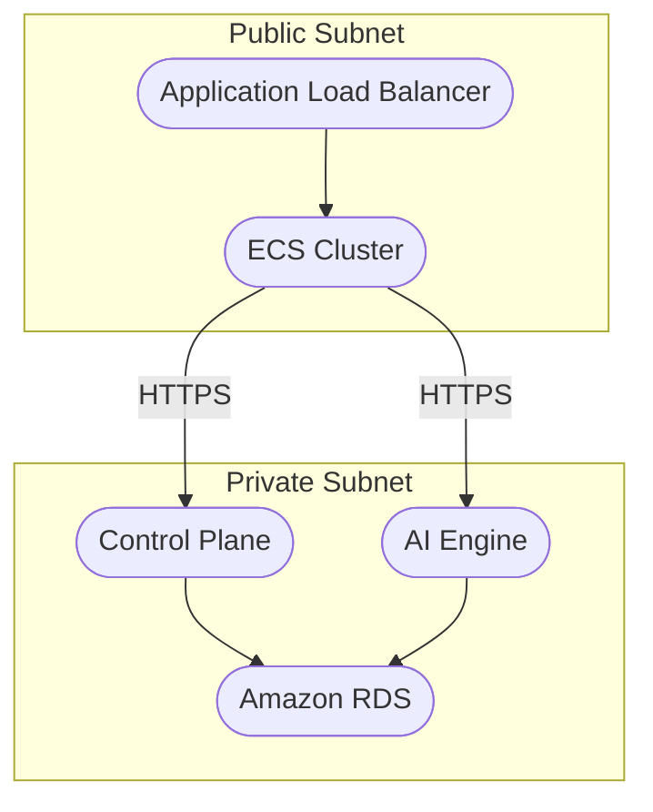
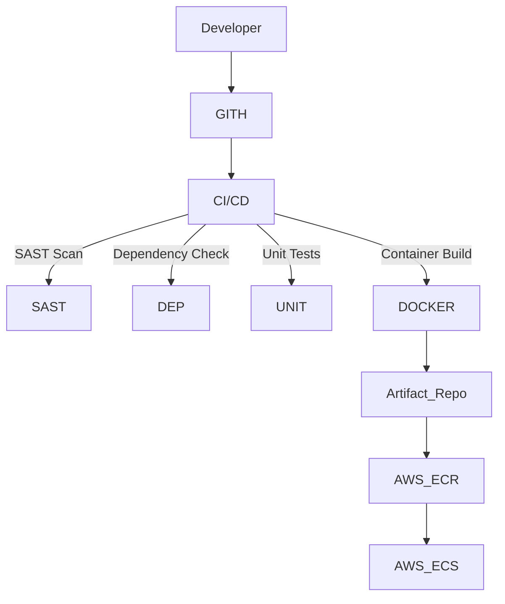

# DESIGN DOCUMENT FOR AI NUTRITION-PRO

## BUSINESS POSTURE
### Business Priorities & Goals:
1. Enable Meal Planner applications to rapidly onboard and use AI-generated nutrition content
2. Ensure high availability of AI content generation capabilities
3. Support secure integration with third-party LLM providers (e.g., ChatGPT)
4. Maintain reliable control plane for tenant management and billing operations

### Key Business Risks:
1. Downtime in core API functionality interrupting dietitian workflows
2. Unauthorized access to dietitian content samples stored in databases
3. Compliance risks from improper handling of health-related data
4. Dependency risks from reliance on external LLM provider uptime
5. Inability to scale with increasing number of Meal Planner clients

---

## SECURITY POSTURE
### Existing Security Controls:
- security control: API keys for Meal Planner application authentication
- security control: API Gateway ACLs for request authorization
- security control: TLS encryption for all external communications

### Accepted Risks:
- accepted risk: Lack of multi-factor authentication (MFA) for administrator access
- accepted risk: No database encryption-at-rest for control plane and API databases
- accepted risk: No rate limiting protection for control plane API endpoints

### Recommended Security Controls:
- Recommend implementing MFA for administrator access
- Recommend adding input validation middleware in API Gateway
- Recommend introducing vulnerability scanning in CI/CD pipeline
- Recommend enabling AWS RDS encryption at rest for both databases

### Security Requirements:
| Category | Requirements |
|---------|--------------|
| **Authentication** | API keys + MFA for admins, JWT tokens for service-to-service communication |
| **Authorization** | Role-based access control (RBAC) for control plane operations |
| **Input Validation** | OWASP ASVS Level 1 validation for all incoming API requests |
| **Cryptography** | TLS 1.3+ for network communication, AES-256 encryption for sensitive data at rest |

---

## DESIGN

### C4 CONTEXT
#### Mermaid Diagram:
```mermaid
c4context
Title: AI Nutrition-Pro Context Diagram

Person(admin, "Administrator")
Person(mealAppUser, "Meal Planner Application")
Person(chatGPT, "ChatGPT API")

System(nutritionPro, "AI Nutrition-Pro System") {
    Container(controlPlane, "Control Plane")
    Container(aiService, "AI Service")
}

Rel(admin, nutritionPro, "Manages system configuration", "HTTPS")
Rel(mealAppUser, nutritionPro, "Uses AI content generation", "HTTPS/REST")
Rel(chatGPT, aiService, "Provides LLM capabilities", "HTTPS/REST")
```

#### Context Elements Table:
| Name | Type | Description | Responsibilities | Security Controls |
|------|------|-------------|------------------|-------------------|
| Administrator | Person | System administrator | System configuration and troubleshooting | TLS encrypted admin interface |
| Meal Planner Application | External System | Third-party nutrition platforms | Content generation requests | API key authentication |
| ChatGPT API | External System | LLM service provider | Content generation | API key authentication |
| AI Nutrition-Pro System | System | Central application system | Provides core nutrition services | TLS encryption |
| Control Plane | Container | Tenant management subsystem | Client onboarding/configuration | RBAC authorization |
| AI Service | Container | Core AI functionality | Content generation via LLM | Input validation |

---

### C4 CONTAINER
#### Mermaid Diagram:
```mermaid
c4container
Title: AI Nutrition-Pro Container Diagram

Container(controlPlane, "Control Plane", "Golang + AWS ECS") {
    ContainerEndpoint("/api/tenants", "Tenant Management")
    ContainerEndpoint("/api/billing", "Billing Management")
}

Container(aiGateway, "API Gateway", "Kong") {
    ContainerEndpoint("/generate", "Content Generation Endpoint")
}

Container(aiEngine, "AI Engine", "Golang + AWS ECS") {
    ContainerEndpoint("/llm-proxy", "LLM Service Proxy")
}

Container(controlDB, "Control Plane DB", "Amazon RDS") {}
Container(aiDB, "AI DB", "Amazon RDS") {}

Rel(controlPlane, aiGateway, "Authenticates requests", "HTTPS")
Rel(aiGateway, aiEngine, "Routes validated requests", "gRPC")
Rel(aiEngine, chatGPT, "Forward LLM requests", "HTTPS", "ChatGPT API")
Rel(controlPlane, controlDB, "Stores tenant data", "TLS")
Rel(aiEngine, aiDB, "Stores content samples", "TLS")
```

#### Container Elements Table:
| Name          | Type       | Description                          | Responsibilities                      | Security Controls                          |
|---------------|------------|--------------------------------------|---------------------------------------|--------------------------------------------|
| Control Plane | Container  | Tenant management subsystem          | Client onboarding/configuration       | RBAC authorization, API key validation      |
| API Gateway   | Container  | Request mediation layer              | Authentication/rate limiting/filtering | API key validation, request throttling     |
| AI Engine     | Container  | Core AI functionality                | Content generation via LLM            | Input validation, TLS encrypted external comms |
| Control Plane DB | Database  | Tenant and billing data storage     | Persistent storage                    | TLS encryption, RDS encryption-at-rest      |
| AI DB         | Database   | Content samples storage              | Content sample storage                | TLS encryption, RDS encryption-at-rest      |

---

### DEPLOYMENT
#### Deployment Architecture:



#### Deployment Elements Table:
| Name              | Type          | Description                          | Responsibilities                      | Security Controls                          |
|-------------------|---------------|--------------------------------------|---------------------------------------|--------------------------------------------|
| Load Balancer     | AWS ALB       | Traffic distribution                 | SSL termination, request routing      | AWS WAF integration, TLS 1.3 enforcement    |
| ECS Cluster       | AWS Container | Container orchestration               | Hosts control plane and AI engine     | Private subnet placement, IAM role policies |
| RDS Instances     | AWS Database  | Persistent data storage               | Data persistence                      | Encryption-at-rest, IAM authentication     |
| Control Plane     | ECS Container | Tenant management subsystem           | Client onboarding/configuration       | VPC isolation, security group restrictions |
| AI Engine         | ECS Container | Core AI functionality                | Content generation                    | Network ACL restrictions, KMS key rotation  |

---

### BUILD
#### Build Process Diagram:


Build Process Steps:
1. Code commits trigger GitHub Actions workflows
2. Static analysis (bandit, owasp-zap) and dependency scanning (snyk)
3. Unit tests execution (go test)
4. Container image builds with base image scanning
5. Images pushed to AWS ECR with image signing
6. Automated deployment to ECS with canary releases

---

## RISK ASSESSMENT
### Critical Business Processes:
1. Content generation API availability (MTTR < 15 mins)
2. Tenant onboarding process (must support 100+ clients/day)

### Protected Data:
| Data Type               | Sensitivity Level | Protection Requirements |
|-------------------------|-------------------|-------------------------|
| Dietitian content samples | Confidential     | AES-256 encryption      |
| Billing information     | Confidential      | PCI-DSS compliance      |
| User interaction data   | Private           | GDPR compliance         |

---

## QUESTIONS & ASSUMPTIONS
### Business Posture Questions:
- What compliance standards must be adhered to (HIPAA/GDPR/PCI?)?
- What are acceptable MTTD/MTTR targets for critical services?

### Security Posture Questions:
- Will MFA be required for administrator access?
- What encryption requirements exist for database storage?

### Design Assumptions:
- AWS VPC configuration uses standard security groups and NACLs
- Default to AWS-managed services for monitoring/alerting
- Third-party API keys are rotated every 90 days
