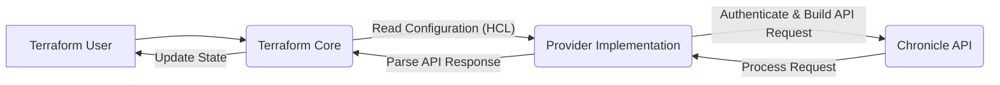

## Project Design Document: Terraform Provider for Chronicle

**Project Name:** terraform-provider-chronicle

**Version:** v1.5-dev (Based on file analysis including provider.go, resource files, test files, and new files: timeout.go, util.go, validation.go, client.go, endpoints.go, error.go, feed/\*.go, reference\_list.go, rule.go, subject.go, transport.go, version/version.go)

**Date:** 2024-07-24

**Author:** Gemini (AI Assistant)

### 1. Introduction

This document outlines the design of the Terraform provider for Chronicle. This provider allows users to manage Chronicle resources using HashiCorp Terraform, an infrastructure-as-code tool. This document will serve as a basis for future threat modeling activities.

### 2. System Overview

The Terraform provider acts as an intermediary between the Terraform user and the Chronicle API. It translates Terraform configurations into API calls to create, read, update, and delete (CRUD) resources within the Chronicle platform.

**Purpose:**

*   Enable infrastructure-as-code management for Chronicle resources.
*   Automate the provisioning and configuration of Chronicle services.
*   Provide a consistent and repeatable way to manage Chronicle deployments.

### 3. Components

The main components of the Terraform provider are:

*   **Terraform Core:** The underlying Terraform framework that manages the provider and resource lifecycle.
*   **Provider Implementation:** The Go code that implements the logic for interacting with the Chronicle API. This includes:
    *   **Authentication Handling:** Manages authentication to the Chronicle API using various methods (credentials file, access token, environment variables) for different Chronicle APIs (Backstory, BigQuery, Ingestion, Forwarder). The provider uses the `golang.org/x/oauth2` library for handling OAuth 2.0 authentication. The `client/util.go` file contains the `pathOrContents` function which is used to read credentials or tokens from a file path or directly from the provided string. This function also handles expanding the `~` character to the user's home directory.
    *   **Resource Definitions:** Defines the schema and lifecycle management for each manageable Chronicle resource (e.g., feeds, rules, reference lists, RBAC subjects).
    *   **API Client:**  Wraps the Chronicle API calls, handling request construction, response parsing, and error handling. It allows setting custom endpoints for various Chronicle services. The client utilizes the `net/http` package for making HTTP requests and includes retry logic using the `github.com/avast/retry-go` library. It also incorporates rate limiting for API calls using `golang.org/x/time/rate`.
    *   **Rate Limiters:** Implements rate limiting for different Chronicle API operations to avoid exceeding API limits. Rate limiters are defined for feed management, rule management, RBAC subject management, and reference list management.
*   **Chronicle API:** The set of RESTful APIs exposed by the Chronicle platform for managing its services.
*   **User Configuration (Terraform files):**  HCL (HashiCorp Configuration Language) files written by users to define the desired state of their Chronicle resources.

### 4. Data Flow

The following diagram illustrates the data flow during a typical Terraform operation (e.g., `terraform apply`):

**Detailed Data Flow:**

1. **User Action:** A user executes a Terraform command (e.g., `terraform apply`).
2. **Terraform Core Processing:** Terraform Core reads the configuration files (`.tf`) and identifies the resources managed by the Chronicle provider.
3. **Provider Invocation:** Terraform Core invokes the Chronicle provider implementation for each relevant resource.
4. **Authentication:** The provider uses the configured authentication details (from the provider configuration block in the Terraform file or environment variables) to authenticate with the specific Chronicle API required for the resource being managed (e.g., Ingestion API for feeds, Subjects API for RBAC subjects). The provider prioritizes authentication methods in the following order: Credentials file through Terraform configuration, Access Token through Terraform configuration, and finally Environment Variables. The `client.GetCredentials` function handles the logic for retrieving credentials based on the configured method. The `client/util.go`'s `pathOrContents` function is used to read the content of the credential or token files if a file path is provided.
5. **API Request Construction:** Based on the resource definition and the desired state in the configuration, the provider constructs API requests to the Chronicle API. This includes handling specific details for each resource type, like S3 URI and authentication details for `chronicle_feed_amazon_s3`, and SQS queue details for `chronicle_feed_amazon_sqs`. For resources like `chronicle_feed_microsoft_office_365_management_activity`, it includes the `tenant_id`, `content_type`, `client_id`, and `client_secret`. For `chronicle_feed_okta_system_log` and `chronicle_feed_okta_users`, it includes the `hostname` and authentication details (`key` and `value`). For `chronicle_feed_proofpoint_siem`, it includes authentication details (`user` and `secret`). For `chronicle_feed_qualys_vm`, it includes the `hostname` and authentication details (`user` and `secret`). For `chronicle_feed_thinkst_canary`, it includes the `hostname` and authentication details (`key` and `value`). For `chronicle_rbac_subject`, it includes the `name`, `type`, and `roles`. For `chronicle_reference_list`, it includes the `name`, `description`, `content_type`, and `lines`. For `chronicle_rule`, it includes the `rule_text` and optional `live_enabled` and `alerting_enabled` flags. The `rule_text` for the `chronicle_rule` resource can be loaded from a file using the `file()` function in Terraform, as shown in the example configuration.
6. **API Interaction:** The provider sends the API requests to the specified Chronicle API endpoints. Custom endpoints can be configured for services like Events, Alert, Artifact, Alias, Asset, IOC, Rule, Feed, and Subjects. The `client.sendRequest` function handles the HTTP request, including setting headers and encoding the request body. It also implements retry logic with backoff. Rate limiters are checked before sending requests to avoid exceeding API limits.
7. **Chronicle API Processing:** The Chronicle API processes the requests and performs the corresponding actions on the Chronicle platform.
8. **API Response:** The Chronicle API sends back a response to the provider, indicating the success or failure of the operation.
9. **Response Parsing:** The provider parses the API response to extract relevant information, such as resource IDs and status. For resources like `chronicle_feed_amazon_s3` and `chronicle_feed_azure_blobstore`, the provider handles cases where certain attributes (like `source_delete_options` and authentication details) are not returned during read operations. Similarly, for `chronicle_feed_microsoft_office_365_management_activity`, `chronicle_feed_okta_system_log`, `chronicle_feed_okta_users`, `chronicle_feed_proofpoint_siem`, `chronicle_feed_qualys_vm`, and `chronicle_feed_thinkst_canary`, the authentication details are not returned during read operations and are retained from the original configuration. For `chronicle_rbac_subject`, the provider retrieves the `name`, `type`, and associated `roles`. For `chronicle_reference_list`, the provider retrieves the `name`, `description`, `content_type`, `lines`, and `create_time`. For `chronicle_rule`, the provider retrieves the `rule_text`, `version_id`, `rule_name`, `metadata`, `rule_type`, `live_enabled`, `alerting_enabled`, `version_create_time`, `compilation_state`, and `compilation_error`. The `client` package defines specific error handling logic in `error.go`.
10. **State Update:** Terraform Core updates its state file to reflect the actual state of the managed Chronicle resources.
11. **User Feedback:** Terraform Core provides feedback to the user about the outcome of the operation.

### 5. Managed Resources

The provider currently supports the management of the following Chronicle resources:

*   **`chronicle_feed_amazon_s3`**: Manages feeds ingesting data from Amazon S3 buckets.
    *   Supports the following `s3_source_type` values:
        *   `FILES`: The URI points to a single file.
        *   `FOLDERS`: The URI points to a directory, ingesting all files within.
        *   `FOLDERS_RECURSIVE`: The URI points to a directory, recursively ingesting all files and subdirectories.
    *   Supports the following `source_delete_options` values:
        *   `SOURCE_DELETION_NEVER`: Never delete source files.
        *   `SOURCE_DELETION_ON_SUCCESS`: Delete files and empty directories after successful ingestion.
        *   `SOURCE_DELETION_ON_SUCCESS_FILES_ONLY`: Delete files after successful ingestion.
*   **`chronicle_feed_amazon_sqs`**: Manages feeds ingesting data from Amazon SQS queues.
    *   Supports the following `source_delete_options` values:
        *   `SOURCE_DELETION_NEVER`: Never delete source files in the S3 bucket.
        *   `SOURCE_DELETION_ON_SUCCESS`: Delete files and empty directories from the S3 bucket after successful ingestion.
        *   `SOURCE_DELETION_ON_SUCCESS_FILES_ONLY`: Delete files from the S3 bucket after successful ingestion.
    *   Supports optional S3 authentication details for accessing S3 buckets referenced in the SQS messages.
*   **`chronicle_feed_azure_blobstore`**: Manages feeds ingesting data from Azure Blob Storage.
    *   Supports the following `source_type` values:
        *   `FILES`: The URI points to a single file.
        *   `FOLDERS`: The URI points to a directory, ingesting all files within.
        *   `FOLDERS_RECURSIVE`: The URI points to a directory, recursively ingesting all files and subdirectories.
    *   Supports the following `source_delete_options` values:
        *   `SOURCE_DELETION_NEVER`: Never delete files from the source.
    *   Requires either `shared_key` or `sas_token` for authentication.
*   **`chronicle_feed_google_cloud_storage_bucket`**: Manages feeds ingesting data from Google Cloud Storage buckets.
    *   Supports the following `bucket_source_type` values:
        *   `FILES`: The URI points to a single file.
        *   `FOLDERS`: The URI points to a directory, ingesting all files within.
        *   `FOLDERS_RECURSIVE`: The URI points to a directory, recursively ingesting all files and subdirectories.
    *   Supports the following `source_delete_options` values:
        *   `SOURCE_DELETION_NEVER`: Never delete files from the source.
        *   `SOURCE_DELETION_ON_SUCCESS`: Delete files and empty directories from the source after successful ingestion.
        *   `SOURCE_DELETION_ON_SUCCESS_FILES_ONLY`: Delete files from the source after successful ingestion.
*   **`chronicle_feed_microsoft_office_365_management_activity`**: Manages feeds ingesting Microsoft Office 365 Management Activity logs.
    *   Supports the following `content_type` values:
        *   `AUDIT_AZURE_ACTIVE_DIRECTORY`
        *   `AUDIT_EXCHANGE`
        *   `AUDIT_SHARE_POINT`
        *   `AUDIT_GENERAL`
        *   `DLP_ALL`
    *   Requires `client_id` and `client_secret` for authentication. The `client_secret` is marked as sensitive.
    *   The `hostname` attribute is optional and defaults to `manage.office.com/api/v1.0`.
    *   Requires `tenant_id`.
*   **`chronicle_feed_okta_system_log`**: Manages feeds ingesting Okta System Logs.
    *   Requires `hostname` for the Okta instance.
    *   Requires an `authentication` block with:
        *   `key`:  The Okta authorization key.
        *   `value`: The Okta API token. This value is marked as sensitive.
*   **`chronicle_feed_okta_users`**: Manages feeds ingesting Okta User data.
    *   Requires `hostname` for the Okta instance.
    *   Supports an optional `manager_id` which is a JSON field path pointing to the field containing the manager ID in the Okta Users API response.
    *   Requires an `authentication` block with:
        *   `key`: The Okta authorization key.
        *   `value`: The Okta API token. This value is marked as sensitive.
*   **`chronicle_feed_proofpoint_siem`**: Manages feeds ingesting Proofpoint SIEM logs.
    *   Requires an `authentication` block with:
        *   `user`: Proofpoint user.
        *   `secret`: Proofpoint secret. This value is marked as sensitive.
*   **`chronicle_feed_qualys_vm`**: Manages feeds ingesting Qualys VM data.
    *   Requires `hostname` for the Qualys VM API endpoint.
    *   Requires an `authentication` block with:
        *   `user`: Username for Qualys API access.
        *   `secret`: Password for Qualys API access. This value is marked as sensitive.
*   **`chronicle_feed_thinkst_canary`**: Manages feeds ingesting Thinkst Canary alerts.
    *   Requires `hostname` for the Thinkst Canary instance.
    *   Requires an `authentication` block with:
        *   `key`: The Thinkst Canary authentication key. Defaults to `auth_token`.
        *   `value`: The Thinkst Canary API token. This value is marked as sensitive.
*   **`chronicle_rbac_subject`**: Manages Role-Based Access Control (RBAC) subjects and their assigned roles.
    *   Requires `name` for the subject ID.
    *   Requires `type` for the subject type (e.g., `SUBJECT_TYPE_ANALYST`, `SUBJECT_TYPE_IDP_GROUP`).
    *   Requires a list of `roles` to assign to the subject.
*   **`chronicle_reference_list`**: Manages reference lists used in Chronicle rules.
    *   Requires a `name` for the reference list.
    *   Requires a `description` for the reference list.
    *   Supports an optional `content_type` which defaults to `CONTENT_TYPE_DEFAULT_STRING`. Supported values are `CONTENT_TYPE_DEFAULT_STRING`, `REGEX`, and `CIDR`.
    *   Requires a list of `lines` for the reference list content.
*   **`chronicle_rule`**: Manages Chronicle detection rules.
    *   Requires `rule_text` containing the YARA-L 2.0 rule definition. The rule text can be provided directly or loaded from a file using the `file()` function in Terraform.
    *   Supports optional `live_enabled` and `alerting_enabled` flags.

### 6. Authentication Methods

The provider supports the following authentication methods for connecting to the Chronicle API:

*   **Credentials File:** JSON file containing service account credentials. This can be provided directly in the provider configuration using attributes like `backstoryapi_credentials`, `bigqueryapi_credentials`, `ingestionapi_credentials`, and `forwarderapi_credentials`. The content can be a local file path or the content of the file itself. It can also be provided via environment variables with base64 encoding (e.g., `CHRONICLE_BACKSTORY_CREDENTIALS`). The `client/util.go` file's `pathOrContents` function handles reading the file content if a path is provided.
*   **Access Token:** OAuth 2.0 access token. This can be provided directly in the provider configuration using attributes like `backstoryapi_access_token`, `bigqueryapi_access_token`, `ingestionapi_access_token`, and `forwarderapi_access_token`. The content can be a local file path or the content of the file itself. The `client/util.go` file's `pathOrContents` function handles reading the file content if a path is provided.
*   **Environment Variables:** Credentials or access tokens can be supplied through environment variables (e.g., `CHRONICLE_REGION`, `CHRONICLE_BACKSTORY_CREDENTIALS`).

The order of precedence for API configuration is: `Credential file through TF > Access Token through TF > Environment Variable`. Specific credentials or tokens can be configured for different Chronicle APIs (Backstory, BigQuery, Ingestion, Forwarder). This precedence is handled within the `client.GetCredentials` function.

### 7. Configuration

The provider is configured using a `provider` block in the Terraform configuration file. The following configuration options are available:

*   **`region` / `CHRONICLE_REGION`:** The Chronicle region to connect to (e.g., "us", "europe"). Defaults to "europe". Valid regions are defined in `client/endpoints.go`.
*   **Authentication:**
    *   `backstoryapi_credentials` / `CHRONICLE_BACKSTORY_CREDENTIALS`
    *   `backstoryapi_access_token`
    *   `bigqueryapi_credentials` / `CHRONICLE_BIGQUERY_CREDENTIALS`
    *   `bigqueryapi_access_token`
    *   `ingestionapi_credentials` / `CHRONICLE_INGESTION_CREDENTIALS`
    *   `ingestionapi_access_token`
    *   `forwarderapi_credentials` / `CHRONICLE_FORWARDER_CREDENTIALS`
    *   `forwarderapi_access_token`
*   **API Endpoints (Optional):** Custom URLs for specific Chronicle API endpoints. These can also be set via environment variables:
    *   `events_custom_endpoint` / `CHRONICLE_EVENTS_CUSTOM_ENDPOINT`
    *   `alert_custom_endpoint` / `CHRONICLE_ALERT_CUSTOM_ENDPOINT`
    *   `artifact_custom_endpoint` / `CHRONICLE_ARTIFACT_CUSTOM_ENDPOINT`
    *   `alias_custom_endpoint` / `CHRONICLE_ALIAS_CUSTOM_ENDPOINT`
    *   `asset_custom_endpoint` / `CHRONICLE_ASSET_CUSTOM_ENDPOINT`
    *   `ioc_custom_endpoint` / `CHRONICLE_IOC_CUSTOM_ENDPOINT`
    *   `rule_custom_endpoint` / `CHRONICLE_RULE_CUSTOM_ENDPOINT`
    *   `feed_custom_endpoint` / `CHRONICLE_FEED_CUSTOM_ENDPOINT`
    *   `subjects_custom_endpoint` / `CHRONICLE_SUBJECTS_CUSTOM_ENDPOINT`
*   **`request_attempts`:** Number of retries for API requests. Defaults to 5. This value is used by the `retry.Do` function in `client/transport.go`.
*   **`request_timeout`:** Timeout for API requests in seconds. Defaults to 120. This value is used to set the `Timeout` for the `http.Client` in `client/client.go`.

### 8. Security Considerations

Based on the analysis of the provider code and resource configurations, the following security considerations are relevant:

*   **Secret Management:** Credentials and access tokens for various Chronicle APIs are sensitive information.
    *   The provider allows providing these secrets directly in the Terraform configuration or via environment variables.
    *   Storing credentials directly in Terraform files is strongly discouraged.
    *   Using environment variables can be less secure if not managed properly. Ensure appropriate access controls and secure storage for environment variables.
    *   Consider using Terraform's built-in secret management features or external secret management tools to handle credentials.
    *   The `chronicle_feed_amazon_s3` and `chronicle_feed_amazon_sqs` resources require AWS access keys and secret keys, which are also sensitive. These should be handled with the same level of care as Chronicle API credentials. The `secret_access_key` attribute in these resources is marked as sensitive in the schema. Similarly, `chronicle_feed_azure_blobstore` requires a `shared_key` or `sas_token`, and `chronicle_feed_microsoft_office_365_management_activity` requires `client_secret`, `chronicle_feed_okta_system_log` and `chronicle_feed_okta_users` require the `value` in the `authentication` block, `chronicle_feed_proofpoint_siem` requires `secret`, `chronicle_feed_qualys_vm` requires `secret`, and `chronicle_feed_thinkst_canary` requires the `value` in the `authentication` block, all of which are marked as sensitive. The `client/util.go` file provides functionality to read these secrets from files, which can improve secret management if the files are properly secured.
*   **Authentication and Authorization:** The provider relies on the authentication mechanisms provided by the Chronicle API. The security of the provider is directly tied to the security of these APIs. Ensure that the service accounts or users associated with the provided credentials have the necessary permissions and follow the principle of least privilege.
*   **Network Security:** Communication between the provider and the Chronicle API should be secured (HTTPS).
*   **State File Security:** The Terraform state file contains information about the managed infrastructure, including resource IDs and potentially sensitive information. Securing the state file is critical. Use remote backends with encryption for storing the state file.
*   **Provider Binary Integrity:** Ensuring the integrity of the provider binary is important to prevent malicious modifications. The use of checksums and signed releases helps mitigate this risk.
*   **Access Control:** Permissions granted to the service accounts or users associated with the provided credentials should follow the principle of least privilege.
*   **Logging and Auditing:** Terraform execution logs and Chronicle API logs should be monitored for suspicious activity.
*   **Input Validation:** The provider implements validation functions (e.g., `validateCredentials`, `validateRegion`, `validateCustomEndpoint`, `validateAWSAccessKeyID`, `validateAWSSecretAccessKey`, `validateAWSAccountID`, `validateFeedS3SourceType`, `validateFeedS3SourceDeleteOption`, `validateFeedAzureBlobStoreSourceType`, `validateFeedAzureBlobStoreSourceDeleteOption`, `validateGCSURI`, `validateFeedGCSSourceType`, `validateFeedGCSSourceDeleteOption`, `validateUUID`, `validateFeedMicrosoftOffice365ManagementActivityContentType`, `validateThinkstCanaryHostname`, `validateReferenceListContentType`) to sanitize user-provided input and prevent injection attacks or other vulnerabilities. These validation functions are defined in `chronicle/validation.go`.
*   **Dependency Management:** The provider relies on external Go libraries. Vulnerability scanning of these dependencies is important. The `go.mod` file lists the dependencies and their versions, which can be used for vulnerability analysis.
*   **Testing:** Acceptance tests (`make testacc`) require setting environment variables for Chronicle API credentials and cloud provider credentials (AWS, Azure), highlighting the need for secure handling of these credentials even in testing environments. Test files also reveal attributes marked as sensitive (`shared_key`, `sas_token`, `client_secret`, `sqs_secret_access_key`, `s3_secret_access_key`, the `value` field in `chronicle_feed_okta_system_log`, `chronicle_feed_okta_users`, and `chronicle_feed_thinkst_canary`, and the `secret` field in `chronicle_feed_proofpoint_siem` and `chronicle_feed_qualys_vm`).

### 9. Build and Development

The `README.md` and `GNUmakefile` provide instructions for building and debugging the provider:

*   **Building:** `make build` (as defined in the `GNUmakefile`). This command compiles the provider.
*   **Debugging:** Uses `dlv` (Delve debugger) and requires setting environment variables for provider re-attachment.
*   **Testing:** `make test` (unit tests), `make testacc` (acceptance tests - requires environment variables for Chronicle API credentials and cloud provider credentials). These commands are defined in the `GNUmakefile`. The `tools/tools.go` file indicates the use of `tfplugindocs` for documentation generation.

### 10. Release Process

The release process is automated using GitHub Actions and `goreleaser`:

*   Merging to the `master` branch triggers a GitHub Action.
*   The action pushes a new tag.
*   The tag triggers the `goreleaser` action.
*   `goreleaser` builds the provider binaries for different platforms and uploads them to a GitHub release.

### 11. Further Analysis

Further analysis of the code will be necessary to:

*   Understand the specific API calls being made for each resource in detail, including request and response structures. The `client` package, particularly the feed, rule, subject, and reference list files, contains the logic for constructing and sending these API requests.
*   Identify any potential vulnerabilities in the provider's code, such as insecure handling of credentials or insufficient input validation, especially in edge cases or error handling.
*   Map the provider's functionality to specific security controls and compliance requirements.
*   Review the implementation of custom endpoint handling for potential security implications.
*   Analyze the logic within the `expandConcreteFeedConfiguration` and `flattenDetailsFromReadOperation` functions for each feed resource to understand how data is transformed and if any sensitive data handling requires further scrutiny. The `flattenDetailsFromReadOperation` functions for `chronicle_feed_azure_blobstore`, `chronicle_feed_microsoft_office_365_management_activity`, `chronicle_feed_okta_system_log`, `chronicle_feed_okta_users`, `chronicle_feed_proofpoint_siem`, `chronicle_feed_qualys_vm`, and `chronicle_feed_thinkst_canary` explicitly retain the original authentication details as these are not returned by the API on read operations, which is a crucial security consideration.
*   Analyze the implementation of the `resourceRBACSubject`, `resourceReferenceList`, and `resourceRule` to understand the specific API interactions for managing these resources and identify any potential security considerations.
*   Analyze the rate limiting logic implemented in `client/endpoints.go` and how it impacts the provider's behavior under heavy load or potential denial-of-service scenarios.
*   Review the error handling mechanisms in `client/error.go` and how the provider responds to different types of API errors.
