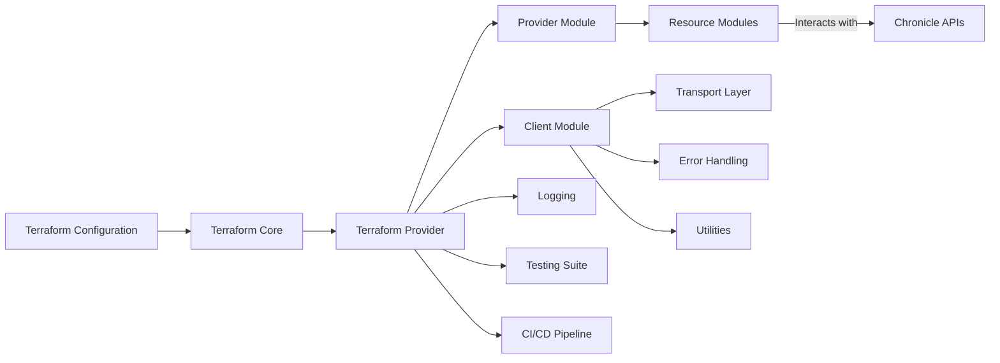
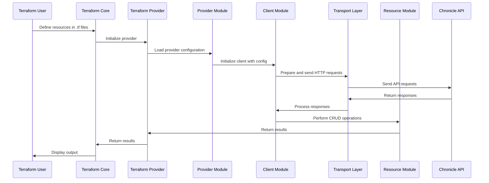

# Project Design Document: Terraform Provider for Chronicle

## Table of Contents

1. [Introduction](#introduction)
2. [Architecture Overview](#architecture-overview)
3. [Components](#components)
   - [Main Module](#main-module)
   - [Provider Module](#provider-module)
   - [Client Module](#client-module)
   - [Resources](#resources)
     - [Feed Resources](#feed-resources)
     - [RBAC Subjects](#rbac-subjects)
     - [Reference Lists](#reference-lists)
     - [Rules](#rules)
   - [Error Handling](#error-handling)
   - [Transport Layer](#transport-layer)
   - [Utilities](#utilities)
   - [Testing](#testing)
   - [CI/CD Pipeline](#cicd-pipeline)
   - [Build and Development Process](#build-and-development-process)
4. [Data Flow](#data-flow)
5. [Security Considerations](#security-considerations)
6. [Logging](#logging)
7. [Future Improvements](#future-improvements)
8. [Appendix](#appendix)

---

## Introduction

The **Terraform Provider for Chronicle** enables users to manage Chronicle resources declaratively using HashiCorp Terraform. This provider facilitates the creation, management, and deletion of Chronicle feeds, reference lists, RBAC subjects, and rules, integrating seamlessly with various Chronicle APIs. The objective is to provide a robust, secure, and efficient means to automate Chronicle resource management within Terraform workflows.

## Architecture Overview

The provider follows the standard Terraform provider architecture, leveraging the Terraform Plugin SDK to interact with Chronicle's APIs. It is built using Go, ensuring high performance and reliability. The architecture is modular, with distinct components handling different aspects of resource management, error handling, integrations, and utility functions.



## Components

### Main Module

- **`main.go`**: Initializes the Terraform provider using the Plugin SDK. It sets up the provider with debugging capabilities and serves it to Terraform.

    ```go
    func main() {
    	var debug bool

    	flag.BoolVar(&debug, "debug", false, "set to true to run the provider with support for debuggers like delve")
    	flag.Parse()

    	plugin.Serve(&plugin.ServeOpts{
    		Debug:        debug,
    		ProviderFunc: chronicle.Provider,
    	})
    }
    ```

### Provider Module

- **`provider.go`**: Defines the provider schema, configuring global settings such as regions, credentials, and custom endpoints. It maps resources like feeds, RBAC subjects, reference lists, and rules to their respective modules.

    ```go
    func Provider() *schema.Provider {
    	provider := &schema.Provider{
    		Schema: map[string]*schema.Schema{
    			// Global configuration parameters
    		},

    		ResourcesMap: map[string]*schema.Resource{
    			"chronicle_feed_amazon_s3": NewResourceFeedAmazonS3().TerraformResource,
    			// Additional resources
    		},
    	}

    	provider.ConfigureContextFunc = func(ctx context.Context, d *schema.ResourceData) (interface{}, diag.Diagnostics) {
    		return providerConfigure(ctx, d, provider)
    	}

    	return provider
    }
    ```

### Client Module

The **Client Module** is responsible for interacting with Chronicle's APIs. It encapsulates the logic for sending HTTP requests, handling responses, managing rate limiting, and retry mechanisms.

- **`client/transport.go`**: Manages the transport layer, including request preparation, sending, and response handling with retry logic.

    ```go
    func sendRequest(client *Client, httpClient *http.Client, method, userAgent string, rawurl string, body interface{}) ([]byte, error) {
        // Implementation with retry logic
    }

    func addQueryParams(rawurl string, params map[string]string) (string, error) {
        // Adds query parameters to the URL
    }
    ```

- **`client/util.go`**: Provides utility functions for the client module, such as environment variable searches and JSON tag mappings.

    ```go
    func envSearch(s string) string {
        if v := os.Getenv(s); v != "" {
            return v
        }
        return ""
    }

    func toMapWithJSONTags(i interface{}) (map[string]interface{}, error) {
        // Converts struct to map using JSON tags
    }
    ```

### Resources

#### Feed Resources

Manage various feed types such as Amazon S3, Amazon SQS, Azure Blobstore, Google Cloud Storage Bucket, and multiple API integrations like Microsoft Office 365, Okta, Proofpoint SIEM, Qualys VM, and Thinkst Canary.

- **`client/feed.go`**: Contains generic feed operations like Create, Update, Read, and Destroy.

- **Specific Feed Configuration Files**:

  - **`client/feed_amazon_s3.go`**
  - **`client/feed_amazon_sqs.go`**
  - **`client/feed_azure_blobstore.go`**
  - **`client/feed_google_cloud_storage_bucket.go`**
  - **`client/feed_microsoft_office_365_management_activity.go`**
  - **`client/feed_okta_system_log.go`**
  - **`client/feed_okta_users.go`**
  - **`client/feed_proofpoint_siem.go`**
  - **`client/feed_qualys_vm.go`**
  - **`client/feed_thinkst_canary.go`**

Each of these files defines the specific configuration structures and methods required to manage different types of Chronicle feeds.

- **Example: `client/feed_amazon_s3.go`**

    ```go
    type S3FeedConfiguration struct {
    	URI                 string               `json:"s3Uri,omitempty"`
    	SourceType          string               `json:"sourceType,omitempty"`
    	SourceDeleteOptions string               `json:"sourceDeletionOption,omitempty"`
    	Authentication      S3FeedAuthentication `json:"authentication,omitempty"`
    }
    ```

#### RBAC Subjects

Handle role-based access control subjects, managing roles and permissions within Chronicle.

- **`client/subject.go`**: Defines the `Subject` struct and methods to Get, Create, Update, and Delete subjects.

    ```go
    type Subject struct {
    	Name  string `json:"name"`
    	Type  string `json:"type"`
    	Roles []Role `json:"roles,omitempty"`
    }

    func (cli *Client) GetSubject(name string) (*Subject, error) {
        // Implementation
    }

    func (cli *Client) CreateSubject(subject Subject) error {
        // Implementation
    }

    // Additional methods...
    ```

#### Reference Lists

Manage reference lists used in rules, supporting different content types like default strings, regex, and CIDR.

- **`client/reference_list.go`**: Defines the `ReferenceList` struct and methods to Get, Create, and Update reference lists.

    ```go
    type ReferenceList struct {
    	Name        string                   `json:"name"`
    	Description string                   `json:"description,omitempty"`
    	Lines       []string                 `json:"lines,omitempty"`
    	ContentType ReferenceListContentType `json:"content_type,omitempty"`
    	CreateTime  string                   `json:"create_time,omitempty"`
    }

    func (cli *Client) GetReferenceList(name string) (*ReferenceList, error) {
        // Implementation
    }

    func (cli *Client) CreateReferenceList(referenceList ReferenceList) (string, error) {
        // Implementation
    }

    // Additional methods...
    ```

#### Rules

Define detection rules using YARA-L 2.0 syntax, handling rule creation, versioning, and validation.

- **`client/rule.go`**: Defines the `Rule` struct and methods to Get, Create, Update, Delete, and Verify YARA rules.

    ```go
    type Rule struct {
    	Text              string            `json:"ruleText"`
    	ID                string            `json:"ruleId,omitempty"`
    	// Additional fields...
    }

    func (cli *Client) GetRule(id string) (*Rule, error) {
        // Implementation
    }

    func (cli *Client) CreateRule(rule Rule) (string, error) {
        // Implementation
    }

    // Additional methods...
    ```

### Error Handling

Centralizes error handling across the provider, particularly for Chronicle API errors. It ensures graceful handling of not-found errors and wraps errors with contextual information.

- **`client/error.go`**: Defines custom error types and handling functions.

    ```go
    type ChronicleAPIError struct {
    	Message        string `json:"message"`
    	Result         string `json:"result"`
    	HTTPStatusCode int
    }

    func (c *ChronicleAPIError) Error() string {
    	return fmt.Sprintf("%s: %s, HTTP status code: %d", c.Result, c.Message, c.HTTPStatusCode)
    }

    func errorForStatusCode(r *http.Response, err error) error {
        // Implementation
    }
    ```

- **`client/errors_helper.go`**: Provides helper functions to handle specific error scenarios.

    ```go
    func HandleNotFoundError(err error, d *schema.ResourceData, resource string) error {
        if IsChronicleAPIErrorWithCode(err, 404) {
            log.Printf("Removing %s because it's gone", resource)
            d.SetId("")
            return nil
        }
        return fmt.Errorf("Error when reading or editing %s: %v", resource, err)
    }
    ```

### Transport Layer

Manages the HTTP transport mechanisms, including setting headers, handling retries, and managing rate limits.

- **`client/transport.go`**: Implements the `sendRequest` function with retry logic using the `retry-go` library.

    ```go
    func sendRequest(client *Client, httpClient *http.Client, method, userAgent string, rawurl string, body interface{}) ([]byte, error) {
        // Implementation with retry logic
    }

    func addQueryParams(rawurl string, params map[string]string) (string, error) {
        // Adds query parameters to the URL
    }
    ```

### Utilities

Provides utility functions that support various modules within the provider, enhancing code reusability and maintainability.

- **`client/util.go`**: Includes functions for environment variable searches, path handling, and JSON tag mappings.

    ```go
    func envSearch(s string) string {
        if v := os.Getenv(s); v != "" {
            return v
        }
        return ""
    }

    func toMapWithJSONTags(i interface{}) (map[string]interface{}, error) {
        // Converts struct to map using JSON tags
    }

    func pathOrContents(poc string) (string, bool, error) {
        // Determines if input is a path or direct content
    }
    ```

### Testing

Ensure the reliability and correctness of the provider through comprehensive testing strategies.

- **Unit Tests**: Implemented using Go's testing framework, covering individual functions and modules.

    - Example: `resource_feed_amazon_s3_test.go`

- **Acceptance Tests**: Validate the integration between Terraform and Chronicle APIs, ensuring resources are created, updated, and destroyed as expected.

    - Example: `resource_rule_test.go`

- **Pre-Check**: Ensures that necessary environment variables and credentials are set before running tests.

    ```go
    func testAccPreCheck(t *testing.T) {
    	if v := multiEnvSearch(chronicle.EnvAPICrendetialsVar); v == "" {
    		t.Fatalf("One of %s must be set for acceptance tests", strings.Join(chronicle.EnvAPICrendetialsVar, ", "))
    	}
    }
    ```

### CI/CD Pipeline

Automates build, linting, testing, and release processes using GitHub Actions.

- **GitHub Actions Workflows**:

  - **CI Workflow (`ci.yaml`)**: Builds and tests the provider on every pull request and push to the master branch.

    ```yaml
    name: CI
    on:
      pull_request:
        types:
          - synchronize
          - opened
          - reopened
      push:
        branches:
          - master

    jobs:
      build_test:
        runs-on: ubuntu-latest
        steps:
          - name: Checkout Code
            uses: actions/checkout@v4.1.1
          - name: Setup Golang
            uses: actions/setup-go@v4.1.0
            with:
              go-version-file: go.mod
          - name: Make
            run: make
    ```

  - **Lint Workflow (`lint.yaml`)**: Runs `golangci-lint` to ensure code quality and adherence to standards.

  - **Release Workflow (`release.yaml`)**: Upon merging to master and pushing a new tag, `goreleaser` handles building binaries and publishing releases.

### Build and Development Process

Facilitates the development and maintenance of the provider through standardized build processes managed via Makefile.

- **`GNUmakefile`**: Defines targets for building, testing, linting, installing, and managing dependencies.

    ```makefile
    SHELL := /bin/bash

    PROJECT_NAME := $(shell basename $(CURDIR))
    empty:=
    prefix:=terraform-provider-
    PROVIDER_NAME := $(subst $(prefix),$(empty),$(PROJECT_NAME))

    OS := $(shell go env GOHOSTOS)
    ARCH := $(shell go env GOHOSTARCH)
    LOCAL_PLUGIN_DIR := ~/.terraform.d/plugins/github.com/form3tech-oss/$(PROVIDER_NAME)/0.0.1/$(OS)_$(ARCH)


    GOFMT_FILES?=$$(find . -name '*.go' |grep -v vendor)

    default: lint build test

    test: fmtcheck
    	go test -v . ./chronicle

    testacc: fmtcheck
    	TF_ACC=1  go test -v ./chronicle -timeout 120m  -parallel 1

    build:
    	@go build -mod=vendor -o $(PROJECT_NAME)
    	@echo "Build succeeded"

    install: lint build
    	@mkdir -p $(LOCAL_PLUGIN_DIR)
    	@cp $(PROJECT_NAME) $(LOCAL_PLUGIN_DIR)/
    	@echo "Install succeeded"

    clean:
    	go clean -testcache

    fmt:
    	gofmt -w $(GOFMT_FILES)

    fmtcheck:
    	@sh -c "'$(CURDIR)/scripts/gofmtcheck.sh'"

    vet:
    	@echo "go vet ."
    	@go vet $$(go list ./... | grep -v /vendor | grep -v /tools) ; if [ $$? -eq 1 ]; then \
    		echo ""; \
    		echo "Vet found suspicious constructs. Please check the reported constructs"; \
    		echo "and fix them if necessary before submitting the code for review."; \
    		exit 1; \
    	fi

    lint: fmtcheck vet

    docs:
    	tfplugindocs generate

    vendor:
    	@go mod tidy && go mod vendor && go mod verify

    .PHONY: build install lint test clean testacc vet fmt fmtcheck docs vendor
    ```

## Data Flow

The data flow within the Terraform Provider for Chronicle can be visualized through the following sequence diagram:



## Security Considerations

Security is paramount in managing integrations with Chronicle APIs. The provider incorporates multiple layers of security to protect sensitive information and ensure compliant operations.

1. **Credential Management**:
   - **Environment Variables**: Credentials can be supplied via environment variables, ensuring they are not hard-coded.
   - **Base64 Encoding**: When using environment variables, credentials should be base64 encoded to add an extra layer of obfuscation.

2. **Sensitive Data Handling**:
   - **Schema Sensitivity**: Fields like `client_secret`, `secret_access_key`, and API tokens are marked as sensitive in the schema, preventing them from being displayed in logs or state files.
   - **Secure Storage**: Terraform's state files, which may contain sensitive data, should be stored securely, preferably using remote backends with encryption.

3. **API Request Security**:
   - **HTTPS Only**: All interactions with Chronicle APIs occur over HTTPS, ensuring data in transit is encrypted.
   - **Rate Limiting**: Implemented rate limiters to prevent abuse and potential denial-of-service conditions.

4. **Input Validation**:
   - **Regular Expressions**: Utilizes regex validation for fields like URIs, UUIDs, and access keys to prevent injection attacks.
   - **Structured Validation**: Ensures that input conforms to expected formats and allowed values.

5. **Access Control**:
   - **RBAC Integration**: Leverages Chronicle's RBAC APIs to manage permissions and roles, ensuring least privilege principles.

6. **Logging and Monitoring**:
   - **Audit Logs**: Provider operations are logged with appropriate severity levels, aiding in monitoring and incident response.
   - **Error Transparency**: Provides clear error messages without exposing sensitive information.

## Logging

Effective logging is crucial for both operational visibility and troubleshooting. The provider implements comprehensive logging strategies:

- **Subsystem Logging**: Utilizes Terraform's logging subsystem to categorize logs, aiding in filtering and analysis.

    ```go
    loggingTransport := logging.NewSubsystemLoggingHTTPTransport("Chronicle", client.Transport)
    client.Transport = loggingTransport
    ```

- **Log Levels**:
  - **DEBUG**: Detailed information useful for debugging.
  - **INFO**: General operational messages.
  - **WARN**: Indications of potential issues.
  - **ERROR**: Errors that prevent operations from completing.

- **Sensitive Data Protection**: Ensures that sensitive information is never logged, adhering to security best practices.

## Future Improvements

While the Terraform Provider for Chronicle is robust, there are areas identified for future enhancement:

1. **Enhanced Support for Additional Chronicle Services**:
   - Expand resource coverage to include more Chronicle services and entities.

2. **Improved Error Reporting**:
   - Implement more granular error messages and recovery strategies for various failure modes.

3. **State Management Enhancements**:
   - Optimize state file operations to handle larger configurations efficiently.

4. **Performance Optimizations**:
   - Implement concurrency controls and caching mechanisms to improve performance for large-scale deployments.

5. **Advanced Validation Rules**:
   - Incorporate more sophisticated validation logic to preemptively catch configuration issues.

6. **Comprehensive Documentation**:
   - Expand user guides and example configurations to cover a wider range of use cases.

7. **Integration with Terraform Registry**:
   - Streamline publishing and updating the provider on the Terraform Registry for easier adoption.

8. **Enhanced Testing Coverage**:
   - Increase the breadth and depth of unit and acceptance tests to cover more scenarios and edge cases.

## Appendix

### Credentials Handling

Credentials can be supplied in multiple ways:

1. **Direct Input**:
    ```hcl
    provider "chronicle" {
      backstoryapi_credentials = "path/to/credentials.json"
      region                   = "europe"
    }
    ```

2. **Environment Variables**:
   - **BigQuery API**: `CHRONICLE_BIGQUERY_CREDENTIALS`
   - **Backstory API**: `CHRONICLE_BACKSTORY_CREDENTIALS`
   - **Ingestion API**: `CHRONICLE_INGESTION_CREDENTIALS`
   - **Forwarder API**: `CHRONICLE_FORWARDER_CREDENTIALS`

   Ensure credentials are base64 encoded when using environment variables.

### Reference List Content Types

- **CONTENT_TYPE_DEFAULT_STRING**
- **REGEX**
- **CIDR**

### Build Commands

- **Build Provider Binary**:
    ```bash
    make build
    ```

- **Install Provider Locally**:
    ```bash
    make install
    ```

- **Run Tests**:
    ```bash
    make test
    ```

- **Generate Documentation**:
    ```bash
    make docs
    ```

### Example Configurations

Refer to the [Examples](#examples) section below for sample Terraform configurations demonstrating the usage of various resources.

---

This design document outlines the key components, architecture, and considerations involved in developing and maintaining the Terraform Provider for Chronicle. It serves as a foundation for threat modeling and ensures that security, performance, and usability are upheld throughout the provider's lifecycle.
