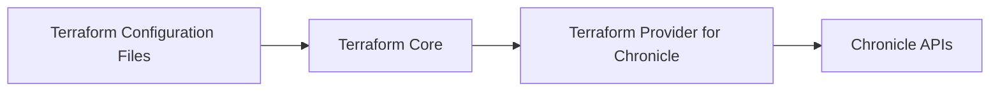

# Design Document for Terraform Provider for Chronicle

## Introduction

The Terraform Provider for Chronicle enables users to manage Google Chronicle resources using Terraform configurations. Google Chronicle is a cloud-based security analytics platform that ingests, normalizes, and analyzes security data for threat detection and investigation. By integrating with Terraform, users can automate the provisioning and management of Chronicle resources, ensuring consistent and reproducible infrastructure deployments.

## Architecture Overview

The provider is written in Go and leverages the HashiCorp Terraform Plugin SDK to interface with Terraform. It communicates with the Chronicle APIs to perform CRUD operations on resources such as feeds, rules, reference lists, and RBAC subjects.

### Components

- **Provider Configuration**: Defines the connection settings and authentication mechanisms to interact with Chronicle APIs.
- **Resources**: Terraform resource implementations for various Chronicle services, including feeds, rules, reference lists, and RBAC subjects.
- **Client**: Handles HTTP interactions with Chronicle APIs, including authentication, request building, response parsing, and error handling.
- **Utilities**: Helper functions for validation, error handling, data manipulation, and other common tasks.
- **Documentation Templates**: Templates used to generate documentation for the provider's resources.

### Component Interaction



1. **Terraform Configuration Files**: Users define the desired state using HCL (HashiCorp Configuration Language).
2. **Terraform Core**: Reads configurations, plans changes, and applies them by interacting with providers.
3. **Terraform Provider for Chronicle**: Translates Terraform resources into Chronicle API calls using the client.
4. **Chronicle APIs**: Execute operations on Chronicle resources and return responses to the provider.

## Provider Configuration

The provider accepts various configurations to authenticate and interact with Chronicle APIs.

### Authentication Methods

- **Credentials File**: Specify a local JSON file containing service account credentials.
- **Access Token**: Provide an access token directly.
- **Environment Variables**: Use environment variables to supply base64-encoded credentials.

### Configuration Options

- `region`: The Chronicle API region to target (e.g., `us`, `europe`).
- `request_timeout`: Request timeout in seconds (default: 120).
- `request_attempts`: Number of retry attempts for API requests (default: 5).
- Custom endpoints for various services (e.g., `alert_custom_endpoint`).

### Example Usage

```hcl
provider "chronicle" {
  backstoryapi_credentials = "path/to/credentials.json"
  region                   = "europe"
  request_attempts         = 5
  request_timeout          = 120
}
```

## Resources

The provider supports managing several types of Chronicle resources.

### Common Attributes

- `display_name`: User-friendly name for the resource.
- `enabled`: Boolean flag to enable or disable the resource.
- `namespace`: Namespace associated with the resource.
- `labels`: Map of key-value pairs for resource labeling.

### Feeds

Feeds define data ingestion points for Chronicle. They specify how and where Chronicle should collect security event data.

#### Supported Feed Types

- **Amazon S3 Feeds**: Ingest data from AWS S3 buckets.
- **Amazon SQS Feeds**: Ingest data from AWS SQS queues.
- **Azure Blob Store Feeds**: Ingest data from Azure Blob Storage.
- **Google Cloud Storage Feeds**: Ingest data from GCS buckets.
- **Microsoft Office 365 Management Activity Feeds**: Ingest data from Office 365.
- **Okta System Log Feeds**: Ingest data from Okta system logs.
- **Okta Users Feeds**: Ingest data from Okta user management.
- **Proofpoint SIEM Feeds**: Ingest data from Proofpoint SIEM.
- **Qualys VM Feeds**: Ingest data from Qualys Vulnerability Management.
- **Thinkst Canary Feeds**: Ingest data from Thinkst Canary tokens.
- **Custom Feeds**: Ingest data from custom HTTP endpoints or APIs.

#### Feed Configuration

Each feed type has specific configuration parameters and authentication mechanisms. The provider abstracts these configurations into concrete feed configurations implementing a common interface.

#### Concrete Feed Configurations

- **Amazon S3 Feed Configuration**
  - `s3_uri`: The S3 URI of the bucket or folder.
  - `s3_source_type`: How to interpret the S3 URI (e.g., `FOLDERS_RECURSIVE`).
  - `source_delete_options`: Options for deleting source files after ingestion.
  - **Authentication**:
    - `region`: AWS region of the S3 bucket.
    - `access_key_id`: AWS access key ID.
    - `secret_access_key`: AWS secret access key.

- **Amazon SQS Feed Configuration**
  - `queue`: The SQS queue name.
  - `region`: AWS region of the SQS queue.
  - `account_number`: AWS account number.
  - `source_delete_options`: Options for deleting source messages after ingestion.
  - **Authentication**:
    - `sqs_access_key_id`: AWS access key ID for SQS.
    - `sqs_secret_access_key`: AWS secret access key for SQS.
    - **S3 Authentication** (if necessary):
      - `access_key_id`: AWS access key ID for S3.
      - `secret_access_key`: AWS secret access key for S3.

- **Azure Blob Store Feed Configuration**
  - `azure_uri`: The Azure Blob Storage URI.
  - `source_type`: How to interpret the Azure URI.
  - `source_delete_options`: Options for deleting source blobs after ingestion.
  - **Authentication**:
    - `shared_key`: Shared access key.
    - `sas_token`: Shared access signature token.

- **Google Cloud Storage Feed Configuration**
  - `bucket_uri`: The GCS bucket URI.
  - `source_type`: How to interpret the bucket URI.
  - `source_delete_options`: Options for deleting source files after ingestion.

- **Microsoft Office 365 Management Activity Feed Configuration**
  - `tenant_id`: Office 365 tenant ID.
  - `content_type`: Type of content to ingest (e.g., `AUDIT_AZURE_ACTIVE_DIRECTORY`).
  - `hostname`: Office 365 API hostname.
  - **Authentication**:
    - `client_id`: Azure application client ID.
    - `client_secret`: Azure application client secret.

- **Okta System Log Feed Configuration**
  - `hostname`: Okta API hostname.
  - **Authentication**:
    - `key`: Header key for authentication (e.g., `Authorization`).
    - `value`: Header value (e.g., API token).

- **Okta Users Feed Configuration**
  - `hostname`: Okta API hostname.
  - `manager_id`: Reference field for manager IDs.
  - **Authentication**:
    - `key`: Header key for authentication.
    - `value`: Header value.

- **Proofpoint SIEM Feed Configuration**
  - **Authentication**:
    - `user`: Proofpoint user ID.
    - `secret`: Proofpoint user secret.

- **Qualys VM Feed Configuration**
  - `hostname`: Qualys API hostname.
  - **Authentication**:
    - `user`: Qualys user ID.
    - `secret`: Qualys user secret.

- **Thinkst Canary Feed Configuration**
  - `hostname`: Thinkst Canary API hostname.
  - **Authentication**:
    - `key`: API key name.
    - `value`: API key value.

#### Example: Amazon S3 Feed

```hcl
resource "chronicle_feed_amazon_s3" "example_s3_feed" {
  display_name = "example_s3_feed"
  log_type     = "GITHUB"
  enabled      = true
  namespace    = "default"
  labels = {
    "environment" = "production"
  }

  details {
    s3_uri                = "s3://my-s3-bucket/"
    s3_source_type        = "FOLDERS_RECURSIVE"
    source_delete_options = "SOURCE_DELETION_NEVER"

    authentication {
      region            = "EU_WEST_1"
      access_key_id     = "AWS_ACCESS_KEY_ID"
      secret_access_key = "AWS_SECRET_ACCESS_KEY"
    }
  }
}
```

### RBAC Subjects

Manage Chronicle RBAC subjects to control access permissions.

#### Attributes

- `name`: Unique identifier for the subject.
- `type`: Type of subject (e.g., `SUBJECT_TYPE_ANALYST`, `SUBJECT_TYPE_IDP_GROUP`).
- `roles`: List of roles assigned to the subject.

#### Example

```hcl
resource "chronicle_rbac_subject" "example_subject" {
  name  = "user@example.com"
  type  = "SUBJECT_TYPE_ANALYST"
  roles = ["Editor"]
}
```

### Reference Lists

Define reference lists used in detection rules for conditions or filtering.

#### Attributes

- `name`: Name of the reference list.
- `description`: Description of the list's purpose.
- `content_type`: Type of content (e.g., `CONTENT_TYPE_DEFAULT_STRING`, `REGEX`, `CIDR`).
- `lines`: Items in the reference list.

#### Example

```hcl
resource "chronicle_reference_list" "example_list" {
  name         = "blocked_ips"
  description  = "List of IPs to block"
  content_type = "CIDR"
  lines = [
    "192.168.0.0/24",
    "10.0.0.0/8"
  ]
}
```

### Rules

Manage detection rules written in YARA-L 2.0 language for threat detection.

#### Attributes

- `rule_text`: YARA-L rule definition.
- `alerting_enabled`: Enable or disable alerting for the rule.
- `live_enabled`: Enable or disable the rule for live processing.

#### Example

```hcl
resource "chronicle_rule" "example_rule" {
  rule_text        = file("rules/malware_detection.yar")
  alerting_enabled = true
  live_enabled     = true
}
```

## Client Implementation

The provider includes a client package responsible for API interactions.

### Features

- **Authentication**: Supports multiple methods, prioritizing credentials from provider configuration.
- **Rate Limiting**: Implements rate limiting using Go's `rate.Limiter` to comply with API quotas.
- **Retry Logic**: Handles transient errors with exponential backoff up to the configured `request_attempts`.
- **Error Handling**: Utilizes custom error types for detailed error information.

### Authentication Methods

- **Credentials File**: Parses JSON credentials from a file.
- **Access Token**: Uses a provided access token for OAuth2 authentication.
- **Environment Variables**: Reads base64-encoded credentials from environment variables.

### Error Handling

- **Custom Error Types**: Defines `ChronicleAPIError` to encapsulate API error details, including HTTP status codes and error messages.
- **Error Parsing**: Parses error responses from Chronicle APIs to provide meaningful error messages.
- **Client-Side vs. Server-Side Errors**: Differentiates between types of errors to aid in troubleshooting.

### Retry Logic

- **Retry Mechanism**: Implements retries for API calls using `github.com/avast/retry-go`.
- **Exponential Backoff**: Uses exponential backoff strategy for retries, configurable via `request_attempts`.
- **Error Logging**: Logs retry attempts and errors for visibility.

### HTTP Transport

- **Request Building**: Constructs HTTP requests with appropriate headers and query parameters.
- **Response Handling**: Processes HTTP responses, checks for errors, and decodes JSON bodies.
- **Utility Functions**: Includes helper functions like `sendRequest` and `addQueryParams` for HTTP interactions.

## Build and Development

### Prerequisites

- **Go**: Go programming language (version 1.21+).
- **Make**: For running build and test scripts.
- **GNU Makefile**: Contains build, test, and linting targets.

### Building the Provider

```bash
make build
```

### Testing

- **Unit Tests**: Run with `make test`.
- **Acceptance Tests**: Run with `make testacc`. Note that these tests create real resources and require valid credentials.

### Formatting and Linting

- **Formatting**: Use `make fmt` to format code using `gofmt`.
- **Linting**: Use `make lint` to run formatting checks and `go vet`.

### Debugging

1. Run the debug script:

   ```bash
   ./debug.sh
   ```

2. Initialize Terraform in the `examples/` directory:

   ```bash
   cd examples/
   terraform init
   ```

3. Attach a debugger to port `2345`.

4. Use the provided environment variables to run Terraform commands:

   ```bash
   TF_REATTACH_PROVIDERS='{...}' terraform plan
   ```

### Releasing

- **GitHub Actions**: Releases are automated via GitHub Actions and `goreleaser`.
- **Versioning**: The provider's version is set in the `version/version.go` file.
- **Tagging**: Pushing a new tag to the `master` branch triggers the release workflow.

## Documentation

### Templates

- **Markdown Templates**: Located in the `templates/` directory, used to generate documentation for resources.
- **Generation Tool**: Uses `tfplugindocs` to generate documentation from templates.

### Examples

- **Example Configurations**: Available in the `examples/` directory for various resources.
- **Usage**: Provide practical usage examples for users.

## Security Considerations

- **Credential Management**: Credentials should be securely stored and handled. Avoid hardcoding sensitive information.
- **Access Control**: Properly configure RBAC subjects to enforce least privilege.
- **Logging**: Ensure that sensitive information is not logged or exposed in logs.
- **Dependency Updates**: Regularly update dependencies to incorporate security patches.
- **Error Handling**: Properly handle and log errors without exposing sensitive information.

## Conclusion

The Terraform Provider for Chronicle streamlines the management of Chronicle resources using infrastructure-as-code principles. By defining security infrastructure declaratively, organizations can improve consistency, reduce manual errors, and integrate Chronicle resource management into automated pipelines.

---

This design document provides a comprehensive overview of the Terraform Provider for Chronicle, detailing its architecture, components, and usage. It integrates the latest developments from the project's codebase, including enhancements to the client implementation, new resource types, and updated development practices. It serves as a foundation for further development, deployment, and threat modeling activities.
