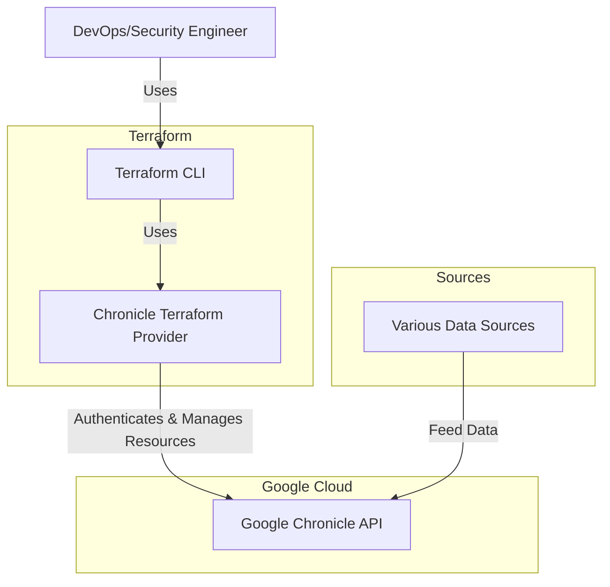
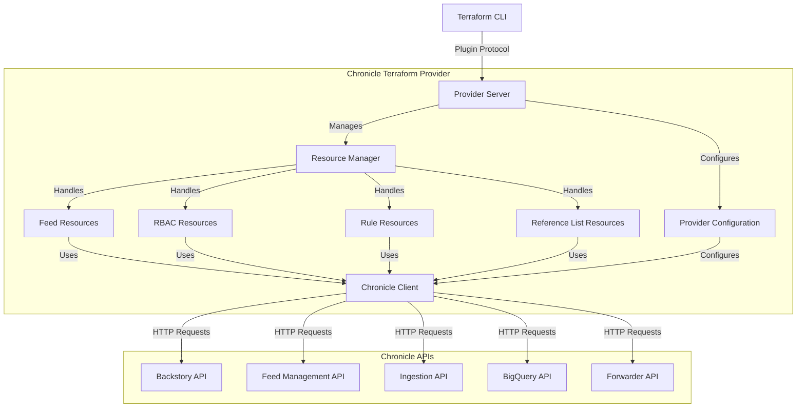
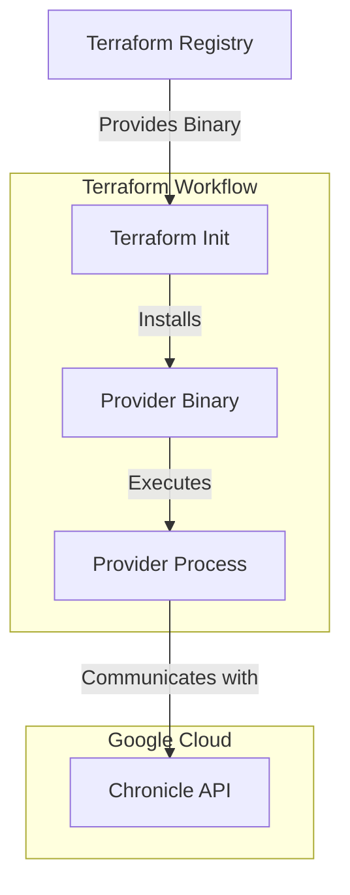
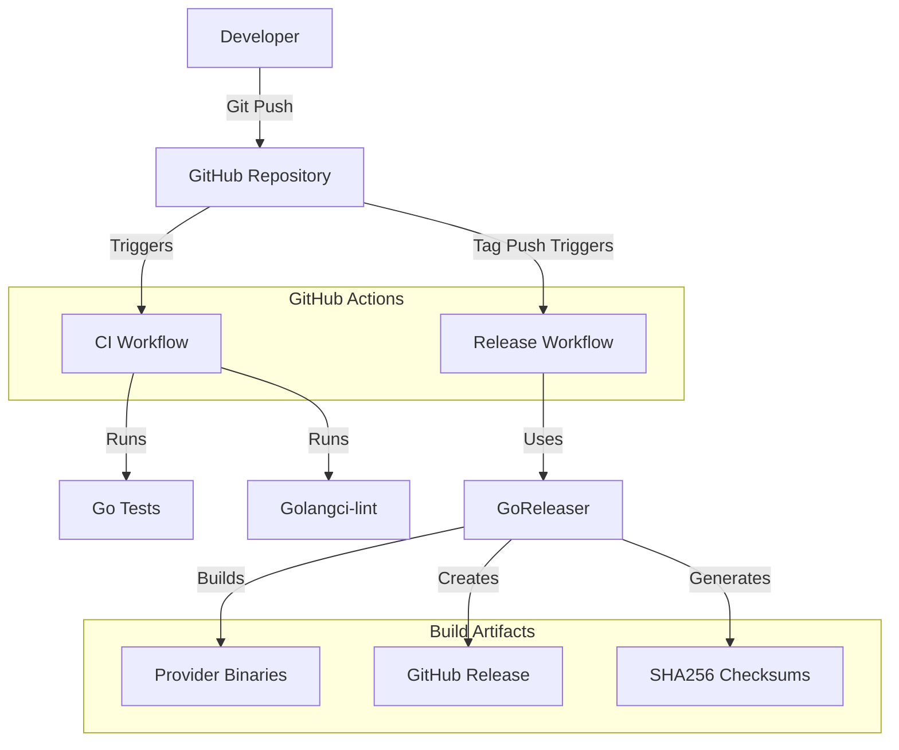

# BUSINESS POSTURE

The Chronicle Terraform provider project enables infrastructure automation for Google Cloud's Chronicle security platform. The main business priorities of this project are:

1. Enable security operations teams to define, deploy, and manage Chronicle resources through infrastructure as code
2. Support various data ingestion methods (feeds) to consolidate security data from multiple sources
3. Provide a consistent, programmable interface for managing security rules, reference lists, and access controls
4. Improve operational efficiency by automating Chronicle resource management

Key business risks that need to be addressed:

1. API credential management and security
2. Consistency and reliability in resource state management
3. Compatibility with Chronicle API changes
4. Maintaining accurate documentation for complex feed configurations

# SECURITY POSTURE

## Existing Security Controls

- Security control: Credentials protection through sensitive attribute marking in schema definitions. Implemented in all authentication-related fields that contain secrets or access tokens.

- Security control: Token-based authentication through various API endpoints. Implemented in provider.go with multiple authentication options.

- Security control: Environment variable fallback for credentials, reducing hard-coded secrets in Terraform files. Implemented in provider configuration.

- Security control: Request timeout and retry parameters to prevent hanging connections. Implemented in client configuration.

- Security control: Region validation to ensure API endpoints are legitimate. Implemented in provider validation functions.

- Security control: Rate limiting in API clients to prevent abuse or throttling. Implemented via ClientRateLimiters in endpoints.go.

- Security control: Sensitive data handling for feed authentication credentials (e.g., Thinkst Canary tokens, Qualys VM credentials, AWS keys). Implemented in resource schemas with Sensitive: true attributes.

- Security control: Validation functions for resource property formats to prevent misconfiguration. Implemented with ValidateDiagFunc across resources.

- Accepted risk: The provider currently stores state containing resource identifiers in the Terraform state file.

## Recommended Security Controls

- Implement credential rotation capabilities within the provider
- Add support for AWS IAM role-based authentication instead of just access keys
- Implement logging with sensitive data filtering
- Add support for service account impersonation
- Add SAST scanning for YARA-L rule content to identify potentially harmful rules
- Implement resource tagging for easier security auditing and management
- Add detection rule testing simulation before enabling in production

## Security Requirements

### Authentication
- Support for multiple authentication methods (credentials, access tokens, environment variables)
- Secure handling of sensitive authentication data
- Validation of authentication parameters
- API-specific credential isolation (BigQuery, Backstory, Ingestion, Forwarder)

### Authorization
- Support for RBAC subject management
- Clear separation of responsibilities in resource access
- Role-based access control for Chronicle resources

### Input Validation
- Parameter validation for all resource configurations
- URI format validation for storage endpoints
- UUID format validation for tenant and client IDs
- Hostname format validation for service endpoints
- YARA-L rule syntax validation

### Cryptography
- TLS for all API communications
- Secure handling of encryption keys and tokens
- Protection of sensitive authentication data

# DESIGN

## C4 CONTEXT

### Context Elements

| Name | Type | Description | Responsibilities | Security Controls |
|------|------|-------------|-----------------|-------------------|
| DevOps/Security Engineer | Person | User of the Terraform provider | Creates and maintains Terraform configurations for Chronicle resources | Follows secure coding practices, manages credentials securely |
| Terraform CLI | System | Command-line tool for applying Terraform configurations | Executes resource creation, updating, and deletion based on configuration | State encryption, secure variable handling |
| Chronicle Terraform Provider | System | Terraform provider for Chronicle | Translates Terraform configuration to Chronicle API calls | Credential protection, input validation, timeout management |
| Google Chronicle API | System | API for Google's Chronicle security platform | Processes and authenticates API requests, manages security resources | Authentication, authorization, encryption in transit |
| Various Data Sources | Systems | External systems providing security data | Generate security logs and data for ingestion | Varies by source |

## C4 CONTAINER

### Container Elements

| Name | Type | Description | Responsibilities | Security Controls |
|------|------|-------------|-----------------|-------------------|
| Provider Server | Container | gRPC server implementing Terraform plugin protocol | Handles requests from Terraform CLI, initializes provider | Request validation, error handling |
| Provider Configuration | Component | Provider-level settings | Manages region, authentication, endpoints, timeouts | Credential validation, endpoint validation |
| Resource Manager | Component | Coordinates resource operations | Routes create/read/update/delete operations to appropriate handlers | Operation validation |
| Feed Resources | Component | Resource handlers for various feed types | Manage feed configurations for different data sources | Input validation, type checking |
| RBAC Resources | Component | Resource handler for subject management | Manage access control configurations | Permission validation |
| Rule Resources | Component | Resource handler for detection rules | Manage YARA-L rules | Syntax validation |
| Reference List Resources | Component | Resource handler for reference lists | Manage reference list content | Content validation |
| Chronicle Client | Component | HTTP client for Chronicle APIs | Makes API requests, handles authentication | Request retry, timeout management, credential handling |

## DEPLOYMENT

Chronicle Terraform Provider is deployed as part of the Terraform ecosystem. The provider is typically installed in one of two ways:

1. **Registry-based deployment**: The provider is published to the Terraform Registry and automatically downloaded by Terraform.
2. **Local development deployment**: For development or custom builds, the provider can be built locally and configured via a local plugin directory.

For this design document, we'll focus on the standard registry-based deployment which is the most common approach.

### Deployment Elements

| Name | Type | Description | Responsibilities | Security Controls |
|------|------|-------------|-----------------|-------------------|
| Terraform Registry | External System | Public registry for Terraform providers | Distributes signed provider binaries | Binary signature verification, checksum validation |
| Terraform Init | Process | Initialization process | Downloads and verifies providers | Version constraints, lockfile validation |
| Provider Binary | Artifact | Compiled Go binary | Implements provider functionality | Code signing, binary hardening |
| Provider Process | Process | Running provider instance | Serves gRPC interface for Terraform | Process isolation, controlled API access |
| Chronicle API | External Service | Google's Chronicle security platform API | Provides security services | Authentication, authorization, TLS |

## BUILD

The Chronicle Terraform provider build process uses GitHub Actions for continuous integration and release management.

### Build Elements

| Name | Type | Description | Responsibilities | Security Controls |
|------|------|-------------|-----------------|-------------------|
| Developer | Person | Provider developer | Writes code, creates releases | Follows secure coding practices |
| GitHub Repository | System | Source code repository | Stores code, manages workflows | Access controls, branch protection rules |
| CI Workflow | Process | Continuous Integration process | Runs tests and linting | Automated code review, vulnerability scanning |
| Release Workflow | Process | Release management process | Creates official releases | Version control, artifact signing |
| GoReleaser | Tool | Release automation tool | Builds cross-platform binaries | Reproducible builds, artifact signing |
| Go Tests | Process | Automated testing | Validates functionality | Test coverage analysis |
| Golangci-lint | Tool | Static code analysis | Identifies code issues | Security linting rules |
| Provider Binaries | Artifact | Compiled provider for multiple platforms | Implements provider functionality | Binary hardening, reproducible builds |
| GitHub Release | Artifact | Release metadata and assets | Packages provider for distribution | Asset checksums, release notes |
| Checksums | Artifact | SHA256 checksums of binaries | Enables integrity verification | Checksum validation |

The build process includes several security controls:

- Security control: Automated testing to verify functionality
- Security control: Static code analysis to identify potential issues
- Security control: SHA256 checksums for binary verification
- Security control: Reproducible builds through containerized build environment
- Security control: Dependency verification and scanning

# RISK ASSESSMENT

## Critical Business Processes to Protect

1. **Credential Management**: The provider handles sensitive authentication credentials for Chronicle APIs. Protecting these credentials is essential to prevent unauthorized access to security data.

2. **Resource Provisioning**: The accurate and consistent provisioning of Chronicle resources is critical for security monitoring and operations.

3. **Data Feed Configuration**: Ensuring correct configuration of data feeds is essential for proper security monitoring and threat detection.

4. **Detection Rule Management**: The correct deployment and management of detection rules directly impacts an organization's security posture.

## Data to Protect

1. **API Credentials**: The provider handles various API credentials and access tokens. These have high sensitivity as they provide direct access to Chronicle.

2. **Feed Authentication Data**: The provider manages authentication details for various third-party systems. These have high sensitivity as they could provide access to external systems.

3. **Detection Rules**: YARA-L rules managed by the provider may contain sensitive information about an organization's detection capabilities and security practices. These have medium sensitivity.

4. **Reference Lists**: Lists managed by the provider might contain sensitive indicators or internal asset information. These have medium sensitivity.

5. **Resource IDs and Names**: The provider manages identifiers for various resources which might reveal information about the security infrastructure. These have low sensitivity.

# QUESTIONS & ASSUMPTIONS

## BUSINESS POSTURE
- Question: What is the target customer profile for this provider?
- Question: Are there specific compliance requirements this provider needs to adhere to?
- Assumption: The provider is intended for security operations teams managing Chronicle deployments.
- Assumption: The business priority is to enable security automation and infrastructure as code for Chronicle resources.

## SECURITY POSTURE
- Question: Are there specific encryption requirements for credential handling?
- Question: Is there a need for audit logging of provider operations?
- Assumption: All API communications use TLS encryption.
- Assumption: Credentials are stored in Terraform state, which should be secured separately.

## DESIGN
- Question: What is the expected scale of resources managed through this provider?
- Question: Are there performance considerations for large-scale deployments?
- Assumption: The provider follows the standard Terraform plugin architecture.
- Assumption: Error handling and retries are implemented to handle transient API issues.
