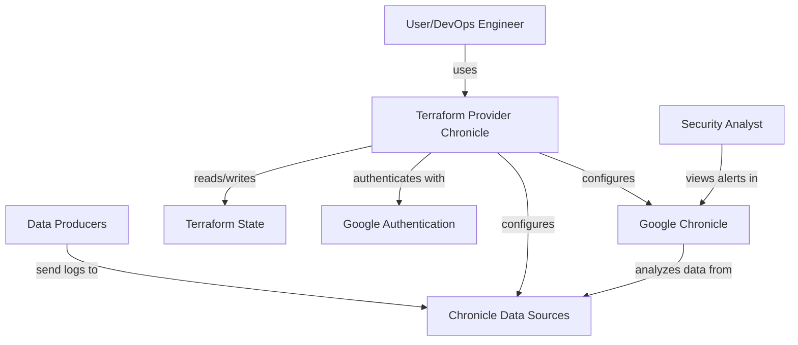
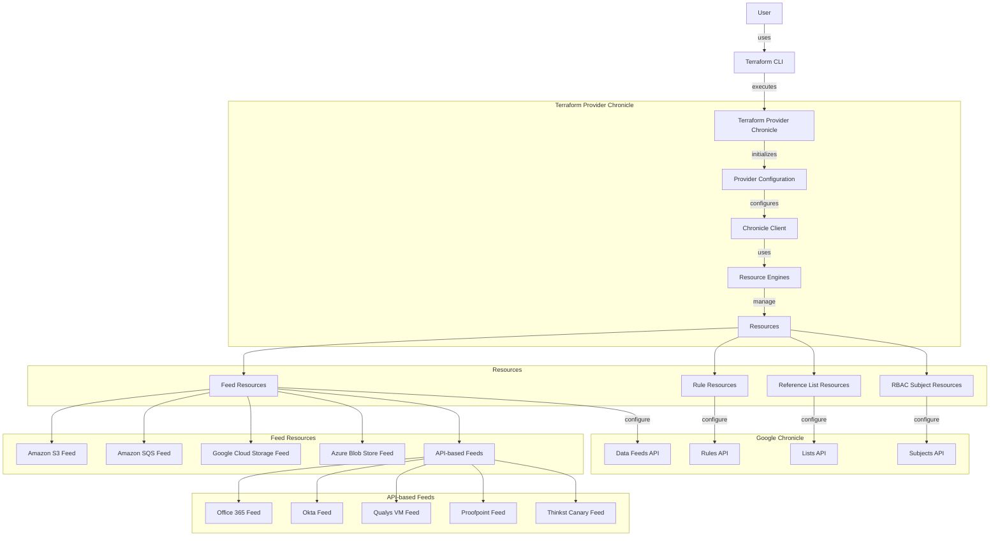
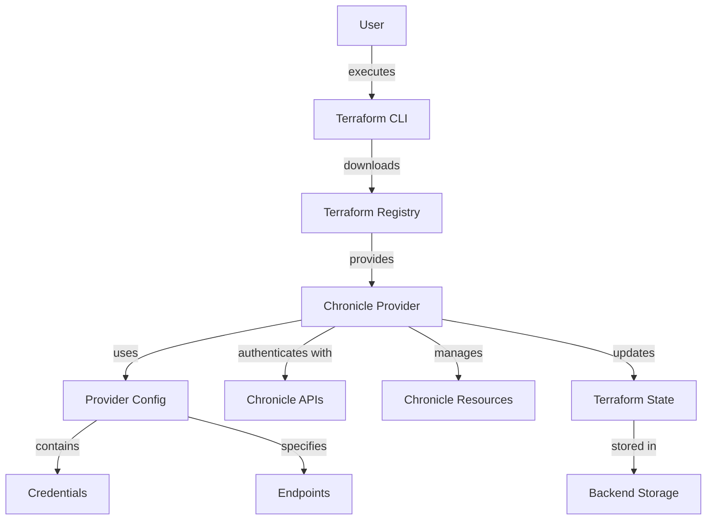
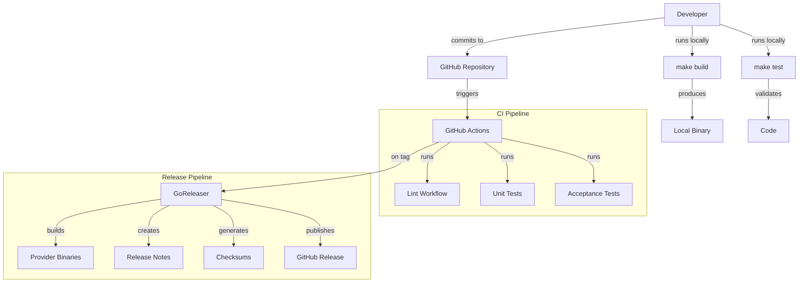

# BUSINESS POSTURE

Google Chronicle is a cloud-native security analytics platform designed to help organizations detect, investigate, and respond to cybersecurity threats. This Terraform provider enables infrastructure-as-code management of Chronicle resources, allowing security teams to automate the setup and configuration of data feeds, detection rules, access control, and reference lists.

The primary business priorities and goals include:

1. Enabling security teams to manage Chronicle resources through infrastructure-as-code practices
2. Automating the configuration of data ingestion feeds from various sources
3. Standardizing security controls and configurations across environments
4. Providing a consistent way to deploy and update security detection rules
5. Managing access control (RBAC) through code
6. Supporting various authentication methods for different Chronicle APIs

Key business risks that need to be addressed:

1. Credential exposure in Terraform state files and version control systems
2. Complexity in managing credential authorization for multiple APIs and data sources
3. Ensuring consistent security controls across different deployment environments
4. Maintaining version compatibility with the Chronicle API
5. Potential service disruption during updates or reconfigurations

# SECURITY POSTURE

## Existing Security Controls

- Security control: Sensitive field protection for credentials marked with `Sensitive: true` to prevent logging of sensitive values (implemented in all resource files containing authentication blocks, including `resource_feed_qualys_vm.go`, `resource_feed_thinkst_canary.go`)
- Security control: Multiple authentication methods including credential files and access tokens (implemented in provider.go)
- Security control: Environment variable fallback for credentials to avoid hardcoding in configuration files (implemented in provider.go)
- Security control: Region-specific endpoint configuration to ensure data locality compliance (implemented in provider.go)
- Security control: Resource-level timeout configuration to prevent long-running operations (implemented in all resource files)
- Security control: Validation functions for input parameters to prevent misconfiguration (implemented in validation.go)
- Security control: Rate limiting for API requests to prevent accidental DoS conditions (implemented in client/endpoints.go)
- Security control: Proper error handling with retry mechanisms (implemented in client/transport.go)
- Security control: Validation of YARA rules before submission to ensure proper format (implemented in resource_rule.go)
- Security control: Input validation for hostnames, authentication parameters, and other critical fields (implemented in validation.go)
- Accepted risk: Credentials stored in Terraform state files are not encrypted by default

## Recommended Security Controls

- Implement state file encryption or use remote state with encryption
- Add support for Workload Identity Federation authentication to avoid using static credentials
- Implement credential rotation capabilities
- Add comprehensive logging for security-relevant operations
- Add input validation for all custom parameters to prevent injection attacks
- Implement mutual TLS for API communication to enhance transport security

## Security Requirements

### Authentication
- Support for multiple authentication methods including service account keys and access tokens
- Clear separation of authentication contexts for different Chronicle APIs
- Secure storage of credentials (preferably using environment variables or credential files)
- Support for regional endpoints to meet data residency requirements

### Authorization
- Role-based access control for Chronicle resources
- Management of subjects (users/groups) and their roles
- Support for namespace-based resource segregation

### Input Validation
- Validation of all input parameters to prevent misconfiguration
- Format validation for identifiers, URIs, and configuration values
- Type checking for all input values
- Validation of YARA rules before deployment

### Cryptography
- Secure handling of authentication tokens and credentials
- Support for various authentication schemes including AWS IAM and Azure authentication
- Potential support for encryption of data in transit

# DESIGN

## C4 CONTEXT

### Context Elements

| Name | Type | Description | Responsibilities | Security Controls |
|------|------|-------------|-----------------|-------------------|
| Terraform Provider Chronicle | Software | Terraform provider to manage Chronicle resources | Translates Terraform configurations into Chronicle API calls, manages resource state | Credential handling, input validation, secure defaults |
| Google Chronicle | External System | Cloud-based security analytics platform | Ingests, stores, analyzes security data, generates alerts | Data encryption, access control, compliance certifications |
| Terraform State | Data Store | Storage of resource state | Tracks current state of Chronicle resources | State encryption (when configured) |
| Google Authentication | External System | Authentication service for Google APIs | Validates credentials, provides tokens | Token rotation, multi-factor authentication |
| Data Producers | External Systems | Systems generating security logs | Generate and forward security events | N/A |
| Chronicle Data Sources | External Systems | Configured sources of security data | Connect to data producers to receive security logs | Authentication, authorization |
| User/DevOps Engineer | Person | Person configuring Chronicle | Creates and maintains Terraform configurations | N/A |
| Security Analyst | Person | Person analyzing security events | Reviews and responds to security alerts | N/A |

## C4 CONTAINER

### Container Elements

| Name | Type | Description | Responsibilities | Security Controls |
|------|------|-------------|-----------------|-------------------|
| Terraform CLI | External System | Command-line interface for Terraform | Executes Terraform configurations | N/A |
| Provider Configuration | Component | Configuration for the Chronicle provider | Stores connection details, authentication | Input validation, credential handling |
| Chronicle Client | Component | Client library for Chronicle APIs | Makes API requests, handles errors | Request retry, timeout handling, rate limiting |
| Resource Engines | Component | Logic for managing resource lifecycle | Create, read, update, delete operations | State validation, error handling |
| Feed Resources | Component | Resources for data ingestion configuration | Configure data feeds from various sources | Authentication validation, input validation |
| Amazon S3 Feed | Component | Feed from S3 buckets | Configure S3 data ingestion | AWS authentication handling |
| Amazon SQS Feed | Component | Feed from SQS queues | Configure SQS data ingestion | AWS authentication handling |
| Google Cloud Storage Feed | Component | Feed from GCS buckets | Configure GCS data ingestion | GCP authentication handling |
| Azure Blob Store Feed | Component | Feed from Azure blob storage | Configure Azure data ingestion | Azure authentication handling |
| API-based Feeds | Component | Feed from various API sources | Configure API data ingestion | API-specific authentication |
| Office 365 Feed | Component | Feed from Microsoft Office 365 | Configure Office 365 data ingestion | Microsoft authentication handling |
| Okta Feed | Component | Feed from Okta | Configure Okta data ingestion | Token authentication handling |
| Qualys VM Feed | Component | Feed from Qualys VM | Configure Qualys VM data ingestion | User/password authentication handling |
| Proofpoint Feed | Component | Feed from Proofpoint | Configure Proofpoint data ingestion | User/password authentication handling |
| Thinkst Canary Feed | Component | Feed from Thinkst Canary | Configure Thinkst Canary data ingestion | Token authentication handling |
| Rule Resources | Component | Resources for detection rules | Manage security detection rules | Rule validation |
| Reference List Resources | Component | Resources for reference lists | Manage lists used in detections | Content validation |
| RBAC Subject Resources | Component | Resources for access control | Manage user/group permissions | Role validation |
| Data Feeds API | External System | Chronicle API for data feeds | Process feed configurations | API-level authentication |
| Rules API | External System | Chronicle API for rules | Process rule definitions | API-level authentication |
| Lists API | External System | Chronicle API for reference lists | Process list configurations | API-level authentication |
| Subjects API | External System | Chronicle API for RBAC | Process subject configurations | API-level authentication |

## DEPLOYMENT

The Terraform Provider Chronicle can be deployed in various ways, depending on user needs:

1. **Standard Terraform Registry Installation**
   - Provider downloaded from Terraform Registry
   - Used in standard Terraform workflows
   - Credentials provided via Terraform configuration or environment variables

2. **Local Development Installation**
   - Provider built locally using `make build`
   - Configured via local filesystem mirror in ~/.terraform.d/plugins
   - Used for development and testing

3. **CI/CD Pipeline Integration**
   - Provider used within CI/CD pipelines
   - Credentials provided via secure pipeline variables
   - Used for automated infrastructure management

For this design document, we'll focus on the standard installation approach:

### Deployment Elements

| Name | Type | Description | Responsibilities | Security Controls |
|------|------|-------------|-----------------|-------------------|
| Terraform CLI | Software | Command-line tool for Terraform | Execute Terraform commands | N/A |
| Terraform Registry | External System | Registry of Terraform providers | Distribute provider binaries | Package signature verification |
| Chronicle Provider | Software | Provider for Chronicle resources | Interact with Chronicle APIs | Credential handling, input validation |
| Provider Config | Configuration | Configuration for the provider | Specify credentials, region, settings | N/A |
| Credentials | Secret | Authentication credentials | Authenticate with Chronicle APIs | Marked as sensitive to prevent logging |
| Endpoints | Configuration | API endpoints for Chronicle | Direct requests to correct API endpoints | Validation |
| Chronicle APIs | External System | APIs for Chronicle services | Process API requests | Authentication, authorization |
| Chronicle Resources | External System | Resources managed in Chronicle | Store configurations and state | Access controls |
| Terraform State | Data | State of managed resources | Track resource configuration | Potential encryption |
| Backend Storage | External System | Storage for Terraform state | Persist state between operations | Access controls, potential encryption |

## BUILD

The Terraform provider is built using a standard Go build process, with additional tooling for testing, linting, and release management.

The build process includes several security controls:

- Security control: Dependency verification via go.mod/go.sum
- Security control: Code linting via golangci-lint to catch potential issues
- Security control: Unit and acceptance testing to validate functionality
- Security control: Binary checksums for integrity verification
- Security control: Versioned releases with proper tagging
- Security control: Build automation via GitHub Actions to ensure consistent builds

## RISK ASSESSMENT

### Critical Business Processes

1. **Security Data Ingestion**
   - Chronicle depends on reliable data ingestion from various sources
   - The provider manages feed configurations that determine what data is ingested
   - Misconfigurations could lead to missing security data or excessive costs

2. **Security Detection and Response**
   - Chronicle's ability to detect threats depends on properly configured rules
   - The provider manages rule deployments and updates
   - Errors in rule management could lead to missed detections or false positives

3. **Access Control and Permissions**
   - Chronicle requires proper access management for security
   - The provider manages RBAC subjects and their roles
   - Misconfiguration could lead to excessive privileges or access restrictions

### Data Protection

The provider handles various sensitive data types:

1. **Authentication Credentials**
   - Service account keys, access tokens, API credentials
   - High sensitivity - must be protected from exposure
   - Used to authenticate with Chronicle APIs

2. **Feed Configuration Details**
   - Connection information for various data sources
   - Medium to high sensitivity - reveals information about security infrastructure
   - Used to configure data ingestion

3. **Detection Rules**
   - Security detection logic
   - Medium sensitivity - reveals security monitoring strategy
   - Used to detect security threats

4. **Reference Lists**
   - Lists used in security detections
   - Medium sensitivity - reveals monitoring scope
   - Used to support detection rules

## QUESTIONS & ASSUMPTIONS

### BUSINESS POSTURE

1. What is the primary use case for this Terraform provider? (Assumed to be managing Chronicle resources through IaC)
2. Who are the primary users of this provider? (Assumed to be security engineers and DevOps teams)
3. What environments will this provider be used in? (Assumed to be both development and production)
4. How critical is Chronicle to the overall security posture? (Assumed to be highly critical)
5. What compliance requirements must be adhered to? (Unknown, depends on organization)

### SECURITY POSTURE

1. What is the preferred authentication method? (Assumed to be service account credentials)
2. How are credentials rotated and managed? (Assumed to be external to the provider)
3. Is there a need for audit logging of provider operations? (Assumed yes, but not implemented)
4. Are there specific security controls required for sensitive environments? (Unknown, depends on organization)
5. What is the threat model for the provider? (Assumed to include credential theft, misconfiguration)

### DESIGN

1. Are there performance requirements for the provider? (Assumed to be standard Terraform provider performance)
2. How should error handling be approached? (Assumed to follow Terraform provider best practices)
3. What is the versioning strategy for the provider? (Assumed to follow semantic versioning)
4. How should backward compatibility be maintained? (Assumed to follow Terraform provider guidelines)
5. What is the expected release cadence? (Unknown, depends on project needs)
