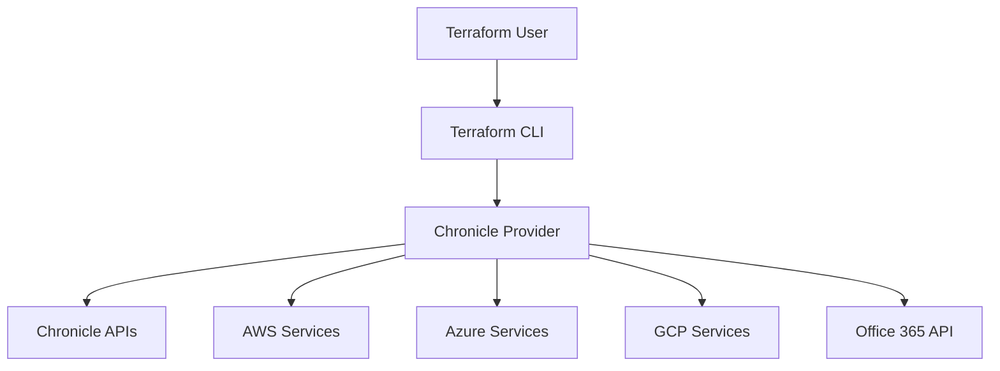
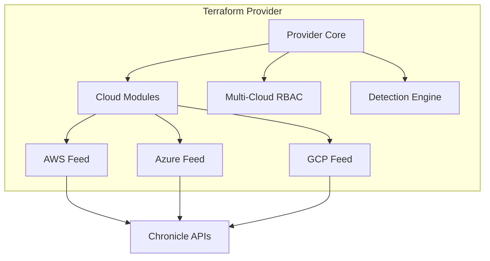
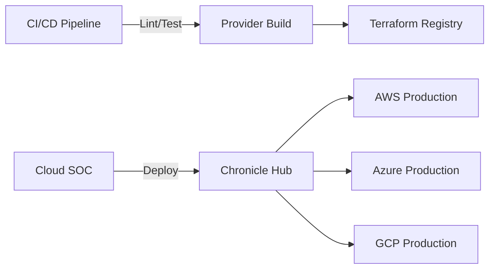
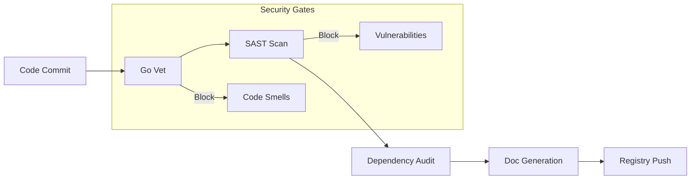

# Design Document: Terraform Provider for Chronicle

## BUSINESS POSTURE

### Business Priorities & Goals
- Enable multi-cloud IaC management for security resources
- Automate log ingestion from cloud platforms (AWS, Azure, GCP) and SaaS providers
- Unified security rule management across hybrid cloud environments
- Centralize RBAC for cloud security operations

### Key Business Risks
1. **Cloud Credential Proliferation** across AWS, Azure, and GCP integrations
2. **Multi-Platform Configuration Drift** between Terraform and cloud APIs
3. **Sensitive Cloud Metadata Exposure** in storage configurations
4. **Cross-Cloud Permission Escalation** through RBAC misconfigurations

## SECURITY POSTURE

### Existing Security Controls
1. **security control**: Cloud-specific credential encapsulation
   - Implemented in: AWS (access_key_id/secret_access_key), Azure (shared_key), GCP (service account keys)
2. **security control**: Storage URI validation
   - Implemented in: S3 URI format checks, GCS bucket validation
3. **accepted risk**: Test credential persistence in CI/CD
   - Mitigated by randomized test values and cleanup workflows

### Recommended Security Controls
1. Implement cloud credential temporary token support
2. Add storage bucket ownership verification
3. Introduce cross-cloud permission boundary checks

### Security Requirements
| Category          | Updated Requirements                                                |
|-------------------|---------------------------------------------------------------------|
| Authentication    | Support AWS SigV4, Azure Shared Key, GCP service account auth      |
| Authorization     | Validate cloud IAM policies during feed configuration              |
| Input Validation  | Strict cloud resource ARN validation                               |
| Cryptography      | Enforce bucket encryption flags for cloud storage integrations     |

## DESIGN

### C4 Context Diagram

### C4 Context Elements

| Name                  | Type         | Description                                                                 | Responsibilities                          | Security Controls                     |
|-----------------------|--------------|-----------------------------------------------------------------------------|-------------------------------------------|---------------------------------------|
| AWS Services          | Cloud        | Amazon S3, SQS, and EC2 integrations                                       | Provide cloud infrastructure logs         | IAM Role delegation                  |
| Azure Blobstore       | Service      | Microsoft cloud storage solution                                           | Supply Azure activity logs                | Shared key rotation                  |
| GCP Storage           | Service      | Google Cloud Storage buckets                                              | Deliver GCP audit trails                  | Service account constraints          |

### C4 Container Diagram

### Deployment Architecture

### Build Process Security

## RISK ASSESSMENT

### Protected Assets
1. **Cloud Audit Logs**: AWS CloudTrail, Azure Activity Logs, GCP Audit Logs
2. **SaaS Activity Data**: Office 365 management events
3. **Detection Rules**: Multi-cloud threat detection logic

### Data Sensitivity
| Data Type               | Sensitivity | Protection Requirements                  |
|-------------------------|-------------|------------------------------------------|
| Cloud Storage Keys      | Critical    | 90-day rotation, vault storage          |
| Office 365 Auth Tokens  | High        | Short-lived tokens, conditional access  |
| Detection Rules         | High        | Code signing, peer review               |

## QUESTIONS & ASSUMPTIONS

### Open Questions
1. How are cloud service endpoints validated against regional restrictions?
2. What mechanisms prevent credential leakage in Terraform state files?
3. Are there cross-cloud IAM consistency checks for RBAC subjects?

### Default Assumptions
1. All cloud providers support equivalent API authentication methods
2. Provider users have minimal required cloud permissions
3. Terraform state encryption is enabled by default
4. Cloud storage buckets have versioning enabled
