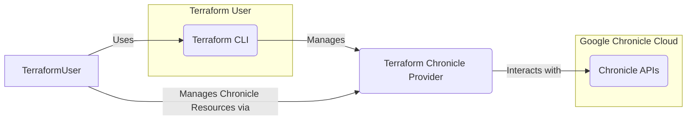
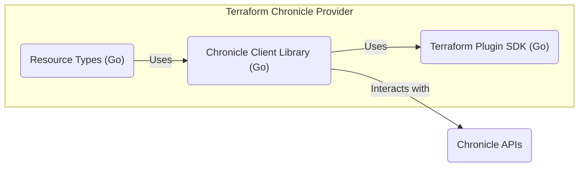
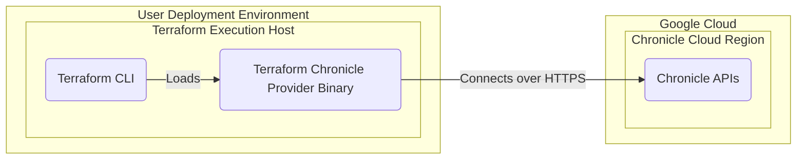

# BUSINESS POSTURE

- Business Priorities and Goals:
    - Goal: To provide users with a Terraform provider for managing Google Chronicle resources.
    - Priority: Enable Infrastructure-as-Code (IaC) for Chronicle deployments, allowing for automated and repeatable management of security logging and analytics infrastructure.
    - Goal: Simplify the management of Chronicle resources, making it easier for security and operations teams to adopt and utilize Chronicle effectively.
- Business Risks:
    - Risk of misconfiguration of Chronicle resources through the Terraform provider, potentially leading to security gaps or operational issues in Chronicle deployments.
    - Risk of exposing sensitive credentials or configuration details if the Terraform provider or its configurations are not securely managed.
    - Risk of provider vulnerabilities that could be exploited to compromise Chronicle environments managed by Terraform.

# SECURITY POSTURE

- Existing Security Controls:
    - security control: Authentication to Chronicle APIs is handled through credentials (service account keys) or access tokens, as configured in the Terraform provider. Described in: `docs\index.md`.
    - security control: Secure handling of sensitive data using Terraform's sensitive attribute for credentials and API tokens. Implemented in: provider code and resource schemas.
    - security control: Input validation within the Terraform provider code to ensure proper configuration of Chronicle resources. Implemented in: provider code, e.g., `chronicle\resource_feed_amazon_s3.go` - `validateFeedS3SourceType`.
    - security control: CI/CD pipeline using GitHub Actions for automated building, testing, and releasing of the Terraform provider. Implemented in: `.github\workflows\ci.yaml`, `.github\workflows\release.yaml`.
    - security control: Code quality checks including linting and formatting enforced through GitHub Actions. Implemented in: `.github\workflows\lint.yaml`, `scripts\gofmtcheck.sh`.
    - security control: Input validation in resource definitions using `ValidateDiagFunc`. Implemented in: resource definition files, e.g. `chronicle\resource_feed_thinkst_canary.go`, `chronicle\resource_rule.go`.
- Accepted Risks:
    - accepted risk: Reliance on users to securely manage their Chronicle credentials and Terraform state files.
    - accepted risk: Potential vulnerabilities in third-party Go libraries used by the Terraform provider.
- Recommended Security Controls:
    - security control: Implement Static Application Security Testing (SAST) to automatically scan the Terraform provider code for potential vulnerabilities.
    - security control: Implement Dependency Scanning to identify and manage vulnerabilities in the provider's dependencies.
    - security control: Enhance supply chain security by signing provider releases and verifying dependencies.
    - security control: Conduct regular security audits and penetration testing of the Terraform provider and its usage patterns.
- Security Requirements:
    - Authentication:
        - Requirement: The provider must securely authenticate to Chronicle APIs using various methods (credentials, access tokens).
        - Requirement: Support secure storage and handling of API credentials within Terraform configurations, leveraging Terraform's state management and sensitive attributes.
    - Authorization:
        - Requirement: Ensure that the Terraform provider operations are authorized against Chronicle's Role-Based Access Control (RBAC) to prevent unauthorized resource manipulation.
        - Requirement: Document the necessary Chronicle RBAC permissions required for the Terraform provider to function correctly.
    - Input Validation:
        - Requirement: Implement robust input validation for all resource attributes to prevent misconfigurations and potential injection vulnerabilities.
        - Requirement: Validate API responses to handle unexpected data and errors gracefully.
    - Cryptography:
        - Requirement: While direct cryptography within the provider might be limited, ensure sensitive data like credentials are handled as `sensitive` within Terraform to leverage Terraform's state encryption.
        - Requirement: Recommend and document best practices for users to manage sensitive data in Terraform, such as using backend state encryption and secret management tools.

# DESIGN

## C4 CONTEXT



### C4 Context Elements

- Element:
    - Name: Terraform Chronicle Provider
    - Type: Software System
    - Description: Terraform provider that allows users to manage Google Chronicle resources declaratively.
    - Responsibilities:
        - Translate Terraform configurations into Chronicle API calls.
        - Manage the lifecycle of Chronicle resources (create, read, update, delete).
        - Handle authentication and authorization with Chronicle APIs.
    - Security controls:
        - security control: Secure credential management using Terraform's sensitive attributes.
        - security control: Input validation of Terraform configurations.
        - security control: Logging of API interactions and provider operations.
- Element:
    - Name: Terraform CLI
    - Type: Software System
    - Description: HashiCorp Terraform command-line interface used to apply and manage infrastructure as code.
    - Responsibilities:
        - Parse Terraform configuration files.
        - Plan and apply infrastructure changes.
        - Manage Terraform state.
        - Interact with Terraform providers.
    - Security controls:
        - security control: State file encryption (backend dependent).
        - security control: Secure execution environment (user's machine or CI/CD).
        - security control: Access control to Terraform configurations and state files.
- Element:
    - Name: Chronicle APIs
    - Type: Software System
    - Description: Google Chronicle's set of APIs for managing security logging, analytics, and related resources.
    - Responsibilities:
        - Provide programmatic access to Chronicle functionalities.
        - Enforce authentication and authorization for API requests.
        - Manage Chronicle resources based on API calls.
        - Return data and status of operations to the provider.
    - Security controls:
        - security control: API authentication and authorization (OAuth 2.0, Service Account Keys).
        - security control: API request logging and monitoring.
        - security control: Data encryption in transit and at rest within Google Cloud.
- Element:
    - Name: Terraform User
    - Type: Person
    - Description: Security engineers, DevOps engineers, or cloud engineers who use Terraform to manage Chronicle resources.
    - Responsibilities:
        - Write and maintain Terraform configurations for Chronicle.
        - Manage credentials and access to Chronicle and Terraform.
        - Review and apply Terraform plans.
        - Monitor Chronicle infrastructure managed by Terraform.
    - Security controls:
        - security control: User authentication and authorization to access Terraform execution environments.
        - security control: Secure storage and management of Chronicle credentials.
        - security control: Following security best practices for IaC and Terraform.

## C4 CONTAINER



### C4 Container Elements

- Element:
    - Name: Terraform Plugin SDK
    - Type: Library
    - Description: HashiCorp Terraform Plugin SDK v2, providing the framework for building Terraform providers in Go.
    - Responsibilities:
        - Handles Terraform provider protocol.
        - Manages resource schemas and data types.
        - Provides helper functions for resource lifecycle operations (Create, Read, Update, Delete).
        - Manages Terraform state interactions.
    - Security controls:
        - security control:  SDK is a well-maintained and widely used library from HashiCorp.
        - security control:  Provider code built with SDK follows Terraform security model.
- Element:
    - Name: Chronicle Client Library
    - Type: Library
    - Description: Go client library specifically developed for interacting with Google Chronicle APIs. This might be part of the provider or an external library. Based on files like `chronicle\client\client.go` it's internal client.
    - Responsibilities:
        - Encapsulates API interactions with Chronicle services.
        - Handles API request construction and response parsing.
        - Manages authentication logic for Chronicle APIs.
        - Provides abstractions for different Chronicle API endpoints (Feed, Rule, Subject, etc.).
    - Security controls:
        - security control: Secure handling of API credentials within the client library.
        - security control: Implementation of secure communication protocols (HTTPS).
        - security control: Error handling and logging of API interactions.
- Element:
    - Name: Resource Types
    - Type: Component
    - Description: Go code implementing Terraform resource types for each manageable Chronicle resource (e.g., `chronicle_feed_amazon_s3`, `chronicle_rule`). Files like `chronicle\resource_feed_amazon_s3.go`, `chronicle\resource_rule.go`.
    - Responsibilities:
        - Define Terraform resource schemas.
        - Implement resource lifecycle operations (Create, Read, Update, Delete) using Chronicle Client Library.
        - Perform input validation and data transformation between Terraform configurations and Chronicle APIs.
    - Security controls:
        - security control: Input validation logic within resource type implementations.
        - security control: Secure handling of sensitive attributes for resource configurations.
        - security control: Proper error handling and state management for resource operations.

## DEPLOYMENT



### Deployment Elements

- Element:
    - Name: Terraform Execution Host
    - Type: Environment
    - Description: The environment where Terraform CLI is executed. This could be a user's local machine, a CI/CD pipeline server, or a dedicated infrastructure management server.
    - Responsibilities:
        - Run Terraform CLI commands.
        - Host the Terraform provider binary.
        - Maintain Terraform state (depending on backend configuration).
        - Provide network connectivity to Google Cloud.
    - Security controls:
        - security control: Access control to the execution environment.
        - security control: Secure configuration of the host operating system.
        - security control: Network security controls to restrict outbound access if needed.
- Element:
    - Name: Terraform CLI
    - Type: Software
    - Description: HashiCorp Terraform command-line tool.
    - Responsibilities:
        - Execute Terraform commands (plan, apply, destroy).
        - Interpret Terraform configuration files.
        - Manage Terraform state.
        - Interact with providers.
    - Security controls:
        - security control:  Securely downloaded and verified Terraform CLI binary.
        - security control:  Secure configuration and usage of Terraform CLI.
- Element:
    - Name: Terraform Chronicle Provider Binary
    - Type: Software
    - Description: Executable binary of the Terraform Chronicle Provider, distributed via Terraform Registry or local installation.
    - Responsibilities:
        - Implement Terraform provider logic.
        - Translate Terraform configurations to Chronicle API requests.
        - Manage resource lifecycle.
        - Handle authentication.
    - Security controls:
        - security control: Provider binary is built using secure build processes.
        - security control: Distribution via Terraform Registry provides a level of trust and verification.
        - security control: Binary should be stored securely if managed locally.
- Element:
    - Name: Chronicle Cloud Region
    - Type: Environment
    - Description: Google Cloud region where Chronicle services are deployed and APIs are accessed.
    - Responsibilities:
        - Host Chronicle APIs.
        - Process API requests from the Terraform provider.
        - Manage Chronicle resources.
    - Security controls:
        - security control: Google Cloud's infrastructure security.
        - security control: Chronicle API security controls (authentication, authorization, logging).
        - security control: Network security within Google Cloud.
- Element:
    - Name: Chronicle APIs
    - Type: Software Service
    - Description: Google Chronicle API endpoints.
    - Responsibilities:
        - Provide access to Chronicle functionalities.
        - Enforce security policies.
        - Process and respond to API requests.
    - Security controls:
        - security control: HTTPS for secure communication.
        - security control: Authentication and authorization mechanisms.
        - security control: API logging and monitoring.

## BUILD

```mermaid
flowchart LR
    subgraph Developer Workstation
        Developer("Developer")
    end
    subgraph GitHub Repository
        GitHub("GitHub")
        SourceCode("Source Code")
        CI_CD("CI/CD Workflows")
    end
    subgraph Build System (GitHub Actions)
        BuildProcess("Build Process (GitHub Actions)")
        Artifacts("Build Artifacts")
    end
    subgraph Terraform Registry
        TerraformRegistry("Terraform Registry")
        ProviderPackage("Provider Package")
    end

    Developer -- "Writes Code" --> SourceCode
    SourceCode -- "Pushes to" --> GitHub
    GitHub -- "Triggers" --> CI_CD
    CI_CD -- "Executes" --> BuildProcess
    BuildProcess -- "Generates" --> Artifacts
    Artifacts -- "Releases to" --> TerraformRegistry
    TerraformRegistry -- "Distributes" --> ProviderPackage
```

### Build Elements

- Element:
    - Name: Developer
    - Type: Person
    - Description: Software developer contributing to the Terraform Chronicle Provider project.
    - Responsibilities:
        - Writing, testing, and maintaining provider code.
        - Committing code changes to the GitHub repository.
        - Participating in code reviews.
    - Security controls:
        - security control: Secure workstation and development environment.
        - security control: Code review process to identify potential vulnerabilities.
        - security control: Authentication and authorization for accessing the GitHub repository.
- Element:
    - Name: GitHub Repository
    - Type: Code Repository
    - Description: GitHub repository hosting the Terraform Chronicle Provider source code, CI/CD workflows, and release configurations.
    - Responsibilities:
        - Version control for source code.
        - Hosting CI/CD workflow definitions.
        - Managing releases and tags.
        - Access control for code and configurations.
    - Security controls:
        - security control: Access control and permissions management for repository access.
        - security control: Branch protection rules to enforce code review and prevent direct pushes to main branches.
        - security control: Audit logging of repository activities.
- Element:
    - Name: CI/CD Workflows
    - Type: Automation
    - Description: GitHub Actions workflows defined in the repository for automated build, test, linting, and release processes. Files: `.github\workflows\ci.yaml`, `.github\workflows\release.yaml`, `.github\workflows\lint.yaml`.
    - Responsibilities:
        - Automate the build process.
        - Run automated tests (unit and acceptance tests).
        - Perform code linting and formatting checks.
        - Automate release process upon tag creation.
    - Security controls:
        - security control: Securely configured GitHub Actions workflows.
        - security control: Use of pinned actions versions to prevent supply chain attacks.
        - security control: Secret management for any credentials used in CI/CD.
- Element:
    - Name: Build Process (GitHub Actions)
    - Type: Automation
    - Description: Specific GitHub Actions jobs within workflows that perform build, test, and release steps.
    - Responsibilities:
        - Compile Go code.
        - Run unit and acceptance tests.
        - Package provider binaries for different platforms.
        - Sign and checksum release artifacts.
    - Security controls:
        - security control: Build environment isolation within GitHub Actions runners.
        - security control: Security scanning during the build process (SAST, dependency scanning - recommended).
        - security control: Verification of build artifacts integrity (checksums, signatures).
- Element:
    - Name: Build Artifacts
    - Type: Data
    - Description: Output of the build process, including provider binaries, checksums, and signatures.
    - Responsibilities:
        - Be securely stored temporarily before release.
        - Be used for release to Terraform Registry.
        - Be verifiable for integrity and authenticity.
    - Security controls:
        - security control: Secure storage of build artifacts during the build process.
        - security control: Checksums and signatures to ensure artifact integrity and authenticity.
- Element:
    - Name: Terraform Registry
    - Type: Software Service
    - Description: HashiCorp Terraform Registry, a public registry for Terraform providers.
    - Responsibilities:
        - Distribute Terraform provider packages to users.
        - Verify provider signatures.
        - Host provider documentation.
    - Security controls:
        - security control: Provider package verification and signing process by Terraform Registry.
        - security control: HTTPS for secure download of provider packages.
        - security control: Registry infrastructure security managed by HashiCorp.
- Element:
    - Name: Provider Package
    - Type: Data
    - Description: Packaged Terraform Chronicle Provider, including binaries for different platforms, metadata, and signatures, distributed via Terraform Registry.
    - Responsibilities:
        - Be securely downloaded and used by Terraform users.
        - Contain all necessary components for the provider to function.
        - Be verified for authenticity and integrity by Terraform CLI.
    - Security controls:
        - security control: Signed provider package ensures authenticity and integrity.
        - security control: Downloaded over HTTPS.
        - security control: Verified by Terraform CLI before use.

# RISK ASSESSMENT

- Critical Business Processes:
    - Ingestion of security logs into Chronicle for analysis and threat detection.
    - Definition and management of detection rules in Chronicle.
    - Management of user access and permissions within Chronicle.
- Data to Protect:
    - Sensitive Data:
        - Chronicle API credentials (service account keys, API tokens) - High sensitivity. Compromise could lead to unauthorized access and control over Chronicle instance.
        - User-provided credentials for external log sources (AWS, Azure, Okta, etc.) stored in Terraform configurations - High sensitivity. Compromise could lead to unauthorized access to external systems.
    - Other Data:
        - Terraform state files - Medium sensitivity. May contain configuration details and resource IDs, but sensitive credentials should be marked as sensitive.
        - Terraform provider code and build artifacts - Medium sensitivity. Potential supply chain risk if compromised, but primarily code and binaries.

# QUESTIONS & ASSUMPTIONS

- BUSINESS POSTURE:
    - Assumption: The primary driver for developing this Terraform provider is to enable automation and improve efficiency in managing Chronicle security operations.
    - Question: What is the expected adoption rate and user base for this provider? Is it primarily for internal use within Form3, or is it intended for broader public consumption?
- SECURITY POSTURE:
    - Assumption: Security is a high priority for this project, given its role in managing security infrastructure.
    - Question: Are there specific security compliance standards (e.g., SOC 2, ISO 27001, FedRAMP) that the provider needs to adhere to? What are the organization's specific security requirements for Terraform providers?
- DESIGN:
    - Assumption: The provider is designed to be stateless, relying on Terraform state for managing resource configurations.
    - Question: How are users expected to manage and rotate Chronicle API credentials when using this provider? Are there best practices or recommendations documented for secure credential management in conjunction with the provider? How does the provider handle different Chronicle regions and API endpoint variations?
    - Question: How are credentials used in acceptance tests managed and secured?
    - Assumption: Acceptance tests are designed to cover main functionalities and security relevant configurations. What is the scope of security testing in acceptance tests?
