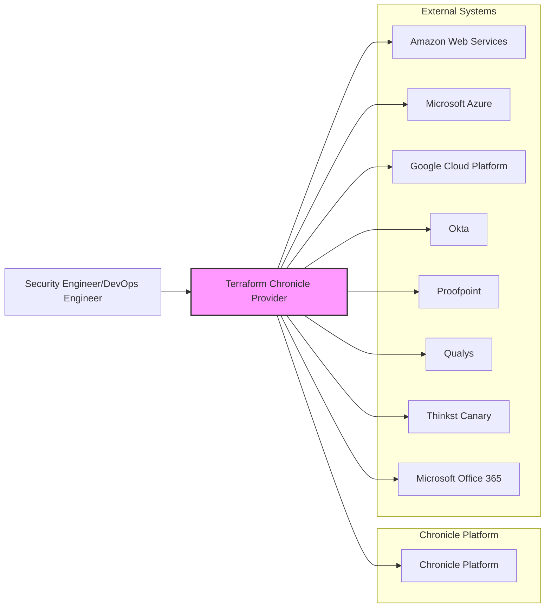
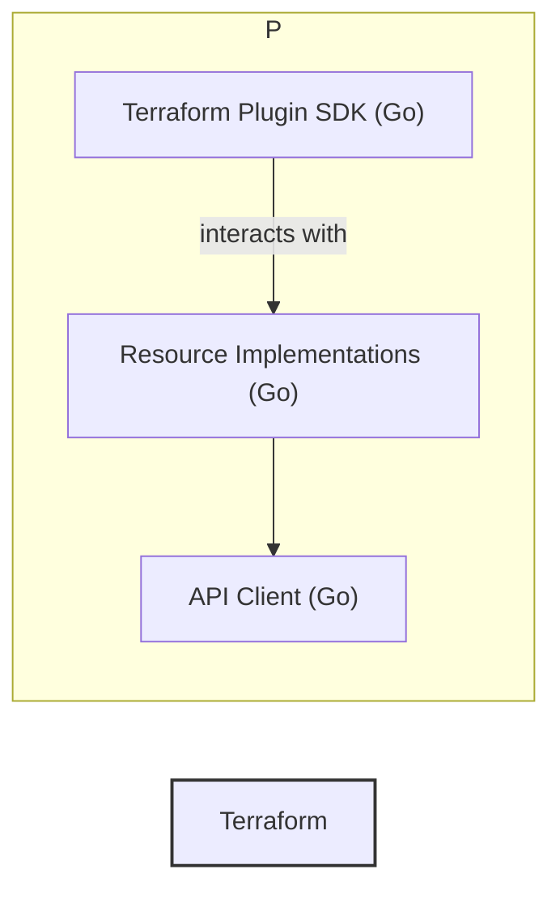
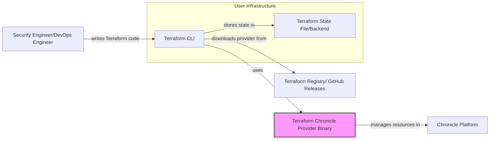
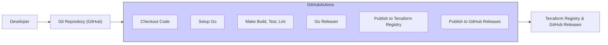

# BUSINESS POSTURE

- Business Priorities and Goals:
    - The primary goal of the Terraform Chronicle provider is to enable users to manage and automate the configuration of their Chronicle security analytics platform using Terraform.
    - This automation aims to streamline the deployment and management of Chronicle resources, such as data feeds, detection rules, and access controls.
    - By providing an Infrastructure-as-Code (IaC) approach, the provider seeks to improve consistency, repeatability, and auditability of Chronicle configurations.
    - The provider is intended to simplify the integration of Chronicle into existing DevOps workflows and infrastructure management practices.

- Business Risks:
    - Risk of misconfiguration: Incorrectly configured Chronicle resources through Terraform could lead to gaps in security monitoring, data ingestion failures, or ineffective threat detection.
    - Credential exposure: Improper handling or storage of Chronicle API credentials within Terraform configurations or state files could lead to unauthorized access to the Chronicle platform.
    - Provider reliability and stability: Bugs or vulnerabilities in the Terraform provider itself could disrupt Chronicle operations or introduce security weaknesses.
    - Adoption risk: Low adoption of the provider if it is not user-friendly, feature-rich, or well-documented, hindering the intended automation benefits.
    - Compatibility risk: Potential incompatibility issues with future versions of Terraform or Chronicle API changes could require ongoing maintenance and updates to the provider.

# SECURITY POSTURE

- Existing Security Controls:
    - security control: Credential management for Chronicle APIs (Backstory, BigQuery, Ingestion, Forwarder) is handled through Terraform provider configuration, supporting credentials file, access token, and environment variables. Described in `docs/index.md`.
    - security control: Sensitive credentials like `secret_access_key`, `client_secret`, `shared_key`, `sas_token`, and API tokens are marked as `Sensitive` in the Terraform schema. Implemented in resource schemas like `resource_feed_amazon_s3.go`, `resource_feed_amazon_sqs.go`, `resource_feed_azure_blobstore.go`, `resource_feed_microsoft_office_365_management_activity.go`, `resource_feed_okta_system_log.go`, `resource_feed_okta_users.go`, `resource_feed_proofpoint_siem.go`, `resource_feed_qualys_vm.go`, `resource_feed_thinkst_canary.go`.
    - security control: Input validation for region parameter to ensure it's within the allowed regions. Implemented in `chronicle/provider.go` and `chronicle/validation_helper.go`.
    - security control: Input validation for custom endpoint URLs to ensure they are valid URLs. Implemented in `chronicle/provider.go` and `chronicle/validation_helper.go`.
    - security control: Validation for AWS Access Key ID and Secret Access Key formats. Implemented in `chronicle/validation_helper.go`.
    - security control: Input validation for GCS URI format. Implemented in `chronicle/validation.go`.
    - security control: Input validation for AWS Account ID format. Implemented in `chronicle/validation.go`.
    - security control: Input validation for Thinkst Canary Hostname format. Implemented in `chronicle/validation.go`.
    - security control: Input validation for UUID format. Implemented in `chronicle/validation.go`.
    - security control: Input validation for Microsoft Office 365 Management Activity Content Type. Implemented in `chronicle/validation.go`.
    - security control: Input validation for Reference List Content Type. Implemented in `chronicle/validation.go`.
    - security control: Input validation to ensure rule text ends with a newline. Implemented in `chronicle/validation.go`.
    - security control: Input validation for allowed values of Feed S3 Source Delete Option. Implemented in `chronicle/validation.go`.
    - security control: Input validation for allowed values of Feed GCS Source Delete Option. Implemented in `chronicle/validation.go`.
    - security control: Input validation for allowed values of Feed Azure Blob Store Source Delete Option. Implemented in `chronicle/validation.go`.
    - security control: Input validation for allowed values of Feed S3 Source Type. Implemented in `chronicle/validation.go`.
    - security control: Input validation for allowed values of Feed GCS Source Type. Implemented in `chronicle/validation.go`.
    - security control: Input validation for allowed values of Feed Azure Blob Store Source Type. Implemented in `chronicle/validation.go`.
    - security control: Input validation for allowed values of Subject Type. Implemented in `chronicle/validation.go`.
    - security control: gofmt and golangci-lint checks are integrated into the CI pipeline to enforce code quality and security best practices. Configured in `.github/workflows/lint.yaml`.
    - security control: Automated CI pipeline using GitHub Actions for building, testing, and releasing the provider. Defined in `.github/workflows/ci.yaml` and `.github/workflows/release.yaml`.
    - security control: Checksum verification for releases using SHA256. Configured in `goreleaser.yaml`.

- Accepted Risks:
    - accepted risk: Users are responsible for securely managing Terraform state files, which may contain sensitive configuration data, including credentials if not using external secret management.
    - accepted risk: Users are responsible for following security best practices when writing Terraform configurations, such as avoiding hardcoding sensitive credentials directly in code where possible.
    - accepted risk: Reliance on the security of underlying cloud provider APIs (Chronicle, AWS, Azure, GCP, Okta, Proofpoint, Qualys, Thinkst Canary, Microsoft Office 365) for data ingestion and resource management.

- Recommended Security Controls:
    - security control: Implement Static Application Security Testing (SAST) tools in the CI/CD pipeline to automatically scan the provider code for potential security vulnerabilities before release.
    - security control: Integrate Dependency Scanning tools in the CI/CD pipeline to identify and alert on known vulnerabilities in the provider's dependencies.
    - security control: Add Credential Scanning to the CI/CD pipeline to prevent accidental commit of credentials or secrets in the code.
    - security control: Provide comprehensive documentation with security best practices for users, including guidance on secure credential management (e.g., using Terraform Cloud Secrets, HashiCorp Vault, or cloud provider secret management services), secure state file storage, and principle of least privilege.
    - security control: Encourage and facilitate community security audits and vulnerability reporting processes.

- Security Requirements:
    - Authentication:
        - Requirement: The provider must securely authenticate to the Chronicle APIs using configured credentials or access tokens.
        - Existing Controls: Supports credentials and access tokens for API authentication.
        - Recommended Controls: Follow best practices for secure API authentication in Go, avoid storing credentials in memory longer than necessary.
    - Authorization:
        - Requirement: Provider actions must be authorized by Chronicle's RBAC system based on the credentials used for authentication.
        - Existing Controls: Relies on Chronicle API's authorization mechanisms.
        - Recommended Controls:  Document required Chronicle RBAC roles for different provider operations (e.g., creating feeds, rules, subjects).
    - Input Validation:
        - Requirement: All user-provided inputs must be validated to prevent injection attacks and misconfigurations.
        - Existing Controls: Input validation for region, custom endpoints, AWS keys, GCS URI, Azure Blobstore source type and delete options, Microsoft Office 365 content type, and UUIDs, Thinkst Canary Hostname, AWS Account ID, Reference List Content Type, Rule Text new line ending, Subject Type, Feed S3/GCS/Azure Blob Store Source Delete Options and Source Types.
        - Recommended Controls:  Strengthen input validation for all resource properties, especially those that interact with external systems (URIs, hostnames, etc.). Consider using schema-based validation to ensure data types and formats are correct.
    - Cryptography:
        - Requirement: Sensitive data at rest (in state) and in transit should be protected using encryption.
        - Existing Controls: Sensitive data marked in schema, HTTPS for API communication (assumed).
        - Recommended Controls:  Ensure that Terraform state backend is configured to encrypt sensitive data at rest. Document the importance of using HTTPS for all communication with Chronicle and external services.

# DESIGN

## C4 CONTEXT

### C4 Context Elements

- Element:
    - Name: Security Engineer/DevOps Engineer
    - Type: Person
    - Description: Users who manage and automate security infrastructure and configurations. They use Terraform to manage Chronicle resources and integrate Chronicle with other systems.
    - Responsibilities:
        - Define and manage Chronicle infrastructure as code using Terraform.
        - Automate the deployment and configuration of Chronicle resources.
        - Monitor and maintain Chronicle configurations.
    - Security controls:
        - security control: Role-Based Access Control (RBAC) within their organization to limit who can manage security infrastructure.
        - security control: Multi-Factor Authentication (MFA) for accessing Terraform Cloud or local Terraform environments.

- Element:
    - Name: Terraform Chronicle Provider
    - Type: Software System
    - Description: A Terraform provider that acts as an interface between Terraform and the Chronicle platform and external systems. It translates Terraform configurations into API calls to manage Chronicle resources and integrations.
    - Responsibilities:
        - Translate Terraform configurations into Chronicle API requests.
        - Manage the lifecycle of Chronicle resources (create, read, update, delete).
        - Integrate with various external systems for data ingestion into Chronicle.
        - Provide a declarative way to manage Chronicle configurations.
    - Security controls:
        - security control: Secure coding practices during development.
        - security control: Input validation and sanitization.
        - security control: Secure handling of credentials and sensitive data.
        - security control: Automated testing and security scanning in CI/CD pipeline.

- Element:
    - Name: Chronicle Platform
    - Type: Software System
    - Description: Google Chronicle security analytics platform. It ingests, analyzes, and correlates security data to detect and respond to threats. The Terraform provider manages resources within this platform.
    - Responsibilities:
        - Ingest and store security telemetry data.
        - Analyze data for threat detection and incident response.
        - Provide APIs for managing its configuration and resources.
        - Enforce access control and security policies.
    - Security controls:
        - security control: Chronicle platform's built-in security controls (authentication, authorization, data encryption, etc.).
        - security control: Regular security updates and patching by Chronicle.

- Element:
    - Name: Amazon Web Services (AWS)
    - Type: External System
    - Description: Amazon's cloud services platform. Used as a source for security logs ingested into Chronicle via S3 buckets and SQS queues.
    - Responsibilities:
        - Store security logs in S3 buckets.
        - Provide SQS queues for event notifications.
        - Manage access to S3 and SQS resources.
    - Security controls:
        - security control: AWS IAM for access control.
        - security control: S3 bucket policies and encryption.
        - security control: SQS queue policies and encryption.

- Element:
    - Name: Microsoft Azure
    - Type: External System
    - Description: Microsoft's cloud services platform. Used as a source for security logs ingested into Chronicle via Azure Blob Storage.
    - Responsibilities:
        - Store security logs in Azure Blob Storage.
        - Manage access to Azure Blob Storage.
    - Security controls:
        - security control: Azure Active Directory for access control.
        - security control: Azure Blob Storage access keys and SAS tokens.
        - security control: Azure Blob Storage encryption.

- Element:
    - Name: Google Cloud Platform (GCP)
    - Type: External System
    - Description: Google's cloud services platform. Used as a source for security logs ingested into Chronicle via Google Cloud Storage buckets.
    - Responsibilities:
        - Store security logs in Google Cloud Storage buckets.
        - Manage access to Google Cloud Storage.
    - Security controls:
        - security control: GCP IAM for access control.
        - security control: Google Cloud Storage bucket policies and encryption.

- Element:
    - Name: Okta
    - Type: External System
    - Description: Identity and access management platform. Used as a source for user and system logs ingested into Chronicle via Okta APIs.
    - Responsibilities:
        - Provide user and system logs via APIs.
        - Authenticate API requests.
    - Security controls:
        - security control: Okta API authentication and authorization.
        - security control: Okta's security controls for log access and management.

- Element:
    - Name: Proofpoint
    - Type: External System
    - Description: Security company providing email security and threat intelligence. Used as a source for security logs ingested into Chronicle via Proofpoint SIEM API.
    - Responsibilities:
        - Provide security logs via APIs.
        - Authenticate API requests.
    - Security controls:
        - security control: Proofpoint API authentication and authorization.
        - security control: Proofpoint's security controls for log access and management.

- Element:
    - Name: Qualys
    - Type: External System
    - Description: Security company providing vulnerability management and compliance solutions. Used as a source for vulnerability data ingested into Chronicle via Qualys VM API.
    - Responsibilities:
        - Provide vulnerability data via APIs.
        - Authenticate API requests.
    - Security controls:
        - security control: Qualys API authentication and authorization.
        - security control: Qualys's security controls for data access and management.

- Element:
    - Name: Thinkst Canary
    - Type: External System
    - Description: Provider of detection canaries and decoy technology. Used as a source for alerts and event data ingested into Chronicle via Thinkst Canary API.
    - Responsibilities:
        - Provide alert and event data via APIs.
        - Authenticate API requests.
    - Security controls:
        - security control: Thinkst Canary API authentication and authorization.
        - security control: Thinkst Canary's security controls for data access and management.

- Element:
    - Name: Microsoft Office 365
    - Type: External System
    - Description: Microsoft's suite of office and collaboration applications. Used as a source for activity logs ingested into Chronicle via Microsoft Office 365 Management Activity API.
    - Responsibilities:
        - Provide activity logs via APIs.
        - Authenticate API requests.
    - Security controls:
        - security control: Azure Active Directory authentication for API access.
        - security control: Microsoft 365 security and compliance controls.

## C4 CONTAINER

### C4 Container Elements

- Element:
    - Name: Terraform Plugin SDK
    - Type: Library
    - Description: HashiCorp Terraform Plugin SDK, which provides the framework and libraries for building Terraform providers in Go. It handles communication between Terraform CLI and the provider.
    - Responsibilities:
        - Provider framework and lifecycle management.
        - Schema definition and validation.
        - State management.
        - Communication with Terraform CLI.
    - Security controls:
        - security control: Leverages security features of the Terraform Plugin SDK.
        - security control: Follows HashiCorp's security guidelines for plugin development.

- Element:
    - Name: API Client
    - Type: Library
    - Description: Go client library to interact with Chronicle APIs (and potentially APIs of external systems). Handles API request construction, authentication, and response parsing.
    - Responsibilities:
        - Encapsulate Chronicle API interactions.
        - Handle authentication and authorization for Chronicle APIs.
        - Manage API request retries and error handling.
        - Data transformation between provider and API models.
    - Security controls:
        - security control: Secure handling of API credentials (using provider configuration).
        - security control: HTTPS for all API communications.
        - security control: Input sanitization before sending requests to APIs.
        - security control: Error handling to avoid leaking sensitive information.

- Element:
    - Name: Resource Implementations
    - Type: Component
    - Description: Go code implementing Terraform resources for Chronicle entities (feeds, rules, RBAC subjects, reference lists). Each resource implementation defines the resource schema, CRUD operations, and logic for interacting with the API client.
    - Responsibilities:
        - Define Terraform resource schemas.
        - Implement CRUD operations for Chronicle resources using API Client.
        - Handle resource state management within Terraform.
        - Map Terraform resource attributes to Chronicle API parameters and responses.
    - Security controls:
        - security control: Input validation for resource attributes based on schema.
        - security control: Secure handling of sensitive attributes (using `Sensitive` flag in schema).
        - security control: Proper error handling and logging (without exposing sensitive data).
        - security control: Unit and integration testing for resource logic.

## DEPLOYMENT

The Terraform Chronicle Provider is distributed through the Terraform Registry and GitHub Releases. Users download and install the provider plugin for use with Terraform CLI in their local or CI/CD environments.

### Deployment Elements

- Element:
    - Name: Terraform CLI
    - Type: Software Application
    - Description: HashiCorp Terraform command-line tool used by users to execute Terraform configurations and manage infrastructure.
    - Responsibilities:
        - Read Terraform configuration files.
        - Download and manage Terraform providers.
        - Execute provider operations (plan, apply, destroy).
        - Manage Terraform state.
    - Security controls:
        - security control: User authentication and authorization for accessing Terraform CLI (system-level).
        - security control: Secure storage of Terraform CLI configuration and credentials.
        - security control: Secure execution environment for Terraform CLI.

- Element:
    - Name: Terraform State File/Backend
    - Type: Data Store
    - Description: Stores the state of the infrastructure managed by Terraform. Can be stored locally or remotely in various backends (e.g., Terraform Cloud, AWS S3, Azure Storage Account, GCP Cloud Storage).
    - Responsibilities:
        - Persistently store Terraform state data.
        - Provide state locking and versioning (in some backends).
        - Ensure data integrity and availability.
    - Security controls:
        - security control: Encryption of state data at rest and in transit (backend-dependent).
        - security control: Access control to state data (backend-dependent, IAM, ACLs).
        - security control: Secure backend configuration and management.

- Element:
    - Name: Terraform Registry / GitHub Releases
    - Type: Software Repository
    - Description: Public registry (and GitHub Releases page) for distributing Terraform providers. Users download the Chronicle provider plugin from here.
    - Responsibilities:
        - Host and distribute Terraform provider binaries.
        - Provide versioning and discovery of providers.
        - Ensure integrity and authenticity of provider packages.
    - Security controls:
        - security control: Secure infrastructure for hosting and serving provider binaries.
        - security control: Signing of provider packages for authenticity verification.
        - security control: Regular security scanning and updates of registry infrastructure.

- Element:
    - Name: Terraform Chronicle Provider Binary
    - Type: Software Application
    - Description: Executable binary of the Terraform Chronicle Provider plugin. Downloaded by Terraform CLI and executed to manage Chronicle resources.
    - Responsibilities:
        - Implement Terraform provider logic.
        - Communicate with Chronicle APIs.
        - Manage resource lifecycle.
    - Security controls:
        - security control: Security controls inherited from the build process.
        - security control: Provider code security (SAST, dependency scanning).

- Element:
    - Name: Chronicle Platform
    - Type: Software System
    - Description: Target platform being managed by the Terraform provider.
    - Responsibilities:
        - Host and operate Chronicle security analytics services.
        - Provide APIs for resource management.
    - Security controls:
        - security control: Chronicle platform's inherent security controls.

## BUILD

The build process for the Terraform Chronicle Provider is automated using GitHub Actions, ensuring a consistent and secure software supply chain.

### Build Elements

- Element:
    - Name: Developer
    - Type: Person
    - Description: Software developers who write and maintain the Terraform Chronicle Provider code.
    - Responsibilities:
        - Write provider code (Go).
        - Implement features and bug fixes.
        - Write unit and integration tests.
        - Participate in code reviews.
        - Adhere to secure coding practices.
    - Security controls:
        - security control: Secure development environment.
        - security control: Code reviews to identify potential vulnerabilities.
        - security control: Security training for developers.

- Element:
    - Name: Git Repository (GitHub)
    - Type: Code Repository
    - Description: GitHub repository hosting the source code of the Terraform Chronicle Provider.
    - Responsibilities:
        - Version control for source code.
        - Collaboration platform for development team.
        - Trigger CI/CD pipelines on code changes.
    - Security controls:
        - security control: Access control to the repository (GitHub permissions).
        - security control: Branch protection rules.
        - security control: Audit logging of repository activities.

- Element:
    - Name: GitHub Actions CI/CD
    - Type: CI/CD System
    - Description: GitHub Actions workflows automate the build, test, linting, and release processes for the Terraform Chronicle Provider.
    - Responsibilities:
        - Automated build process.
        - Run unit and integration tests.
        - Perform code linting and formatting checks.
        - Execute security scans (SAST, dependency scanning - recommended).
        - Build release binaries for multiple platforms.
        - Publish provider to Terraform Registry and GitHub Releases.
    - Security controls:
        - security control: Secure workflow definitions.
        - security control: Use of secrets management for API keys and tokens.
        - security control: Isolation of build environments.
        - security control: Audit logging of CI/CD activities.

- Element:
    - Name: Make Build, Test, Lint
    - Type: Build Step (GitHub Actions)
    - Description: Executes `make` commands to build the provider, run tests, and perform linting checks.
    - Responsibilities:
        - Compile Go code.
        - Run unit and integration tests (`make test`, `make testacc`).
        - Execute code formatting checks (`gofmtcheck.sh`).
        - Perform static analysis and linting (`golangci-lint`).
    - Security controls:
        - security control: Secure build scripts (`Makefile`, shell scripts).
        - security control: Static analysis tools to detect code vulnerabilities.
        - security control: Dependency vulnerability checks (via `golangci-lint` or dedicated tools - recommended).

- Element:
    - Name: Go Releaser
    - Type: Release Tool (GitHub Actions)
    - Description: GoReleaser tool automates the release process, including building binaries for different platforms, creating release artifacts (ZIP archives, checksums), and publishing to GitHub Releases.
    - Responsibilities:
        - Cross-compilation of Go binaries.
        - Creation of release archives (ZIP).
        - Generation of checksum files (SHA256).
        - Publishing release artifacts to GitHub Releases.
        - (Optionally) Publishing to Terraform Registry.
    - Security controls:
        - security control: Secure GoReleaser configuration.
        - security control: Signing of release artifacts (recommended).
        - security control: Secure handling of GITHUB_TOKEN for publishing.

- Element:
    - Name: Publish to Terraform Registry & GitHub Releases
    - Type: Release Step (GitHub Actions)
    - Description: Workflows steps to publish the built provider binaries and release artifacts to the Terraform Registry and GitHub Releases page, making the provider available to users.
    - Responsibilities:
        - Authenticate to Terraform Registry and GitHub.
        - Upload provider binaries and release artifacts.
        - Create release notes and metadata.
    - Security controls:
        - security control: Secure credentials for Terraform Registry and GitHub publishing.
        - security control: Access control to publishing workflows and credentials.
        - security control: Verification of successful publishing.

- Element:
    - Name: Terraform Registry & GitHub Releases
    - Type: Distribution Platform
    - Description: Platforms where the Terraform Chronicle Provider is made publicly available for download and use by Terraform users.
    - Responsibilities:
        - Host and distribute provider releases.
        - Provide provider discovery and installation mechanisms.
    - Security controls:
        - security control: Platform security controls for hosting and distribution.
        - security control: Provider package signing and verification by Terraform CLI.

# RISK ASSESSMENT

- Critical Business Processes:
    - Ingesting security logs and events from various sources into Chronicle for analysis and threat detection.
    - Defining and managing detection rules in Chronicle to identify security incidents.
    - Managing user access and permissions within Chronicle using RBAC.
    - Maintaining reference lists for threat intelligence and context enrichment within Chronicle.

- Data to Protect and Sensitivity:
    - Chronicle API Credentials (BigQuery, Backstory, Ingestion, Forwarder): High sensitivity. Compromise could lead to unauthorized access to Chronicle platform and data.
    - Credentials for external systems (AWS, Azure, GCP, Okta, Proofpoint, Qualys, Thinkst Canary, Microsoft Office 365) used for data ingestion: High sensitivity. Compromise could lead to unauthorized access to external systems and data.
    - Terraform State Files: Medium sensitivity. May contain configuration details and potentially credentials if not managed externally.
    - Chronicle Rule definitions (YARA-L code): Medium sensitivity. May contain detection logic that could be valuable to attackers if exposed.
    - Reference Lists content: Low to Medium sensitivity. Sensitivity depends on the nature of the data in the lists (e.g., IP addresses, domain names, usernames).
    - RBAC Subject and Role assignments: Low to Medium sensitivity. Improper configuration could lead to unauthorized access within Chronicle.

# QUESTIONS & ASSUMPTIONS

- BUSINESS POSTURE:
    - Question: What is the expected level of adoption for this Terraform provider within the target user base? Assumption: Moderate to high adoption, driven by the need for automation and IaC for security operations.
    - Question: Are there specific compliance requirements (e.g., SOC 2, PCI DSS, HIPAA) that the provider needs to adhere to? Assumption: General security best practices are sufficient initially, with potential for compliance-specific features if required by user demand.
    - Question: What is the acceptable level of effort for ongoing maintenance and feature updates for the provider? Assumption: Ongoing maintenance and regular updates are expected to address bugs, security vulnerabilities, and API changes in Chronicle and integrated systems.

- SECURITY POSTURE:
    - Question: What are the user's security maturity levels and their understanding of IaC security best practices? Assumption: Users have a basic understanding of security principles but may need guidance on applying them within Terraform and the provider context.
    - Question: What are the preferred methods for users to manage sensitive credentials when using the provider? Assumption: Users will utilize a variety of methods, including environment variables, Terraform Cloud Secrets, and external secret management solutions. The provider should support and document these options.
    - Question: What level of security testing and code review is required for provider releases? Assumption: Regular security testing (SAST, dependency scanning) and code reviews by at least two developers are necessary before each release.

- DESIGN:
    - Question: What are the expected performance and scalability requirements for the provider? Assumption: The provider's performance should be comparable to other Terraform providers and scale adequately to manage typical Chronicle deployments. Performance testing and optimization may be needed in future iterations.
    - Question: Are there specific deployment environments or constraints that the provider needs to support? Assumption: The provider should be compatible with standard Terraform deployment environments (local CLI, Terraform Cloud, CI/CD pipelines) and common operating systems (Linux, macOS, Windows).
    - Question: What level of logging and auditing is required within the provider itself? Assumption: Basic logging for debugging and error reporting is sufficient initially. More detailed auditing may be considered based on user feedback and security requirements.
