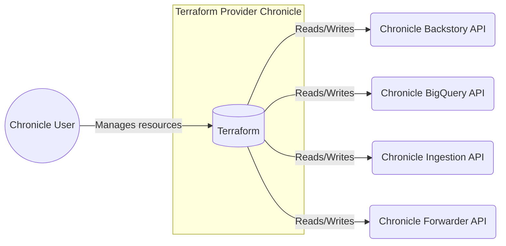
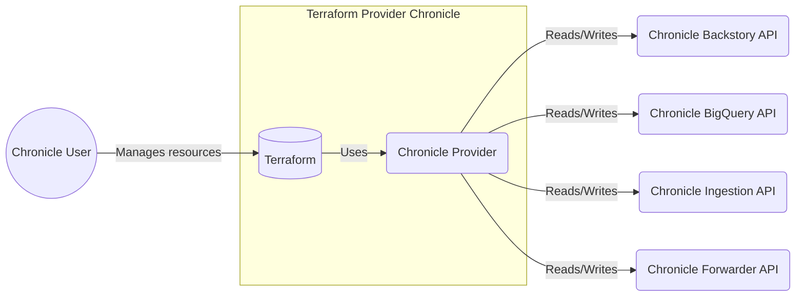
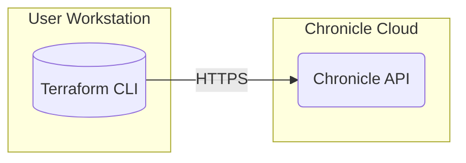
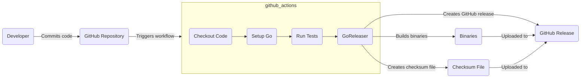

# DESIGN DOCUMENT

## BUSINESS POSTURE

Business priorities and goals:

* Enable Chronicle users to manage their resources using Terraform.
* Support multiple authentication methods for Chronicle APIs.
* Support multiple Chronicle APIs and regions.
* Provide a secure and reliable way to manage Chronicle resources.
* Allow management of Feeds, Rules, Reference Lists, and RBAC Subjects.

Business risks:

* Unauthorized access to Chronicle resources.
* Misconfiguration of Chronicle resources leading to data loss or security breaches.
* Exposure of sensitive credentials.
* Lack of visibility into Chronicle resource changes.
* Difficulty in managing Chronicle resources at scale.
* Supply chain attacks targeting the provider or its dependencies.

## SECURITY POSTURE

Existing security controls:

* security control: Authentication to Chronicle APIs using credentials or access tokens (described in `docs/index.md`).
* security control: Support for multiple Chronicle APIs, each with separate authentication (described in `docs/index.md`).
* security control: Region-specific API endpoints (described in `docs/index.md`).
* security control: Input validation for resource attributes (implemented in `chronicle/*.go`).
* security control: Sensitive data (e.g., access keys, secrets) marked as such in Terraform schema (implemented in `chronicle/*.go`).
* security control: Use of Go modules for dependency management (described in `go.mod`).
* security control: Basic acceptance tests for resource CRUD operations (implemented in `chronicle/*_test.go`).
* security control: Exponential back-off and retry mechanism for API requests (implemented in `client/transport.go`).
* security control: Use of GoReleaser for building and releasing the provider (described in `goreleaser.yaml`).
* security control: Use of GitHub Actions for CI/CD (described in `.github/workflows/*.yaml`).
* security control: Use of `gofmt` for code formatting checks (described in `scripts/gofmtcheck.sh`).
* security control: Use of golangci-lint for code quality checks (described in `.github/workflows/lint.yaml`).
* security control: Input validation for resource attributes, including: credentials, region, feed source/delete options, feed source types, rule text, custom endpoint, subject type, UUID, access keys, and content types (implemented in `chronicle/validation.go`).
* security control: Retry mechanism for API requests with exponential back-off (implemented in `client/transport.go`).
* security control: Rate limiting for API requests (implemented in `client/endpoints.go`).

Accepted risks:

* accepted risk: Limited test coverage for error handling and edge cases.
* accepted risk: Lack of explicit support for Chronicle API rate limiting.
* accepted risk: No specific security controls for supply chain security (e.g., code signing, vulnerability scanning).

Recommended security controls:

* security control: Implement more comprehensive acceptance tests, including negative testing and edge cases.
* security control: Add support for Chronicle API rate limiting.
* security control: Implement supply chain security measures, such as code signing and vulnerability scanning.
* security control: Implement logging of all API requests and responses.
* security control: Implement a mechanism for auditing changes to Chronicle resources.

Security requirements:

* Authentication:
    * Support authentication using credentials (local file path or content).
    * Support authentication using access tokens (local file path or content).
    * Support environment variables for credentials.
    * Credentials and access tokens should be handled securely.
* Authorization:
    * The provider should use the least privilege principle when accessing Chronicle APIs.
    * The provider should support managing RBAC subjects and roles.
* Input validation:
    * All user-provided input should be validated to prevent injection attacks.
    * Validate region, credentials, access tokens, URLs, and other resource attributes.
* Cryptography:
    * Sensitive data (e.g., access keys, secrets) should be encrypted at rest and in transit.
    * Use secure communication channels (HTTPS) for all API requests.

## DESIGN

### C4 CONTEXT

Elements description:

* Name: Terraform
    * Type: System
    * Description: Terraform CLI and core engine.
    * Responsibilities: Manage Chronicle resources via the Terraform Provider Chronicle.
    * Security controls:
        * Authentication to Chronicle APIs using credentials or access tokens.
        * Input validation for resource attributes.
        * Sensitive data marked as such in Terraform schema.
        * Exponential back-off and retry mechanism for API requests.

* Name: Chronicle User
    * Type: Person
    * Description: A user who interacts with Chronicle through Terraform.
    * Responsibilities: Define and manage Chronicle resources using Terraform configuration files.
    * Security controls:
        * Authentication to Terraform.

* Name: Chronicle Backstory API
    * Type: System
    * Description: Chronicle Backstory API.
    * Responsibilities: Provide access to Chronicle Backstory data and functionality.
    * Security controls:
        * Authentication and authorization.
        * Data encryption at rest and in transit.

* Name: Chronicle BigQuery API
    * Type: System
    * Description: Chronicle BigQuery API.
    * Responsibilities: Provide access to Chronicle BigQuery data and functionality.
    * Security controls:
        * Authentication and authorization.
        * Data encryption at rest and in transit.

* Name: Chronicle Ingestion API
    * Type: System
    * Description: Chronicle Ingestion API.
    * Responsibilities: Provide access to Chronicle Ingestion functionality.
    * Security controls:
        * Authentication and authorization.
        * Data encryption at rest and in transit.

* Name: Chronicle Forwarder API
    * Type: System
    * Description: Chronicle Forwarder API.
    * Responsibilities: Provide access to Chronicle Forwarder functionality.
    * Security controls:
        * Authentication and authorization.
        * Data encryption at rest and in transit.

### C4 CONTAINER

Elements description:

* Name: Terraform
    * Type: Container
    * Description: Terraform CLI and core engine.
    * Responsibilities: Manage Chronicle resources via the Terraform Provider Chronicle.
    * Security controls:
        * Authentication to Chronicle APIs using credentials or access tokens.
        * Input validation for resource attributes.
        * Sensitive data marked as such in Terraform schema.
        * Exponential back-off and retry mechanism for API requests.

* Name: Chronicle Provider
    * Type: Container: Go application
    * Description: Terraform provider for Chronicle.
    * Responsibilities: Interact with Chronicle APIs to manage resources.
    * Security controls:
        * Authentication to Chronicle APIs using credentials or access tokens.
        * Input validation for resource attributes.
        * Sensitive data marked as such in Terraform schema.
        * Exponential back-off and retry mechanism for API requests.
        * Use of Go modules for dependency management.
        * Use of GoReleaser for building and releasing the provider.
        * Use of GitHub Actions for CI/CD.
        * Use of `gofmt` for code formatting checks.
        * Use of golangci-lint for code quality checks.
        * Input validation for resource attributes (implemented in `chronicle/validation.go`).
        * Retry mechanism for API requests with exponential back-off (implemented in `client/transport.go`).
        * Rate limiting for API requests (implemented in `client/endpoints.go`).

* Name: Chronicle User
    * Type: Person
    * Description: A user who interacts with Chronicle through Terraform.
    * Responsibilities: Define and manage Chronicle resources using Terraform configuration files.
    * Security controls:
        * Authentication to Terraform.

* Name: Chronicle Backstory API
    * Type: System
    * Description: Chronicle Backstory API.
    * Responsibilities: Provide access to Chronicle Backstory data and functionality.
    * Security controls:
        * Authentication and authorization.
        * Data encryption at rest and in transit.

* Name: Chronicle BigQuery API
    * Type: System
    * Description: Chronicle BigQuery API.
    * Responsibilities: Provide access to Chronicle BigQuery data and functionality.
    * Security controls:
        * Authentication and authorization.
        * Data encryption at rest and in transit.

* Name: Chronicle Ingestion API
    * Type: System
    * Description: Chronicle Ingestion API.
    * Responsibilities: Provide access to Chronicle Ingestion functionality.
    * Security controls:
        * Authentication and authorization.
        * Data encryption at rest and in transit.

* Name: Chronicle Forwarder API
    * Type: System
    * Description: Chronicle Forwarder API.
    * Responsibilities: Provide access to Chronicle Forwarder functionality.
    * Security controls:
        * Authentication and authorization.
        * Data encryption at rest and in transit.

### DEPLOYMENT

The Terraform Provider for Chronicle is deployed as a Go binary. It can be installed using the Terraform CLI. The provider interacts with the Chronicle APIs using HTTPS.

Deployment environments:

* Development: Local machine.
* Testing: Local machine or CI environment.
* Production: Terraform Cloud or local machine.

Deployment diagram (Production):

Elements description:

* Name: Terraform CLI
    * Type: Software System
    * Description: Terraform CLI running on a user's workstation.
    * Responsibilities: Execute Terraform plans and apply changes to Chronicle resources.
    * Security controls:
        * Authentication to Chronicle APIs using credentials or access tokens.
        * Input validation for resource attributes.
        * Sensitive data marked as such in Terraform schema.
        * Exponential back-off and retry mechanism for API requests.

* Name: Chronicle API
    * Type: Software System
    * Description: Chronicle API endpoints.
    * Responsibilities: Provide access to Chronicle data and functionality.
    * Security controls:
        * Authentication and authorization.
        * Data encryption at rest and in transit.
        * Rate limiting.

### BUILD

The Terraform Provider for Chronicle is built using Go and managed with Go modules. The build process is automated using GitHub Actions and GoReleaser.

Build process:

1. Developer commits code changes to the GitHub repository.
2. GitHub Actions workflow is triggered.
3. The workflow checks out the code, sets up Go, and runs tests.
4. If tests pass, GoReleaser is triggered.
5. GoReleaser builds the provider binary for multiple platforms (Darwin, Linux, Windows).
6. GoReleaser creates a checksum file for the binaries.
7. GoReleaser creates a GitHub release and uploads the binaries and checksum file.

Build diagram:

Security controls:

* Use of Go modules for dependency management.
* Use of GitHub Actions for CI/CD.
* Use of `gofmt` for code formatting checks.
* Use of golangci-lint for code quality checks.
* Use of GoReleaser for building and releasing the provider.

## RISK ASSESSMENT

Critical business process we are trying to protect:

* Management of Chronicle resources using Terraform. This includes creating, reading, updating, and deleting Chronicle Feeds, Rules, Reference Lists, and RBAC Subjects.

Data we are trying to protect and their sensitivity:

* Chronicle API credentials and access tokens: Highly sensitive.
* Chronicle resource configurations (e.g., Feed details, Rule text): Moderately sensitive.
* User and group information for RBAC: Moderately sensitive.
* Terraform state file: Contains sensitive information about the managed resources.

## QUESTIONS & ASSUMPTIONS

Questions:

* Are there any specific compliance requirements (e.g., PCI DSS, HIPAA) that need to be considered?
* What is the expected scale of Chronicle resource management (number of resources, frequency of changes)?
* Are there any existing monitoring or logging solutions in place for Chronicle?
* What level of error handling and resilience is required for the provider?
* Are there any specific security concerns or known vulnerabilities related to the Chronicle APIs?
* What is the process for reporting and handling security vulnerabilities in the provider?
* Is there a preference for specific security tools or practices (e.g., static analysis, dynamic analysis)?

Assumptions:

* BUSINESS POSTURE: The primary goal is to enable Chronicle users to manage their resources using Terraform.
* SECURITY POSTURE: The Chronicle APIs are secured with authentication and authorization mechanisms.
* DESIGN: The provider will interact with the Chronicle APIs using HTTPS.
* DESIGN: The provider will be used by Chronicle administrators and developers.
* DESIGN: The provider will be distributed through the official Terraform Registry.
* DESIGN: The provider will be maintained and updated regularly.
