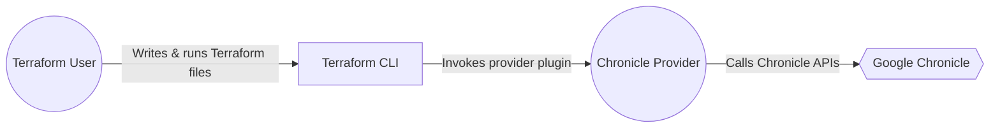
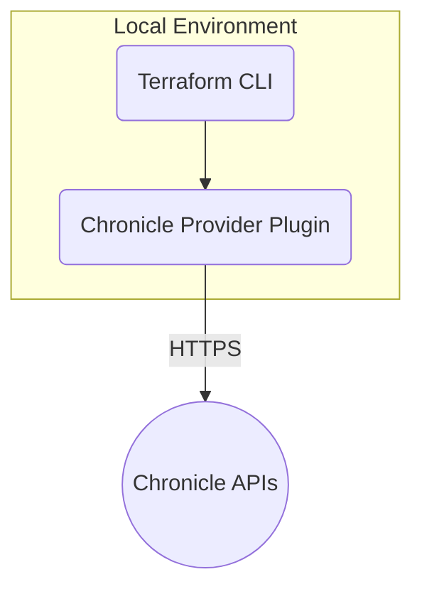
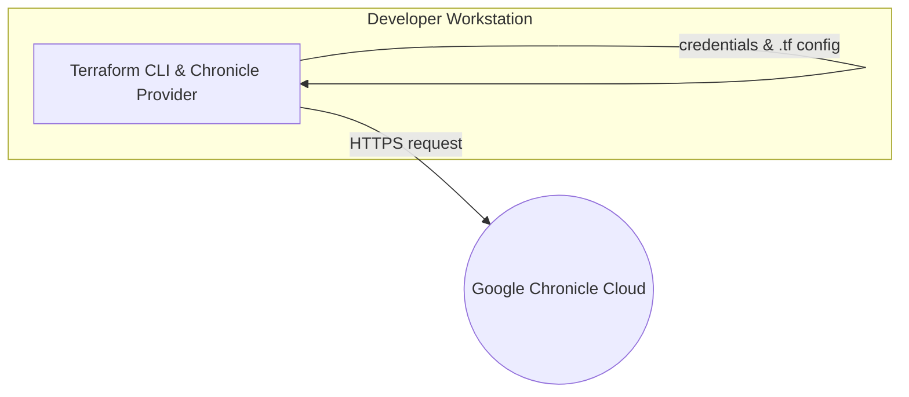
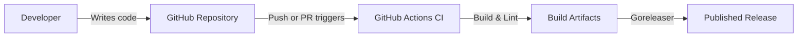

# BUSINESS POSTURE
The primary business objective of this Terraform provider is to facilitate the management of Google Chronicle resources using Infrastructure as Code (IaC) principles. By enabling users to define, deploy, and maintain Chronicle configurations in code form, this project aims to:
1. Improve the efficiency and consistency of Chronicle resource provisioning.
2. Reduce manual mistakes by automatizing environment configurations.
3. Enhance integration with broader DevOps pipelines and workflows.

Key business priorities include:
• Reliability and stability of the provider so that end-users can trust it in production environments.
• Rich feature coverage, supporting the most commonly used Chronicle resources (feeds, rules, reference lists, RBAC subjects, etc.).
• Well-documented usage examples to reduce the learning curve and increase user adoption.

Most important business risks that must be addressed:
• Risk of misconfigurations that could lead to unintended resource creation or data leakage in Chronicle.
• Risk of security breaches if credentials and access tokens are misused or improperly stored.
• Reputational risk if the provider fails to meet user expectations for reliability or if it introduces destructive bugs in production environments.

# SECURITY POSTURE
Below are the existing security controls already visible in the Terraform provider for Chronicle, along with accepted risks and recommended additional security controls.

Existing security controls:
• security control: GitHub Actions-based CI pipelines to build, test, and release the project.
• security control: Linting and code-style checks (golangci-lint, gofmt) enforced via CI workflows.
• security control: Support for credential isolation using environment variables or local disk files.
• security control: Environment variable fallback for various Chronicle credentials, thereby decoupling strictly from user-supplied tokens/JSON strings.
• security control: GPG-signed releases (via goreleaser) ensuring integrity of published artifacts.

Accepted risks:
• accepted risk: Default reliance on environment variables that might store plaintext credentials if not managed securely by the user’s operating environment.
• accepted risk: Potential for accidental exposure of environment variables in public logs or debug modes.

Recommended security controls (high priority and not explicitly referenced in existing documentation or code):
• security control: Implement or integrate a secrets scanning tool during CI to detect accidental commits of secrets.
• security control: Configure automated dependency vulnerability scanning to ensure that third-party libraries used by the provider are free of known CVEs.
• security control: Add static application security testing (SAST) beyond basic lint to catch potential logic flaws or insecure coding patterns.

Security requirements important for this project:
1. Authentication: The provider must handle OAuth or service account credentials securely using standard ephemeral tokens or environment variables with minimized secret exposure.
2. Authorization: The provider should limit privileged actions to the least-privilege principle where possible, letting end-users supply only the required Chronicle roles.
3. Input validation: The provider must validate resource input parameters (e.g., feed configuration, rule text) to prevent injection or unexpected runtime errors.
4. Cryptography: All data in transit to Chronicle’s back-end is protected via TLS. The provider defers to Google’s standard authentication flows for encryption of credentials at rest.

# DESIGN
This Terraform provider is implemented in Go and integrates with Chronicle APIs to create, update, and delete Chronicle resources. It interacts with authentication tokens or credential files that are derived from environment variables or local paths. The provider code performs API transformations to map user-supplied Terraform definitions into Chronicle resource definitions.

## C4 CONTEXT

### Context Diagram Elements
| Name                    | Type               | Description                                                           | Responsibilities                                                          | Security controls                                                                   |
|-------------------------|--------------------|-----------------------------------------------------------------------|----------------------------------------------------------------------------|--------------------------------------------------------------------------------------|
| Terraform User          | External Actor     | A person or system that writes Terraform configuration files.         | 1. Defines .tf files specifying Chronicle resources.                      | Typically relies on local machine security; external to project scope.               |
| Terraform CLI           | Software System    | The main Terraform executable that processes .tf files.               | 1. Reads config files. 2. Loads provider plugins. 3. Executes user’s plan. | Standard Terraform approach with plugin architecture; user environment constraints.  |
| Chronicle Provider      | Software Component | The compiled Go-based plugin that orchestrates Chronicle resources.   | 1. Translates .tf definitions to Chronicle API calls. 2. Manages state.    | security control: Environment-based credentials; security control: CI tests, linting |
| Google Chronicle        | External System    | Chronicle’s cloud-based platform holding logs, feeds, and references. | 1. Stores logs and detection rules. 2. Exposes REST APIs for management.   | Google-managed security, including TLS in transit, identity, and data protection.    |

## C4 CONTAINER
The high-level container architecture of this system focuses on how the Terraform CLI, the Chronicle Provider plugin, and the Chronicle APIs interact.

### Container Diagram Elements
| Name                    | Type               | Description                                                                   | Responsibilities                                                                     | Security controls                                                                     |
|-------------------------|--------------------|-------------------------------------------------------------------------------|---------------------------------------------------------------------------------------|----------------------------------------------------------------------------------------|
| Terraform CLI           | Container          | HashiCorp Terraform engine that loads the provider plugin at runtime.         | 1. Processes user .tf files. 2. Coordinates resource actions. 3. Reports plan output. | Depends on user machine environment security; standard Terraform verification.         |
| Chronicle Provider      | Container          | The compiled plugin using Go-based code and Chronicle client libraries.       | 1. Maps Terraform resource definitions to Chronicle API endpoints. 2. Manages CRUD.   | security control: CI tests, environment-based credential usage, code lint, goreleaser. |
| Chronicle APIs          | External Container | Google Chronicle’s managed APIs for feeds, rules, and reference lists.        | 1. Validates calls from the provider. 2. Persists or modifies Chronicle resources.    | TLS encryption, Google identity management, user-supplied service account or OAuth.    |

## DEPLOYMENT
Below are potential deployment strategies. One common approach is that users install the Terraform provider plugin locally, or retrieve it from an official registry, then run Terraform on a workstation or in a CI environment.

We will detail a local installation approach:

### Deployment Diagram Elements
| Name                                | Type         | Description                                                                                                                   | Responsibilities                                                                                 | Security controls                                                                                         |
|-------------------------------------|-------------|-------------------------------------------------------------------------------------------------------------------------------|---------------------------------------------------------------------------------------------------|----------------------------------------------------------------------------------------------------------------|
| Developer Workstation               | Host         | Local machine or CI runner where Terraform CLI and the Chronicle provider plugin are installed.                               | 1. Stores local credentials. 2. Configures & runs Terraform. 3. Communicates with Chronicle.      | security control: OS-level environment variable protection, optional encryption at rest.                  |
| Terraform CLI & Chronicle Provider  | Software     | Combined environment with Terraform engine and installed Chronicle provider plugin binary.                                     | 1. Applies IaC logic to Chronicle resources. 2. Maintains state locally or in remote back-end.    | security control: environment-based authentication, code scanning, acceptance tests.                      |
| Google Chronicle Cloud              | Cloud System | Hosted by Google. Receives requests from the Terraform provider to create or update resources.                                | 1. Authenticates requests. 2. Provisions or modifies data.                                       | Managed by Google, subject to GCP’s standard security controls (TLS, identity, roles).                   |

## BUILD
This project’s build process is defined by a Makefile and GitHub Actions workflows. The typical flow, from local development to published artifacts, is shown below:

During build:
• The developer modifies the Go code and commits changes.
• A GitHub Actions pipeline is triggered, running lint (golangci-lint), unit and acceptance tests.
• Once tests pass, goreleaser is used to build and package provider binaries for multiple OS/architectures, then publishes them as release assets on GitHub.

Security considerations for build:
• SAST-like checks or advanced code scanning can be integrated into the pipeline.
• Secure storage and redaction of any credentials used during acceptance tests.
• SBOM production or other supply chain attestations (recommended).

# RISK ASSESSMENT
Critical business processes we aim to protect:
• Management of Chronicle resources that, if compromised, could lead to unauthorized log access, rules manipulation, or feed misconfiguration.
• Preservation of infrastructure-as-code reproducibility so that changes to logging and detection rules remain consistent and controlled.

Data we are trying to protect and its sensitivity:
• OAuth tokens or service account JSON credentials used to authenticate to Chronicle. These credentials can grant broad read/write abilities in Chronicle. Exposure could allow a malicious actor to manipulate or retrieve logs or detection data.
• The high-value data includes user-supplied feed configurations and detection rules that define security posture. If misused, attackers could hamper detection capabilities.

# QUESTIONS & ASSUMPTIONS
1. We assume that end-users will manage environment variables or credential files securely (for instance, by storing them in a safe location or using a secrets manager).
2. We assume that only authorized staff will have commit access to the repository, and PRs undergo mandatory review.
3. We assume that the Google Chronicle environment has robust security for data at rest and data in transit.
4. Are there any existing organization-wide scanning or artifact signing policies that can complement the recommended security controls?
5. Under what conditions should additional test coverage (integration or acceptance) be run, and should it be integrated with external scanning services?
6. We assume that usage logs or debug outputs will not inadvertently leak environment variables in typical user scenarios.
