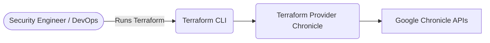
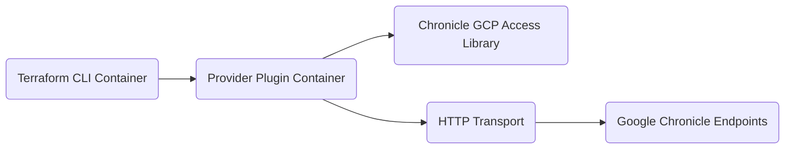
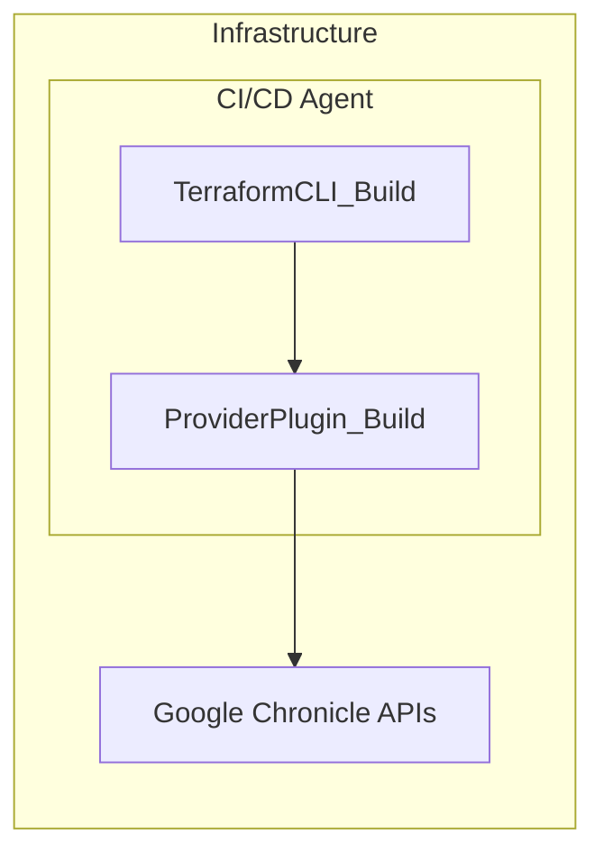
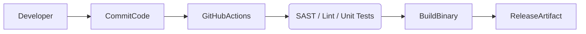

# BUSINESS POSTURE
The primary business goal of this project is to provide a Terraform provider for Chronicle, enabling automated provisioning and management of Chronicle resources (feeds, rules, reference lists, and RBAC subjects). This streamlines the integration between Terraform-based infrastructure-as-code workflows and Chronicle's security analytics service. The project aims to reduce manual efforts for security engineers and DevOps teams, allowing organizations to swiftly deploy and manage Chronicle resources in a consistent, repeatable way.

Business priorities and goals include:
1. Simplify management of Chronicle feeds, rules, and configurations via Terraform.
2. Provide a stable integration point for automated pipelines, enabling version control and collaborative workflows.
3. Reduce complexity and manual overhead when configuring Chronicle environments at scale.
4. Ensure reliability and auditability of security configurations, supporting compliance requirements.

Most important business risks to address:
1. Misconfiguration leading to disruption of Chronicle ingest or alerts, impacting security visibility.
2. Insecure handling of credentials or feed configuration, potentially exposing sensitive data.
3. Unavailability or instability of the Terraform provider, delaying business operations and security investigations.
4. Reputational risk if the provider fails to meet enterprise-grade security and reliability requirements.

# SECURITY POSTURE
Existing security controls:
security control: Authentication flows are handled via built-in environment variables or by reading local credential files. This is implemented in the provider's code (provider.go, client.go) where the code loads credentials from environment variables (CHRONICLE_*) or from local paths.
security control: Input validation checks for AWS access keys, GCS URIs, and general resource properties (validation.go).
security control: Basic rate limiting for each operation to prevent flooding Chronicle APIs (see client/endpoints.go).
security control: Terraform state retains a restricted set of credentials or uses ephemeral environment variables.

Accepted risks:
accepted risk: Reliance on Terraform state security. If state files are not protected, credentials could be exposed.
accepted risk: Storing base64-encoded credentials in environment variables. If those environment variables are leaked, Chronicle secrets could be compromised.

Recommended security controls (high priority):
1. security control: Consider using a dedicated secrets manager for Chronicle secrets rather than environment variables.
2. security control: Enforce mandatory encryption at rest for any local or remote Terraform state (for example, storing state in an encrypted S3 bucket or Terraform Cloud with encryption).
3. security control: Add code scanning tools (SAST and dependency checks) to the CI pipeline to detect vulnerable libraries and insecure coding patterns.
4. security control: Enforce continuous vulnerability checks on dependencies.
5. security control: Provide thorough documentation on rotating credentials, ensuring short-lived tokens where possible.

Important security requirements:
1. Authentication: All Chronicle API calls must be authenticated using GCP or Chronicle-provided credentials/tokens. Rotate credentials regularly.
2. Authorization: Limit the privileges of GCP credentials used by the provider to only necessary Chronicle API scopes.
3. Input validation: Continue verifying user inputs for resource definitions (feed URIs, region constraints, etc.) to prevent misconfigurations.
4. Cryptography: TLS must be enforced when communicating between the Terraform client and Chronicle APIs. Any stored credentials should be encrypted (for instance, in state or ephemeral environment variables).

# DESIGN

## C4 CONTEXT

### Context Diagram Table

| Name               | Type            | Description                                                                            | Responsibilities                                                     | Security controls                                              |
|--------------------|----------------|-----------------------------------------------------------------------------------------|-----------------------------------------------------------------------|----------------------------------------------------------------|
| User               | Person          | Security engineer or DevOps personnel.                                                | Provision Chronicle resources via Terraform.                          | Uses environment with restricted access privileges            |
| TerraformCLI       | System          | Terraform CLI tool.                                                                    | Reads configuration, interacts with providers, applies plans.         | Access controlled by file system or CI pipeline permissions    |
| ProviderPlugin     | Software System | The Chronicle Terraform provider plugin.                                              | Implements logic to manage and configure Chronicle resources.         | Validates user inputs, loads credentials, rate limits requests |
| ChronicleAPIs      | External System | Google Chronicle endpoints (feeds, rules, etc.).                                      | Executes the creation, update, deletion of Chronicle resources.       | Requires valid API credentials and TLS                         |

## C4 CONTAINER

### Container Diagram Table

| Name                           | Type        | Description                                                                                 | Responsibilities                                                                   | Security controls                                              |
|--------------------------------|------------|---------------------------------------------------------------------------------------------|-------------------------------------------------------------------------------------|----------------------------------------------------------------|
| Terraform CLI Container        | Container  | Running user commands to parse .tf files, initialize providers, and run user plans.         | Orchestrates any Terraform plan/apply operations.                                   | Local security context for storing state, environment variables |
| Provider Plugin Container      | Container  | Runs as a separate process that implements the Terraform plugin interface.                 | Translates Terraform resource configuration to Chronicle API calls.                | Input validation, environment variable usage, rate limiting     |
| Chronicle GCP Access Library   | Library    | Google OAuth2 or other GCP-based credentials library used by the plugin.                   | Loads credentials from environment or file, obtains valid OAuth2 tokens.           | Validates or loads credentials from secure sources if configured |
| HTTP Transport                 | Component  | Handles HTTP requests to Chronicle endpoints.                                              | Facilitates secure communication with the Chronicle APIs over HTTPS.               | TLS in transit, uses tokens from the GCP Access Library         |
| Google Chronicle Endpoints     | External   | Chronicle's managed SIEM endpoints for feed management, rule management, etc.              | Receives validated requests from the provider, performs changes in Chronicle.      | Google-managed security and authentication                      |

## DEPLOYMENT
Below is one possible deployment approach, where the Terraform CLI and plugin run on a CI/CD instance with access to the necessary environment variables or secrets. Another approach is running on a developer's local machine.

### Deployment Diagram Table

| Name              | Type         | Description                                                                             | Responsibilities                          | Security controls                                               |
|-------------------|-------------|-----------------------------------------------------------------------------------------|--------------------------------------------|-----------------------------------------------------------------|
| CI/CD Agent       | Node         | The virtual machine or container that runs the Terraform CLI and provider plugin.       | Executes Terraform commands in a pipeline | Requires restricted network access, stores short-lived secrets   |
| TerraformCLI_Build       | Process      | Terraform CLI binary installed in the CI/CD instance or developer workstation.        | Responsible for reading .tf files, applying changes in Chronicle     | Local or ephemeral environment variables for credentials         |
| ProviderPlugin_Build     | Process      | The Chronicle Terraform provider plugin.                                             | Translates user configuration to Chronicle API calls                 | Verified through checksums, version pinned                      |
| GCPChronicle      | External Node| Production Chronicle environment.                                                      | Applies or rejects feed / rule changes                                | Enforces TLS, requires valid credentials                         |

## BUILD
Below is an example simplified build pipeline from source to artifact:

1. Developer makes changes locally.
2. Code is pushed to GitHub.
3. GitHub Actions runs lint, format checks, and unit tests (potentially including SAST scanners).
4. If successful, the plugin is built.
5. Final artifacts are uploaded as a release.

# RISK ASSESSMENT
Critical business processes to protect:
1. Automated provisioning and update of Chronicle resources (feeds, rules, roles).
2. Maintenance and audit of security analytics pipeline.

Data to protect and their sensitivity:
1. Chronicle credentials (environment variables, potential in Terraform state). High sensitivity.
2. Configuration data for feeds and rules (could reveal internal structure or logging strategies). Medium to high sensitivity.
3. Terraform state files with partial secrets or references to environment data. Medium to high sensitivity.

# QUESTIONS & ASSUMPTIONS
1. Questions:
   - Who is responsible for rotation and management of Chronicle credentials (platform team, security team, or DevOps)?
   - Is there a dedicated secrets manager or do we rely solely on environment variables?
   - Is encryption enforced by default in Terraform state (for instance, Terraform Cloud with encryption at rest)?
   - Do we require multi-factor or short-lived tokens for API calls?

2. Assumptions:
   - Chronicle credentials are managed securely outside of version control.
   - The organization is comfortable with environment variables as a short-term method of injecting credentials, provided the environment is locked down.
   - The provided Terraform plugin code is built and distributed through a secure CI environment, with code scanning and artifact validation.
   - TLS is always enforced when communicating between the provider and Chronicle endpoints.
