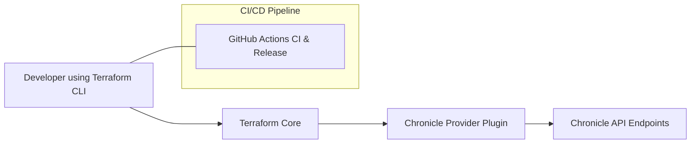

# BUSINESS POSTURE

The Terraform Chronicle Provider is designed to enable users to manage Chronicle resources using a declarative, infrastructure‐as‐code approach. The provider integrates with the Chronicle APIs to manage a variety of resources such as feeds (including ingestion from Amazon S3, Amazon SQS, Azure Blobstore, Google Cloud Storage, and several API feeds such as Microsoft Office 365 Management Activity, Okta, Proofpoint SIEM, Qualys VM, and Thinkst Canary), rules for detection, reference lists, and RBAC subjects. This enables security and operations teams to centrally manage configurations, automate deployments, and version-control their security configurations through Terraform.

**Business Priorities and Goals:**
- Enable automation and consistency in the deployment and management of Chronicle resources.
- Integrate tightly with Terraform so that organizations can incorporate Chronicle configurations into their CI/CD pipelines and infrastructure management suites.
- Provide a uniform, declarative interface to manage multiple feed types and other Chronicle resources across cloud ecosystems.
- Streamline the process of updating rules and feed configurations to improve response times to emerging threats.

**Business Risks to Address:**
- Misconfiguration of feeds or rules might lead to gaps in threat detection or undesired data ingestion.
- Insecure management of credentials (API keys, access tokens, and other secrets) used to access Chronicle APIs.
- Supply chain risks stemming from unverified third‐party dependencies and libraries.
- Changes in Chronicle API versions or endpoints may affect the provider’s functionality and require prompt remediation.

---

# SECURITY POSTURE

This project leverages several built‐in security controls and follows best practices for secure software development throughout its lifecycle.

### Existing Security Controls
- **security control (input validation):** All resource schema fields use custom validation functions (e.g. validating AWS access key formats, UUIDs, URL formats) to enforce correct input.
- **security control (credentials management):** Sensitive fields (e.g. API keys, client secrets) are marked as sensitive in the Terraform schema so that they are not inadvertently exposed.
- **security control (conflict and precedence):** Configuration rules enforce that credentials and access tokens cannot be provided together, with clear precedence using environment variables.
- **security control (build and CI/CD):** The provider includes strict CI pipelines (linter, gofmt, unit tests, acceptance tests) defined in GitHub Actions. Additionally, goreleaser is used to build and sign releases.
- **security control (rate limiting):** The client package implements rate limiting across different API endpoints to mitigate spam and denial-of-service issues.
- **security control (dependency management):** The go.mod file explicitly pins versions of dependencies that are used both directly and indirectly.

### Accepted Risks
- **accepted risk (credentials exposure risk):** Although credentials are handled as sensitive inputs, users must ensure that their environment configurations (e.g. environment variables or files referenced for credentials) are securely managed.
- **accepted risk (external API dependency):** The provider depends on external Chronicle APIs; changes in these APIs or unexpected behaviors may affect provider operations.

### Recommended Security Controls
- Implement automated SAST and dependency vulnerability scanning (e.g. using tools such as Snyk or GitHub Dependabot) within the CI/CD pipeline.
- Consider adding code-signing for build artifacts to ensure build integrity.
- Enhance logging and alerting around authentication failures and unusual API response patterns.

### Security Requirements for the Provider
- **Authentication:** Must support secure OAuth2 flows and token-based authentication as provided through credentials, access tokens, or environment variables.
- **Authorization:** Uses RBAC subject configuration to ensure that users have the minimum required privileges.
- **Input Validation:** All inputs are strongly validated (e.g., UUID formats, valid URLs, AWS credential formats) to reduce injection vulnerabilities.
- **Cryptography:** Communication with Chronicle APIs must use HTTPS and standard TLS practices. Sensitive data such as secrets must be handled with encryption in transit and at rest on user systems.
- Implementation details are documented in the schema and validation functions within the code.

---

# DESIGN

The Terraform Chronicle Provider is implemented in Go using the Terraform Plugin SDK v2. Its primary responsibility is to present a Terraform-compatible interface that maps configuration files into CRUD operations against Chronicle’s various API endpoints. The project is structured into several modules:

- **Provider Entry & Configuration:**
  – Located in `main.go` and `chronicle/provider.go`
  – Initializes the provider, sets up schema for global configurations (e.g. region, credentials, API endpoints) and configures the client with rate limiters and authentication.

- **Resource Implementations:**
  – Located in the `chronicle/` directory. Each resource (feed, rule, rbac subject, reference list) is implemented as a Terraform resource with Create, Read, Update, Delete and Import functionality.
  – These resources call into the common client library to perform HTTP requests to the appropriate Chronicle API endpoint.

- **Client Library:**
  – Located in the `client/` directory.
  – Provides functions to build, sign, and send HTTP requests to Chronicle API endpoints.
  – Implements rate limiting, error handling (including parsing of Google API errors), and helpers for building the request payload from resource configuration maps.

- **Templates and Documentation:**
  – The `templates/` and `docs/` directories include markdown templates for user documentation.
  – The documentation is automatically generated using `tfplugindocs`.

- **CI/CD and Build Automation:**
  – Uses GitHub Actions workflows for continuous integration (lint, test, release) with scripts (e.g. `gofmtcheck.sh` and Make rules).
  – Releases are built and packaged via goreleaser, ensuring multiplatform distribution.

The design leverages separation of concerns:
- The provider adapts Terraform’s resource lifecycle methods, while the client library abstracts API communications.
- Validation and error handling are centralized using helper functions.
- Rate limiting is implemented per API operation to ensure reliability and protection from API abuse.

---

## C4 CONTEXT

Below is a mermaid diagram representing the system context of the Terraform Chronicle Provider:



Below is a table describing the elements of the context diagram:

| Name                          | Type             | Description                                                   | Responsibilities                                                                      | Security Controls                                        |
|-------------------------------|------------------|---------------------------------------------------------------|---------------------------------------------------------------------------------------|----------------------------------------------------------|
| Developer using Terraform CLI | External Actor   | End user who writes Terraform configurations and runs deployments | Author Terraform configuration; initiate deployment and manage state                  | Follows secure coding practices; manages local secrets   |
| Terraform Core                | System Component | The Terraform CLI that loads the provider and executes plans  | Orchestrates Terraform operations; calls provider resource CRUD functions              | Enforces execution as per Terraform plugin security model |
| Chronicle Provider Plugin     | Internal System  | The plugin that implements the Chronicle provider functionality | Translates HCL into API calls; implements provider resources; validates inputs         | Input validation; sensitive field masking; rate limiting |
| Chronicle API Endpoints       | External System  | Chronicle’s back-end services for feeds, rules, RBAC, etc.      | Provide API operations (create, read, update, delete) and manage Chronicle resources     | HTTPS/TLS; authentication via OAuth2; API key validation   |
| GitHub Actions CI & Release   | External System  | The CI/CD system that builds, tests, and releases the provider  | Automates linting, testing, and building; publishes releases using goreleaser           | Automated vulnerability scanning; code signing recommended |

---

## C4 CONTAINER

The container diagram illustrates the high-level architecture and distribution of responsibilities.

```mermaid
flowchart TD
    A[Terraform Provider Entry<br/>(main.go, provider.go)]
    B[Resource Handlers<br/>(chronicle/ resources)]
    C[Client Library<br/>(client/)]
    D[Validation & Utility Functions<br/>(resource_reader.go, validation.go, util.go)]
    E[CI/CD Pipeline<br/>(GitHub Workflows, Makefile, goreleaser)]
    F[Terraform Core]
    G[Chronicle APIs]

    F --> A
    A --> B
    B --> C
    B --> D
    C --> G
    E --> A
```

Below is a table describing each container:

| Name                           | Type                | Description                                                          | Responsibilities                                                                             | Security Controls                                       |
|--------------------------------|---------------------|----------------------------------------------------------------------|----------------------------------------------------------------------------------------------|---------------------------------------------------------|
| Terraform Provider Entry       | Application Binary  | Main entry point (main.go) initializing the provider and configuration | Bootstrapping the plugin; registering schema, provider configuration, and resource mappings     | Enforces proper initialization; propagates secure credentials |
| Resource Handlers              | Application Module  | Implements each Terraform resource type (feeds, rules, RBAC, etc.)    | Translate user configurations into API calls; implement lifecycle functions (CRUD, Import)      | Input validation; schema-sensitive fields; logging       |
| Client Library                 | Application Module  | Centralized HTTP client and API interaction layer (client/ directory)   | Build and send HTTP requests to Chronicle endpoints; manage rate limiting and error handling      | Uses HTTPS/TLS; OAuth2 authentication; rate limiters       |
| Validation & Utility Functions | Supporting Library  | Contains helper functions for reading resource data, performing validations, and converting structures | Convert resource data into maps; validate inputs; manage error wrapping                         | Strict input validation functions; secret handling       |
| CI/CD Pipeline                 | Automation          | GitHub Actions workflows, Makefile, and goreleaser configuration         | Linting, testing, building, and releasing the provider binary                                   | Automated tests; linter checks; vulnerability scanning recommended |

---

## DEPLOYMENT

The provider is distributed as a compiled plugin that Terraform downloads or that users install manually into their local Terraform plugin directory. Deployment occurs in the following ways:

1. **For End Users:**
   - The provider binary is either fetched from the Terraform Registry or installed from a local build (e.g., via `make install` that copies it into `~/.terraform.d/plugins/github.com/form3tech-oss/chronicle/<version>/<os>_<arch>`).
   - Terraform CLI loads the provider dynamically during `terraform init` and executes it as part of the plan/apply workflow.

2. **CI/CD Deployment:**
   - Code pushes to GitHub trigger CI workflows (for linting, testing, and building).
   - Merges to master trigger the release workflow which runs goreleaser to compile, package, and publish binaries.

Below is a mermaid deployment diagram:

```mermaid
flowchart TD
    A[Developer Workstation]
    B[GitHub Repository]
    C[CI/CD Pipeline<br/>(GitHub Actions)]
    D[Release Artifact<br/>(GitHub Releases)]
    E[Terraform CLI]
    F[Local Plugin Directory]
    G[Chronicle API Endpoints]

    A --> B
    B --> C
    C --> D
    E --> F
    F --> D
    E --> G
```

Below is a table describing the deployment elements:

| Name                      | Type                      | Description                                                  | Responsibilities                                           | Security Controls                                       |
|---------------------------|---------------------------|--------------------------------------------------------------|------------------------------------------------------------|---------------------------------------------------------|
| Developer Workstation     | External Actor            | Machine where development and testing occur                | Code writing and local testing                             | Local secrets management; secure work environment       |
| GitHub Repository         | Source Code Repository    | Hosts the provider source code and configuration files       | Source versioning; collaboration                           | Access controls; code review practices                  |
| CI/CD Pipeline            | Automation Server         | GitHub Actions workflows execute tests, linting, build, and release automation | Automatic testing; build automation; release management    | Automated SAST scanning; verifying build integrity        |
| Release Artifact          | Compiled Binary Artifact  | Compiled provider binaries distributed through GitHub Releases | Packaging and distribution                               | Code signing (if implemented); integrity checks           |
| Terraform CLI             | Client Application        | Terraform tool used by end users to run infrastructure plans | Loads provider plugin; orchestrates plan and apply         | Ensures plugin isolation and secure environment via .terraformrc |
| Local Plugin Directory    | Filesystem Location       | Directory where the provider binary is stored on a user’s system | Hosts the provider binary for Terraform (auto or manual install) | File system permissions; secure storage                    |
| Chronicle API Endpoints   | External API Service      | Chronicle back-end systems that the provider manages         | Provide API operations (create, update, delete, etc.)      | HTTPS/TLS; backend authentication; rate limiting           |

---

## BUILD

The build process incorporates standard Go build tools, Makefiles, and CI via GitHub Actions. The process is as follows:

1. **Local Build:**
   - Developers run `make build` to compile the provider binary with vendored dependencies.
   - `gofmt`, `vet`, and lint checks (via `make fmtcheck` and `make lint`) are executed to ensure code quality.

2. **Automated Testing:**
   - Unit tests and acceptance tests (e.g. resource CRUD tests) are executed via `make test` and `make testacc`.
   - Scripts such as `gofmtcheck.sh` enforce code style.

3. **Release Packaging:**
   - Upon merging to master and pushing a new tag (matching "v*.*.*"), the GitHub Actions release workflow triggers goreleaser.
   - Goreleaser builds cross-platform binaries, packages them (e.g. in zip format), generates checksums, and publishes them to GitHub Releases.

Below is a diagram of the build process:

```mermaid
flowchart TD
    A[Developer Push / Merge]
    B[GitHub Actions CI: Lint & Unit Tests]
    C[Acceptance Tests]
    D[Tag Push / Master Update]
    E[Goreleaser Release Workflow]
    F[Build Artifact (Binaries)]
    G[GitHub Releases]

    A --> B
    B --> C
    C --> D
    D --> E
    E --> F
    F --> G
```

---

# RISK ASSESSMENT

**Critical Business Processes to Protect:**
- Deployment and configuration of Chronicle feeds, detection rules, and IAM-like RBAC subjects. Misconfigurations or security lapses in these processes can directly affect the organization’s ability to detect security incidents.
- The CI/CD pipeline that builds, tests, and releases the provider. A compromised build process may allow malicious code injection.

**Data to Protect and Their Sensitivity:**
- **Credentials and API Tokens:**
  Highly sensitive as they provide access to Chronicle’s back-end and other cloud services.
- **Feed and Rule Configurations:**
  While not as sensitive as credentials, incorrect configuration data could lead to gaps in security monitoring and impact operational security.
- **User and RBAC Data:**
  May include identifiers and roles that are critical to access management; compromise could lead to privilege escalation.

Due to the sensitivity of credentials and the central role of configuration in security monitoring, strong controls are required throughout the build, storage, transmission, and logging lifecycle.

---

# QUESTIONS & ASSUMPTIONS

**Questions:**
1. What are the target deployment environments for the provider (e.g., enterprise vs. small teams), and are there specific compliance requirements (e.g., SOC2, ISO 27001) that must be met?
2. How often are the Chronicle APIs expected to change, and what is the process for updating the provider accordingly?
3. What measures are in place (or planned) for monitoring and alerting if the provider behaves unexpectedly in production?
4. Is there a need or plan for additional integration tests that simulate failures from Chronicle APIs (e.g., rate limiting, authentication failures)?

**Assumptions:**
1. It is assumed that users will deploy the provider in environments that follow standard Terraform best practices (e.g., proper management of the .terraformrc file, secure environment variable management).
2. The build and release pipelines (GitHub Actions, goreleaser) are maintained and secured, reducing the risk of supply chain compromise.
3. The provider is mainly intended to be used as part of automated infrastructure deployments and not as a standalone service.
4. Credentials and secrets will be injected via environment variables or secure file references, and users are responsible for protecting those values.
5. The provider is expected to handle multiple types of feeds and configurations; the design assumes that the underlying Chronicle APIs follow documented and stable conventions.
6. The project team accepts the moderate risk inherent in integrating with external APIs by implementing comprehensive testing, validation, and rate limiting measures.
