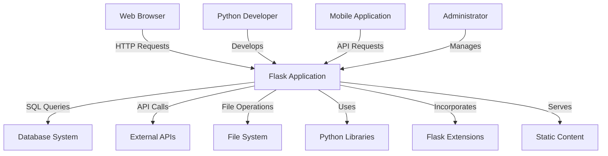
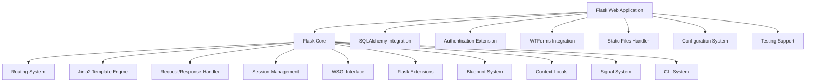
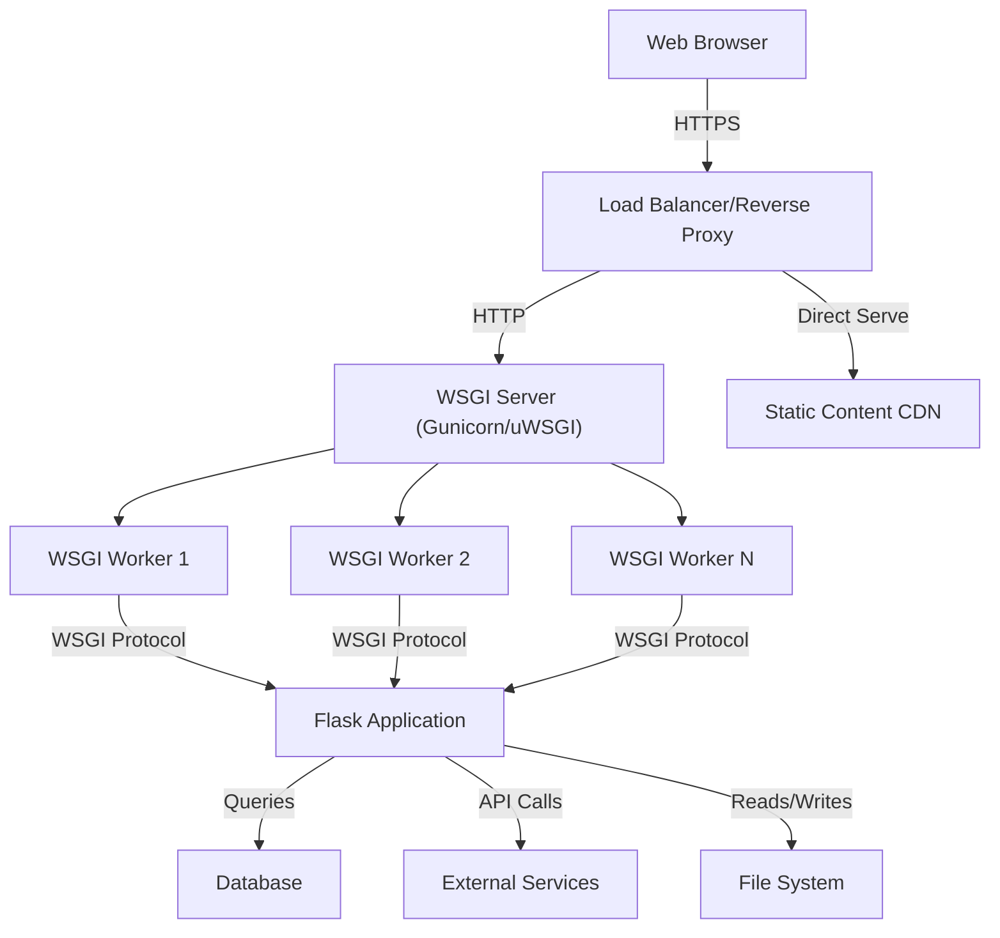
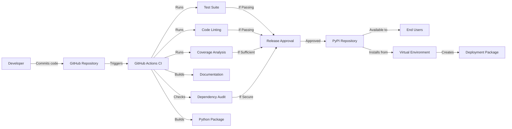

# Flask Project Design Document

## BUSINESS POSTURE

Flask is a lightweight WSGI web application framework designed to make getting started with web development quick and easy, with the ability to scale up to complex applications. As a microframework, Flask provides the essentials without imposing dependencies or structure, allowing developers considerable flexibility.

### Business Priorities and Goals:
1. Provide a simple, approachable entry point for Python web development
2. Maintain a lightweight core with extensive extensibility
3. Support rapid development without compromising on scalability
4. Maintain backward compatibility while evolving with modern web practices
5. Foster a robust ecosystem of extensions and community contributions
6. Serve as a foundation for both small projects and enterprise applications

### Business Risks:
1. Security vulnerabilities could affect thousands of dependent applications
2. Balancing simplicity with security and feature completeness
3. Maintaining relevance amid competing Python web frameworks
4. Supporting diverse deployment scenarios across multiple environments
5. Ensuring appropriate performance characteristics for varying workloads
6. Providing adequate security guidance for inexperienced developers

## SECURITY POSTURE

### Existing Security Controls and Accepted Risks:

1. Security control: Session cookie security with configuration options for secure and httponly flags, implemented in the sessions module.
2. Security control: Context-aware automatic HTML escaping in Jinja2 templates to prevent XSS attacks, implemented in the templating system.
3. Security control: URL parameter validation and route constraints through the routing system.
4. Security control: JSON security measures to prevent content injection, implemented in json functions.
5. Security control: Blueprint system allowing compartmentalization of application functionality, implemented in blueprints module.
6. Security control: Signaling system for security event hooks, implemented in signals.py.
7. Security control: Development server warnings against production use, described in documentation.
8. Security control: Extension ecosystem providing additional security features (Flask-Security, Flask-Login, etc.).
9. Security control: CLI system with secure defaults for environment variables, implemented in the CLI module.

1. Accepted risk: Many critical security features (CSRF protection, authentication, authorization) require additional extensions.
2. Accepted risk: Default configuration prioritizes developer convenience over security.
3. Accepted risk: No built-in protection against common web vulnerabilities beyond basic escaping.
4. Accepted risk: Security guidance is distributed across documentation rather than centralized.
5. Accepted risk: Client-side session storage by default potentially exposing sensitive data.
6. Accepted risk: Limited built-in input validation mechanisms beyond form handling.

### Recommended Security Controls:

1. Integrated security headers configuration with secure defaults
2. Built-in CSRF protection without requiring extensions
3. More comprehensive security documentation prominently featured
4. Default rate limiting capabilities for API endpoints
5. Integrated request validation framework
6. Automated security testing as part of the CI pipeline
7. Configurable logging with security event detection
8. Automatic environment detection with appropriate security settings

### Security Requirements:

#### Authentication
- No built-in authentication system, typically implemented via extensions
- Session handling provides foundation for authentication systems
- Should enforce strong password policies when implementing authentication
- Consider multi-factor authentication for sensitive applications
- Token-based authentication recommended for APIs

#### Authorization
- No built-in role-based access control
- Route protection mechanisms must be implemented by developers
- Consider attribute-based access control for complex requirements
- Implement least privilege principle in access controls
- Include audit logging for sensitive operations

#### Input Validation
- All request data should be validated before processing
- Use schema validation for structured data
- Implement type checking and range validation
- Validate uploaded files for type, size, and content
- Sanitize output to prevent XSS in dynamic content

#### Cryptography
- Use modern algorithms for password hashing (Argon2, bcrypt)
- Properly manage encryption keys outside of source code
- Implement forward secrecy where appropriate
- Use TLS 1.3 for transport security
- Avoid implementing custom cryptographic solutions

## DESIGN

Flask follows a clean, minimalist design philosophy with a focus on simplicity and extensibility. The core framework provides routing, request/response handling, templating, and basic session management while allowing developers to extend functionality through a rich extension ecosystem.

### C4 CONTEXT

#### Context Elements

| Name | Type | Description | Responsibilities | Security Controls |
|------|------|-------------|-----------------|-------------------|
| Flask Application | Software System | Python web application built with Flask | Process HTTP requests, render templates, manage sessions, interact with databases | Input validation, output encoding, cookie security, error handling |
| Web Browser | External System | Client application used by end users | Render HTML/CSS/JS, send HTTP requests, execute client-side code | Same-origin policy, content security policy, HTTPS enforcement |
| Python Developer | Person | Creates and maintains the Flask application | Write application code, implement business logic, manage dependencies | Code reviews, security training, secure coding practices |
| Database System | External System | Stores application data | Persist and retrieve data, enforce data integrity | Connection encryption, authentication, query parameterization, access controls |
| External APIs | External System | Third-party services consumed by the application | Provide additional functionality, data integrations | API key management, transport encryption, request validation |
| File System | External System | Storage for application files | Store configuration, logs, uploads, etc. | Path validation, access controls, file type validation |
| Python Libraries | External System | Additional Python packages used by the application | Extend Python functionality | Dependency scanning, version pinning, vulnerability monitoring |
| Flask Extensions | External System | Specialized Flask add-ons for additional features | Add authentication, admin interfaces, form validation, etc. | Extension vetting, vulnerability monitoring, proper configuration |
| Static Content | Internal System | Static assets (CSS, JavaScript, images) | Provide UI elements and client-side functionality | Content security policy, cache controls, integrity verification |
| Mobile Application | External System | Native or hybrid mobile app consuming Flask APIs | Provide mobile interface to application | API authentication, transport security, input validation |
| Administrator | Person | Manages the Flask application deployment | Configure server, monitor performance, apply updates | Access controls, audit logging, secure configuration |

### C4 CONTAINER

#### Container Elements

| Name | Type | Description | Responsibilities | Security Controls |
|------|------|-------------|-----------------|-------------------|
| Flask Core | Container | Central framework component | Coordinate application functionality | Error handling, secure defaults, extensibility |
| Routing System | Component | Maps URLs to view functions | URL parsing, route matching, URL generation | Route validation, parameter checking |
| Jinja2 Template Engine | Component | Renders HTML templates | Template compilation, context rendering | Automatic HTML escaping, sandbox limitations |
| Request/Response Handler | Component | Processes HTTP interactions | Parse requests, format responses, handle headers | Input validation, secure header management |
| Session Management | Component | Manages user sessions | Create/read/update session data | Cookie signing, secure/httponly flags, session validation |
| WSGI Interface | Component | Communicates with web servers | Handle server interaction, conform to WSGI spec | Request boundary validation, environment isolation |
| Flask Extensions | Component | Pluggable enhancements | Provide additional functionality | Extension validation, configuration validation |
| Blueprint System | Component | Application modularity | Organize routes and views | Namespace isolation, modular security controls |
| Context Locals | Component | Request-scoped globals | Provide access to current request/app objects | Context binding, proper cleanup |
| Signal System | Component | Event dispatching | Allow hooking into framework events | Signal validation, execution isolation |
| CLI System | Component | Command-line interface | Provide admin tools and commands | Input validation, privilege management |
| SQLAlchemy Integration | External Container | Database ORM integration | Manage database connections and queries | Query parameterization, connection pooling |
| Authentication Extension | External Container | User authentication | Verify user identity, manage login state | Password hashing, brute force protection |
| WTForms Integration | External Container | Form handling and validation | Process form submissions, validate input | CSRF protection, input sanitization |
| Static Files Handler | Component | Serves static assets | Efficient delivery of static content | Content type validation, caching controls |
| Configuration System | Component | Manages application settings | Load and apply configuration | Secret management, validation |
| Testing Support | Component | Facilitates application testing | Create test clients, mock requests | Test isolation, coverage analysis |

### DEPLOYMENT

Flask applications can be deployed in multiple ways, including:

1. Traditional WSGI server deployment (Gunicorn, uWSGI)
2. Containerized deployment (Docker)
3. Serverless deployment (AWS Lambda, Google Cloud Functions)
4. PaaS deployment (Heroku, Fly.io, Google App Engine)
5. Hybrid deployment with CDN integration

Below is a detailed description of a traditional production deployment using WSGI servers:

#### Deployment Elements

| Name | Type | Description | Responsibilities | Security Controls |
|------|------|-------------|-----------------|-------------------|
| Web Browser | External System | Client application | Render application UI, execute client code | TLS certificate validation, SOP/CORS |
| Load Balancer/Reverse Proxy | Infrastructure | NGINX, HAProxy, or cloud load balancer | Distribute traffic, terminate TLS, serve static assets | TLS configuration, HTTP security headers, WAF rules |
| WSGI Server | Infrastructure | Gunicorn, uWSGI, or similar | Execute Python application code, manage worker processes | Process isolation, resource limits, timeout handling |
| WSGI Workers | Process | Individual application processes | Handle concurrent requests | Memory isolation, graceful restart |
| Flask Application | Software System | The Flask web application | Process requests, implement business logic | All application security controls |
| Database | Infrastructure | PostgreSQL, MySQL, MongoDB, etc. | Store application data | Network isolation, authentication, encryption at rest |
| External Services | External System | Third-party APIs and services | Provide additional functionality | Secure API keys, circuit breakers, transport security |
| File System | Infrastructure | Server or cloud storage | Store uploaded files, logs, etc. | Access controls, encryption, integrity checks |
| Static Content CDN | Infrastructure | Content delivery network | Efficiently serve static assets | Cache controls, origin validation |

### BUILD

Flask, as an open-source framework, uses a standardized build and release process ensuring quality and security.

The Flask build process incorporates several security controls:

1. Automated testing with pytest to verify functionality and prevent regressions
2. Code linting with flake8 to enforce coding standards
3. Type checking with mypy to catch type-related errors
4. Documentation generation with Sphinx to ensure proper guidance
5. Dependency scanning to identify vulnerable packages
6. Package signing for release integrity
7. Continuous integration via GitHub Actions
8. Version constraint enforcement for dependencies
9. Automated release process to PyPI
10. Community review process for all code changes

The Flask project follows an open development model with security controls embedded throughout:

1. Code review requirements for all changes
2. Branch protection on the main repository
3. Maintainer approval required for all pull requests
4. Security policy with responsible disclosure process
5. Semantic versioning for clear upgrade paths
6. Deprecation periods for breaking changes
7. Regular security updates and maintenance releases

## RISK ASSESSMENT

### Critical Business Processes to Protect:

1. HTTP request processing pipeline
   - This forms the core of any Flask application's functionality
   - Vulnerabilities here could affect all aspects of an application
   - Failures could lead to denial of service or security bypasses

2. Template rendering
   - Incorrect template handling could lead to XSS vulnerabilities
   - Template injection could allow for server-side template injection attacks
   - Performance issues could cause application unavailability

3. Session management
   - Session hijacking could allow unauthorized access
   - Session fixation attacks could compromise user accounts
   - Session data leakage could expose sensitive information

4. Routing and URL handling
   - Improper routing could expose unintended functionality
   - URL manipulation could bypass security controls
   - Parameter handling flaws could lead to injection attacks

5. Extension integration
   - Poorly configured extensions could introduce vulnerabilities
   - Outdated extensions may contain known security flaws
   - Extension compatibility issues could create unexpected behaviors

### Data Sensitivity and Protection:

1. User credentials and authentication tokens
   - Highest sensitivity level
   - Must be protected in transit and at rest
   - Should never be logged or exposed in error messages
   - Requires cryptographic protection with modern algorithms

2. Session data
   - High sensitivity level
   - Contains authentication state and potentially personal information
   - Should be cryptographically signed
   - Should be configured with secure cookie flags

3. Application business data
   - Sensitivity varies by application
   - Access should be controlled based on user authorization
   - Data validation required at all trust boundaries
   - Appropriate database security controls needed

4. Configuration and environment data
   - High sensitivity for secrets and credentials
   - Should be separated from code
   - Environment-specific settings must be secured
   - Secrets management system recommended

5. Logs and diagnostics
   - Medium sensitivity
   - Should not contain personal data or secrets
   - Access should be restricted to administrators
   - Retention policies should be implemented

## QUESTIONS & ASSUMPTIONS

### Business Posture Questions & Assumptions:

1. What is the target audience for Flask applications (startups, enterprises, individuals)?
   - Assumption: Flask serves a broad range of users from individual developers to large enterprises.

2. What is the expected scale of applications built with Flask?
   - Assumption: Flask can scale from simple applications to large-scale services with proper architecture.

3. How much security expertise do typical Flask developers possess?
   - Assumption: Flask developers have varying levels of security expertise, requiring both flexibility and guidance.

4. What is the priority between developer experience and security?
   - Assumption: Flask prioritizes developer experience but provides pathways to security.

5. What competitive frameworks does Flask position against?
   - Assumption: Flask competes with Django, FastAPI, and other Python web frameworks.

### Security Posture Questions & Assumptions:

1. What level of default security should Flask provide versus leaving to developers?
   - Assumption: Core security features should be available but configurable.

2. How should Flask balance backward compatibility with security improvements?
   - Assumption: Security improvements take precedence but with appropriate migration paths.

3. What is the expected threat model for typical Flask applications?
   - Assumption: Web-based threats including OWASP Top 10 vulnerabilities.

4. How should Flask handle security vulnerabilities in dependencies?
   - Assumption: Dependency scanning and notification mechanisms should be provided.

5. What security documentation is most valuable to Flask users?
   - Assumption: Practical, implementation-focused security guidance with examples.

### Design Questions & Assumptions:

1. How do Flask applications typically integrate with databases?
   - Assumption: Through SQLAlchemy or similar ORMs with connection pooling.

2. What authentication mechanisms are most commonly used with Flask?
   - Assumption: Flask-Login, Flask-Security, or custom implementations using sessions.

3. How are Flask applications typically deployed in production?
   - Assumption: Behind a WSGI server with a reverse proxy in containerized environments.

4. What monitoring and observability tools integrate with Flask?
   - Assumption: Standard Python tooling like Prometheus, OpenTelemetry, or application-specific monitoring.

5. How should Flask applications handle microservice architectures?
   - Assumption: Through API design with appropriate authentication between services.
