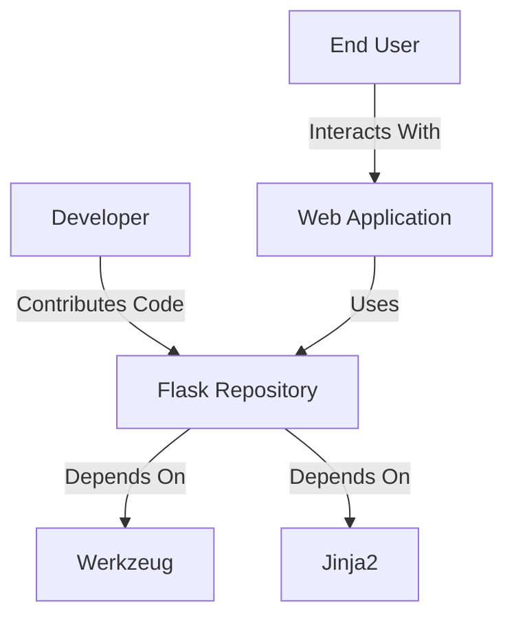
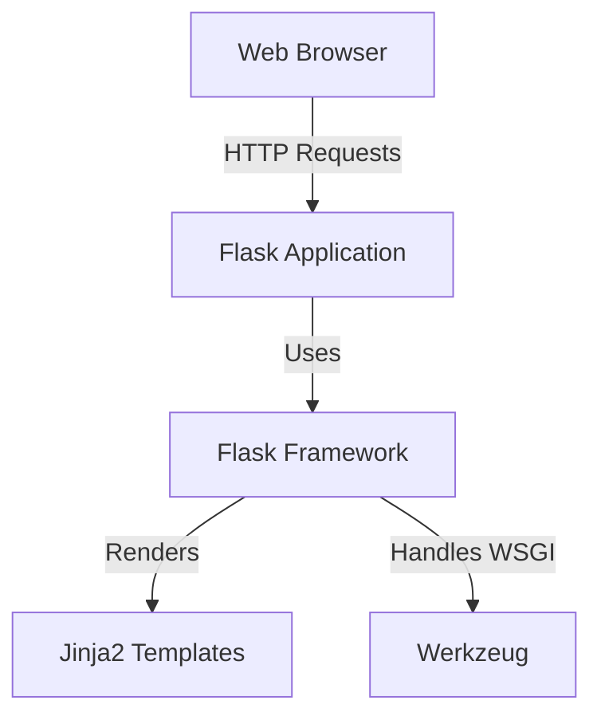
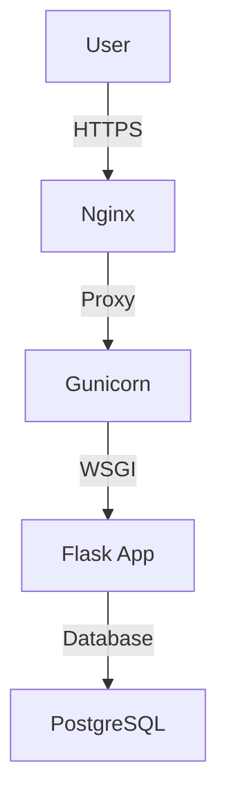
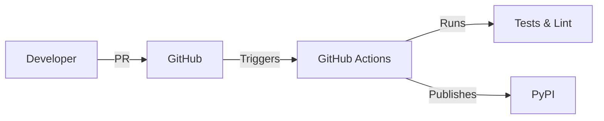

# Project Design Document: Flask Web Framework

## BUSINESS POSTURE

**Business Priorities and Goals:**
- Provide a lightweight, modular, and extensible web framework for Python developers.
- Maintain simplicity while enabling rapid development of web applications.
- Foster a large open-source community for contributions and support.

**Key Business Risks:**
1. **Framework Vulnerabilities:** Security flaws in Flask could propagate to downstream applications.
2. **Project Sustainability:** Reliance on volunteer maintainers risks delayed updates or abandonment.
3. **Third-Party Dependency Risks:** Vulnerabilities in dependencies (e.g., Werkzeug, Jinja) may compromise Flask's security.

---

## SECURITY POSTURE

**Existing Security Controls:**
- **Security Control:** Automated testing via GitHub Actions (implemented in `.github/workflows`).
- **Security Control:** Dependency scanning via Dependabot (configured in `dependabot.yml`).
- **Security Control:** Code review process for pull requests (enforced via GitHub branch protections).

**Accepted Risks:**
- No formal SAST (Static Application Security Testing) integration in CI/CD.
- Limited documentation on secure coding practices for Flask extension developers.

**Recommended Security Controls (High Priority):**
1. Integrate SAST tools (e.g., Bandit, Semgrep) into GitHub Actions.
2. Implement signed releases for PyPI packages.
3. Add threat modeling for new feature proposals.

**Security Requirements:**
- **Authentication:** Not natively provided; developers must implement via extensions (e.g., Flask-Login).
- **Authorization:** Delegated to application-layer logic or third-party libraries.
- **Input Validation:** Relies on Werkzeug's form/data parsing with basic sanitization.
- **Cryptography:** Uses Python's `secrets` module for session cookie signing (default).

---

## DESIGN

### C4 CONTEXT

**Context Diagram Elements Table:**

| Name | Type | Description | Responsibilities | Security Controls |
|------|------|-------------|------------------|-------------------|
| Flask Repository | Software System | Core Flask framework codebase | Provide HTTP request handling, routing, templating | Code reviews, automated tests |
| Werkzeug | External System | WSGI utility library | HTTP protocol parsing, request/response objects | Dependency updates |
| Jinja2 | External System | Templating engine | Render HTML templates | Input sanitization |
| Developer | Human | Contributor/maintainer | Code development, issue triaging | 2FA enforcement |
| Web Application | Software System | Flask-based application | Serve user-facing features | N/A (application-specific) |

### C4 CONTAINER

**Container Diagram Elements Table:**

| Name | Type | Description | Responsibilities | Security Controls |
|------|------|-------------|------------------|-------------------|
| Flask Application | Container | Custom application logic | Implement business rules | Session management |
| Flask Framework | Container | Core library | Route requests, process middleware | Secure defaults |
| Jinja2 Templates | Container | Template files | Generate dynamic HTML | Auto-escaping enabled |
| Werkzeug | Container | WSGI server | Parse HTTP headers | Request size limits |

### DEPLOYMENT

**Common Deployment Architectures:**
1. Traditional WSGI Server (Gunicorn/uWSGI + Nginx)
2. Serverless (AWS Lambda + API Gateway)
3. Containerized (Docker + Kubernetes)

**Selected Deployment (Traditional WSGI):**

**Deployment Elements Table:**

| Name | Type | Description | Responsibilities | Security Controls |
|------|------|-------------|------------------|-------------------|
| Nginx | Infrastructure | Web server | TLS termination, rate limiting | TLS 1.3 enforcement |
| Gunicorn | Infrastructure | WSGI server | Process management | Worker isolation |
| Flask App | Container | Application runtime | Execute business logic | Secure session cookies |
| PostgreSQL | Infrastructure | Database | Store persistent data | Encryption at rest |

### BUILD

**Build Process:**
1. Developer commits to `main` branch (protected)
2. GitHub Actions runs:
   - Unit tests with pytest
   - Linting via flake8
   - Documentation build
3. Successful builds trigger PyPI release via Twine

**Security Controls:**
- Branch protection requiring 2 maintainer approvals
- Cryptographic signing of PyPI packages
- Dependency version pinning in `requirements.txt`

---

## RISK ASSESSMENT

**Critical Business Processes:**
- HTTP request handling pipeline
- Template rendering system
- Extension ecosystem management

**Data to Protect:**
- Session cookies (signed but not encrypted by default)
- Application secrets (SECRET_KEY configuration)
- User-supplied input (forms, URL parameters)

---

## QUESTIONS & ASSUMPTIONS

**Questions:**
1. Is there a formal process for security audits of third-party dependencies?
2. How are secrets managed in the CI/CD pipeline for PyPI deployments?
3. What is the SLA for addressing critical CVEs in released versions?

**Assumptions:**
- Flask is primarily deployed in production environments with reverse proxies
- Developers follow WSGI server hardening guidelines
- Applications implement additional security layers (e.g., WAF) externally
