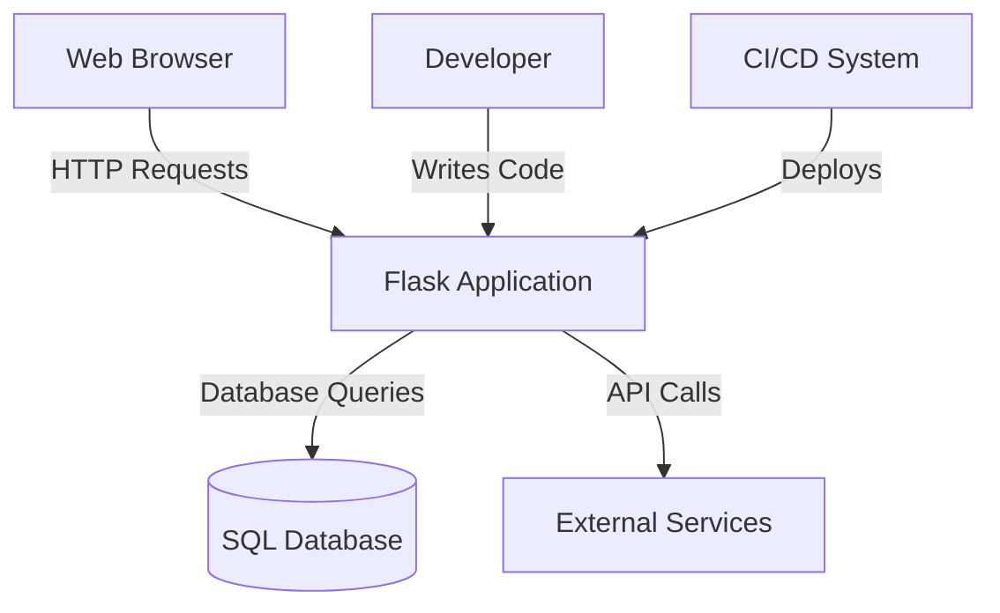
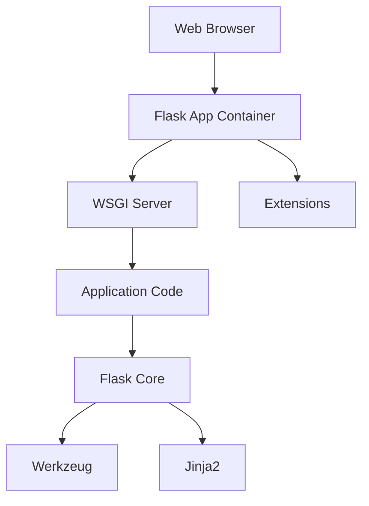
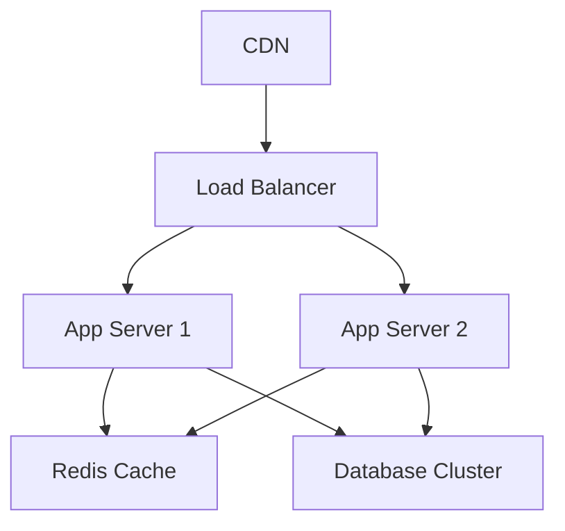
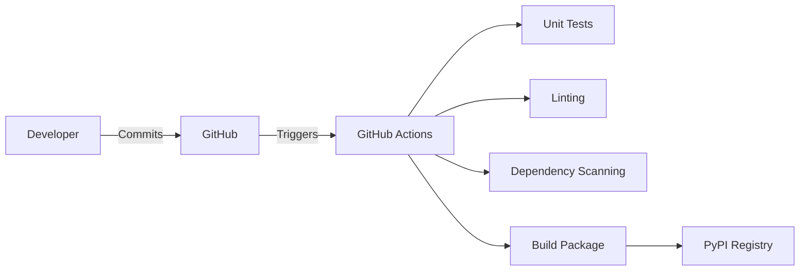

# Project Design Document: Flask (pallets/flask)

## BUSINESS POSTURE

**Business Priorities and Goals:**
1. Provide a lightweight, modular web framework for Python developers.
2. Enable rapid development of web applications with minimal boilerplate.
3. Maintain backward compatibility while allowing extensibility through extensions.
4. Foster an open-source ecosystem around microservices and small-to-medium web apps.

**Key Business Risks:**
1. Framework vulnerabilities impacting downstream applications (reputational risk)
2. Over-reliance on community-maintained extensions (supply chain risk)
3. Competition with full-stack frameworks offering built-in security features
4. Maintaining security in minimalist design philosophy vs. enterprise feature expectations

## SECURITY POSTURE

**Existing Security Controls:**
1. Security Control: Secure session management (implemented in `flask.sessions`)
2. Security Control: CSRF protection via Flask-WTF extension (documented in Flask docs)
3. Security Control: Input sanitization through Werkzeug (base dependency)
4. Accepted Risk: No built-in authentication system (delegated to extensions)
5. Accepted Risk: Default development server not production-hardened

**Recommended Security Controls:**
1. Formal security audit program for core framework
2. Vulnerability disclosure program with CVE tracking
3. SBOM generation for release artifacts
4. Integration with OWASP Python Security Project

**Security Requirements:**
- Authentication: Must support integration with standard auth mechanisms (OAuth2, OpenID Connect)
- Authorization: Role-based access control through extensions
- Input Validation: Built-in request parsing with Werkzeug
- Cryptography: TLS 1.2+ support through WSGI server implementation

## DESIGN

### C4 CONTEXT

| Name | Type | Description | Responsibilities | Security Controls |
|------|------|-------------|------------------|-------------------|
| Web Browser | User Interface | End-user access point | Render UI, handle user input | HTTPS enforcement |
| Flask Application | Software System | Core web application | Process requests, business logic | CSRF protection |
| SQL Database | Data Store | Persistent data storage | Data persistence | Access controls |
| External Services | External System | Third-party APIs | Specialized services | API key management |
| Developer | Human | Application maintainer | Code development | Code signing |
| CI/CD System | Automation | Deployment pipeline | Build/test/deploy | Pipeline security |

### C4 CONTAINER

| Name | Type | Description | Responsibilities | Security Controls |
|------|------|-------------|------------------|-------------------|
| WSGI Server | Container | HTTP request handler | Request routing | Request validation |
| Application Code | Container | Business logic | Implement features | Input validation |
| Flask Core | Component | Framework core | Provide base features | Session security |
| Werkzeug | Component | Utility library | HTTP handling | Secure headers |
| Jinja2 | Component | Templating engine | Template rendering | Autoescaping |

### DEPLOYMENT

**Typical Production Deployment:**

| Name | Type | Description | Responsibilities | Security Controls |
|------|------|-------------|------------------|-------------------|
| CDN | Infrastructure | Content delivery | Static asset caching | DDoS protection |
| Load Balancer | Infrastructure | Traffic distribution | SSL termination | WAF integration |
| App Server | Container | Flask application | Request processing | Runtime security |
| Redis Cache | Data Store | Session storage | Temporary data | Encryption at rest |
| Database Cluster | Data Store | Primary data storage | Data persistence | TDE implementation |

### BUILD

**CI/CD Pipeline:**

Security Controls:
1. Signed git commits enforcement
2. Automated security scanning (Bandit, Safety)
3. Twine package signing
4. Peer review requirements

## RISK ASSESSMENT

**Critical Business Processes:**
1. Web application request handling integrity
2. Session management reliability
3. Extension ecosystem trust chain

**Data Protection Requirements:**
- Sensitivity Levels:
  1. High: User authentication credentials
  2. Medium: Application configuration
  3. Low: Static assets

## QUESTIONS & ASSUMPTIONS

**Questions:**
1. Is there a formal security review process for community extensions?
2. What is the incident response process for framework vulnerabilities?
3. Are there SLAs for security patch releases?

**Assumptions:**
1. Deployment uses WSGI server with security hardening
2. Developers follow Flask security guidelines
3. Extensions are vetted before production use
4. Monitoring covers application-layer attacks
