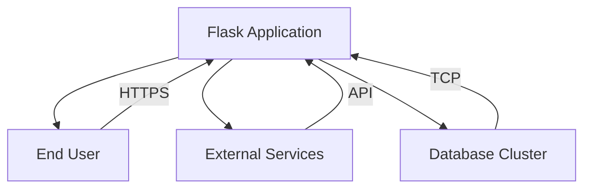
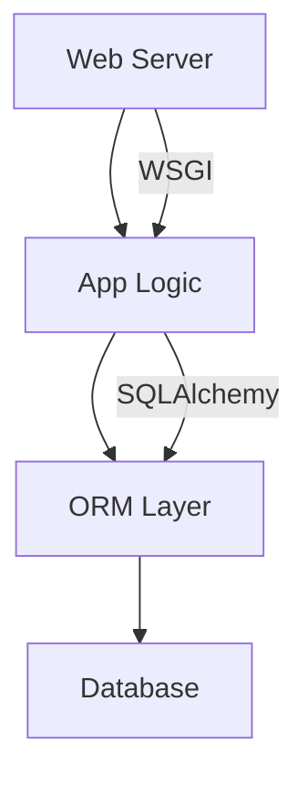
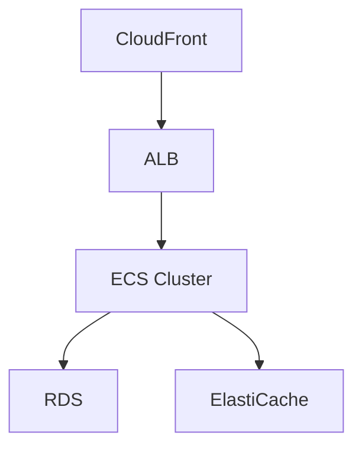
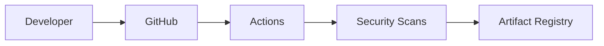

mermaid
graph TD
    A[Flask Application] --> B[User]
    A --> C[External APIs]
    A --> D[Database]
    A --> E[Flask Framework]
    B -->|HTTP Requests/Responses| A
    C -->|API Calls| A
    D -->|Data Storage/Retrieval| A
    E -->|Core Functionality| A
```

# Project Design Document for Flask

## BUSINESS POSTURE
**Priorities & Goals**
- Provide a lightweight, modular web framework for Python developers
- Enable rapid development of small to medium web applications
- Maintain backward compatibility while evolving with modern web standards

**Business Risks**
- Framework vulnerabilities impacting downstream applications
- Slow adoption due to increasing competition (e.g., FastAPI, Django)
- Community fragmentation affecting maintenance velocity
- Legal risks from third-party dependency vulnerabilities

## SECURITY POSTURE

### Existing Security Controls
1. **Security Control**: Input validation via Werkzeug
   Implemented in: `werkzeug.security` module
2. **Security Control**: Secure cookie implementation
   Implemented in: `flask.sessions` interface
3. **Security Control**: Cross-Site Scripting (XSS) protection
   Implemented via Jinja2 autoescaping

### Accepted Risks
1. No built-in authentication system (delegated to extensions)
2. Default development server lacks production hardening
3. Reliance on developers for proper HTTPS configuration

### Recommended Security Controls
1. Code signing for release artifacts
2. Automated vulnerability scanning for dependencies
3. Security headers middleware (CSP, HSTS)
4. Formal security certification process for Flask extensions

### Security Requirements
1. **Authentication**: Must support integration with OAuth2/OIDC
2. **Authorization**: Role-based access control capabilities
3. **Input Validation**: Strict type checking for all endpoints
4. **Cryptography**: Enforced TLS 1.3+ for session management

## DESIGN

### C4 CONTEXT



| Name | Type | Description | Responsibilities | Security Controls |
|------|------|-------------|-------------------|-------------------|
| Flask Application | Software System | Core web framework | Request handling, routing, templating | Input validation, secure sessions |
| End User | Person | Application end user | Initiate HTTP requests | N/A |
| External Services | Software System | Third-party APIs | Provide external data | Mutual TLS |
| Database Cluster | Software System | Persistent storage | Data CRUD operations | Encryption at rest |

### C4 CONTAINER



| Name | Type | Description | Responsibilities | Security Controls |
|------|------|-------------|-------------------|-------------------|
| Web Server | Container | HTTP endpoint | Handle network I/O | Request filtering |
| App Logic | Container | Business logic | Route processing | Input validation |
| ORM Layer | Container | Data mapping | Object-relational mapping | Query sanitization |
| Database | Container | RDBMS | Data storage | Access controls |

### DEPLOYMENT

**Primary Architecture**: Cloud-native deployment with AWS


| Name | Type | Description | Responsibilities | Security Controls |
|------|------|-------------|-------------------|-------------------|
| CloudFront | Infrastructure | CDN | Traffic distribution | WAF integration |
| ALB | Infrastructure | Load balancer | Request routing | TLS termination |
| ECS Cluster | Infrastructure | Container runtime | App execution | IAM roles |
| RDS | Infrastructure | Managed database | Persistent storage | Encryption at rest |

### BUILD

**CI/CD Pipeline**:


Security Controls:
1. Signed commits enforcement
2. SAST via CodeQL
3. Dependency scanning with Dependabot
4. Build artifact signing

## RISK ASSESSMENT

**Critical Processes**:
- Web request handling pipeline
- Session management lifecycle
- Dependency update mechanism

**Protected Data**:
- User session tokens (high sensitivity)
- Application configuration secrets
- Database connection credentials

## QUESTIONS & ASSUMPTIONS

1. What compliance standards apply to deployment environments?
   *Assumption: No specific compliance requirements beyond general best practices*

2. Is there a dedicated security review team?
   *Assumption: Security handled through community contributions*

3. What SLAs exist for vulnerability patching?
   *Assumption: Best-effort basis based on severity*

4. Are there regulatory constraints for data residency?
   *Assumption: Global deployment model with no geo-restrictions*
