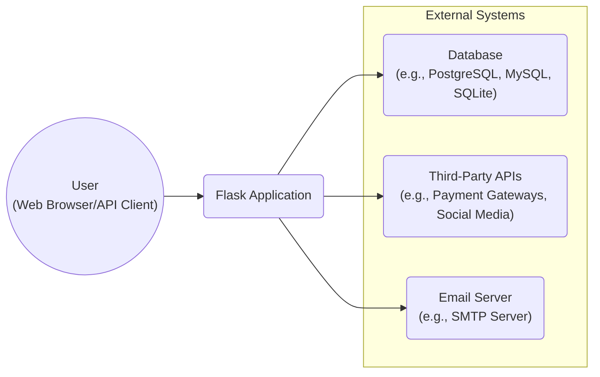
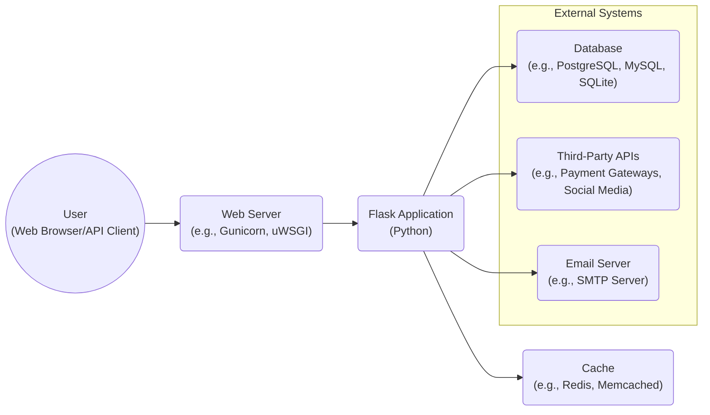
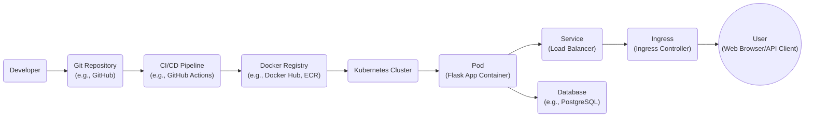
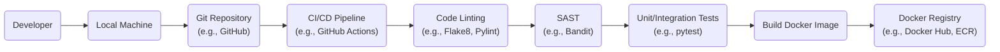

Okay, let's create a design document for the Flask project, keeping in mind its purpose and potential security considerations.

# BUSINESS POSTURE

Flask is a micro web framework written in Python. It aims to provide a simple, yet extensible, foundation for building web applications, APIs, and other web-connected resources.  It's known for its flexibility and minimalist design, allowing developers to choose the components they need.

Priorities:

-   Ease of Use:  Flask prioritizes being easy to learn and use, enabling rapid development.
-   Flexibility:  Developers should be able to choose their own tools and libraries (databases, templating engines, etc.).
-   Extensibility:  Flask should be easily extended with third-party extensions.
-   Performance:  While not the primary focus, Flask should be performant enough for a wide range of applications.
-   Maintainability: The codebase should be well-maintained and easy to contribute to.

Goals:

-   Provide a solid foundation for web application development.
-   Empower developers to build applications quickly and efficiently.
-   Foster a vibrant community of users and contributors.
-   Remain a relevant and modern framework in the evolving web landscape.

Business Risks:

-   Security Vulnerabilities:  As with any web framework, vulnerabilities in Flask or its extensions could expose applications built with it to attacks (e.g., XSS, SQL injection, CSRF). This is the most critical risk.
-   Dependency Issues:  Reliance on third-party extensions and libraries introduces the risk of vulnerabilities or compatibility problems in those dependencies. Supply chain attacks are a concern.
-   Scalability Challenges:  While Flask can be scaled, it might require more manual configuration and infrastructure management compared to more opinionated frameworks.  Improperly configured scaling could lead to performance bottlenecks or denial-of-service.
-   Lack of Standardization:  Flask's flexibility can be a double-edged sword.  Without proper coding standards and architectural patterns, applications built with Flask can become difficult to maintain.
-   Community Fragmentation:  If the Flask community becomes fragmented or loses momentum, it could impact the long-term viability of the framework.

# SECURITY POSTURE

Existing Security Controls:

-   security control: Werkzeug Security Helpers: Flask leverages Werkzeug, which provides utilities for password hashing (using secure algorithms like bcrypt or scrypt) and secure token generation. (Described in Werkzeug documentation).
-   security control: Jinja2 Templating Security: Flask uses Jinja2 for templating, which includes auto-escaping by default to mitigate Cross-Site Scripting (XSS) vulnerabilities. (Described in Jinja2 documentation).
-   security control: ItsDangerous: Flask utilizes ItsDangerous for securely signing data, useful for creating secure session cookies and other tokens. (Described in ItsDangerous documentation).
-   security control: Documentation and Best Practices: The Flask documentation provides guidance on security best practices, such as using HTTPS, validating user input, and protecting against common web vulnerabilities. (Described in Flask documentation).
-   security control: Regular Updates: The Flask project and its core dependencies are actively maintained, with security patches released as needed. (Visible in the GitHub repository).
-   security control: Community Security Audits: The large and active Flask community contributes to security by identifying and reporting potential vulnerabilities. (Visible in the GitHub repository issue tracker).

Accepted Risks:

-   accepted risk: Extension Ecosystem Risk: Flask's reliance on third-party extensions means that the security of an application depends heavily on the security practices of those extensions.  The Flask project does not directly audit or vet all extensions.
-   accepted risk: Developer Responsibility: Flask provides the tools for building secure applications, but it's ultimately the developer's responsibility to implement those tools correctly and follow security best practices.  Misconfiguration or insecure coding practices can lead to vulnerabilities.
-   accepted risk: Limited Built-in Security Features: Compared to more opinionated frameworks, Flask has fewer built-in security features (e.g., built-in CSRF protection requires an extension). This places a greater burden on the developer to implement necessary security measures.

Recommended Security Controls:

-   security control: Integrate a dedicated CSRF protection library (e.g., Flask-WTF with CSRF protection).
-   security control: Implement Content Security Policy (CSP) headers to mitigate XSS and other code injection attacks.
-   security control: Use a robust session management system, ensuring secure cookie attributes (e.g., HttpOnly, Secure).
-   security control: Implement rate limiting to protect against brute-force attacks and denial-of-service.
-   security control: Regularly audit dependencies for known vulnerabilities using tools like pip-audit or Dependabot.
-   security control: Consider using a Web Application Firewall (WAF) to provide an additional layer of protection.

Security Requirements:

-   Authentication:
    -   Support secure password storage using strong hashing algorithms (bcrypt, scrypt).
    -   Provide mechanisms for secure session management (e.g., using signed cookies).
    -   Facilitate integration with various authentication methods (e.g., OAuth, OpenID Connect).
-   Authorization:
    -   Enable developers to implement role-based access control (RBAC) or other authorization schemes.
    -   Provide mechanisms for protecting routes and resources based on user roles or permissions.
-   Input Validation:
    -   Encourage the use of input validation libraries (e.g., WTForms, Marshmallow) to prevent common vulnerabilities like SQL injection and XSS.
    -   Provide clear guidance on how to sanitize user input effectively.
-   Cryptography:
    -   Utilize secure cryptographic libraries (e.g., cryptography) for tasks such as encryption and key management.
    -   Provide guidance on using HTTPS and secure communication protocols.

# DESIGN

## C4 CONTEXT

Element Descriptions:

-   Element:
    -   Name: User
    -   Type: Person
    -   Description: A person interacting with the Flask application through a web browser or API client.
    -   Responsibilities: Initiates requests, views responses, provides input.
    -   Security controls: Browser security features (e.g., same-origin policy, HTTPS enforcement), user-provided security measures (e.g., strong passwords, antivirus).

-   Element:
    -   Name: Flask Application
    -   Type: Software System
    -   Description: The web application built using the Flask framework.
    -   Responsibilities: Handles HTTP requests, processes data, interacts with databases and external APIs, renders responses.
    -   Security controls: Input validation, output encoding, authentication, authorization, session management, CSRF protection, secure configuration.

-   Element:
    -   Name: Database
    -   Type: Software System
    -   Description: A database system used to store application data.
    -   Responsibilities: Stores and retrieves data, ensures data integrity.
    -   Security controls: Access control, encryption at rest, encryption in transit, auditing, regular backups.

-   Element:
    -   Name: Third-Party APIs
    -   Type: Software System
    -   Description: External APIs used by the Flask application (e.g., payment gateways, social media APIs).
    -   Responsibilities: Provides specific services to the Flask application.
    -   Security controls: API keys, OAuth, rate limiting, input validation, secure communication (HTTPS).

-   Element:
    -   Name: Email Server
    -   Type: Software System
    -   Description: An email server used to send emails from the Flask application.
    -   Responsibilities: Sends emails, handles email queueing.
    -   Security controls: Authentication, encryption (TLS/SSL), spam filtering, DKIM/SPF/DMARC.

## C4 CONTAINER

Element Descriptions:

-   Element:
    -   Name: User
    -   Type: Person
    -   Description: A person interacting with the Flask application.
    -   Responsibilities: Initiates requests, views responses, provides input.
    -   Security controls: Browser security features, user-provided security.

-   Element:
    -   Name: Web Server
    -   Type: Container (Application Server)
    -   Description: A web server (e.g., Gunicorn, uWSGI) that serves the Flask application.
    -   Responsibilities: Handles incoming HTTP requests, forwards requests to the Flask application, manages worker processes.
    -   Security controls: HTTPS configuration, request filtering, rate limiting, denial-of-service protection.

-   Element:
    -   Name: Flask Application
    -   Type: Container (Python Application)
    -   Description: The Flask application code, including routes, views, models, and business logic.
    -   Responsibilities: Processes requests, interacts with other components, generates responses.
    -   Security controls: Input validation, output encoding, authentication, authorization, session management, CSRF protection, secure coding practices.

-   Element:
    -   Name: Database
    -   Type: Container (Database)
    -   Description: The database system.
    -   Responsibilities: Stores and retrieves data.
    -   Security controls: Access control, encryption, auditing, backups.

-   Element:
    -   Name: Third-Party APIs
    -   Type: Container (External API)
    -   Description: External APIs used by the application.
    -   Responsibilities: Provides specific services.
    -   Security controls: API keys, OAuth, rate limiting, secure communication.

-   Element:
    -   Name: Email Server
    -   Type: Container (Email Server)
    -   Description: An email server.
    -   Responsibilities: Sends emails.
    -   Security controls: Authentication, encryption, spam filtering.

-   Element:
    -   Name: Cache
    -   Type: Container (Cache Server)
    -   Description: A caching system (e.g., Redis, Memcached) used to improve performance.
    -   Responsibilities: Stores frequently accessed data in memory.
    -   Security controls: Access control, data validation, secure communication (if remote).

## DEPLOYMENT

Possible Deployment Solutions:

1.  Cloud Platforms (e.g., AWS, Google Cloud, Azure): Using services like Elastic Beanstalk, App Engine, or Azure App Service.
2.  Container Orchestration (e.g., Kubernetes, Docker Swarm): Deploying the Flask application as a containerized application.
3.  Virtual Machines: Deploying directly onto a virtual machine (e.g., using a cloud provider's VM service or a self-managed server).
4.  Serverless (e.g., AWS Lambda, Google Cloud Functions): Deploying individual Flask routes as serverless functions.

Chosen Solution: Container Orchestration with Kubernetes

Element Descriptions:

-   Element:
    -   Name: Developer
    -   Type: Person
    -   Description: A developer working on the Flask application.
    -   Responsibilities: Writes code, commits changes, manages deployments.
    -   Security controls: Strong passwords, multi-factor authentication, secure development environment.

-   Element:
    -   Name: Git Repository
    -   Type: System
    -   Description: A Git repository hosting the application code.
    -   Responsibilities: Stores code, tracks changes, enables collaboration.
    -   Security controls: Access control, branch protection rules, code review policies.

-   Element:
    -   Name: CI/CD Pipeline
    -   Type: System
    -   Description: A CI/CD pipeline that automates the build, test, and deployment process.
    -   Responsibilities: Builds Docker images, runs tests, deploys to Kubernetes.
    -   Security controls: Secure access to credentials, automated security checks (SAST, DAST), vulnerability scanning.

-   Element:
    -   Name: Docker Registry
    -   Type: System
    -   Description: A registry for storing Docker images.
    -   Responsibilities: Stores and distributes Docker images.
    -   Security controls: Access control, image signing, vulnerability scanning.

-   Element:
    -   Name: Kubernetes Cluster
    -   Type: System
    -   Description: A Kubernetes cluster for orchestrating containers.
    -   Responsibilities: Manages deployments, scaling, networking, and other container-related tasks.
    -   Security controls: Role-based access control (RBAC), network policies, pod security policies, regular security audits.

-   Element:
    -   Name: Pod
    -   Type: Node
    -   Description: A Kubernetes Pod running the Flask application container.
    -   Responsibilities: Executes the application code.
    -   Security controls: Resource limits, security context, least privilege principle.

-   Element:
    -   Name: Service
    -   Type: Node
    -   Description: A Kubernetes Service that exposes the Flask application.
    -   Responsibilities: Provides a stable endpoint for accessing the application.
    -   Security controls: Network policies, TLS termination (if applicable).

-   Element:
    -   Name: Ingress
    -   Type: Node
    -   Description: A Kubernetes Ingress that manages external access to the Service.
    -   Responsibilities: Routes traffic to the appropriate Service, handles TLS termination.
    -   Security controls: HTTPS configuration, web application firewall (WAF) integration.

-   Element:
    -   Name: User
    -   Type: Person
    -   Description: A user accessing the application.
    -   Responsibilities: Initiates requests, views responses.
    -   Security controls: Browser security features, user-provided security.

-   Element:
    -   Name: Database
    -   Type: Node
    -   Description: The database system.
    -   Responsibilities: Stores and retrieves data.
    -   Security controls: Access control, encryption, auditing, backups.

## BUILD

Build Process Description:

1.  Developer: The developer writes code and commits changes to a local Git repository.
2.  Local Machine: The developer's local development environment.
3.  Git Repository: The code is pushed to a remote Git repository (e.g., GitHub).
4.  CI/CD Pipeline: A CI/CD pipeline (e.g., GitHub Actions) is triggered by the push.
5.  Code Linting: Code linters (e.g., Flake8, Pylint) are run to check for code style and potential errors.
6.  SAST: Static Application Security Testing (SAST) tools (e.g., Bandit) are run to identify potential security vulnerabilities in the code.
7.  Unit/Integration Tests: Unit and integration tests (e.g., using pytest) are executed to ensure code correctness.
8.  Build Docker Image: If all checks and tests pass, a Docker image is built containing the Flask application and its dependencies.
9.  Docker Registry: The Docker image is pushed to a Docker registry (e.g., Docker Hub, Amazon ECR).

Security Controls in Build Process:

-   Code Linting: Enforces coding standards and helps prevent common errors.
-   SAST: Identifies potential security vulnerabilities early in the development lifecycle.
-   Unit/Integration Tests: Ensures code correctness and helps prevent regressions.
-   Dependency Management: Using requirements.txt or Pipfile.lock to manage dependencies and ensure reproducible builds.
-   Secure CI/CD Pipeline: Using secure access controls and credentials in the CI/CD pipeline.
-   Image Scanning: Scanning Docker images for vulnerabilities before pushing them to the registry.

# RISK ASSESSMENT

Critical Business Processes:

-   Serving web requests: The core function of Flask is to handle HTTP requests and provide responses.  Any disruption to this process would directly impact users.
-   Data processing: Flask applications often process data, whether it's user input, data from a database, or data from external APIs.  The integrity and confidentiality of this data are critical.
-   Interactions with external systems: Flask applications may interact with databases, third-party APIs, and other systems.  The security and availability of these interactions are important.

Data Sensitivity:

-   User Data:  This may include personal information (names, email addresses, etc.), authentication credentials (passwords, tokens), and other sensitive data.  Sensitivity: High.
-   Application Data:  This includes data stored in the database, configuration data, and other data specific to the application. Sensitivity: Varies depending on the application, but can be high.
-   Session Data:  Data stored in user sessions (e.g., using cookies). Sensitivity: High, as it can be used to impersonate users.
-   Logs and Monitoring Data:  Data collected for logging and monitoring purposes. Sensitivity: Medium to High, as it may contain sensitive information about user activity or system behavior.

# QUESTIONS & ASSUMPTIONS

Questions:

-   What specific third-party extensions are commonly used with Flask in this context?  This will help assess the risk associated with the extension ecosystem.
-   What are the specific regulatory requirements or compliance standards that apply to applications built with Flask (e.g., GDPR, HIPAA, PCI DSS)?
-   What is the expected scale of applications built with Flask (number of users, requests per second)? This will inform the deployment and scaling strategy.
-   What is the level of security expertise of the developers who will be building applications with Flask? This will influence the recommendations for security controls and best practices.
-   Are there any existing security policies or guidelines that should be followed?

Assumptions:

-   BUSINESS POSTURE: It is assumed that the organization deploying Flask applications has a moderate risk appetite, balancing the need for rapid development with the need for security.
-   SECURITY POSTURE: It is assumed that basic security hygiene practices are followed (e.g., using strong passwords, keeping software up to date). It is also assumed that developers have some familiarity with web security concepts.
-   DESIGN: It is assumed that a standard deployment model using a web server, a Flask application, and a database is used. It is also assumed that the application may interact with third-party APIs and an email server. The deployment will use Kubernetes.
