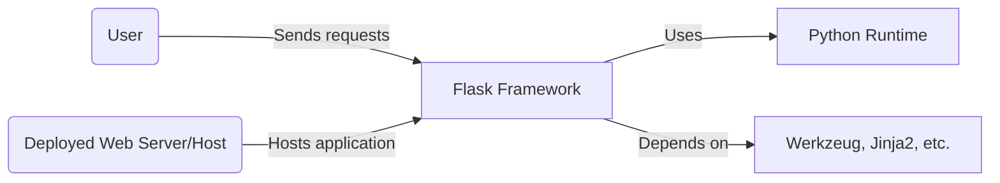
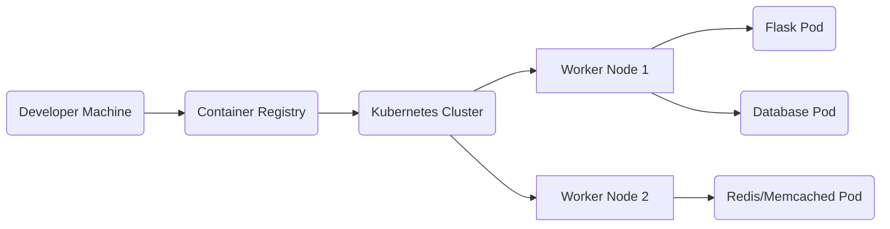
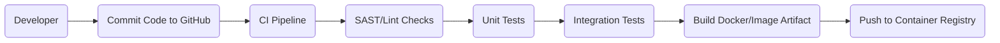

# BUSINESS POSTURE

Flask is a lightweight web framework for Python, commonly used for building web applications and APIs. The primary business goal for adopting or further developing Flask is often to provide a simple yet extensible foundation for Python-based web services. Key priorities and goals include:

1. Providing a flexible and minimalistic framework that can be extended by a wide range of use cases.
2. Sustaining a large community ecosystem that contributes and benefits from the framework.
3. Facilitating rapid development of prototypes and production-ready services.
4. Maintaining a stable and secure codebase with backward-compatible changes to support a broad user base.

Important business risks to address based on these priorities include:

1. Losing trust due to critical security vulnerabilities that compromise user applications.
2. Alienating the community if major backward-incompatible changes are made.
3. Delays or complications in adopting modern security, deployment, and development practices, which may reduce Flask’s appeal for enterprise use.
4. Inadequate visibility or governance leading to forks, fragmentation, or reduced community support.

# SECURITY POSTURE

Flask maintains an active open-source community with continuous patches and improvements to address code quality and security. Security controls and accepted risks for the project are as follows:

security control: Code reviews and pull request (PR) validations in GitHub.
security control: Automated tests covering core functionality and common security edge cases.
security control: Regular updates to dependencies such as Jinja2 and Werkzeug, enabling prompt patching of security issues.
accepted risk: Being a community-driven project, some security issues might not be resolved immediately if maintainers or contributors lack bandwidth.
accepted risk: User responsibility for deployment hardening and secure configuration of Flask-based applications.

Recommended additional security controls (high priority) that are not explicitly mentioned in the input:

security control: Automated static application security testing (SAST) for each pull request to detect vulnerabilities in Python code.
security control: Documentation and guides for setting up a secure environment (like secure HTTP headers, best practices for session management, etc.).
security control: Periodic dependency scanning to ensure no compromised third-party libraries are used.
security control: Automated threat analysis or code scanning integrated into continuous integration pipeline.

Security requirements for Flask (important for the idea or project in question):

1. Authentication
   - Flexible hooks to integrate with external authentication providers.
   - Mechanisms to prevent session hijacking and replay attacks.
2. Authorization
   - Fine-grained control over resource access, with support for role-based or policy-based access.
3. Input Validation
   - Built-in or recommended libraries/methods to validate and sanitize data from HTTP requests.
4. Cryptography
   - Proper configuration for TLS/SSL on deployment.
   - Secure session token creation that ensures confidentiality and integrity.

Existing security controls (where implemented or described):
- GitHub Pull Request Reviews: Described in the repository’s contributor guidelines.
- Test Coverage and Linting: Implemented in the repository’s continuous integration workflows for code quality checks (if present).
- Werkzeug Integration: Provides foundational WSGI functionality and security enhancements, described in Flask’s documentation and codebase.

# DESIGN

## C4 CONTEXT



### Context Diagram Table

| Name              | Type         | Description                                                                                  | Responsibilities                                                              | Security controls                                                                                         |
|-------------------|-------------|----------------------------------------------------------------------------------------------|-------------------------------------------------------------------------------|----------------------------------------------------------------------------------------------------------------|
| user              | External     | End user interacting with a Flask-based web application through HTTP requests               | Initiates requests, expects responses                                        | Not applicable (this is an external actor)                                                                    |
| flaskProject      | System       | The Flask framework forming the core of the web application                                 | Receives HTTP requests, routes them, handles logic with blueprint or extensions | security control: Code review, tests; recommended security control: SAST scans, secure coding practices       |
| pythonRuntime     | External     | Host environment for running Flask code in Python                                           | Executes code, manages packages, runs the application                        | security control: Proper environment configuration, OS-level hardening                                        |
| externalLibraries | External     | Libraries and dependencies such as Werkzeug, Jinja2, etc.                                   | Provide lower-level functionality (WSGI layers, templating, etc.)            | security control: Regular dependency scanning and updates                                                     |
| externalSystems   | External     | The host environment or container orchestrator (e.g., Docker, cloud hosting)                | Deploys and runs Flask-based applications                                    | security control: Proper host-level security (firewalls, patching, container scanning)                        |

## C4 CONTAINER

In a simple scenario, the Flask framework constitutes a single container running in a Python environment. If integrated into a larger system, multiple containers (e.g., backend services, database, cache) may be involved. Here is a high-level container diagram:

```mermaid
flowchart LR
    cFlask[Flask Container] --> cDatabase[Database]
    cFlask --> cCache[Cache (Optional)]
    cFlask --> cAuthService[External Authentication Provider (Optional)]
    user(User) --> cFlask
```

### Container Diagram Table

| Name                    | Type       | Description                                                              | Responsibilities                                                      | Security controls                                                                           |
|-------------------------|-----------|--------------------------------------------------------------------------|------------------------------------------------------------------------|----------------------------------------------------------------------------------------------|
| cFlask (Flask)          | Container | Flask application container (Python-based)                               | Handles incoming requests, processes business logic, sends responses  | security control: Use recommended best practices for Flask, input validation, updated deps   |
| cDatabase (Database)    | Container | Database system (e.g., PostgreSQL, MySQL, SQLite)                        | Stores and retrieves persistent data                                   | security control: Encryption at rest, secure credentials management                          |
| cCache (Optional Cache) | Container | Caching layer (e.g., Redis, Memcached)                                   | Improves performance by caching data and responses                     | security control: Access control, minimal open ports, secure configuration                   |
| cAuthService (External Authentication) | External System | External authentication provider (OAuth, SSO, etc.)                      | Provides user identity and authentication services                     | security control: Encrypted connections, token-based or credential-based authentication      |
| user                    | External   | End user interacting with the Flask application via a web interface      | Initiates requests, consumes responses                                 | Not applicable (external actor)                                                              |

## DEPLOYMENT

Flask can be deployed in multiple ways:
- Single server deployment with Gunicorn or uWSGI behind Nginx.
- Docker containers orchestrated by Kubernetes or Docker Compose.
- Platform as a Service (e.g., Heroku, AWS Elastic Beanstalk).

Below is an example deployment diagram using Docker containers orchestrated by a container platform:



### Deployment Diagram Table

| Name                     | Type               | Description                                                        | Responsibilities                                                    | Security controls                                                                      |
|--------------------------|--------------------|--------------------------------------------------------------------|----------------------------------------------------------------------|-----------------------------------------------------------------------------------------|
| devMachine               | Workstation        | Developer machine used to build, test, and push images             | Source editing, building, pushing images to registry                | security control: Local environment security, developer authentication                 |
| containerRegistry        | Registry Service   | Stores Docker images for deployment                                | Maintains versioned application images                              | security control: Access control, vulnerability scanning of container images           |
| k8sCluster (Kubernetes)  | Orchestration      | Orchestrates container deployment across multiple worker nodes     | Deploys, scales, and manages containers                             | security control: Role-based access control (RBAC), network policies, TLS communication |
| node1 (Worker Node)      | Compute Resource   | Hosts Flask and database containers                                | Executes containerized workloads                                    | security control: OS patching, container isolation, secrets management                 |
| node2 (Worker Node)      | Compute Resource   | Hosts cache service                                                | Executes containerized workloads                                    | security control: OS patching, container isolation, secrets management                 |
| flaskPod (Flask Pod)     | Container Instance | Runs the Flask framework code                                      | Processes web traffic                                               | security control: Proper container runtime security, validated environment variables    |
| dbPod (Database Pod)     | Container Instance | Hosts the database engine                                          | Stores persistent data                                              | security control: Protect credentials, encrypt data at rest                             |
| cachePod (Cache Pod)     | Container Instance | Hosts cache service (e.g. Redis)                                   | Caches frequently accessed data to enhance performance              | security control: Network isolation, restricted access                                  |

## BUILD

Below is an example of an automated build process using GitHub Actions (or similar Continuous Integration systems):



1. Developer writes code and commits changes to the repository.
2. A continuous integration pipeline triggers automatically.
3. The pipeline runs static analysis (SAST) and lint checks for vulnerabilities and code quality issues.
4. If checks pass, unit tests and integration tests run.
5. The build process creates an artifact (a Docker image or a distribution package).
6. The artifact is pushed to a registry or storage for deployment.

Security controls in the build process:
- Code scanning for known vulnerabilities (SAST).
- Automated linting and style checks to enforce secure coding practices.
- Signed releases or images to ensure integrity.
- Restricted and authenticated access to the container registry.

# RISK ASSESSMENT

What are critical business processes we are trying to protect?
- The ability to develop and maintain Flask securely without introducing vulnerabilities into dependent applications.
- Support for stable, continual operation of applications built on Flask, ensuring minimal downtime or security breaches.

What data are we trying to protect and what is their sensitivity?
- At the framework level, Flask itself does not store production data, but it processes user inputs and interactions. This can include user credentials, personal information, or any sensitive data that an application layer might handle. While Flask does not manage this data, it is a conduit for it, so integrity and confidentiality of data in transit are critical.

# QUESTIONS & ASSUMPTIONS

1. Questions regarding BUSINESS POSTURE
   - What is the projected scale and market focus for projects using Flask?
   - How much investment is available for ongoing security maintenance and controls?
   - Is there a dedicated security or governance team overseeing the roadmap?

2. Questions regarding SECURITY POSTURE
   - Are there established policies for handling reported vulnerabilities in Flask’s codebase?
   - Will there be a periodic or on-demand security review or penetration testing?
   - How are community contributions vetted to ensure malicious code is not introduced?

3. Questions regarding DESIGN
   - Which external systems and services do we expect to integrate with?
   - What are the performance targets in terms of throughput and latency?
   - Are there any multi-tenancy concerns that require isolation within the same infrastructure?

Default assumptions:
- Flask is used in diverse deployment models, from simple single-server setups to container orchestration frameworks (Kubernetes).
- The open-source community will continue to provide improvements and reviews for the project.
- The project will maintain backward-compatible interfaces to avoid major disruptions for existing applications.
