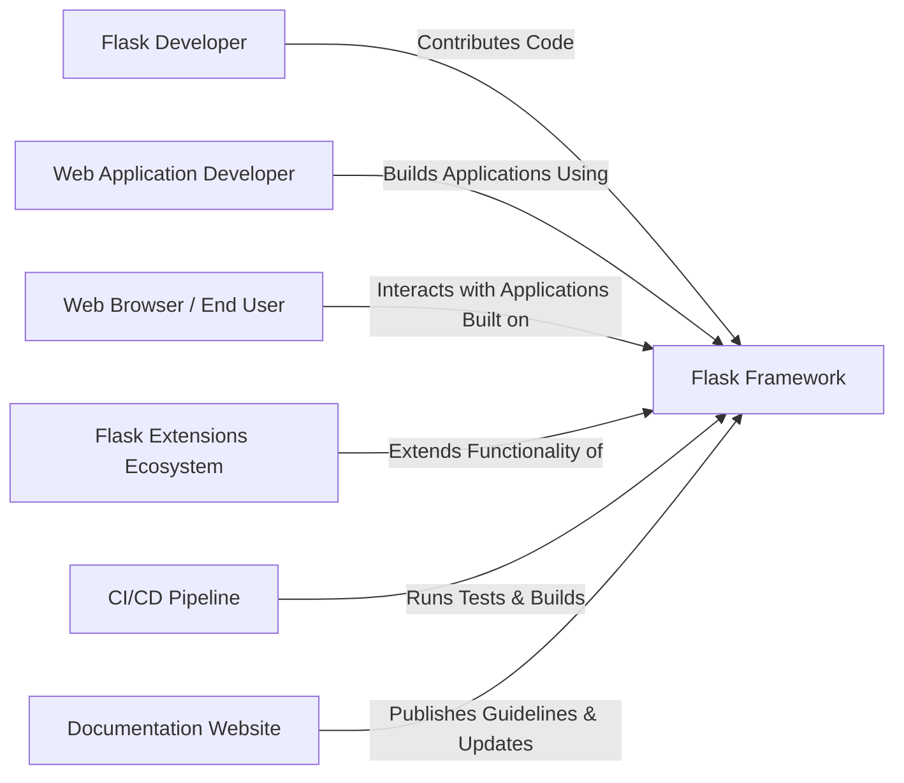
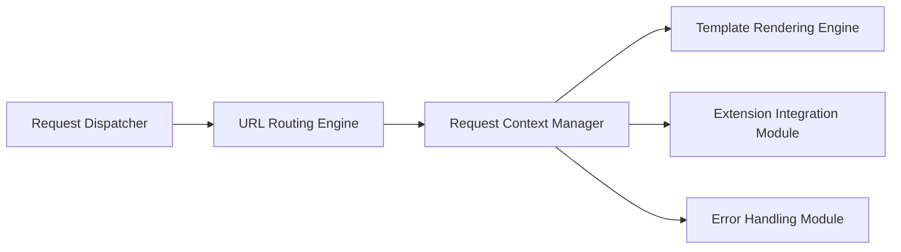
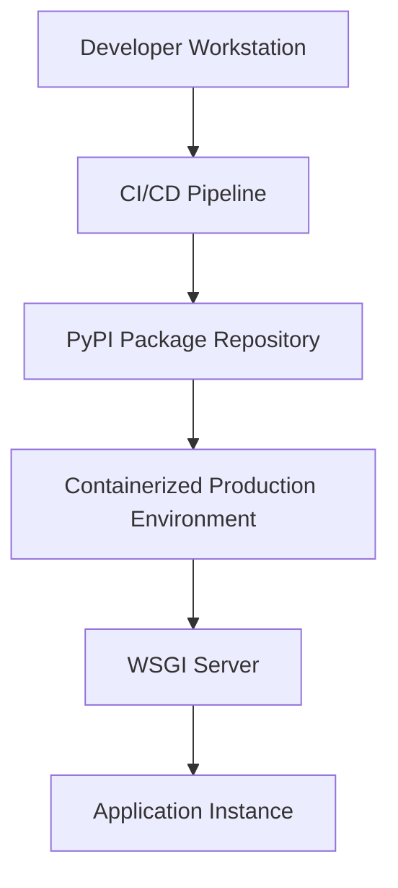
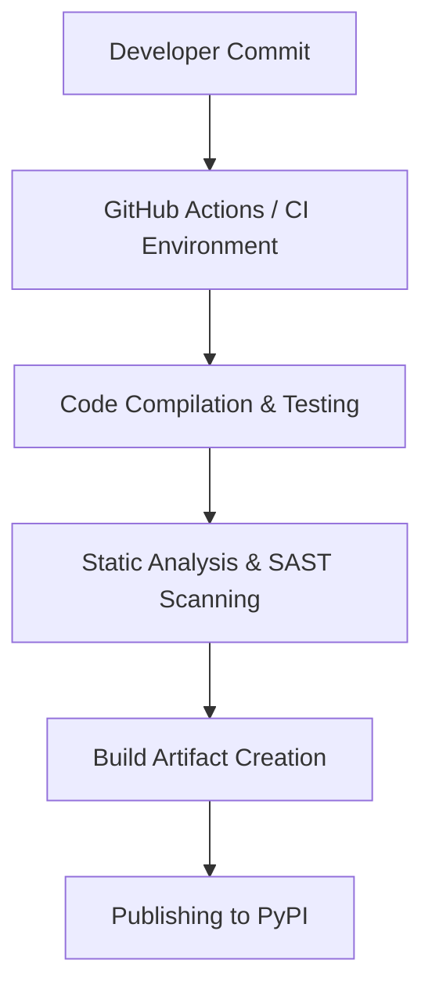

# BUSINESS POSTURE

The Flask project is an open source micro web framework aimed at providing simplicity and flexibility for web application development. Its business priorities include sustaining community trust, ease-of-use, rapid development, and high performance while serving as the foundation for countless web applications. The project supports a vast ecosystem of extensions and integrations that rely on its stability and security.

Business Goals:
• Provide a robust and lightweight framework for building web applications.
• Enable a flexible, extensible architecture that supports community-driven enhancements.
• Maintain high quality standards to ensure performance and security.
• Foster active collaboration among contributors while preserving code integrity.

Business Risks:
• Potential vulnerabilities in the core framework could propagate security issues to dependent applications.
• Supply chain risks through third-party extensions and dependencies.
• Inconsistent contributions leading to varying code quality and potential security gaps.
• Inadequate documentation or outdated security practices may lead to misconfigurations in user applications.

# SECURITY POSTURE

Existing Security Controls:
• security control: Code reviews and community vetting are implemented through GitHub pull requests and issues.
• security control: Continuous integration (CI) pipelines (as defined in repository configurations) run tests and checks covering functionality and some static analysis.
• accepted risk: The core framework does not enforce strict authentication or input validation as these are delegated to the application built on top of Flask.

Recommended Security Controls:
• security control: Implement automated static application security testing (SAST) as part of the CI pipeline.
• security control: Introduce dependency scanning to monitor for vulnerabilities in third-party libraries.
• security control: Establish a formal vulnerability disclosure program and response process.
• security control: Enforce artifact signing for distributed packages on PyPI.

Security Requirements:
• Authentication: Ensure that any integrations or administrative interfaces (e.g., documentation portals) leverage robust authentication mechanisms.
• Authorization: Document and recommend best practices for granular authorization in student applications using Flask.
• Input Validation: Provide clear guidelines and helper utilities for input sanitization and validation within user applications.
• Cryptography: Encourage the use of secure cryptographic practices and provide examples for secure session and cookie management.

Implementations:
• Code reviews occur on GitHub via pull request processes.
• CI workflows (for testing and basic static analysis) are described in repository configurations.
• Documentation outlines best practices, though detailed authentication and authorization schemes are delegated to applications built using the framework.

# DESIGN

The design of the Flask project focuses on providing a modular, extensible micro framework. The core is designed to route HTTP requests, manage context, and support extension integration while exposing a simple API to developers.

## C4 CONTEXT

Below is the context diagram showing Flask at the center along with its interacting elements.

Table: Elements of the Context Diagram

| Name                        | Type                | Description                                                                      | Responsibilities                                                                       | Security Controls                                           |
|-----------------------------|---------------------|----------------------------------------------------------------------------------|----------------------------------------------------------------------------------------|-------------------------------------------------------------|
| Flask Framework             | Core System         | The micro web framework providing routing, request handling, and extension hooks | Serve as the foundation for web application development; manage HTTP interactions      | Input validation helpers, recommended secure coding practices |
| Flask Developer             | Contributor         | Developer contributing to the framework                                        | Code development, review, and maintenance                                               | Adherence to secure development guidelines                  |
| Web Application Developer   | User/Integrator     | Developer using Flask to build web applications                                  | Build and deploy applications leveraging Flask’s API                                    | Follow security recommendations in integration              |
| Web Browser / End User      | External Consumer   | End user interacting with applications built on Flask                           | Consume web services provided by applications                                            | Rely on application-level security measures                   |
| Flask Extensions Ecosystem  | External Module     | Third-party extensions enhancing Flask functionality                             | Provide extended functionality (e.g., authentication, database integration)              | Extensions to implement their own security controls           |
| CI/CD Pipeline              | Automation Service  | Automated build, test, and deployment system                                     | Run tests, static analysis, and build artifacts                                            | Automated code scanning, SAST, and dependency checks          |
| Documentation Website       | Informational Portal | Website publishing guides, release notes, and API documentation                  | Communicate project guidelines and updates                                                 | HTTPS, secure content management                              |

## C4 CONTAINER

The container diagram outlines the high-level architecture of Flask. Although Flask is delivered as a single package, its architecture comprises several components that interact to provide core functionality.

Table: Elements of the Container Diagram

| Name                        | Type             | Description                                                                    | Responsibilities                                                            | Security Controls                                            |
|-----------------------------|------------------|--------------------------------------------------------------------------------|-----------------------------------------------------------------------------|--------------------------------------------------------------|
| Request Dispatcher          | Application Layer| Entry point for incoming HTTP requests                                         | Direct HTTP requests to routing and context management                      | Input sanitization at request entry point                     |
| URL Routing Engine          | Core Component   | Maps URLs to view functions and endpoints                                      | Parse and match request paths; manage route definitions                     | Validate route parameters to avoid injection attacks            |
| Request Context Manager     | Core Component   | Maintains request and session context during a request cycle                   | Manage global context for requests; isolate data per request                | Context isolation, session data integrity checks              |
| Template Rendering Engine   | Presentation     | Renders dynamic content using templates                                        | Process templates and generate dynamic HTML content                         | Encourage secure template practices and output escaping         |
| Extension Integration Module| Plugin Interface | Provides hooks for third-party extensions                                      | Allow seamless integration of external modules; manage extension lifecycles   | Recommend security review for extensions; sandboxing guidelines  |
| Error Handling Module       | Utility          | Manages exceptions and errors, providing graceful error responses              | Capture, log, and manage errors; present safe error messages                  | Secure logging practices; avoid information leakage             |

## DEPLOYMENT

Flask is primarily deployed as a Python package published on PyPI. Users integrate Flask into their web application deployments. Deployment options include package distribution via PyPI and integration into containerized environments for production use. The following focuses on deployment via the PyPI distribution channel and containerized production environments.

Table: Elements of the Deployment Diagram

| Name                        | Type                 | Description                                                                      | Responsibilities                                                               | Security Controls                                                      |
|-----------------------------|----------------------|----------------------------------------------------------------------------------|--------------------------------------------------------------------------------|------------------------------------------------------------------------|
| Developer Workstation       | Development System   | Environment where contributions are authored                                     | Code development and initial testing                                          | Local static analysis; secure IDE practices                             |
| CI/CD Pipeline              | Automation Platform  | System that builds, tests, and publishes the package                              | Run unit tests, perform SAST scans, create build artifacts                      | Automated SAST, dependency scanning, artifact integrity checks           |
| PyPI Package Repository     | Package Distribution | Repository where the Flask package is published and distributed                   | Host and distribute verified build artifacts                                  | Package signing; TLS encryption                                           |
| Containerized Production Environment | Deployment Environment | Environment where production applications are containerized using Flask           | Run and manage container instances hosting Flask-based applications            | Secure container orchestration (e.g., Kubernetes security controls)        |
| WSGI Server                | Web Server           | Interface layer that connects the Flask application to the web server             | Handle HTTP requests and facilitate communication with Flask app              | Input validation; secure network configuration                             |
| Application Instance       | Runtime Instance     | Running instance of a web application built on Flask                              | Serve live application traffic                                                | Runtime monitoring; logging; secure configuration management                |

## BUILD

The build process for Flask is automated via CI/CD pipelines, typically using GitHub Workflows along with tools like tox, pytest, and linters. Steps include code commit, automated testing, static analysis, packaging, and publishing to PyPI.

Security Controls in Build Process:
• security control: SAST scanning integrated into the CI pipeline to detect vulnerabilities early.
• security control: Dependency scanning during build to identify insecure packages.
• security control: Automated testing (unit, integration) to validate functionality and prevent regressions.
• security control: Build artifact signing to ensure distribution integrity.
• security control: Linters and coding standard enforcement to maintain code quality.

# RISK ASSESSMENT

Critical Business Processes:
• The continuous delivery of a secure, reliable framework that underpins thousands of web applications.
• The open source collaboration and contribution process that ensures ongoing improvements and bug fixes.
• The release and distribution process which, if compromised, can affect the entire Flask ecosystem.

Data Protection and Sensitivity:
• Source Code: Highly sensitive as it forms the foundation of the framework and must remain uncompromised.
• Build Artifacts and Package Distribution: Integrity is critical to prevent supply chain attacks.
• Contributor and Issue Data: Moderately sensitive; includes information that helps in vulnerability response and community management.
• Documentation and Guidelines: Important for proper secure usage but not highly sensitive.

# QUESTIONS & ASSUMPTIONS

Questions:
• What is the formal process for vulnerability disclosure and timely remediation in the Flask project?
• Are there any existing metrics or reports from static analysis tools that can be reviewed to assess current security posture?
• How is dependency management handled, and is there a process to regularly update and audit third-party libraries?
• What additional security validations are recommended for the extensions ecosystem, and how are these monitored?

Assumptions:
• The repository follows standard open source practices with community-based code reviews and contributions.
• CI/CD pipelines are in place and are actively utilized for testing and basic static analysis.
• The deployment of Flask via PyPI is secured with current best practices such as package signing and TLS.
• Security controls in the framework are advisory, given that specific application-level security is delegated to the end user.
• The project is maintained with a higher tolerance for transparency and community involvement, with risks addressed through public patches and updates.
