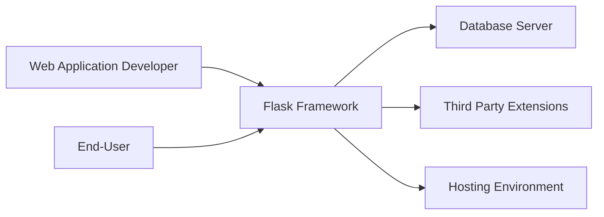
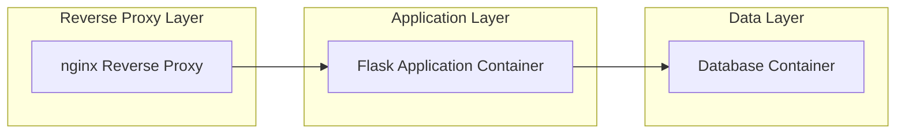
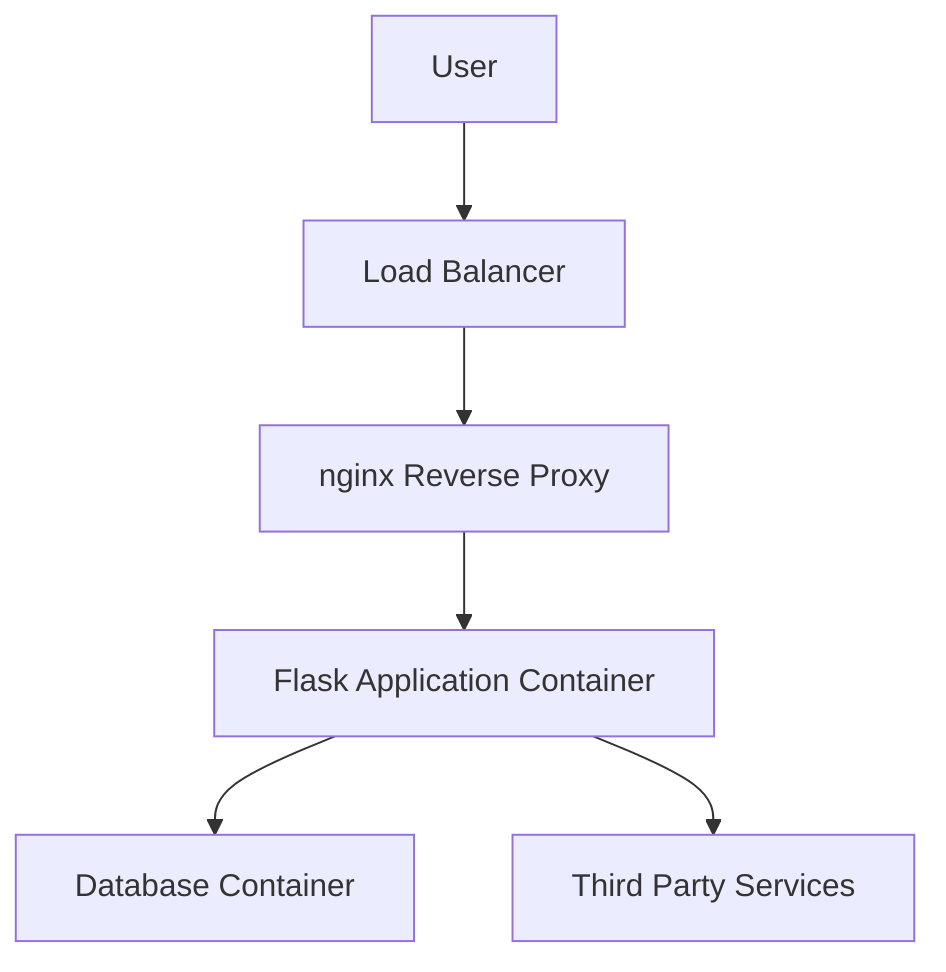
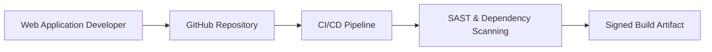

# BUSINESS POSTURE

Flask is a lightweight, extensible web framework for Python designed to simplify web application development. The project’s primary business goals are to provide a developer-friendly, flexible platform that accelerates application development while remaining robust enough for production deployments. Key business priorities and goals include rapid development cycles, ease of integration with third-party tools, and a strong community that ensures continuous improvement. Given its widespread use in diverse industries—from small startups to large enterprises—the project must address risks related to supply chain vulnerabilities, improper usage of extensions, and misconfigurations that can compromise production applications. Critical business risks to be managed include potential vulnerabilities in dependency libraries, insecure configurations in production deployments, and insufficient security controls in applications built using Flask.

# SECURITY POSTURE

Existing security controls and accepted risks:
- security control: The framework provides secure session management and configurable cookie handling as documented in the Flask security guidelines.
- security control: Input processing and routing mechanisms built on Werkzeug include defensive programming practices.
- accepted risk: Flask does not enforce comprehensive authentication or authorization; these aspects are delegated to the application developer.
- accepted risk: Security of third-party extensions and integrations relies on external vetting and proper configuration by the developer.

Recommended high-priority security controls:
- security control: Integrate CSRF protection and robust XSS prevention measures via well-maintained extensions.
- security control: Enforce role-based access control frameworks (e.g., Flask-Login, Flask-Security) for managing user authentication and authorization.
- security control: Implement comprehensive input validation and sanitization at both front-end and back-end layers.
- security control: Adopt a secure dependency management process with regular vulnerability scanning (e.g., using SAST tools) and automated patching.
- security control: Ensure deployment runs behind a TLS-terminating reverse proxy with strict network access controls.
- security control: Utilize artifact signing and metadata provenance to secure the build and deployment pipeline.

Security requirements:
- Authentication: Support integration with modern identity providers (OAuth, OpenID Connect) and enforce strong credential policies.
- Authorization: Implement role-based and attribute-based access controls to safeguard sensitive endpoints.
- Input Validation: Rigorously validate and sanitize all user input to protect against injection, XSS, and other injection-based attacks.
- Cryptography: Use well-vetted cryptographic libraries for data encryption in transit and at rest, ensuring compliance with current best practices.

# DESIGN

This design document details the architecture, deployment, and build processes for applications built using Flask, along with relevant security controls integrated at each stage.

## C4 CONTEXT

The following context diagram illustrates how Flask sits at the center of a web application ecosystem, interfacing with developers, end-users, third-party extensions, and the hosting environment.

### Context Diagram Elements

| Name                     | Type                | Description                                                        | Responsibilities                                                              | Security Controls                                                                                                       |
|--------------------------|---------------------|--------------------------------------------------------------------|-------------------------------------------------------------------------------|-------------------------------------------------------------------------------------------------------------------------|
| Flask Framework          | Software Component  | Core web framework handling routing, sessions, and extension hooks | Process HTTP requests, manage sessions, allow extensibility                   | security control: Built-in session management and secure cookie handling                                               |
| Web Application Developer| Actor               | Developer using Flask to build applications                        | Write secure application and integrate necessary extensions                   | security control: Adherence to secure coding practices and proper use of provided security guidelines                   |
| End-User                 | Actor               | Individuals accessing applications built on Flask                  | Consume application services ensuring secure interactions                     | security control: Use of secure authentication mechanisms provided by the application                                   |
| Third Party Extensions   | Software Component  | Plugins and middleware extending Flask functionality                 | Provide add-on features like authentication, ORM integration, etc.              | security control: Must follow security guidelines; recommended to perform independent security assessments                |
| Hosting Environment      | Infrastructure      | Server or cloud platform where the application is deployed           | Provide reliable runtime environment and network security                     | security control: Firewall, intrusion detection systems, TLS termination, and access control measures                     |
| Database Server          | Infrastructure      | Persistent storage for application data                              | Secure data storage and retrieval                                             | security control: Encryption at rest, secure access controls, and periodic vulnerability scanning                         |

## C4 CONTAINER

This container diagram shows the high-level architecture for a typical Flask-based application deployed in a production environment. The design leverages container-based deployment with a reverse proxy, application container, and a dedicated database container.

### Container Diagram Elements

| Name                   | Type                | Description                                                    | Responsibilities                                                                   | Security Controls                                                                                                   |
|------------------------|---------------------|----------------------------------------------------------------|------------------------------------------------------------------------------------|---------------------------------------------------------------------------------------------------------------------|
| Reverse Proxy (nginx)  | Container           | Handles request routing and TLS termination                    | Accepts incoming traffic, terminates TLS, and forwards requests to the application | security control: TLS termination, rate limiting, and enforcement of security headers                                |
| Flask Application      | Container           | The core application running the Flask framework                 | Implements business logic, processes HTTP requests, and manages sessions            | security control: Secure session management, input validation, and integration with authentication/authorization modules |
| Database               | Container           | Persists application data                                        | Stores and retrieves data                                                         | security control: Encryption at rest, database access control, and secure connectivity (TLS/SSL)                       |

## DEPLOYMENT

Flask applications can be deployed in multiple ways. One common approach is a containerized deployment in a cloud environment orchestrated by systems such as Kubernetes. This approach includes a load balancer, TLS-terminating reverse proxy, the Flask application container, and a separate database container.

### Deployment Diagram Elements

| Name                   | Type                | Description                                                    | Responsibilities                                                               | Security Controls                                                                                         |
|------------------------|---------------------|----------------------------------------------------------------|--------------------------------------------------------------------------------|-----------------------------------------------------------------------------------------------------------|
| Load Balancer          | Network Component   | Distributes incoming traffic across available servers          | Traffic distribution, DDoS mitigation                                          | security control: Firewall rules, anti-DDoS, and rate limiting controls                                    |
| Reverse Proxy (nginx)  | Container           | Terminates TLS and routes requests                             | Handles SSL/TLS termination, injects security headers                          | security control: TLS termination, HTTP header security policies                                           |
| Flask Application      | Container           | Application instance of Flask running business logic             | Processes client requests, performs business logic                             | security control: Secure coding practices, session control, input validation, and authentication measures    |
| Database Container     | Container/Service   | Backend data store for the application                         | Data storage and transaction management                                       | security control: Encryption at rest, access control, and regular vulnerability patching                    |
| Third Party Services   | External System     | External API services or identity providers                      | Provide add-on services such as external authentication or payment processing   | security control: Secure API key management, mutual TLS (where applicable), and periodic security reviews     |

## BUILD

The build process is critical to ensure that only validated, secure artifacts are deployed. The process starts from a developer's commit to the GitHub repository, proceeds through a CI/CD pipeline where automated tests, SAST scans, and dependency checks are performed, and ends with the generation of signed, provenance-attested build artifacts.

### Build Process Elements

| Name                  | Type                  | Description                                                    | Responsibilities                                                             | Security Controls                                                                                              |
|-----------------------|-----------------------|----------------------------------------------------------------|------------------------------------------------------------------------------|----------------------------------------------------------------------------------------------------------------|
| Developer Workstation | Development Environment | Environment where code is written and locally tested             | Write code, run local tests                                                  | security control: Local antivirus, secure IDE practices, and adherence to secure coding guidelines               |
| GitHub Repository     | Source Code Management | Central source code repository                                  | Version control and code storage                                             | security control: Branch protection rules, two-factor authentication, and regular security audits               |
| CI/CD Pipeline        | Automation System      | Automated build, test, and deployment orchestration              | Execute automated testing, SAST scanning, and build packaging                | security control: Automated SAST, dependency scanning, and supply chain integrity checks                        |
| Signed Build Artifact | Output Artifact       | The final packaged and signed output ready for deployment         | Represents the deployable unit of the application                            | security control: Artifact signing, provenance metadata, and secure storage mechanisms for build artifacts      |

# RISK ASSESSMENT

Critical business processes to protect include the user authentication flow, session management, and data processing operations that deliver business functionality. The application data to be protected includes personal identifiable information (PII), authentication credentials, session tokens, and any sensitive business data stored in connected databases. The sensitivity of this data is high, and its compromise could lead to significant financial, reputational, and compliance-related damages. Therefore, ensuring confidentiality, integrity, and availability through robust security controls across the development, deployment, and operational phases is imperative.

# QUESTIONS & ASSUMPTIONS

Questions:
- How is the Flask deployment configured for production (e.g., development mode vs. production mode settings)?
- What specific third-party extensions are commonly used, and have they undergone security assessments?
- How is vulnerability management handled for both Flask and its dependencies?
- What is the process for patching identified vulnerabilities in the production environment?
- How is authentication and authorization managed in deployments using Flask—are there recommended or mandated extensions?

Assumptions:
- The development team adheres to secure coding practices and follows Flask’s security guidelines.
- Deployment is containerized in a production-grade environment with additional network and infrastructure security measures (such as TLS termination, load balancing, and firewall protections).
- The open-source project is actively maintained by a community that monitors for vulnerabilities and releases timely patches.
- Automated security scanning (SAST, dependency checks) is integrated into the CI/CD pipeline.
- Developers and operators assume responsibility for proper configuration of third-party extensions and ensuring that their security posture aligns with the overall system design.
