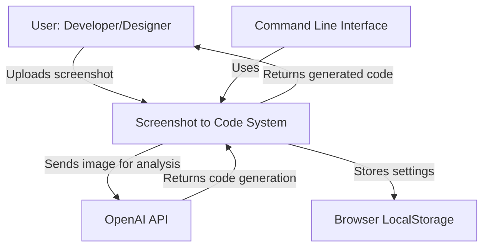
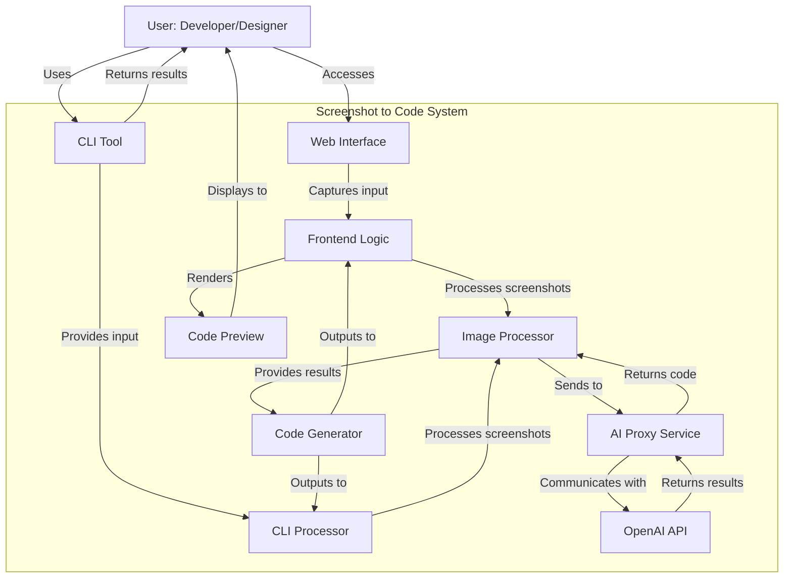
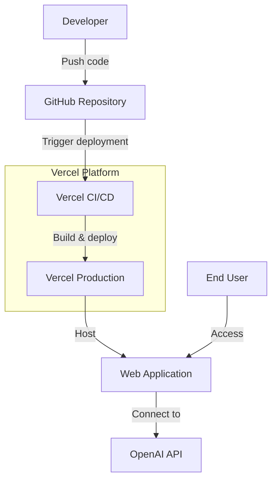
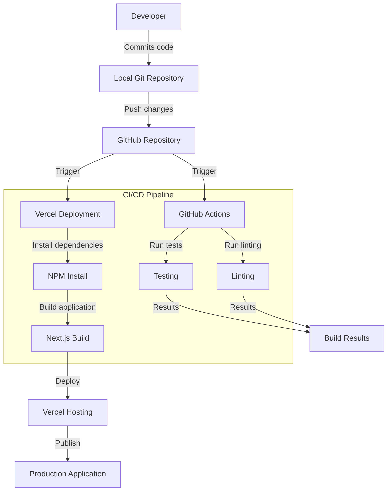

# Project Design Document: Screenshot-to-Code

## BUSINESS POSTURE

Screenshot-to-Code is an innovative tool designed to convert design screenshots into functional code. The project aims to accelerate the development process for frontend engineers and designers by using AI to translate visual designs into implementation-ready code.

### Business Priorities and Goals:
1. Simplify and accelerate the UI development process
2. Bridge the gap between design and implementation
3. Provide a zero-installation web tool accessible to anyone
4. Support multiple frontend frameworks (HTML/CSS, Tailwind, React, Vue)
5. Build an open-source community around AI-powered development tools

### Business Risks:
1. Dependency on third-party AI services (particularly OpenAI), creating potential availability and cost concerns
2. Accuracy limitations in code generation may affect user satisfaction and adoption
3. Scaling challenges as the service grows in popularity
4. Competition from similar tools or integrated features in design platforms
5. Managing the cost of AI API usage while maintaining the service's accessibility

## SECURITY POSTURE

### Existing Security Controls and Accepted Risks:

- Security control: Environment variable management for sensitive API keys, implemented through Next.js environment configuration
- Security control: Client-side processing of screenshots reducing data transfer risk, implemented in the frontend code
- Security control: Third-party authentication for the hosted version, implemented through Vercel deployment
- Security control: Input validation for image uploads, implemented in the frontend code
- Security control: Rate limiting through OpenAI API proxy, implemented in the backend code

- Accepted risk: Reliance on third-party AI providers (OpenAI) for critical functionality
- Accepted risk: Potential exposure of user designs through screenshot uploads
- Accepted risk: Limited logging and audit capabilities in the current implementation
- Accepted risk: No encryption for screenshots during local processing
- Accepted risk: Limited protection against prompt injection attacks

### Recommended Security Controls:

1. Implementation of Content Security Policy (CSP) to mitigate XSS risks
2. Comprehensive input validation for screenshots to prevent malicious uploads
3. Secure storage and rotation of API keys
4. Enhanced rate limiting and abuse prevention mechanisms
5. Implementation of audit logging for operations
6. Regular dependency scanning and updates
7. Sandboxed execution of generated code preview

### Security Requirements:

#### Authentication
- Implement strong authentication for API access
- Consider optional user accounts for the web interface with secure credential management
- Employ secure token handling for session management

#### Authorization
- Restrict access to API endpoints based on user roles/permissions
- Implement resource-based access controls for saved projects
- Enforce usage limits based on user tiers

#### Input Validation
- Validate all screenshot uploads for size, format, and content
- Sanitize all user inputs to prevent injection attacks
- Implement secure file handling practices

#### Cryptography
- Encrypt API keys at rest and in transit
- Consider encrypting saved screenshots if implementing persistence
- Use secure, modern TLS configurations for all communications

## DESIGN

### C4 CONTEXT

#### Context Diagram Elements

| Name | Type | Description | Responsibilities | Security Controls |
|------|------|-------------|------------------|-------------------|
| User | Person | Developer or designer using the system | Provides screenshots, configures outputs, uses generated code | N/A |
| Screenshot to Code System | Software System | Core system that converts screenshots to code | Process screenshots, generate code, render preview | Input validation, secure API key handling, client-side processing |
| OpenAI API | External System | AI service for image analysis and code generation | Analyze images, generate code based on prompts | Rate limiting, authentication via API keys |
| Browser LocalStorage | External System | Client-side storage | Store user preferences and settings | Client-side data isolation |
| Command Line Interface | Software System | Alternative interface for the tool | Provide command-line access to core functionality | Local execution security |

### C4 CONTAINER

#### Container Diagram Elements

| Name | Type | Description | Responsibilities | Security Controls |
|------|------|-------------|------------------|-------------------|
| Web Interface | Container | Browser-based UI | Provide user interface, capture screenshots, display results | Input validation, CSP implementation |
| CLI Tool | Container | Command-line interface | Process command-line arguments, capture local screenshots | Local file system validation |
| Frontend Logic | Component | Core web application logic | Handle user interactions, manage application state | State validation, input sanitization |
| CLI Processor | Component | Core CLI application logic | Process CLI commands, manage execution flow | Input validation, error handling |
| Image Processor | Component | Processes screenshots | Prepare images for AI processing | Image validation, content verification |
| AI Proxy Service | Component | Interface to AI services | Manage API communication, format prompts | API key protection, rate limiting |
| Code Generator | Component | Creates code from AI responses | Transform AI output to usable code | Output sanitization |
| Code Preview | Component | Renders generated code | Show live preview of generated code | Sandbox execution, CSP controls |

### DEPLOYMENT

The Screenshot-to-Code project can be deployed in several ways:

1. Self-hosted web application
2. Locally installed CLI tool
3. Vercel-hosted web application (current primary deployment)

We'll focus on the Vercel-hosted deployment as this is the primary method used by the project.

#### Deployment Diagram Elements

| Name | Type | Description | Responsibilities | Security Controls |
|------|------|-------------|------------------|-------------------|
| GitHub Repository | External System | Source code repository | Store and version code | Access control, branch protection |
| Vercel CI/CD | External System | Continuous integration | Build and test application | Dependency scanning, environment isolation |
| Vercel Production | Infrastructure | Hosting environment | Run the web application | HTTPS enforcement, environment variable protection |
| Web Application | Container | Deployed application | Serve the application to users | Input validation, API security |
| OpenAI API | External System | AI service provider | Process AI requests | Authentication, rate limiting |
| End User | Person | Application user | Interact with application | N/A |

### BUILD

The Screenshot-to-Code project uses GitHub and Vercel for its build and deployment processes.

The build process for Screenshot-to-Code follows these steps:

1. Developers work locally and commit code to the GitHub repository
2. GitHub Actions runs tests and linting checks
3. Vercel's deployment process installs dependencies via NPM
4. Next.js builds the application
5. The built application is deployed to Vercel's hosting platform

Security controls in the build process include:
- Dependency integrity verification through package lock files
- Automated testing to catch issues before deployment
- Linting to enforce code quality standards
- Environment variable management for API keys and secrets
- Vercel's built-in security controls for deployment

The project could benefit from additional build-time security controls:
- SAST (Static Application Security Testing) scanning
- Secret scanning to prevent accidental credential exposure
- Dependency vulnerability scanning
- Container scanning if containerization is implemented in the future

## RISK ASSESSMENT

### Critical Business Processes to Protect:
1. Screenshot processing and code generation
2. User interaction with the web interface
3. API communication with OpenAI
4. CLI tool functionality and security
5. Deployment and release processes

### Data to Protect and Sensitivity:

| Data Type | Sensitivity | Reason |
|-----------|-------------|--------|
| User Screenshots | Medium | May contain proprietary designs or sensitive information |
| OpenAI API Keys | High | Could be used to rack up charges if exposed |
| Generated Code | Medium | Represents intellectual property of users |
| User Preferences | Low | Limited personal information, but still requires protection |
| System Configuration | Medium | Could expose system details useful for attackers |

## QUESTIONS & ASSUMPTIONS

### BUSINESS POSTURE
1. Is this tool intended for commercial use or primarily as an open-source community project?
   - Assumption: It's an open-source project with potential for commercial applications or services built on top.
2. What is the target scale for this service?
   - Assumption: Initially targeted at individual developers and small teams, with potential to scale.
3. What is the business model for sustaining API costs?
   - Assumption: Currently relies on users providing their own API keys, may evolve to a freemium model.

### SECURITY POSTURE
1. What level of data protection is required for user uploads?
   - Assumption: Standard web application security practices are sufficient, with no long-term storage of screenshots.
2. Are there compliance requirements for the project?
   - Assumption: No specific regulatory compliance requirements beyond standard security practices.
3. What is the threat model for potential attackers?
   - Assumption: Primary concerns are API key theft, prompt injection, and potential exposure of proprietary designs.

### DESIGN
1. How will the system scale as usage increases?
   - Assumption: Vercel provides auto-scaling capabilities; the bottleneck would be OpenAI API quotas.
2. Is there a plan to support user accounts and persistence?
   - Assumption: Not currently implemented but may be added in future iterations.
3. How is testing implemented for the AI components?
   - Assumption: Limited structured testing for AI outputs; relies on user feedback for quality assessment.
4. Is there a disaster recovery plan?
   - Assumption: Relies on GitHub for code recovery and Vercel for deployment recovery.
