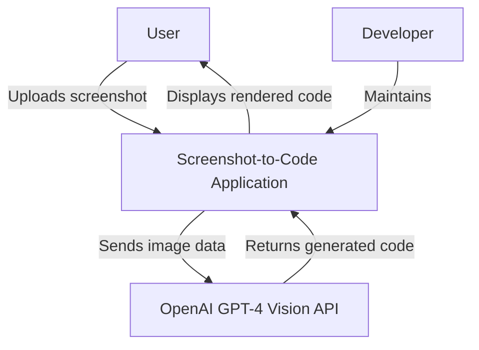
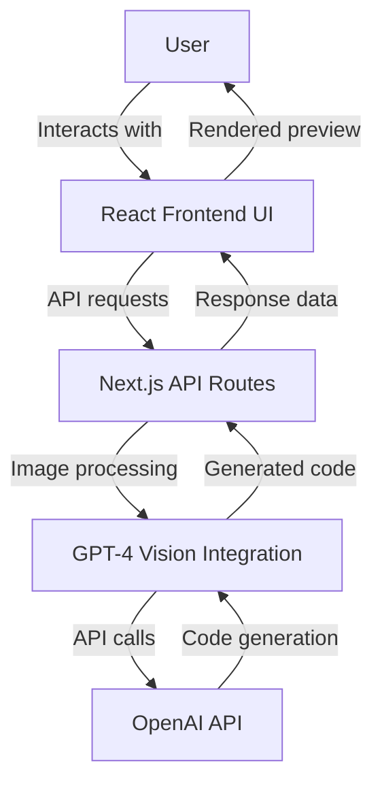
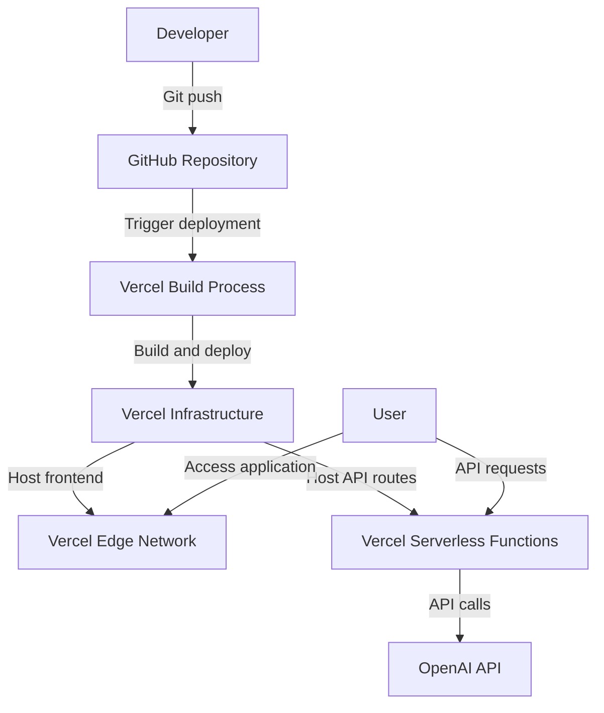
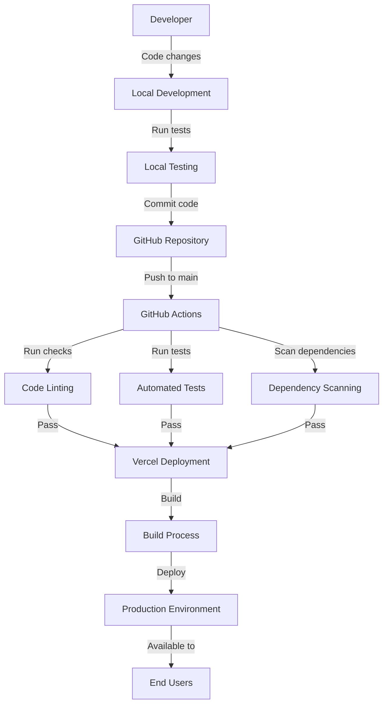

# Project Design Document: Screenshot-to-Code

## BUSINESS POSTURE

Screenshot-to-Code is a tool that takes a screenshot as input and generates corresponding HTML/CSS code, effectively reverse engineering web pages from their visual appearance. This project addresses several business priorities:

1. Accelerating UI Development: Converting design mockups to functional code quickly, reducing the time between design and implementation.
2. Design-to-Code Automation: Eliminating manual coding of visual elements, reducing human error and inconsistency.
3. Accessibility for Non-Developers: Allowing designers and product managers to generate code without deep technical expertise.
4. Educational Tool: Helping beginners learn web development by seeing how UIs translate to code.

Key business risks include:
1. Quality and Accuracy: The fidelity and performance of generated code directly impacts user trust and adoption.
2. API Dependency: Heavy reliance on OpenAI's GPT-4 Vision API creates dependency risk.
3. Cost Management: API costs could scale unexpectedly with increased usage.
4. Competitive Landscape: Similar tools may emerge, requiring continuous innovation to maintain relevance.
5. Technical Debt: Rapid development may lead to architectural decisions that limit future scale or features.

## SECURITY POSTURE

Existing security controls and accepted risks:

- Security control: API key authentication for OpenAI GPT-4 Vision API access, implemented via environment variables in the deployment platform.
- Security control: Client-side validation of image uploads to ensure proper format and prevent malicious file uploads.
- Security control: Using Next.js's built-in security features including automatic input sanitization.
- Security control: Deployment on Vercel platform providing TLS/SSL encryption for all communications.
- Accepted risk: Generated code quality and security are dependent on GPT-4 Vision's capabilities.
- Accepted risk: No user authentication system, making it difficult to implement personalized rate limiting or tracking.
- Accepted risk: Limited server-side validation for inputs.

Recommended high-priority security controls:

1. Implement comprehensive server-side validation for all user inputs.
2. Add Content Security Policy headers to prevent XSS attacks.
3. Implement rate limiting to prevent API abuse and manage costs.
4. Establish a vulnerability management process for dependencies.
5. Add telemetry and logging for security-relevant events.
6. Implement user authentication for personalized experiences and better security controls.

Security requirements:

Authentication:
- Consider implementing user authentication to associate generated content with specific users.
- If implementing authentication, use industry standard protocols like OAuth 2.0 or OIDC.
- Store authentication tokens securely with proper expiration policies.

Authorization:
- Implement role-based access control if adding multi-user capabilities.
- Ensure users can only access their own generated code and uploaded screenshots.
- Apply rate limiting per user or IP address to prevent abuse.

Input Validation:
- Validate all user inputs both client-side and server-side.
- Implement strict file validation for uploaded screenshots (type, size, dimensions).
- Sanitize generated code before rendering to prevent XSS attacks.

Cryptography:
- Ensure all API communications use TLS 1.2+ with strong cipher suites.
- Store API keys in secure environment variables, never in client-side code.
- Consider implementing encryption for stored user data if persistence is added.

## DESIGN

The Screenshot-to-Code application follows a modern web application architecture, designed to be simple yet effective for its specific use case.

### C4 CONTEXT

#### Context Elements Table

| Name | Type | Description | Responsibilities | Security Controls |
|------|------|-------------|------------------|-------------------|
| User | Person | End user of the application | Uploads screenshots, configures generation options, views and exports generated code | Input validation, client-side security |
| Screenshot-to-Code Application | System | Web application for converting screenshots to code | Accepts user inputs, processes images, communicates with OpenAI API, renders generated code | Input validation, API key protection, secure communication |
| OpenAI GPT-4 Vision API | External System | AI service that processes images and generates code | Analyzes screenshot content, generates HTML/CSS based on visual elements | API authentication, data encryption in transit |
| Developer | Person | Creates and maintains the application | Implements features, fixes bugs, manages deployments | Code reviews, secure development practices, dependency management |

### C4 CONTAINER

#### Container Elements Table

| Name | Type | Description | Responsibilities | Security Controls |
|------|------|-------------|------------------|-------------------|
| React Frontend UI | Container | User interface built with React and Tailwind CSS | Provides screenshot upload interface, displays code preview, allows framework selection | Client-side input validation, secure rendering practices, XSS prevention |
| Next.js API Routes | Container | Backend API functionality | Processes requests, handles business logic, integrates with external services | Server-side validation, API key management, rate limiting |
| GPT-4 Vision Integration | Container | Integration layer with OpenAI | Formats requests to OpenAI, processes responses, handles errors | Secure API communication, error handling, input sanitization |
| OpenAI API | External System | Third-party AI service | Processes images, generates corresponding code | Authentication via API keys, TLS encryption, rate limiting |

### DEPLOYMENT

The Screenshot-to-Code application can be deployed in several ways:

1. Vercel Deployment (Primary): Leveraging Next.js native integration with Vercel for serverless deployment.
2. Traditional Web Hosting: Deploying to traditional web servers after building the Next.js application.
3. Self-Hosted: Organizations can deploy on-premises for greater control.

We'll focus on the primary Vercel deployment model:

#### Deployment Elements Table

| Name | Type | Description | Responsibilities | Security Controls |
|------|------|-------------|------------------|-------------------|
| GitHub Repository | Infrastructure | Source code repository | Stores application code, manages versions | Access controls, branch protection, code scanning |
| Vercel Build Process | Service | CI/CD pipeline | Builds and tests the application | Secret management, dependency scanning |
| Vercel Infrastructure | Infrastructure | Cloud hosting platform | Manages deployment, scaling, and infrastructure | Infrastructure security, DDoS protection |
| Vercel Edge Network | Infrastructure | CDN for static assets | Delivers frontend assets globally | TLS encryption, edge security |
| Vercel Serverless Functions | Infrastructure | Serverless compute | Hosts API routes and business logic | Function isolation, execution timeouts, secure environment variables |
| OpenAI API | External Service | AI service provider | Processes images, generates code | API authentication, rate limiting |

### BUILD

The Screenshot-to-Code project uses a modern CI/CD pipeline centered around GitHub and Vercel:

The build process incorporates several security controls:

1. Automated linting to enforce code quality standards
2. Dependency scanning to identify vulnerable packages
3. Environment variable protection for API keys and secrets
4. Automated testing to verify functionality
5. Controlled deployment process through Vercel

## RISK ASSESSMENT

Critical business processes to protect:

1. Screenshot Processing: The core functionality of analyzing uploaded screenshots
2. Code Generation: The accuracy and quality of the generated HTML/CSS
3. User Experience: The responsiveness and reliability of the application
4. API Integration: The secure and cost-effective use of the OpenAI API

Data to protect and sensitivity:

1. User-Uploaded Screenshots (Medium Sensitivity):
   - May contain proprietary design information
   - Could potentially include sensitive information if users upload screenshots containing confidential data
   - Temporary storage only during processing

2. Generated Code (Medium Sensitivity):
   - Represents intellectual property derived from user inputs
   - May reveal information about proprietary designs or implementations
   - Currently not persistently stored on server

3. OpenAI API Credentials (High Sensitivity):
   - Access credentials to paid third-party services
   - Unauthorized use could result in financial impact
   - Protected via environment variables

4. User Session Data (Low Sensitivity):
   - Basic usage information
   - No personal identifiable information currently collected
   - Used only for current session functionality

## QUESTIONS & ASSUMPTIONS

### Business Posture Questions & Assumptions

Assumptions:
- The project is currently in early development with focus on feature completeness over scalability
- Target users are developers, designers, and those learning web development
- Project prioritizes ease of use and accuracy of generated code over advanced features

Questions:
1. Is there a monetization strategy planned or will this remain an open-source utility?
2. What is the expected scale of usage? Will it serve thousands or millions of users?
3. Are there plans to expand beyond web interfaces to other types of UI (mobile, desktop)?
4. What metrics define success for this project (user adoption, code accuracy, etc.)?

### Security Posture Questions & Assumptions

Assumptions:
- The project currently operates with minimal persistent data storage
- Security controls rely primarily on the underlying platforms (Vercel, OpenAI)
- Users are expected to review generated code before production use

Questions:
1. Is there a plan to implement user accounts and authentication?
2. What is the data retention policy for uploaded screenshots and generated code?
3. How will API costs be controlled as usage scales?
4. Is there a security review process for code changes?
5. What is the incident response plan for security breaches?

### Design Questions & Assumptions

Assumptions:
- The application is designed as a client-side heavy application with minimal backend logic
- OpenAI's GPT-4 Vision will remain the primary AI service
- The application prioritizes ease of use over customization options

Questions:
1. How will the application scale if usage increases significantly?
2. Are there plans to support offline functionality?
3. Will the application evolve to support more frameworks beyond the current options?
4. Is there a performance budget for response times and application size?
5. How will the application handle complex, nested UI components in screenshots?
