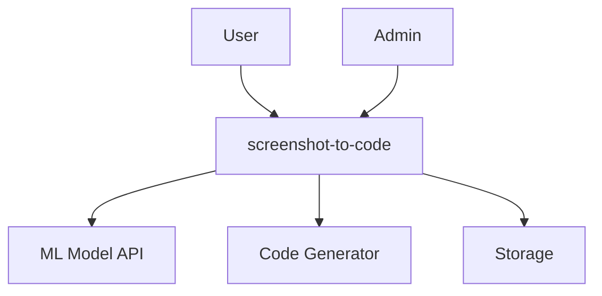
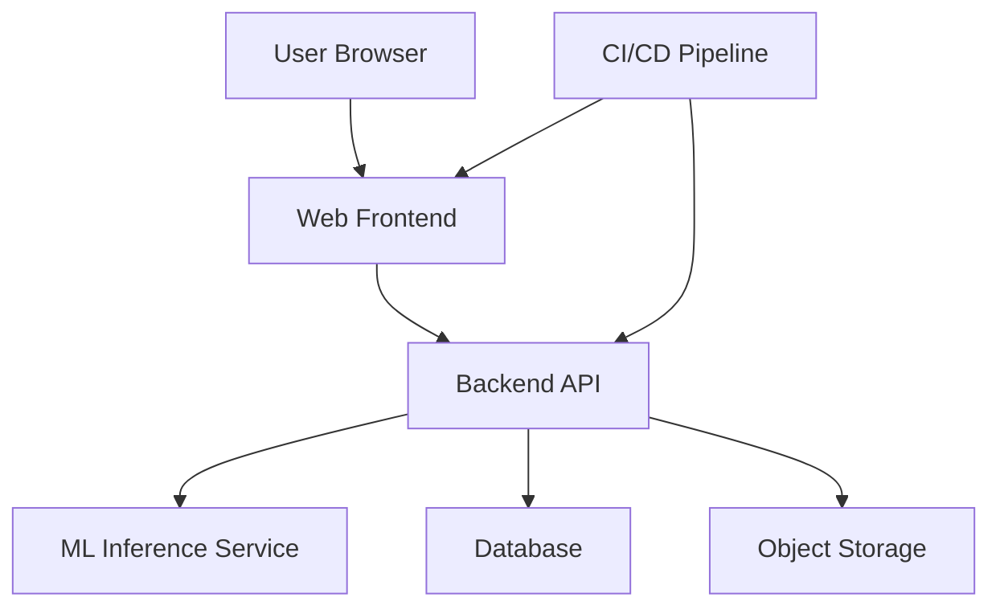
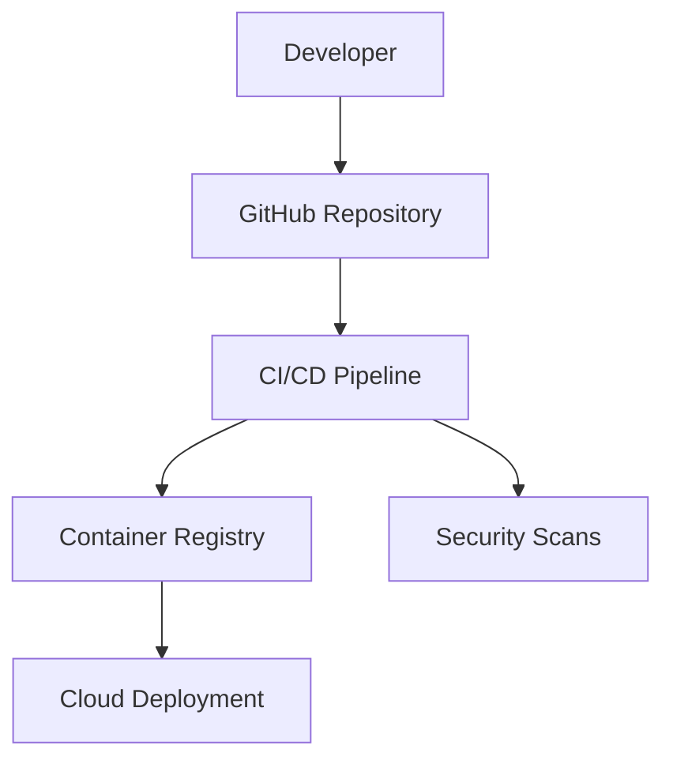
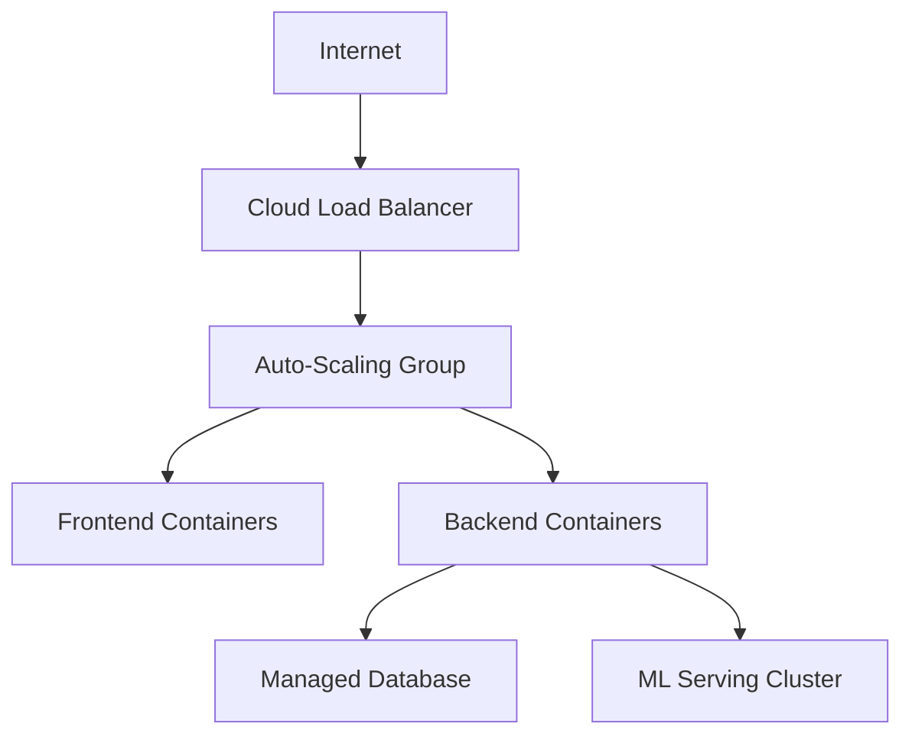

# BUSINESS POSTURE

## Priorities and Goals
1. Accelerate UI development through automated screenshot-to-code conversion
2. Enable rapid prototyping for frontend developers
3. Reduce manual coding efforts for common UI patterns
4. Support multiple output formats (HTML/CSS, React, etc.)

## Business Risks
1. Potential accuracy issues in generated code impacting user trust
2. Dependency on third-party ML models/services
3. Intellectual property protection for training data/models
4. Scalability challenges with image processing workloads
5. Competition from similar AI-powered development tools

# SECURITY POSTURE

## Existing Security Controls
1. Security control: Code review process (implemented via GitHub PR workflow)
2. Security control: Dependency scanning (implemented via GitHub Dependabot)
3. Security control: Basic input validation for image uploads (described in image_processor.py)
4. Security control: Environment separation (development vs production)

## Accepted Risks
1. No formal bug bounty program
2. Limited security testing in CI pipeline
3. No runtime protection for ML models
4. Basic logging implementation

## Recommended Security Controls
1. Implement SAST/DAST scanning in CI pipeline
2. Add model watermarking for IP protection
3. Introduce secret management solution
4. Implement request rate limiting
5. Add anomaly detection for ML inference

## Security Requirements
1. Authentication: OAuth2 for admin access
2. Authorization: Role-based access control for API endpoints
3. Input Validation: Strict file type verification, image size limits
4. Cryptography: TLS 1.3 for data in transit, AES-256 for stored user data

# DESIGN

## C4 CONTEXT

### Context Diagram Elements Table

| Name | Type | Description | Responsibilities | Security Controls |
|------|------|-------------|-------------------|-------------------|
| User | Human | End user | Upload screenshots, download generated code | N/A |
| Admin | Human | System administrator | Manage system configuration, monitor operations | MFA, Audit logging |
| ML Model API | External System | Third-party ML service | Process images and extract UI components | API key rotation |
| Code Generator | Internal System | Code generation engine | Convert ML output to target frameworks | Input sanitization |
| GitHub | External System | Version control platform | Host source code, CI/CD pipelines | SSH key access |

## C4 CONTAINER

### Container Diagram Elements Table

| Name | Type | Description | Responsibilities | Security Controls |
|------|------|-------------|-------------------|-------------------|
| Web Frontend | React App | User interface | Handle user interactions, display results | CSP headers, XSS protection |
| Backend API | Python/Flask | Business logic | Process requests, coordinate components | Request validation, JWT verification |
| ML Inference | TensorFlow Serving | Model serving | Run predictions on uploaded images | Model encryption, GPU isolation |
| PostgreSQL | Database | Store user metadata | Persist session data, audit logs | Encryption at rest, PII masking |
| S3-Compatible Storage | Object Store | File storage | Store uploaded screenshots | Signed URLs, access policies |

## DEPLOYMENT

### Primary Deployment Architecture
- Cloud Provider: AWS
- Orchestration: ECS/EKS
- Networking: VPC with public/private subnets
- Monitoring: CloudWatch + Prometheus

### Deployment Diagram Elements Table

| Name | Type | Description | Responsibilities | Security Controls |
|------|------|-------------|-------------------|-------------------|
| WAF | Network Filter | Web application firewall | Block malicious requests | OWASP ruleset |
| API Gateway | Traffic Manager | Route requests | Rate limiting, SSL termination | DDoS protection |
| Worker Nodes | EC2 Instances | Run containers | Execute application components | CIS-hardened images |
| Model Cache | Elasticache | Intermediate storage | Cache ML model outputs | Redis AUTH |
| Backup Vault | S3 Glacier | Disaster recovery | Store system backups | Immutable storage |

## BUILD

### Build Process Security
1. GitHub Actions CI pipeline
2. Multi-stage Docker builds
3. Step-by-step:
   - Linting (ESLint, flake8)
   - SAST scanning (CodeQL)
   - Dependency checking (OWASP DC)
   - Container scanning (Trivy)
   - Signed artifacts

### Build Diagram Elements Table

| Name | Type | Description | Responsibilities | Security Controls |
|------|------|-------------|-------------------|-------------------|
| Dev Machine | Workstation | Developer computer | Write and test code | Full disk encryption |
| GitHub Runner | CI Server | Execute pipelines | Run build jobs | Ephemeral environments |
| NPM Registry | Package Source | Frontend dependencies | Provide JS packages | Integrity hashes |
| PyPI Mirror | Package Source | Python dependencies | Provide Python packages | GPG signatures |
| Artifact Registry | Storage | Build outputs | Store production images | Vulnerability scanning |

# RISK ASSESSMENT

## Critical Business Processes
1. Image processing pipeline integrity
2. Code generation accuracy
3. User workflow continuity
4. Model training/update process

## Data Protection Requirements
1. User-uploaded screenshots (Confidentiality: Medium)
2. Generated source code (Integrity: High)
3. API keys/secrets (Confidentiality: Critical)
4. Model weights (Confidentiality: High, Integrity: High)

# QUESTIONS & ASSUMPTIONS

## Questions
1. What compliance standards apply (HIPAA, GDPR, etc.)?
2. Are there any third-party data processors involved?
3. What's the maximum retention period for user files?
4. Is there disaster recovery plan for ML models?
5. How are model updates validated/tested?

## Assumptions
1. Web-based architecture with REST API
2. Uses pre-trained ML models with fine-tuning
3. Stateless backend with horizontal scaling
4. Cloud-native deployment model
5. Mixed open-source/proprietary components
