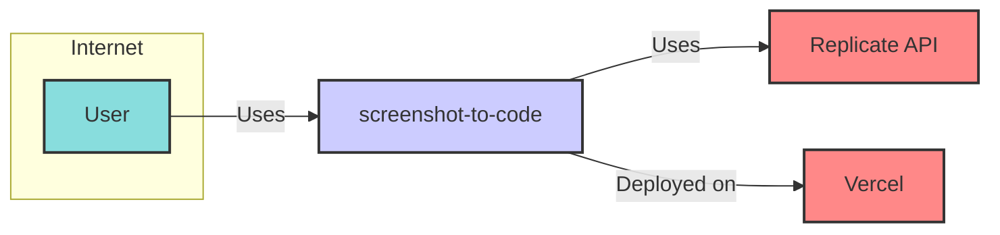
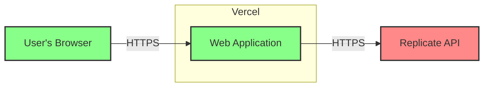
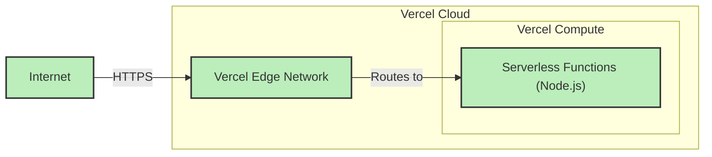

# BUSINESS POSTURE

This project, "screenshot-to-code", aims to streamline the process of converting visual website designs into functional code. It targets users who need to quickly prototype web interfaces from mockups or screenshots, potentially for rapid development, design iteration, or educational purposes.

Business Priorities and Goals:

- Accelerate web development prototyping: The primary goal is to reduce the time and effort required to translate visual designs into code, enabling faster prototyping and iteration cycles.
- Democratize front-end development: By simplifying the initial coding step, the project can lower the barrier to entry for individuals with design skills but limited coding expertise.
- Enhance design-to-development workflow: The tool can bridge the gap between design and development teams, allowing for quicker feedback loops and potentially improved collaboration.

Business Risks:

- Accuracy and quality of generated code: If the generated code is inaccurate, buggy, or not well-structured, it can hinder rather than help development, leading to wasted time and effort in debugging and refactoring.
- Dependency on third-party services: Reliance on external services like Replicate and Vercel introduces dependencies and potential vulnerabilities outside of the project's direct control. Service outages or security breaches in these dependencies could impact the project's availability and security.
- Misuse and abuse: The tool could be misused for generating malicious code or for circumventing standard design and development processes if not properly secured and governed.
- Data privacy and security: Handling user-uploaded screenshots, which might contain sensitive information, requires careful consideration of data privacy and security. Data leaks or unauthorized access could lead to reputational damage and legal liabilities.

# SECURITY POSTURE

Existing Security Controls:

- security control: HTTPS for web traffic: Assumed as standard practice for web applications, likely enforced by Vercel hosting.
- security control: Input validation on file upload: Basic file type and size validation is expected to prevent simple attacks.
- security control: Code scanning for vulnerabilities: GitHub provides basic code scanning capabilities that might be enabled for the repository.
- security control: Dependency scanning: GitHub also offers dependency scanning to detect known vulnerabilities in project dependencies.
- security control: Vercel platform security: Leveraging Vercel as a hosting platform provides inherent security features offered by Vercel, such as DDoS protection and infrastructure security.

Accepted Risks:

- accepted risk: Reliance on third-party service security: Accepting the security posture of Replicate and Vercel as sufficient, without conducting independent deep security audits of these services.
- accepted risk: Limited input sanitization: Assuming basic input validation is sufficient and not implementing advanced input sanitization techniques for code generation.
- accepted risk: Basic vulnerability scanning: Relying on standard GitHub code and dependency scanning without implementing more comprehensive security testing like penetration testing.

Recommended Security Controls:

- security control: Implement robust input validation and sanitization:  Focus on validating uploaded screenshots to prevent malicious file uploads and sanitize generated code to mitigate potential injection vulnerabilities.
- security control: Regular dependency updates and vulnerability monitoring: Implement automated dependency updates and continuous monitoring for newly discovered vulnerabilities in project dependencies.
- security control: Implement rate limiting and abuse prevention: Protect against abuse by implementing rate limiting for API requests and file uploads.
- security control: Data encryption at rest and in transit: Ensure user data (screenshots, if stored) is encrypted both in transit (HTTPS is assumed) and at rest.
- security control: Security awareness training for developers: Educate developers on secure coding practices and common web application vulnerabilities.

Security Requirements:

- Authentication:
    - Requirement: For now, authentication is not a primary concern as the application appears to be designed for public use. However, if user accounts or access control are introduced in the future, a robust authentication mechanism (e.g., OAuth 2.0, password-based authentication with multi-factor authentication) should be implemented.

- Authorization:
    - Requirement:  Currently, authorization is not explicitly required. If user-specific data or features are added, implement an authorization mechanism to control access to resources based on user roles or permissions.

- Input Validation:
    - Requirement:  Strictly validate and sanitize user inputs, especially uploaded screenshots and any parameters passed to the code generation engine. This is crucial to prevent injection attacks and ensure the stability of the application. Implement validation on file types, sizes, and content. Sanitize generated code to prevent potential XSS or other client-side vulnerabilities.

- Cryptography:
    - Requirement:  Utilize HTTPS for all communication to ensure data confidentiality and integrity in transit. If sensitive data is stored (e.g., user preferences, API keys), it should be encrypted at rest using strong encryption algorithms. Consider encrypting uploaded screenshots if they are persisted.

# DESIGN

## C4 CONTEXT

Context Diagram Elements:

- Element:
    - Name: User
    - Type: Person
    - Description: Individuals who want to convert website design screenshots into code. They interact with the "screenshot-to-code" application through a web browser.
    - Responsibilities: Upload screenshots, view generated code, potentially customize or download the code.
    - Security controls:  User-side security is limited to their own browser and device security. The application should guide users on safe usage, like not uploading screenshots with sensitive personal data if not necessary.

- Element:
    - Name: screenshot-to-code
    - Type: Software System
    - Description: The web application itself, responsible for receiving screenshots, processing them using the Replicate API to generate code, and presenting the generated code to the user.
    - Responsibilities:
        - Receive user screenshot uploads.
        - Interact with Replicate API for code generation.
        - Display generated code to the user.
        - Handle user requests and application logic.
    - Security controls:
        - security control: Input validation and sanitization for uploaded screenshots.
        - security control: Secure API communication with Replicate (HTTPS).
        - security control: Rate limiting to prevent abuse.
        - security control: Output sanitization of generated code.
        - security control: Regular security updates of application dependencies.

- Element:
    - Name: Replicate API
    - Type: External System
    - Description: A third-party API service used to perform the machine learning task of converting images to code. The "screenshot-to-code" application sends screenshots to this API and receives generated code in response.
    - Responsibilities:
        - Receive image data from "screenshot-to-code".
        - Process the image using machine learning models.
        - Generate code based on the image content.
        - Return generated code to "screenshot-to-code".
    - Security controls:
        - security control: Replicate's own security measures for their API and infrastructure.
        - security control: API key management to ensure only authorized access from "screenshot-to-code".

- Element:
    - Name: Vercel
    - Type: External System
    - Description: The cloud platform where the "screenshot-to-code" application is deployed and hosted. Vercel provides infrastructure, hosting, and potentially some platform-level security features.
    - Responsibilities:
        - Host the "screenshot-to-code" application.
        - Provide runtime environment and resources.
        - Handle web traffic and routing.
        - Potentially offer platform-level security features like DDoS protection.
    - Security controls:
        - security control: Vercel's infrastructure security measures.
        - security control: HTTPS termination and enforcement.
        - security control: Vercel's platform-level security features.

## C4 CONTAINER

Container Diagram Elements:

- Element:
    - Name: Web Application
    - Type: Container
    - Description: This represents the core application logic running on Vercel. It likely consists of a frontend (JavaScript framework, e.g., Next.js if using Vercel) and a backend (Node.js serverless functions or similar) that handles user requests, interacts with the Replicate API, and serves the user interface.
    - Responsibilities:
        - Handling HTTP requests from user browsers.
        - Serving the frontend user interface.
        - Implementing application logic for screenshot processing and code generation workflow.
        - Communicating with the Replicate API.
        - Managing API keys for Replicate.
        - Storing temporary data (if any) during processing.
    - Security controls:
        - security control: Web application firewall (potentially provided by Vercel or implemented within the application).
        - security control: Input validation and sanitization within the application code.
        - security control: Secure coding practices followed in development.
        - security control: Regular security updates of application dependencies and framework.
        - security control: Secure configuration of the Vercel environment.

- Element:
    - Name: Replicate API
    - Type: External Container
    - Description:  The external Replicate API service, considered as a container from the perspective of "screenshot-to-code".
    - Responsibilities: (Same as in Context Diagram)
        - Receive image data from "screenshot-to-code".
        - Process the image using machine learning models.
        - Generate code based on the image content.
        - Return generated code to "screenshot-to-code".
    - Security controls: (Same as in Context Diagram)
        - security control: Replicate's own security measures for their API and infrastructure.
        - security control: API key management to ensure only authorized access from "screenshot-to-code".

- Element:
    - Name: User's Browser
    - Type: Container
    - Description:  The user's web browser, acting as the client-side container for interacting with the "screenshot-to-code" application.
    - Responsibilities:
        - Rendering the user interface of the application.
        - Sending HTTP requests to the Web Application container.
        - Displaying the generated code to the user.
    - Security controls:
        - security control: Browser security features (sandboxing, content security policies, etc.).
        - security control: User's responsibility to keep their browser updated and secure.

## DEPLOYMENT

Deployment Architecture: Vercel Platform

Deployment Diagram Elements:

- Element:
    - Name: Vercel Edge Network
    - Type: Deployment Node
    - Description: Vercel's global edge network, responsible for handling incoming HTTP requests, providing CDN services, and potentially performing some edge logic. It acts as the entry point for user traffic to the application.
    - Responsibilities:
        - Handling incoming user requests from the internet.
        - SSL/TLS termination.
        - Content Delivery Network (CDN) for static assets.
        - Routing requests to the appropriate backend compute resources.
        - Potentially providing DDoS protection and other edge security features.
    - Security controls:
        - security control: Vercel's edge network security infrastructure.
        - security control: DDoS mitigation.
        - security control: HTTPS enforcement.

- Element:
    - Name: Serverless Functions (Node.js)
    - Type: Deployment Node
    - Description:  The backend logic of the "screenshot-to-code" application, implemented as serverless functions running in Vercel's compute environment. These functions handle application logic, API interactions, and dynamic content generation.
    - Responsibilities:
        - Executing the application's backend code.
        - Interacting with the Replicate API.
        - Processing user requests and generating responses.
        - Managing application state (if any, likely stateless in serverless functions).
    - Security controls:
        - security control: Serverless environment isolation provided by Vercel.
        - security control: Secure coding practices in serverless function code.
        - security control: Principle of least privilege for function permissions and access to resources.
        - security control: Regular patching and updates of the serverless runtime environment by Vercel.

- Element:
    - Name: Internet
    - Type: Deployment Node
    - Description: The public internet, representing the network through which users access the "screenshot-to-code" application.
    - Responsibilities:
        - Providing network connectivity for users to access the application.
    - Security controls:
        - security control:  Internet security is a shared responsibility. Users are responsible for their own network security. The application relies on HTTPS to secure communication over the internet.

## BUILD

Build Process: GitHub Actions and potentially Vercel Build Pipeline

```mermaid
flowchart LR
    A["Developer"]:::person --> B["GitHub Repository"]:::code_repo
    B --> C["GitHub Actions"]:::ci_cd
    C --> D["Build Artifacts"]:::artifact
    D --> E["Vercel Build Pipeline"]:::deployment_pipeline
    E --> F["Vercel Cloud"]:::deployment_env

    classDef person fill:#8dd,stroke:#333,stroke-width:2px
    classDef code_repo fill:#eee,stroke:#333,stroke-width:2px
    classDef ci_cd fill:#beb,stroke:#333,stroke-width:2px
    classDef artifact fill:#fdf,stroke:#333,stroke-width:2px
    classDef deployment_pipeline fill:#beb,stroke:#333,stroke-width:2px
    classDef deployment_env fill:#beb,stroke:#333,stroke-width:2px
```

Build Diagram Elements:

- Element:
    - Name: Developer
    - Type: Person
    - Description: Software developers who write and maintain the code for the "screenshot-to-code" application.
    - Responsibilities:
        - Writing, testing, and committing code changes.
        - Performing code reviews.
        - Ensuring code quality and security.
    - Security controls:
        - security control: Secure coding practices.
        - security control: Code review process.
        - security control: Developer workstation security.
        - security control: Access control to the GitHub repository.

- Element:
    - Name: GitHub Repository
    - Type: Code Repository
    - Description: The central repository where the source code of the "screenshot-to-code" application is stored and version controlled using Git.
    - Responsibilities:
        - Storing the source code.
        - Tracking code changes and history.
        - Facilitating collaboration among developers.
        - Triggering CI/CD pipelines on code changes.
    - Security controls:
        - security control: Access control to the repository (authentication and authorization).
        - security control: Branch protection rules.
        - security control: Audit logs of repository activities.

- Element:
    - Name: GitHub Actions
    - Type: CI/CD
    - Description: GitHub's built-in CI/CD service used for automating the build, test, and potentially deployment processes. GitHub Actions workflows are defined in YAML files within the repository.
    - Responsibilities:
        - Automating the build process.
        - Running automated tests (unit tests, integration tests, etc.).
        - Performing static code analysis (SAST) and linting.
        - Building and packaging application artifacts.
        - Potentially triggering deployment pipelines.
    - Security controls:
        - security control: Secure configuration of GitHub Actions workflows.
        - security control: Secrets management for API keys and credentials.
        - security control: Dependency scanning within the CI pipeline.
        - security control: SAST and code linters to detect potential vulnerabilities.

- Element:
    - Name: Build Artifacts
    - Type: Artifact
    - Description: The packaged output of the build process, which could include compiled code, static assets, and deployment configurations.
    - Responsibilities:
        - Storing the build output.
        - Providing deployable packages for the Vercel Build Pipeline.
    - Security controls:
        - security control: Secure storage of build artifacts (implicitly managed by GitHub Actions and Vercel).
        - security control: Integrity checks on build artifacts.

- Element:
    - Name: Vercel Build Pipeline
    - Type: Deployment Pipeline
    - Description: Vercel's automated build and deployment pipeline, which takes build artifacts and deploys them to the Vercel platform. It may include additional build steps specific to the Vercel environment.
    - Responsibilities:
        - Building the application in the Vercel environment.
        - Deploying the application to Vercel's infrastructure.
        - Managing deployments and rollbacks.
    - Security controls:
        - security control: Vercel's build and deployment pipeline security.
        - security control: Secure deployment configurations.
        - security control: Automated deployment process to reduce manual errors.

- Element:
    - Name: Vercel Cloud
    - Type: Deployment Environment
    - Description: Vercel's cloud infrastructure where the application is ultimately deployed and runs.
    - Responsibilities: (Same as Deployment Diagram - Vercel Cloud components)
        - Hosting and running the application.
        - Providing the runtime environment.
        - Handling web traffic.
    - Security controls: (Same as Deployment Diagram - Vercel Cloud components)
        - security control: Vercel's infrastructure security.
        - security control: Platform-level security features provided by Vercel.

# RISK ASSESSMENT

Critical Business Processes:

- Core process: Converting screenshots to code. Failure of this process directly undermines the primary business goal of the application.
- Availability of the application: Users need to be able to access and use the application reliably. Downtime impacts user experience and perceived value.
- Data processing integrity: Ensuring that screenshots are processed correctly and code is generated accurately is critical for the tool's usefulness.

Data Sensitivity:

- User-uploaded screenshots: Screenshots might contain sensitive information depending on what users choose to upload. This could include UI designs of internal applications, mockups with placeholder data that resembles real data, or in rare cases, screenshots inadvertently capturing personal or confidential information.
    - Sensitivity level: Moderate. While not explicitly designed to handle highly sensitive data, there's a potential for users to upload screenshots containing information that should be treated with some level of confidentiality.
- Generated code: The generated code itself is generally not considered highly sensitive. However, if the generation process or storage of generated code is compromised, it could potentially reveal information about the input screenshots or application logic.
    - Sensitivity level: Low to Moderate.

# QUESTIONS & ASSUMPTIONS

Questions:

- Data storage: Is there any persistent storage of user-uploaded screenshots or generated code? If so, where and how is it secured?
- API Key Management: How are Replicate API keys managed and secured within the application and Vercel environment?
- Error Handling: How are errors handled, especially during API calls to Replicate? Are error messages potentially revealing sensitive information?
- Logging and Monitoring: What level of logging and monitoring is implemented for the application? Are security-related events logged?
- Abuse Monitoring: Are there any mechanisms in place to monitor and prevent abuse of the service (e.g., excessive API calls, malicious uploads)?

Assumptions:

- BUSINESS POSTURE:
    - Assumption: The primary business goal is rapid prototyping and developer productivity enhancement.
    - Assumption: The project is likely in an early stage and prioritizing speed of development and feature delivery over extensive security measures initially.
    - Assumption: The target audience is primarily developers and designers who understand the experimental nature of the tool.

- SECURITY POSTURE:
    - Assumption: Basic security controls like HTTPS and input validation are in place.
    - Assumption: Security is primarily reliant on the security provided by Vercel and Replicate platforms.
    - Assumption: No dedicated security team or extensive security testing has been performed yet.

- DESIGN:
    - Assumption: The application is a relatively simple web application deployed on Vercel.
    - Assumption: Serverless functions are used for backend logic and API interactions.
    - Assumption: The build process is automated using GitHub Actions and Vercel's built-in pipeline.
