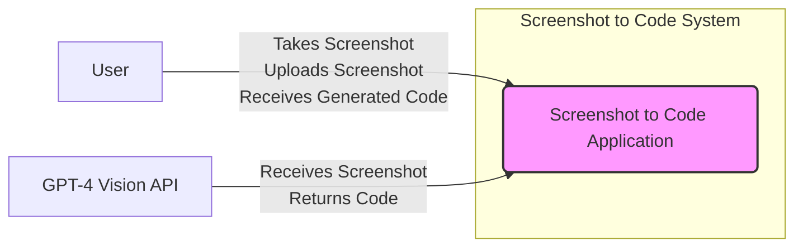
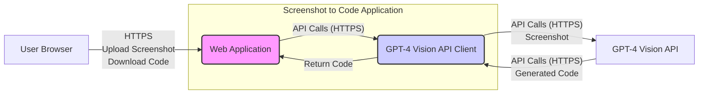
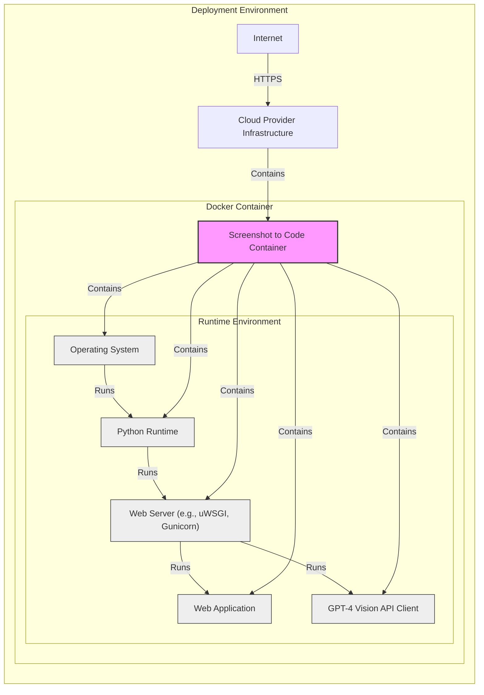
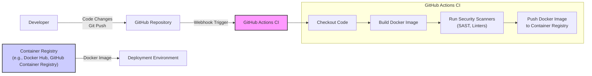

# BUSINESS POSTURE

This project, 'screenshot-to-code', aims to demonstrate the feasibility of automatically converting user interface screenshots into functional HTML and Tailwind CSS code using AI, specifically GPT-4 Vision API.

*   Business Priorities and Goals:
    *   Explore and showcase the capabilities of AI in automating UI development tasks.
    *   Potentially reduce the time and effort required for front-end development by automating the initial code generation from visual designs.
    *   Demonstrate a practical application of GPT-4 Vision API and browser automation technologies.
    *   Generate interest and gather feedback for further development of such automation tools.

*   Business Risks:
    *   Accuracy and quality of AI-generated code may not be production-ready, requiring manual refinement and potentially introducing bugs.
    *   Reliance on a third-party API (GPT-4 Vision API) introduces dependency and potential cost implications.
    *   Performance and latency of the API calls could impact the user experience.
    *   Misinterpretation of UI elements by the AI could lead to incorrect or incomplete code generation.
    *   Potential misuse of the tool for generating malicious or unintended code if not properly controlled.

# SECURITY POSTURE

This project is a demonstration and likely lacks comprehensive security controls in its current state as a GitHub repository. We will outline potential security considerations for a production-ready version of such a tool.

*   Existing Security Controls:
    *   security control: Access control to the GitHub repository itself is managed by GitHub's platform. Implemented in: GitHub repository settings.
    *   security control: Code review process for contributions to the repository. Implemented in: GitHub pull request workflow.

*   Accepted Risks:
    *   accepted risk: Lack of formal security testing or penetration testing.
    *   accepted risk: Dependency on the security of third-party APIs (GPT-4 Vision API).
    *   accepted risk: Potential vulnerabilities in the demo code due to rapid development and focus on functionality over security.

*   Recommended Security Controls:
    *   security control: Implement input validation to sanitize user-provided screenshots and prevent potential injection attacks or processing of malicious files.
    *   security control: Secure API key management for accessing GPT-4 Vision API, avoiding hardcoding keys in the code and using environment variables or secure vault solutions.
    *   security control: Implement rate limiting and usage quotas for the GPT-4 Vision API to prevent abuse and control costs.
    *   security control: Conduct regular security vulnerability scanning of dependencies and the codebase using SAST and DAST tools.
    *   security control: Implement logging and monitoring to detect and respond to potential security incidents.
    *   security control: Define and implement secure software development lifecycle (SSDLC) practices, including security requirements gathering, secure design, secure coding guidelines, and security testing.
    *   security control: If deployed as a web application, implement standard web application security controls such as HTTPS, protection against CSRF and XSS attacks, and secure session management.

*   Security Requirements:
    *   Authentication: For a production version, user authentication would be necessary to control access and potentially personalize the service. For this demo, authentication is not explicitly required.
    *   Authorization: If user accounts are introduced, authorization mechanisms would be needed to control access to features and data based on user roles or permissions. For this demo, authorization is not explicitly required.
    *   Input Validation: Robust input validation is critical to prevent processing of malicious screenshots or unexpected data formats that could lead to vulnerabilities. Validation should be performed on file uploads, API requests, and any user-provided input.
    *   Cryptography:  If sensitive data is processed or stored (which is not evident in this demo), appropriate encryption methods should be used to protect data at rest and in transit. Secure communication over HTTPS is essential if deployed as a web application.  API keys for GPT-4 Vision API should be treated as sensitive credentials and managed securely.

# DESIGN

## C4 CONTEXT

*   Context Diagram Elements:
    *   Element:
        *   Name: User
        *   Type: Person
        *   Description: A developer or designer who wants to convert a UI screenshot into code.
        *   Responsibilities: Takes a screenshot of a UI design. Uploads the screenshot to the 'Screenshot to Code Application'. Receives the generated HTML/Tailwind CSS code.
        *   Security controls: User's local machine security controls. Authentication and authorization controls are not applicable at this context level.

    *   Element:
        *   Name: Screenshot to Code Application
        *   Type: Software System
        *   Description: The application that takes a screenshot as input, uses GPT-4 Vision API to generate code, and provides the code to the user.
        *   Responsibilities: Receives screenshot from the user. Sends the screenshot to GPT-4 Vision API. Receives generated code from GPT-4 Vision API. Returns the generated code to the user. Manages API key for GPT-4 Vision API.
        *   Security controls: Input validation of the screenshot. Secure API key management for GPT-4 Vision API. Logging and monitoring. Rate limiting for API calls.

    *   Element:
        *   Name: GPT-4 Vision API
        *   Type: External System
        *   Description: OpenAI's GPT-4 Vision API, a third-party service that processes images and generates text based on visual input.
        *   Responsibilities: Receives screenshots from the 'Screenshot to Code Application'. Analyzes the screenshot and generates HTML/Tailwind CSS code representing the UI. Returns the generated code.
        *   Security controls: Security controls are managed by OpenAI. 'Screenshot to Code Application' should use HTTPS for communication and adhere to OpenAI's API security best practices.

## C4 CONTAINER

*   Container Diagram Elements:
    *   Element:
        *   Name: Web Application
        *   Type: Web Application
        *   Description:  The front-end and back-end components of the 'Screenshot to Code Application' responsible for handling user requests, managing API calls, and presenting the generated code. This could be a simple Python Flask application serving both frontend and backend.
        *   Responsibilities: Serves the user interface for uploading screenshots and displaying generated code. Receives user screenshot uploads.  Orchestrates calls to the 'GPT-4 Vision API Client'.  Handles API key management. Implements input validation. Manages user sessions (if authentication is added).
        *   Security controls: HTTPS for secure communication. Input validation on screenshot uploads. Secure session management (if applicable). Rate limiting. Web application firewall (WAF) if deployed publicly.

    *   Element:
        *   Name: GPT-4 Vision API Client
        *   Type: Application Library/Component
        *   Description: A component within the Web Application responsible for interacting with the GPT-4 Vision API. This likely involves using a Python library to make API calls to OpenAI's services.
        *   Responsibilities:  Encapsulates the logic for calling the GPT-4 Vision API.  Handles API authentication (API key management).  Transforms data between the Web Application and the GPT-4 Vision API.  Error handling for API calls.
        *   Security controls: Secure storage and retrieval of API keys (e.g., using environment variables or a secrets management service).  HTTPS for API communication.  Proper error handling to avoid leaking sensitive information.

    *   Element:
        *   Name: User Browser
        *   Type: Client Application
        *   Description: The user's web browser used to access the 'Screenshot to Code Application'.
        *   Responsibilities:  Provides the user interface for interacting with the application. Renders the web application. Sends screenshot upload requests. Receives and displays generated code.
        *   Security controls: Browser security controls, user's responsibility to keep browser secure and updated.

    *   Element:
        *   Name: GPT-4 Vision API
        *   Type: External System
        *   Description: OpenAI's GPT-4 Vision API, as described in the context diagram.
        *   Responsibilities:  Same as in the context diagram.
        *   Security controls: Same as in the context diagram, managed by OpenAI.

## DEPLOYMENT

For demonstration purposes and simplicity, a basic deployment using a single server or container is suitable. For a more scalable and robust production environment, a cloud-based deployment would be recommended. Let's consider a simple containerized deployment using Docker.

*   Deployment Diagram Elements:
    *   Element:
        *   Name: Screenshot to Code Container
        *   Type: Container
        *   Description: A Docker container encapsulating the entire 'Screenshot to Code Application', including the operating system, Python runtime, web server, application code, and API client.
        *   Responsibilities: Provides a packaged and isolated environment for running the application. Ensures consistent deployment across different environments. Facilitates scalability and portability.
        *   Security controls: Container image scanning for vulnerabilities.  Principle of least privilege for container user.  Resource limits for container.  Regular container updates.

    *   Element:
        *   Name: Operating System
        *   Type: Software
        *   Description: The operating system within the Docker container, likely a Linux distribution.
        *   Responsibilities: Provides the base system for running the Python runtime and other components.
        *   Security controls: OS hardening within the container. Regular OS updates and patching.

    *   Element:
        *   Name: Python Runtime
        *   Type: Software
        *   Description: The Python interpreter and libraries required to run the 'Screenshot to Code' application code.
        *   Responsibilities: Executes the Python application code.
        *   Security controls: Keeping Python runtime updated to the latest secure version. Vulnerability scanning of Python libraries.

    *   Element:
        *   Name: Web Server (e.g., uWSGI, Gunicorn)
        *   Type: Software
        *   Description: A production-ready web server to handle HTTP requests and serve the Python web application.
        *   Responsibilities: Serves the web application over HTTP/HTTPS. Manages web application processes.
        *   Security controls: Web server configuration hardening.  Keeping web server software updated.

    *   Element:
        *   Name: Web Application
        *   Type: Software
        *   Description: The Python Flask (or similar framework) web application code as described in the container diagram.
        *   Responsibilities: Same as in the container diagram.
        *   Security controls: Same as in the container diagram.

    *   Element:
        *   Name: GPT-4 Vision API Client
        *   Type: Software
        *   Description: The Python library/component for interacting with the GPT-4 Vision API.
        *   Responsibilities: Same as in the container diagram.
        *   Security controls: Same as in the container diagram.

    *   Element:
        *   Name: Cloud Provider Infrastructure
        *   Type: Infrastructure
        *   Description: The cloud infrastructure provided by a cloud provider (e.g., AWS, Azure, GCP) that hosts the Docker container. This could be a virtual machine, container service (like ECS or Kubernetes), or serverless container platform.
        *   Responsibilities: Provides the underlying infrastructure for running the container. Manages networking, storage, and compute resources.
        *   Security controls: Cloud provider's infrastructure security controls. Security configuration of cloud resources (e.g., network security groups, IAM roles).

    *   Element:
        *   Name: Internet
        *   Type: Network
        *   Description: The public internet network allowing users to access the 'Screenshot to Code Application'.
        *   Responsibilities: Provides connectivity for users to access the application.
        *   Security controls:  Firewall at the cloud provider level.  DDoS protection.  HTTPS encryption.

## BUILD

The build process should automate the creation of the Docker container image and potentially its deployment. A CI/CD pipeline using GitHub Actions is a suitable choice for this project, given it's hosted on GitHub.

*   Build Process Elements:
    *   Element:
        *   Name: Developer
        *   Type: Person
        *   Description:  A software developer working on the 'Screenshot to Code' project.
        *   Responsibilities: Writes and modifies code. Commits code changes to the GitHub repository.
        *   Security controls: Developer workstation security, secure coding practices.

    *   Element:
        *   Name: GitHub Repository
        *   Type: Code Repository
        *   Description: The GitHub repository hosting the project's source code.
        *   Responsibilities: Version control of the codebase. Triggering CI/CD pipelines.
        *   Security controls: Access control to the repository. Branch protection rules. Code review process.

    *   Element:
        *   Name: GitHub Actions CI
        *   Type: CI/CD System
        *   Description: GitHub Actions workflow configured to automate the build, security scanning, and publishing of the Docker image.
        *   Responsibilities: Automates the build process. Runs security scanners. Publishes the Docker image.
        *   Security controls: Secure configuration of GitHub Actions workflows. Secret scanning to prevent accidental exposure of API keys or credentials.  Use of trusted GitHub Actions and runners.

    *   Element:
        *   Name: Checkout Code
        *   Type: Build Step
        *   Description: Step in the CI pipeline to retrieve the latest code from the GitHub repository.
        *   Responsibilities: Accessing and downloading the source code.
        *   Security controls: Access control based on GitHub repository permissions.

    *   Element:
        *   Name: Build Docker Image
        *   Type: Build Step
        *   Description: Step to build the Docker image from the Dockerfile in the repository.
        *   Responsibilities: Creating the container image.
        *   Security controls: Secure Dockerfile practices (e.g., using minimal base images, avoiding running as root).

    *   Element:
        *   Name: Run Security Scanners (SAST, Linters)
        *   Type: Build Step
        *   Description: Step to perform static application security testing (SAST) and code linting on the codebase.
        *   Responsibilities: Identifying potential security vulnerabilities and code quality issues.
        *   Security controls: Integration of SAST and linting tools into the CI pipeline.  Configuration of scanners to detect relevant security issues.

    *   Element:
        *   Name: Push Docker Image to Container Registry
        *   Type: Build Step
        *   Description: Step to push the built Docker image to a container registry (e.g., Docker Hub, GitHub Container Registry).
        *   Responsibilities: Storing and distributing the Docker image.
        *   Security controls: Secure authentication to the container registry.  Access control to the container registry. Container image signing (optional).

    *   Element:
        *   Name: Container Registry (e.g., Docker Hub, GitHub Container Registry)
        *   Type: Artifact Repository
        *   Description: A registry for storing and managing Docker container images.
        *   Responsibilities: Storing Docker images. Providing access to Docker images for deployment.
        *   Security controls: Access control to the container registry. Vulnerability scanning of stored images (some registries offer this).

    *   Element:
        *   Name: Deployment Environment
        *   Type: Infrastructure
        *   Description: The target environment where the Docker container will be deployed and run, as described in the Deployment section.
        *   Responsibilities: Running the Docker container and the 'Screenshot to Code Application'.
        *   Security controls: Security controls as described in the Deployment section.

# RISK ASSESSMENT

*   Critical Business Processes:
    *   For this demo project, there are no critical business processes directly reliant on it. However, if this were a production tool integrated into a development workflow, the critical process would be the efficient generation of UI code from screenshots, impacting developer productivity and project timelines.

*   Data to Protect and Sensitivity:
    *   Screenshots uploaded by users: These could potentially contain sensitive information depending on the UI being captured (e.g., proprietary designs, internal application interfaces). Sensitivity is moderate - confidentiality and integrity are important to prevent unauthorized access or modification.
    *   API Keys for GPT-4 Vision API: These are highly sensitive credentials that must be protected to prevent unauthorized access to the GPT-4 Vision API and potential cost implications or misuse. Sensitivity is high - confidentiality is critical.
    *   Generated Code:  The generated code itself is less sensitive but should be protected from unauthorized modification to maintain integrity. Sensitivity is low to moderate - integrity is important.
    *   Logs and Monitoring Data: Logs may contain user activity and system information. Sensitivity is low to moderate - confidentiality and integrity are important for security monitoring and incident response.

# QUESTIONS & ASSUMPTIONS

*   Questions:
    *   What is the intended scale and user base for this application if it were to move beyond a demo? This would influence deployment architecture and scalability requirements.
    *   What are the specific data privacy requirements for user-uploaded screenshots? This will dictate data handling and storage policies.
    *   Are there any compliance requirements (e.g., GDPR, HIPAA) that need to be considered if user data is processed or stored?
    *   What is the budget and resources available for implementing security controls? This will prioritize security measures.
    *   Is there an existing security team or security policies within the organization that this project needs to adhere to?

*   Assumptions:
    *   This project is currently a demonstration and not intended for production use in its current form.
    *   Security is a secondary consideration in the current demo state but will be crucial for any production deployment.
    *   The target deployment environment is assumed to be a cloud environment for scalability and ease of management.
    *   User screenshots are not considered highly sensitive in the context of this demo, but this assumption should be validated for a production scenario.
    *   The organization developing this project is security-conscious and wants to implement reasonable security controls.
